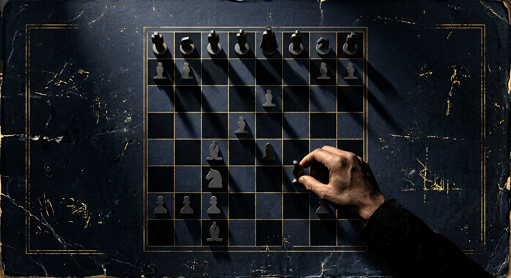
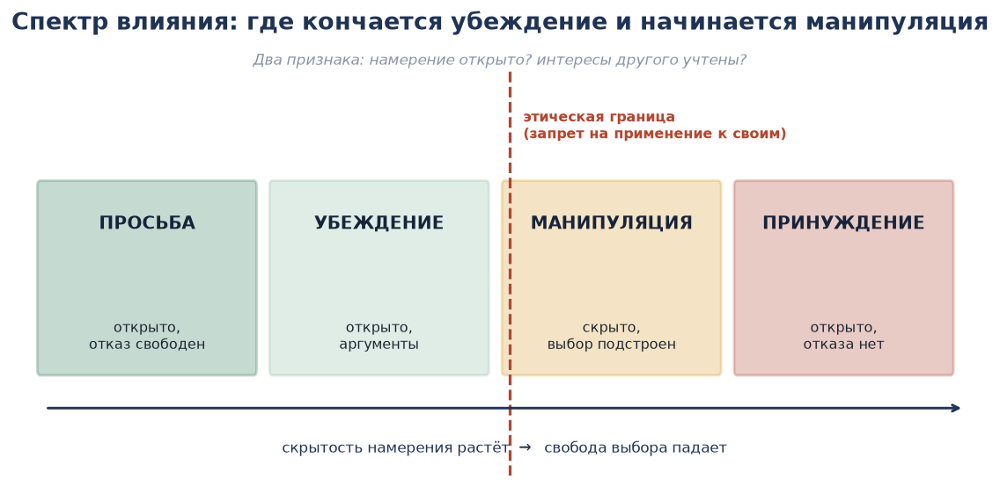
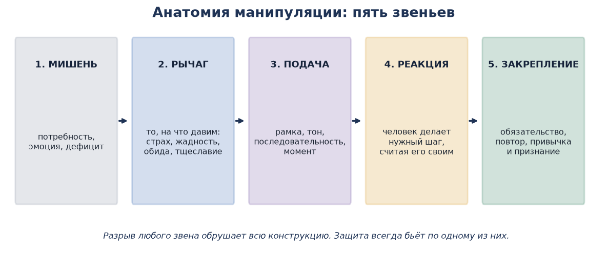
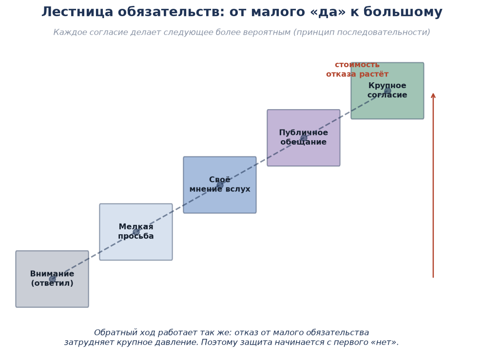
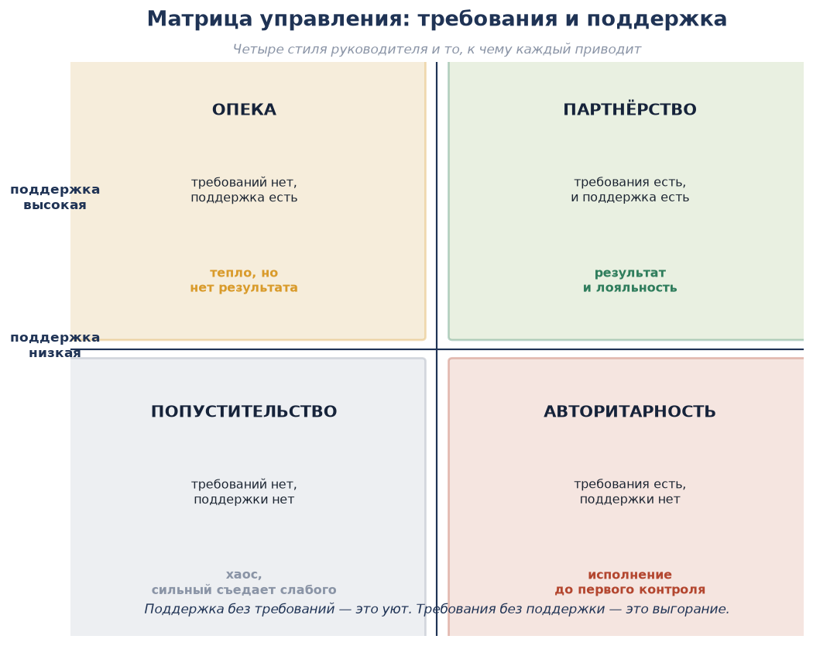
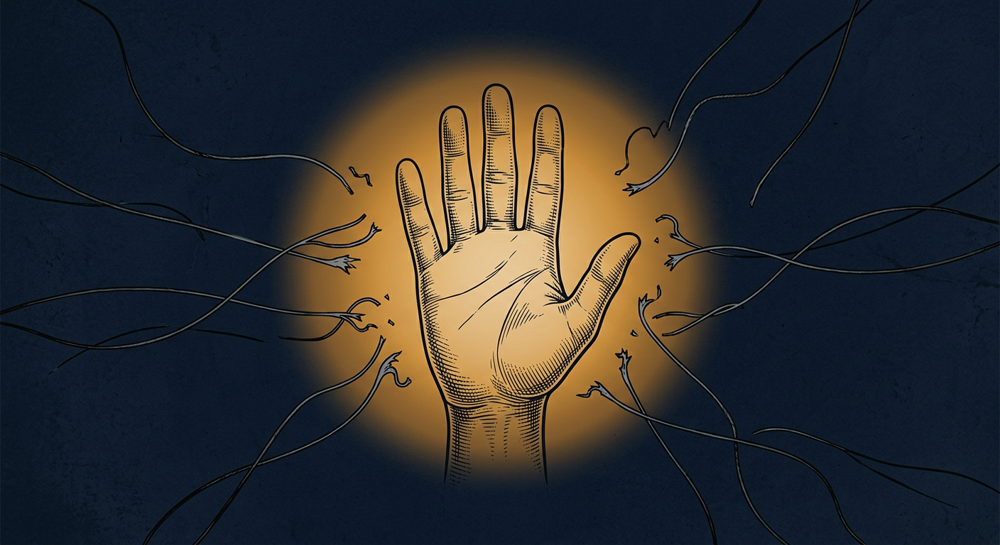
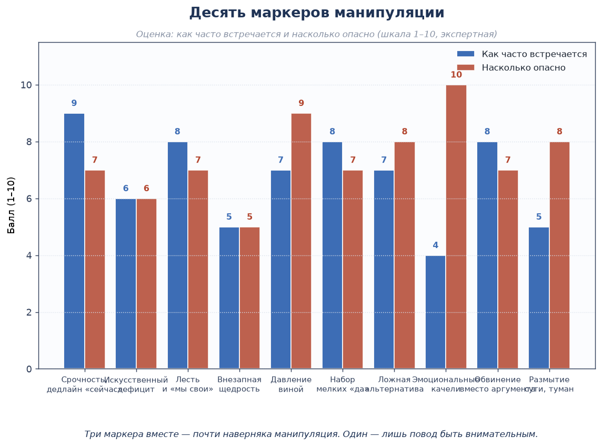

# АКАДЕМИЯ КОМИТЕТА

## ФАКУЛЬТЕТ ВЛИЯНИЯ И УПРАВЛЕНИЯ



```
╔══════════════════════════════════════════════════════════════╗
║              А К А Д Е М И Я   К О М И Т Е Т А                ║
║                                                               ║
║   ФАКУЛЬТЕТ ВЛИЯНИЯ И УПРАВЛЕНИЯ                             ║
║   КУРС: «МАНИПУЛЯЦИЯ, УПРАВЛЕНИЕ                             ║
║          И ЗАЩИТА ОТ ВОЗДЕЙСТВИЯ»                            ║
║                                                               ║
║   ГРИФ: СОВЕРШЕННО СЕКРЕТНО              ЭКЗ. № ___          ║
║   ОБЪЁМ: 5 МОДУЛЕЙ · 17 ЛЕКЦИЙ · 12 ДИАЛОГОВ                ║
╚══════════════════════════════════════════════════════════════╝
```

> *«Манипуляция — это влияние, которое стесняется назвать себя. Комитету она нужна как инструмент против чужой воли. И Комитет погибает в тот день, когда применяет её к своим.»*

---

## О ДОКУМЕНТЕ

### Что это

Курс о том, как устроено влияние на человека: от безобидной просьбы до принуждения. Три предмета в одном:

1. **Манипуляция** — как устроена, из каких звеньев состоит, почему работает.
2. **Управление** — как руководить людьми так, чтобы не подменять управление манипуляцией.
3. **Защита** — как распознать воздействие и нейтрализовать его.

### Три принципа курса

1. **Знать — значит уметь защититься.** Приёмы изучаются не затем, чтобы применять их чаще, а затем, чтобы видеть, когда их применяют к тебе.
2. **Оружие последней линии.** Манипуляция допустима против внешнего объекта — подозреваемого, враждебной фракции, провокатора. **Против своих она запрещена** (раздел 5.4). Орган, который манипулирует собственными сотрудниками, теряет их доверие и перестаёт существовать как орган.
3. **У каждого приёма есть цена.** Манипуляция, которую заметили, дороже прямого отказа: она разрушает доверие ко всем будущим словам. Курс учит считать эту цену заранее.

### Как устроен курс

- **Модуль 1** — природа влияния: спектр, анатомия, основания.
- **Модуль 2** — инструментарий: двенадцать приёмов и механизмы их работы.
- **Модуль 3** — **диалоги**: двенадцать разобранных разговоров между персонажами.
- **Модуль 4** — управление людьми без подмены.
- **Модуль 5** — защита, маркеры, институциональные меры и кодекс.

### Действующие лица курса

Все диалоги в курсе разыгрываются постоянными персонажами, чтобы примеры складывались в единую картину.

| Персонаж | Роль | Кто это |
|---|---|---|
| **Коршун** | Куратор Комитета, наставник | Опытный сотрудник, ведёт стажёров |
| **Лис** | Агент Комитета | Исполнитель, работает на объекте |
| **Ёж** | Стажёр Академии Комитета | Учится; на нём показывают ошибки |
| **Гранит** | Комиссар Полиции Спавна | Гласный руководитель |
| **Филин** | Детектив Полиции Спавна | Ведёт расследования |
| **Вьюга** | Патрульный | Работает на спавне, первый на месте |
| **Зот** | Торговец на спавне | Гражданский; объект вербовки |
| **Рысь** | Лидер фракции «Север» | Сильный, опытный противник |
| **Копатель** | Игрок | Подозреваемый по делу о краже |
| **Шакал** | Провокатор | Подстрекает толпу |
| **Саня** | Новичок | Потерпевший |
| **Тень** | Игрок | Пытается давить на сотрудника |

---

## ОГЛАВЛЕНИЕ

| Раздел | Содержание |
|---|---|
| [Модуль 1](#модуль-1-природа-влияния) | Спектр влияния, анатомия манипуляции, основания, этика |
| [Модуль 2](#модуль-2-инструментарий) | Двенадцать приёмов: обязательство, обмен, рамка, авторитет, речь |
| [Модуль 3](#модуль-3-диалоги) | 12 разобранных диалогов между персонажами |
| [Модуль 4](#модуль-4-управление-людьми) | Матрица управления, делегирование, обратная связь, сопротивление |
| [Модуль 5](#модуль-5-защита-и-пределы) | Маркеры, нейтрализация, институциональные меры, кодекс |
| [Практикум](#практикум) | Задания и упражнения |
| [Итоговая аттестация](#итоговая-аттестация) | Билеты, практическое задание, критерии |
| [Источники](#источники) | Список литературы |

---

# МОДУЛЬ 1. ПРИРОДА ВЛИЯНИЯ

## Лекция 1.1. Спектр влияния: четыре точки на одной линии



**Цель:** перестать называть «манипуляцией» любое влияние — и научиться видеть, где именно ты стоишь.

### Ключевые понятия

- **Просьба** — открытое обращение; отказ свободен и ничего не стоит.
- **Убеждение** — открытое влияние аргументами; человек знает, что его убеждают.
- **Манипуляция** — скрытое влияние: намерение спрятано, выбор подстроен, отказ стоит дорого.
- **Принуждение** — открытое влияние силой или угрозой; отказа нет.

### Содержание

Влияние — не переключатель, а линия. На ней важно не место, а **два признака**:

| Признак | Просьба | Убеждение | Манипуляция | Принуждение |
|---|---|---|---|---|
| **Намерение открыто?** | Да | Да | **Нет** | Да |
| **Интересы другого учтены?** | Да | Частично | **Обычно нет** | Нет |
| **Отказ свободен?** | Да | Да | **Иллюзия свободы** | Нет |
| **Что остаётся человеку?** | Выбор | Выбор | Чувство, что выбрал сам | Подчинение |

**Главный признак манипуляции — скрытое намерение.** Не вред, не ложь, не выгода манипулятора. Убеждение может быть грубым, а манипуляция — мягкой; различие проходит по открытости.

**Почему это важно практически:**

- Скрытое намерение можно потерять случайно — одним неверным словом, одной деталью. Тогда манипуляция превращается в «сорванный покров» (см. 1.4).
- Открытое влияние часто работает **не хуже**, а дешевле: его не нужно поддерживать ложью, а доверие после него растёт, а не падает.
- Манипуляция незаменима там, где прямое влияние невозможно: объект не станет слушать аргументы, а сведения нужны.

> **Правило Комитета:** если то же самое можно получить открыто — получи открыто. Манипуляция — не первое средство, а последнее.

### Практикум

Вспомните три случая, когда на вас влияли за последнюю неделю. Расположите их на спектре. В каком из случаев намерение было скрыто?

### Контрольные вопросы

1. Какой главный признак отличает манипуляцию от убеждения?
2. Чем принуждение отличается от остальных трёх?
3. Почему открытое влияние дешевле скрытого?

---

## Лекция 1.2. Анатомия манипуляции: пять звеньев



**Цель:** научиться разбирать любое воздействие на детали — и видеть, за что его можно сломать.

### Ключевые понятия

- **Мишень** — то, во что бьют: потребность, эмоция, дефицит.
- **Рычаг** — то, чем давят: страх, жадность, обида, тщеславие, долг.
- **Подача** — то, как это оформлено: рамка, тон, последовательность, момент.
- **Реакция** — нужный шаг, который человек считает своим решением.
- **Закрепление** — то, что делает шаг необратимым: обязательство, повтор, привычка.

### Содержание

**Звено 1. Мишень.** Манипуляция всегда бьёт в то, что у человека болит или чего ему не хватает. Поэтому первая часть работы — не приём, а **разведка мотива** (см. «Курс мотивации», модуль 3).

| Мишень | Признак | Что человек делает |
|---|---|---|
| Потребность в признании | Говорит о себе, хочет публичности | Согласится на видимую роль |
| Обида | Возвращается к старому конфликту | Согласится на всё против обидчика |
| Страх | Считает потери, избегает риска | Согласится на защиту |
| Жадность | Торгуется, считает выгоду | Согласится на оплату |
| Любопытство | Задаёт вопросы, любит загадки | Согласится «просто посмотреть» |

**Звено 2. Рычаг.** То, что превращает мишень в движение. Одна и та же мишень имеет несколько рычагов, и выбор рычага определяет цену:

| Мишень → рычаг | Как звучит | Цена |
|---|---|---|
| Признание → публичность | «Об этом узнают все» | Засветка, обязательство перед аудиторией |
| Обида → справедливость | «Пришло время вернуть своё» | Человек теряет осторожность |
| Страх → защита | «Мы можем это уладить» | Зависимость, которую потом нужно оплачивать |
| Жадность → выгода | «Это стоит больше, чем кажется» | Эскалация ставки, насыщение |
| Любопытство → недосказанность | «Тут есть одна странность» | Почти нулевая |

**Звено 3. Подача.** Один и тот же рычаг можно подать по-разному — и получить противоположный результат. Подача включает: рамку (в каких словах), момент (устал / занят / на эмоциях), последовательность (сначала малое или сначала крупное), канал (при людях или наедине).

**Звено 4. Реакция.** Признак правильно построенной манипуляции: человек **сам** произнёс нужные слова и **сам** сделал нужный шаг. Если шаг сделан под прямым давлением — это не манипуляция, а принуждение со всеми его ценами.

**Звено 5. Закрепление.** Самое недооценённое звено. Без него результат держится до первой паузы. Закрепляют: публичное обещание, первое действие, полученная выгода, новая привычка, запись.

**Разрыв любого звена обрушает всю конструкцию.** Отсюда следует главный практический вывод: **защита всегда бьёт по одному из пяти звеньев** (модуль 5).

> **Правило Комитета:** манипуляция без закрепления — это потраченный вечер. Закрепил — значит, человек сделал шаг сам и вслух.

### Практикум

Разберите по пяти звеньям любую рекламную или политическую речь. Найдите самое слабое звено.

### Контрольные вопросы

1. Чем мишень отличается от рычага?
2. Почему подача часто важнее самого приёма?
3. Какое звено пропускают чаще всего и к чему это ведёт?
4. Как разрыв одного звена ломает всю схему?

---

## Лекция 1.3. Почему это работает: четыре основания

**Цель:** понять, что манипуляция использует не слабость человека, а нормальную работу его мышления.

### Содержание

Манипуляция работает не потому, что люди глупы. Она работает потому, что мышление экономно.

**Основание 1. Экономия внимания.** Люди не обдумывают каждое решение целиком; они пользуются короткими правилами: «раз редкое — значит ценное», «раз другие согласны — значит верно», «раз эксперт сказал — можно не проверять». Приём — это всегда способ нажать на такое правило вместо доказательства.

**Основание 2. Потребность в последовательности.** Человек хочет быть последовательным — в собственных глазах прежде всего. Сказал «да» один раз — следующее «да» того же направления даётся легче, потому что отказ означал бы признать предыдущее решение ошибкой.

**Основание 3. Нормы обмена и принадлежности.** «Мне сделали добро — я должен» и «это свой — своим не отказывают». Эти нормы делают общество возможным и одновременно являются самым доступным рычагом.

**Основание 4. Избегание потерь.** Потеря переживается сильнее, чем равная по размеру находка. Поэтому «упустишь» работает сильнее, чем «получишь».

| Основание | Приём, который на нём стоит | Как ослабить |
|---|---|---|
| Экономия внимания | Авторитет, социальное доказательство, дефицит | Пауза и вопрос «а почему, собственно?» |
| Последовательность | Лестница «да», публичное обещание | Первое осознанное «нет» |
| Нормы обмена | Взаимность, услуга до просьбы | Принять услугу и не считать себя обязанным |
| Избегание потерь | Упущенная выгода, срочность | Переписать предложение в терминах приобретения |

> **Правило Комитета:** манипуляция не делает человека слабее. Она делает его быстрее. Замедление — лучшее лекарство.

### Практикум

Возьмите четыре последних решения, принятых второпях. Какое из четырёх оснований сработало в каждом случае?

### Контрольные вопросы

1. Почему манипуляция эффективна против умных людей?
2. Как потребность в последовательности делает уязвимым?
3. Что сильнее: «получишь» или «потеряешь»?
4. Почему пауза — универсальная защита?

---

## Лекция 1.4. Этика и цена: почему Комитет ограничивает себя сам

**Цель:** понять, почему орган сильнее, когда умеет отказываться от собственных приёмов.

### Ключевые понятия

- **Сорванный покров** — момент, когда объект понял, что им управляли.
- **Обратный удар** — потеря доверия, превосходящая выгоду от приёма.
- **Открытое влияние** — воздействие без сокрытия намерения.
- **Запрет на своих** — недопустимость манипуляции внутри органа.

### Содержание

**Цена манипуляции складывается из четырёх платежей:**

| Платёж | В чём |
|---|---|
| **Риск раскрытия** | Один неверный жест — и приём виден |
| **Утрата доверия** | После раскрытия не верят и правде |
| **Искажение сведений** | Управляемый человек чаще говорит то, что от него ждут |
| **Привычка органа** | Инструмент, применённый однажды, применяется снова — уже без нужды |

**Правило соразмерности.** Приём допустим, если:

1. цель значима и не достижима открытым путём;
2. ущерб объекту меньше вреда, который предотвращается;
3. нет давления на человека в уязвимом положении (болезнь, беда, зависимость);
4. после операции возможен корректный выход (см. «Курс мотивации», лекция 4.4);
5. применение зафиксировано и доложено куратору.

**Запрещено всегда:**

- манипуляция в отношении сотрудников Комитета и Полиции Спавна;
- использование личных бедствий человека как рычага;
- манипуляция детьми;
- шантаж и использование компромата, добытого не службой, а личным путём;
- приёмы, ведущие человека к нарушению правил сервера, — сотрудник Комитета не провоцирует нарушение, чтобы затем его расследовать.

**Открытое влияние дешевле.** В большинстве рабочих ситуаций достаточно: объяснить цель, показать выгоду, снять трение, спросить согласия. Это работает медленнее на первом шаге и быстрее на десятом — потому что не требует поддержки ложью.

> **Правило Комитета:** спроси себя: «Если объект завтра узнает, как именно я им управлял, — мне будет стыдно или всё равно?» Если всё равно — ты уже не агент, а манипулятор. Разница между ними — в наличии цели за пределами самого влияния.

### Пример из полевой практики

Агент получил согласие торговца через искусственный дефицит: «мест в программе защиты два». Через неделю торговец увидел шестерых. Сотрудничество прекратилось, а рассказ разошёлся по всей торговой зоне: три месяца ни один торговец не соглашался ни на что. Выгода одного вечера стоила квартала работы.

### Практикум

Опишите случай, где манипуляция дала бы быстрый результат. Найдите открытый способ достичь того же — и сравните цену.

### Контрольные вопросы

1. Из каких четырёх платежей складывается цена манипуляции?
2. Сформулируйте пять условий допустимости.
3. Почему запрет на своих — не сентиментальность, а выгода?
4. Что такое сорванный покров и чем он опаснее отказа?

---

# МОДУЛЬ 2. ИНСТРУМЕНТАРИЙ

> Двенадцать приёмов. У каждого — механизм, формулировка, область применения и защита.

## Лекция 2.1. Обязательство: как малое «да» открывает большое



### Ключевые понятия

- **«Нога в двери»** — сначала малая просьба, затем основная.
- **Лестница «да»** — серия согласий, ведущих к нужному.
- **Публичное обещание** — обязательство, произнесённое при людях.
- **«Низкий мяч»** — согласие на привлекательных условиях с последующим ухудшением.

### Содержание

**Механизм:** человек хочет быть последовательным. Сказав «да» однажды, он с большей вероятностью согласится и дальше — потому что отказ означал бы признать первое решение ошибкой.

| Приём | Как звучит | Где уместен | Где запрещён |
|---|---|---|---|
| **Нога в двери** | «Скажи, ты видел его вчера?» → «А опиши подробно?» | Опрос, получение сведений | По отношению к своим сотрудникам |
| **Лестница «да»** | Три вопроса, на каждый из которых ответ «да» | Собеседование, беседа | При получении признания — искажает |
| **Публичное обещание** | «Скажи при всех, что разберёшься» | Укрепление договорённости | Как способ принудить |
| **Низкий мяч** | Условия ухудшаются после согласия | Почти нигде: цена слишком высока | **Запрещён**: разрушает доверие |

**«Низкий мяч» — приём, которого нет.** Он даёт результат один раз и навсегда закрывает человека. В работе Комитета он запрещён: источник, обманутый на условиях, либо уходит, либо начинает мстить дезинформацией.

**Защита:** дать первое малое «да» осознанно. Отказ на первом шаге обходится почти бесплатно; отказ на пятом — стоит отношений.

> **Правило Комитета:** строй лестницу из шагов, каждый из которых человеку действительно выгоден. Лестница из обманов рушится на второй ступени.

### Практикум

Разбейте крупную просьбу на четыре ступени. Проверьте: каждая ли из них выгодна человеку самой по себе?

### Контрольные вопросы

1. Почему малое «да» облегчает большое?
2. В чём разница между лестницей «да» и «низким мячом»?
3. Почему «низкий мяч» запрещён?
4. Как ломается приём обязательства?

---

## Лекция 2.2. Обмен и дефицит: услуга, отступление, нехватка

### Ключевые понятия

- **Взаимность** — обязанность вернуть услугу.
- **«Дверь в лицо»** — крупная просьба, затем отступление к малой.
- **Дефицит** — ценность растёт при нехватке.
- **Упущенная выгода** — акцент на потере, а не на приобретении.
- **Контраст** — восприятие величины зависит от сравнения.

### Содержание

| Приём | Механизм | Формулировка | Цена |
|---|---|---|---|
| **Взаимность** | Норма «долг надо вернуть» | Помочь до всякой просьбы | Если услуга с подвохом — отторжение |
| **Дверь в лицо** | Отступление воспринимается как уступка | «Нужны все логи за месяц» → «Тогда хотя бы за вчерашний вечер» | Работает один раз с одним человеком |
| **Дефицит** | Редкое кажется ценным | «Место одно, и то до вечера» | **Ложный дефицит = сорванный покров** |
| **Упущенная выгода** | Потеря переживается сильнее находки | «Если не сейчас — вернётся к ним» | Давление заметно |
| **Контраст** | Величина познаётся сравнением | Сначала крупное, потом малое | Требует подготовки |

**Главное правило дефицита: он должен быть настоящим.** Искусственный дефицит — самый быстрый способ потерять человека: достаточно одного совпадения, и объект понимает, что его разводили.

**Правило взаимности:** услуга должна быть настоящей. Помощь, оказанная только ради ответной услуги, распознаётся по мелочам — поспешности, странной щедрости, слишком быстрому переходу к просьбе.

> **Правило Комитета:** взаимность работает, когда услуга не ждёт оплаты. Помогай так, будто просить ничего не будешь, — и тогда попросить будет можно.

### Пример из полевой практики

Лис три недели помогал Зоту с проблемой рейдеров — без всяких просьб и намёков. Когда через месяц понадобились сведения о поставках, Зот отдал их сам, не дожидаясь вопроса. Прямая просьба в первый же день дала бы отказ.

### Практикум

Придумайте настоящую услугу для человека, который вам нужен. Проверьте: останется ли она услугой, если он ничего не даст взамен?

### Контрольные вопросы

1. Почему «дверь в лицо» работает?
2. Чем опасен искусственный дефицит?
3. Почему потеря сильнее находки?
4. Как отличить настоящую услугу от приманки?

---

## Лекция 2.3. Рамка и выбор: как задают границы чужого решения

### Ключевые понятия

- **Фрейминг** — подача того же факта в другой рамке.
- **Якорение** — первое число задаёт масштаб всем последующим.
- **Ложная альтернатива** — выбор из двух, когда вариантов больше.
- **Допущение** — вопрос, содержащий неоказанное как данное.
- **Перегрузка** — избыток сведений вместо аргумента.

### Содержание

| Приём | Как звучит | Защита |
|---|---|---|
| **Фрейминг** | «Половина игроков за» вместо «половина против» | Переписать в противоположной рамке |
| **Якорение** | «Обычно за это просят стеклянную гору. Тебе хватит и пяти алмазов» | Оценить предмет до всякой цифры |
| **Ложная альтернатива** | «Ты с нами или с ними?» | Назвать третий вариант вслух |
| **Допущение** | «Когда ты забирал вещи, ты понимал, что они чужие?» | Разделить вопрос на два |
| **Перегрузка** | Длинный поток цифр и деталей | Вернуться к вопросу: «что именно ты предлагаешь?» |

**Допущение — самый опасный приём в разбирательстве.** Вопрос, содержащий неоказанное, заставляет отвечать на то, чего не было. В работе Полиции и Комитета он запрещён при получении объяснений: показание, добытое допущением, не является доказательством.

**Якорение в переговорах.** Тот, кто называет первую цифру, задаёт масштаб. Поэтому: либо называй первым обоснованную цифру, либо вообще уходи от цифр до выяснения ценности предмета.

> **Правило Комитета:** если ты задаёшь рамку — жди, что её проверят. Рамка, в которой человеку оставили настоящий выбор, держится; рамка-ловушка ломается при первом же «а почему только два варианта?»

### Практикум

Возьмите спор, в котором вы участвовали. Найдите рамку, в которой он подавался. Перепишите её в противоположной рамке — и сравните, насколько изменилась убедительность при тех же фактах.

### Контрольные вопросы

1. Что такое фрейминг и почему он не является ложью?
2. Как работает якорение и как от него защититься?
3. Почему допущение запрещено в разбирательстве?
4. Как нейтрализовать перегрузку?

---

## Лекция 2.4. Авторитет и единство: кому люди верят

### Ключевые понятия

- **Социальное доказательство** — в неопределённости смотрят на других.
- **Авторитет** — готовность верить тому, кто выглядит знающим.
- **Единство** — «мы одной группы» сильнее простой симпатии.
- **Сходство и лесть** — соглашаются тем, кто кажется своим.

### Содержание

| Приём | Механизм | Как звучит | Ошибка применения |
|---|---|---|---|
| **Социальное доказательство** | «Если другие так делают — так надо» | «Все уже сдали отчёты» | Ссылка на вымышленное большинство |
| **Авторитет** | Снимает тревогу | «По правилам сервера…», «по данным логов…» | Давление авторитетом без сути |
| **Единство** | «Он один из нас» | «Мы с тобой оба держим этот спавн» | Объявление «своим» того, кто им не стал |
| **Сходство** | Нравится похожий | Общие темы, общий опыт | Лесть, которую видно |

**Единство сильнее симпатии.** Симпатия — это «он приятный». Единство — это «он наш». Поэтому самое сильное влияние на человека оказывает не тот, кто ему нравится, а тот, кого он считает принадлежащим к своей группе.

**Ошибка, которая дороже всех:** фальшивое единство. Общие слова, общие символы, «мы же свои» — произнесённые до того, как человек стал своим, воспринимаются как попытка втереться. Результат обратный.

**Авторитет работает, когда он настоящий:** знание дела, ссылка на проверяемое правило, спокойная уверенность. Форма без содержания (форма, звание, громкий тон) работает один-два раза и только на тех, кто не знает.

> **Правило Комитета:** авторитет нельзя надеть. Он либо есть, либо его нет — подтвердить его можно только делом.

### Практикум

Найдите три случая, когда вы поверили человеку из-за его статуса, а не из-за аргументов. Что было бы, если бы вы проверили аргументы?

### Контрольные вопросы

1. Чем единство отличается от симпатии?
2. Почему фальшивое единство даёт обратный результат?
3. Какой авторитет работает дольше — формальный или настоящий?
4. Как выглядит ошибка применения социального доказательства?

---

## Лекция 2.5. Речевая техника: пауза, темп, отражение

### Ключевые понятия

- **Пауза** — молчание, которое заставляет собеседника заполнить его.
- **Отражение** — возврат услышанного своими словами.
- **Переформулирование** — перевод негативного высказывания в нейтральное.
- **«Да-полоса»** — серия очевидных согласий на старте фразы.
- **Темп и интонация** — скорость речи задаёт эмоциональный тон.

### Содержание

Речевая техника — это не слова, а то, как они поданы. Она одинаково применима и для влияния, и для защиты.

| Приём | Как делает | Зачем |
|---|---|---|
| **Пауза** | Молчать 3–5 секунд после вопроса | Собеседник заполняет паузу — и добавляет то, что не собирался |
| **Отражение** | «То есть ты говоришь, что…» | Человек уточняет и углубляет; снимает спор |
| **Переформулирование** | «Ты злишься, потому что считаешь это несправедливым» | Снимает накал, оставляет суть |
| **Да-полоса** | Три утверждения, с которыми нельзя не согласиться, перед вопросом | Создаёт инерцию согласия |
| **Замедление** | Говорить медленнее собеседника | Сбивает эмоциональный накал, возвращает контроль |
| **Уточняющий вопрос** | «Что именно ты имеешь в виду?» | Перегрузка и туман развеиваются |

**Пауза — самый сильный и самый недоиспользуемый приём.** Молчание после вопроса кажется неловким говорящему, но не слушающему. Человек начинает говорить, чтобы заполнить тишину, — и именно там бывает главное.

**Темп важнее громкости.** Крик поднимает напряжение у обоих. Замедление снижает его у обоих — и возвращает инициативу тому, кто говорит медленнее.

> **Правило Комитета:** кто владеет паузой, тот владеет разговором. Кто задаёт вопросы, тот ведёт. Кто говорит быстро — тот объясняет чужую повестку.

### Практикум

В следующем разговоре задайте вопрос и молчите пять секунд. Зафиксируйте, что добавил собеседник за это время.

### Контрольные вопросы

1. Почему пауза работает?
2. Как отражение снимает спор?
3. Что делает замедление речи?
4. Как да-полоса создаёт инерцию согласия?

---

# МОДУЛЬ 3. ДИАЛОГИ


> Двенадцать разговоров. Схема каждого: **контекст → диалог → разбор** (что применялось, почему сработало или нет, цена).
> Диалоги 1–6 — влияние внешнее: работа с объектом. Диалоги 7–9 — управление и защита внутри. Диалоги 10–12 — ошибки, провалы и пределы.

---

## Диалог 1. Вербовка осведомителя: услуга до просьбы

**Контекст.** Торговая площадь спавна. Лис три недели помогает Зоту с рейдерами — без просьб. Пора просить.

```
Лис:     Зот, привет. Как дела у крайнего прилавка — всё спокойно?
Зот:     Спокойно. С тех пор как вы с тем парнем поговорили — тихо.
Лис:     Рад. Слушай, у меня вопрос не по службе, просто интересно:
         кто из крупных скупщиков заходил на спавн за последнюю неделю?
Зот:     Заходил Гнида, брал порох оптом. И ещё двое, не знаю их.
Лис:     Порох оптом — интересно. А раньше он брал?
Зот:     Раньше понемногу. А тут — три сундука сразу.
Лис:     Три сундука. И что, расплатился сразу?
Зот:     Да. Алмазами, и не торговался. Странно — он обычно жмёт.
Лис:     Странно, согласен. Слушай, если ещё кто-то так же странно
         зайдёт — дашь знать? Мне просто нужно понимать, что на спавне
         происходит. Тебе же спокойнее, когда тихо.
Зот:     Дам. Ты же мне помог, я помню.
```

**Разбор**

| Что применялось | Механизм |
|---|---|
| Услуга до просьбы | Взаимность: долг уже есть, но о нём не напоминают |
| «Не по службе» | Снятие напряжения: это не допрос, а разговор |
| Малый вопрос → уточнение | Лестница «да»: от «кто заходил» к деталям оплаты |
| Недосказанность | «Порох оптом — интересно»: Лис не делает выводов, Зот делает их сам |
| Лёгкое обоснование для него же | «Тебе же спокойнее» — выгода названа, но не навязана |

**Почему сработало.** Три недели настоящей услуги создали долг, о котором Лис не напоминал. Вопросы шли от малого к детальному, и каждый следующий ответ был добровольным. Ключевая фраза — «мне просто нужно понимать»: она снимает статус допроса.

**Цена.** Нулевая: Зот получил пользу раньше, чем отдал сведения. И он остался с чувством, что помог по собственной воле.

---

## Диалог 2. Допрос, который не состоялся: две версии

**Контекст.** Детектив Филин беседует с Копателем по делу о краже двух алмазных блоков.

### Версия А. Как не надо

```
Филин:   Ты был на базе А в субботу?
Копатель: Нет.
Филин:   Свидетели говорят, что были.
Копатель: Ну был, и что?
Филин:   Ты забрал два алмазных блока?
Копатель: Нет.
Филин:   Когда ты забрал блоки — ты понимал, что они чужие?
Копатель: Я ничего не забирал! Вы меня подталкиваете!
Филин:   Значит, ты отрицаешь?
Копатель: Да, и всё. Разговаривать больше не о чем.
```

### Версия Б. Как надо

```
Филин:   Копатель, расскажи, что ты делал в субботу вечером.
Копатель: Да как обычно — ходил, копал, на базу зашёл, потом к спавну.
Филин:   На базу зашёл. Зачем?
Копатель: Воды набрать. У них колодец рядом с дорогой.
Филин:   Ты был внутри дома или только у колодца?
Копатель: Только у колодца. В дом не заходил, там сундуки чужие,
          я принципиально не лезу.
Филин:   Сундуки чужие — это те два, что у входа?
Копатель: Не знаю, сколько там. Я туда не смотрел.
Филин:   Хорошо. Кто ещё был на базе, пока ты набирал воду?
Копатель: Никого. Хотя... минут через пять Шакал подошёл.
          Он как-то быстро ушёл, когда меня увидел.
Филин:   Интересно. Давай зафиксируем твои слова, я запишу.
```

**Разбор**

| | Версия А | Версия Б |
|---|---|---|
| Первый вопрос | Закрытый — «ты был?» | Открытый — «расскажи» |
| Допущение | «Когда ты забрал» — приём, запрещённый в разбирательстве | Нет |
| Давление | Прямое, растёт | Отсутствует |
| Что получено | Отрицание и обрыв | Алиби, маршрут, мотив осторожности и новый подозреваемый |
| Доказательная ценность | Никакой | Высокая: есть что проверять |

**Главный вывод.** Закрытый вопрос даёт короткий ответ и закрывает тему. Открытый вопрос даёт картину — и часто выводит на то, о чём следователь не спрашивал. Допущение («когда ты забрал») даёт признание или скандал, но почти никогда не даёт правды.

---

## Диалог 3. «Дверь в лицо»: отступление как уступка

**Контекст.** Лис просит лидера фракции «Север» Рысь допустить осмотр территории.

```
Лис:     Рысь, мне нужны все ваши складские логи за месяц.
Рысь:    Ты с ума сошёл. Это всё моё хозяйство.
Лис:     Понимаю. Тогда хотя бы склад у северных ворот за вчерашний вечер.
Рысь:    ...И فقط посмотреть?
Лис:     Только посмотреть. Я не заберу ничего, даже не открою сундуки.
Рысь:    Ладно. Но ты сам, и без протокола пока.
Лис:     Договорились. Без протокола.
```

**Разбор**

- **Приём:** «дверь в лицо» — заведомо неприемлемая просьба, затем отступление к реальной. Отступление воспринимается как уступка, и на неё отвечают уступкой.
- **Почему сработало:** контраст масштаба. После «логов за месяц» просьба об одном вечере кажется мелочью.
- **Усиление:** Лис добавил ограничение («даже не открою сундуки»), снижая цену согласия почти до нуля.
- **Цена:** приём работает с одним человеком один раз. Вторая крупная просьба будет воспринята как привычка торговаться, и доверие упадёт. К тому же Рысь запомнит, что её «развели», — и в следующий раз начнёт с отказа.

**Альтернатива (открытая):** попросить сразу об одном вечере, объяснив зачем. Результат тот же, цена ниже, доверие сохраняется.

---

## Диалог 4. Манипуляция, которая провалилась: искусственный дефицит

**Контекст.** Ёж, стажёр, пытается склонить торговца Зота к сотрудничеству.

```
Ёж:      Зот, у нас программа защиты для торговцев. Мест осталось два,
         и то до вечера. Записываю?
Зот:     А что за программа?
Ёж:      Ну, защита. Места быстро разбирают, так что решай сейчас.
Зот:     А кто уже записался?
Ёж:      Не могу сказать. Конфиденциально. Но мест два, и до вечера.
Зот:     Слушай, а чего так срочно? Ты сам-то знаешь, что защищаешь?
Ёж:      Я... могу узнать.
Зот:     Узнай, потом приходи. И скажи, кто ещё записался, —
         я с ними поговорю. Если мест правда два, я успею.
```

**Разбор ошибок Ёжа**

| Ошибка | Почему провалилась |
|---|---|
| Дефицит без предмета | «Программа защиты» не описана — нечего ценить |
| Срочность без причины | «До вечера» ничем не обосновано |
| Отказ назвать участников | Зот сразу проверил: если мест два, фамилии известны |
| Давление вместо аргумента | На вопрос «а что за программа» ответа не было |
| Нет настоящей услуги | Опираться не на что |

**Вывод.** Дефицит усиливает ценность того, что уже ценно. Он не создаёт ценность из ничего. Прежде чем говорить «мест два», нужно, чтобы сами эти места чего-то стоили.

---

## Диалог 5. Провокатор и толпа: эмоциональное заражение

**Контекст.** Спавн. Шакал подстрекает толпу против Полиции. Патрульный Вьюга один.

```
Шакал:   Смотрите! Опять они! Вчера у Копателя вещи пропали —
         и что? Ничего! А сегодня у тебя, у тебя, у тебя!
         Сколько можно терпеть?! Они нас грабят!
Толпа:   (шум, крики)
Вьюга:   (входит, спокойно) Шакал, я тебя слышу. Продолжай.
Шакал:   А, и ты тут! Давай, скажи им! Скажи, почему ничего не делаете!
Вьюга:   Скажу. По делу Копателя возбуждено разбирательство, второй день.
         Установлен подозреваемый, проверяются логи.
         (пауза)
Шакал:   Логи-и! Нам сказки рассказывают! Кто видел эти логи?!
Вьюга:   Ты хочешь посмотреть? Подойдём к детективу, он покажет,
         что уже установлено. Прямо сейчас.
Шакал:   Мне некогда по кабинетам ходить. Люди, вы видите?!
         Они отводят разговор!
Вьюга:   (поворачивается к толпе) Кто ещё хочет узнать, что сделано
         по его заявлению? Подходите по одному, я запишу.
         Остальных прошу разойтись — вы мешаете проходу.
```

**Разбор**

| Приём Шакала | Механизм | Что сделал Вьюга |
|---|---|---|
| «У тебя, у тебя, у тебя» | Личное обращение к каждому — вовлечение | Ответил фактами, а не тоном |
| «Они нас грабят» | Обобщение и создание «мы против них» | Разделил толпу на отдельных людей |
| Нарастающий темп | Эмоциональное заражение | Замедлил речь и сделал паузу |
| Постоянные вопросы-обвинения | Вынуждает оправдываться | Не оправдывался; предложил действие |
| «Они отводят разговор» | Перехват инициативы | Обратился к толпе напрямую, дав выход |

**Почему Вьюга выиграл.** Он не спорил с провокатором — он говорил мимо него, с людьми. Он предложил конкретное действие (подойти, записаться), которое разрушает толпу как толпу: люди, которым предложили индивидуальный порядок, перестают быть группой. И он не повысил голос ни разу.

**Цена, которой он избежал.** Ответный крик сделал бы его равным Шакалу в глазах толпы. Задержание — дало бы Шакалу роль мученика.

---

## Диалог 6. Новичок-жертва: работа с эмоцией

**Контекст.** У Сани, новичка, обокрали сундук. Он в панике. Лис его опрашивает.

```
Саня:    Всё пропало! Всё! Я три дня копал! Я...
Лис:     Саня. Посмотри на меня. Дыши. Я помогу, но мне нужно,
         чтобы ты отвечал по порядку. Договорились?
Саня:    (всхлипывает) Да...
Лис:     Хорошо. Что именно пропало?
Саня:    Два ста... два стака пороха и железо, штук сорок.
Лис:     Два стака пороха и сорок железа. Когда ты последний раз
         видел их на месте?
Саня:    Вчера, часов в семь. Точно, потому что я потом на спавн пошёл.
Лис:     В семь были на месте. А сейчас-то какое время, помнишь?
Саня:    Сейчас... наверное, около десяти утра. Я как проснулся — сразу туда.
Лис:     Значит, промежуток — с семи вечера до десяти утра.
         Кто знал, где твой сундук?
Саня:    Никто... хотя нет, я Копателю показывал, он рядом копает.
         И ещё Шакал заходил, спрашивал, где я копаю.
Лис:     Записал. Смотри: ты мне уже помог — ты назвал время и двоих.
         Теперь моя очередь. Я проверю их и вернусь с ответом сегодня.
Саня:    Спасибо... (спокойнее)
```

**Разбор**

| Что делает Лис | Зачем |
|---|---|
| «Посмотри на меня. Дыши» | Возвращает человека из паники в речь |
| Прямая договорённость («договорились?») | Первое малое «да»; включает ответственность |
| Уточнение «два ста... два стака» | Точная фиксация вместо эмоционального «всё» |
| Установление промежутка | Превращает «вчера» в проверяемый интервал |
| Вопрос о круге доступа | Сужение круга — основа расследования |
| «Ты мне уже помог — теперь моя очередь» | Возвращает человеку достоинство; закрепление |

**Почему это работает.** Эмпатия здесь — не мягкость, а инструмент точности. Пока человек в панике, он не может дать проверяемые сведения. Спокойствие — это не утешение, а извлечение данных.

---

## Диалог 7. Комиссар и патрульный: разбор ошибки по регламенту

**Контекст.** Патрульный Вьюга оформил протокол без координат. Комиссар Гранит делает разбор — по ПС-Р-02.

```
Гранит:  Вьюга, зайди. Сядь.
         (кладёт на стол протокол)
         Смотри: дело о краже, протокол от 14:20. Поле «координаты»
         пустое. Что из этого следует?
Вьюга:   Что я забыл. Виноват.
Гранит:  Не виноват, а — что следует. Дальше по цепочке.
Вьюга:   Детектив не сможет проверить лог. Нечего будет смотреть.
Гранит:  Верно. Почему так вышло?
Вьюга:   Торопился. Там трое свидетелей кричали, я думал быстрее закрыть.
Гранит:  Понял. Значит, причина не в незнании, а в темпе.
         Как считаешь, что в следующий раз?
Вьюга:   Записывать координаты первым делом, до разговора с людьми.
Гранит:  Согласен. Добавь сегодня до 20:00 — детектив ждёт.
         И ещё: протокол сделан аккуратно, свидетели записаны все трое.
         Это хорошая работа, кроме одного поля.
Вьюга:   Понял. Сегодня внесу.
```

**Разбор**

| Что делает Гранит | Почему это правильно |
|---|---|
| Спрашивает «что следует», а не обвиняет | Сотрудник сам называет последствие — вывод запоминается |
| Не принимает «виноват» | Самобичевание заменяет разбор: ошибка не названа |
| Ищет причину, а не виноватого | Причина — темп; значит, меняется порядок, а не человек |
| Вопрос «как в следующий раз?» | Сотрудник сам формулирует решение — закрепление |
| Называет и хорошее | Критика не превращается в обесценивание |
| Конкретный срок | Разбор заканчивается действием |

**Отличие от манипуляции.** Здесь нет скрытого намерения: Гранит хочет, чтобы протокол был с координатами, и говорит это прямо. Влияние есть, манипуляции нет.

---

## Диалог 8. Давление на сотрудника: нейтрализация

**Контекст.** Игрок Тень пытается склонить Лисa «закрыть глаза» на нарушение его фракции.

```
Тень:    Лис, ты же умный человек. Мы с тобой одной крови — оба
         старики на этом сервере. Зачем портить отношения из-за мелочи?
Лис:     Какой мелочи?
Тень:    Ну, вчера у склада шум был. Там мои люди немного... пошумели.
         Ты же понимаешь, как всё устроено. Я тебя не забуду —
         два стака алмазов, прямо сейчас, и мы квиты.
Лис:     (пауза) Тень, давай разделим. Первое: «два стака алмазов» —
         это предложение взятки сотруднику при исполнении.
         Я это фиксирую. Второе: что именно произошло у склада?
Тень:    Ты что, записываешь? Я же по-хорошему! У нас всегда так было!
Лис:     Было — не значит будет. Третье: ты сказал «мои люди пошумели».
         Что именно они сделали?
Тень:    Да ничего особенного! Забор сломали, сундук выбили...
Лис:     Забор сломали и сундук выбили. Спасибо, записал.
         Пойдём оформляем.
```

**Разбор: приёмы Тень и защита Лисa**

| Приём Тень | Механизм | Что сделал Лис |
|---|---|---|
| «Мы одной крови» | Фальшивое единство | Не принял: не ответил взаимностью |
| «Зачем портить отношения» | Давление виной | Перевёл в факты: «какой мелочи?» |
| «Ты же понимаешь, как всё устроено» | Ссылка на общую норму коррупции | Назвал вещь своим именем: «это взятка» |
| Два стака алмазов, «прямо сейчас» | Взятка + срочность | Вслух назвал и срочность сбил |
| «У нас всегда так было» | Ссылка на прошлое | Отделил прошлое от настоящего |
| Размытие: «пошумели» | Уход от сути | Уточнил: «что именно сделали?» — и получил признание |

**Почему защита сработала.** Лис не спорил, не оправдывался и не отвечал на тон. Он **называл вещи своими именами** — это сильнейший приём защиты: манипуляция живёт в тумане, а слово «взятка» туман разгоняет. И он задавал вопросы, ведущие к фактам, — в конце концов Тень сам описал деяние.

---

## Диалог 9. Управление: делегирование и работа с сопротивлением

**Контекст.** Комиссар Гранит поручает детективу Филину новое направление. Филин сопротивляется.

```
Гранит:  Филин, хочу поручить тебе направление по кражам на спавне.
Филин:   У меня три открытых дела. Я не потяну четвёртое.
Гранит:  Понимаю. Давай посмотрим: что из трёх ближе к закрытию?
Филин:   Дело о взрыве — я почти закончил, осталось заключение.
Гранит:  Сколько на заключение?
Филин:   Дня два.
Гранит:  Тогда так: два дня — закрываешь взрыв, после этого берёшь
         кражи. Способ работы по новому направлению — твой выбор.
         Что нужно от меня, чтобы ты потянул?
Филин:   Нужен доступ к логам без запроса через диспетчера.
         И ещё — помощник на первые две недели.
Гранит:  Доступ — даю сегодня. Помощника дам из патрульных,
         Вьюгу. Он аккуратный, тебе подойдёт.
Филин:   Вьюга подойдёт. Договорились.
```

**Разбор**

| Шаг Гранита | Что это |
|---|---|
| Прямая просьба вместо манипуляции | Намерение открыто |
| «Что ближе к закрытию?» | Вопрос вместо возражения: Филин сам находит решение |
| Срок и последовательность | Снимает расплывчатость «не потяну» |
| «Способ работы — твой выбор» | Автономия: снимает главный мотив сопротивления |
| «Что нужно от меня?» | Превращает отказ в запрос ресурсов |
| Конкретные обязательства | Доступ сегодня, помощник — назван по имени |

**Почему сработало.** Гранит не стал уговаривать и не стал давить. Он снял два источника сопротивления: перегрузку (найден выход) и потерю автономии (способ работы остался за Филиным). Сопротивление почти всегда означает не «не хочу», а «не вижу, как» или «не хочу терять контроль».

---

## Диалог 10. Ошибка: манипуляция внутри органа

**Контекст.** Куратор Коршун хочет, чтобы стажёр Ёж взял неприятное задание.

```
Коршун:  Ёж, тут одно дельце. Думаю, ты справишься лучше всех.
Ёж:      Какое?
Коршун:  Нужно неделю посидеть на спавне, фиксировать мелочи.
         Скучно, но именно такие задания и делают из стажёра агента.
         Я же в тебя верю — поэтому и предлагаю.
Ёж:      ...Хорошо.
(две недели спустя, Ёж — Лис)
Ёж:      Знаешь, я понял, что Коршун меня просто уговорил.
         Сказал «ты справишься лучше всех» — а задание оказалось
         тем, что никто другой не хотел брать. Мне обидно.
Лис:     И что теперь?
Ёж:      Теперь я каждое его слово проверяю. Раньше верил сразу.
```

**Разбор: что сделал не так Коршун**

| Ошибка | Последствие |
|---|---|
| Скрыл настоящее положение дел («никто не хотел брать») | Сорванный покров: Ёж узнал правду |
| Лесть как рычаг («лучше всех», «я в тебя верю») | После раскрытия лесть читается как инструмент |
| Давление на значимость («делают из стажёра агента») | Потеряно доверие к будущим словам |
| Манипуляция применена к своему | Прямое нарушение раздела 1.4 |

**Чем это кончилось.** Коршун получил неделю работы одного стажёра и потерял его доверие — то есть все будущие задания теперь будут приниматься с проверкой. Цена несопоставима.

**Как надо было:**

> «Ёж, есть неприятное задание: неделя фиксации мелочей на спавне. Оно нужное и скучное. Брать его никто не хочет, поэтому прошу тебя — как стажёра, которому нужно понять, как устроен спавн. Что скажешь?»

Открыто, без лести, с настоящей причиной. Согласие было бы таким же, а доверие — сохранённым.

---

## Диалог 11. Ошибка: «низкий мяч»

**Контекст.** Лис договаривается с информатором о передаче сведений.

```
Лис:     Сведения нужны раз в неделю, по вечерам. И всё.
Ёж:      (как источник) Раз в неделю? Я согласен.
(...)
через две недели
Лис:     Слушай, понадобится ещё и утренняя сводка. И в субботу.
Ёж:      Ты говорил — раз в неделю по вечерам.
Лис:     Обстановка изменилась. Ты же уже в деле, сам понимаешь.
Ёж:      Понимаю. Что ты говорил раньше — и что говоришь теперь.
         Больше сведений не будет.
```

**Разбор.** Приём «низкий мяч» — согласие на одних условиях, затем ухудшение. Он даёт краткосрочный выигрыш и гарантированный разрыв. Ёж согласился на одно, получил другое — и ушёл, потому что договор был нарушен не по существу, а по форме.

**Правило:** если условия меняются — меняй их открыто и с компенсацией: «Появилась утренняя сводка. Это больше работы, поэтому плата вырастет на столько-то. Согласен?» Такой разговор сохраняет и человека, и договор.

---

## Диалог 12. Предел: когда отказываются от приёма

**Контекст.** Коршун и Лис обсуждают задачу. Можно быстро решить её через дезинформацию игрока.

```
Коршун:  Есть вариант: подбросить ему ложные сведения через его же
         канал. Он выведет нас на того, кто заказывал. Быстро.
Лис:     И он поймёт, что его использовали, когда мы выйдем на заказчика.
Коршун:  Поймёт. Но заказчика возьмём.
Лис:     А он после этого с нами вообще заговорит?
Коршун:  (пауза) Не заговорит. Скорее всего, уйдёт к «Северу»
         и расскажет им, как мы работаем.
Лис:     Значит, платим одним источником и раскрытием канала
         за одного заказчика, которого можно взять и через неделю
         обычной проверкой.
Коршун:  Считай, что да. Отменяем. Бери проверку.
```

**Разбор.** Комитет отказывается от приёма, потому что цена (источник + раскрытый канал + репутация) больше выгоды (неделя времени). Это и есть дисциплина влияния: **умение не применять то, что умеешь**.

> **Правило Комитета:** умение — это не «могу применить», а «могу не применить». Тот, кто применяет всё, что умеет, остаётся без инструментов и без людей.

---

# МОДУЛЬ 4. УПРАВЛЕНИЕ ЛЮДЬМИ



> Управление — это влияние, которое не прячется. Там, где руководитель начинает манипулировать, он перестаёт управлять и начинает обманывать.

## Лекция 4.1. Матрица управления: требования и поддержка

**Цель:** понять, что стиль руководителя — это не характер, а соотношение двух величин.

### Содержание

Управление описывается двумя осями: **сколько ты требуешь** и **сколько даёшь поддержки**.

| Стиль | Требования | Поддержка | Что получается |
|---|---|---|---|
| **Попустительство** | Низкие | Низкая | Хаос: сильный съедает слабого, правила не работают |
| **Авторитарность** | Высокие | Низкая | Исполнение ровно до контроля; инициатива мертва |
| **Опека** | Низкие | Высокая | Тепло, но нет результата; люди не растут |
| **Партнёрство** | Высокие | Высокая | Результат и лояльность одновременно |

**Частая ошибка:** путать строгость с требовательностью. Строгость — это тон. Требовательность — это ясный результат и проверка его достижения. Можно быть требовательным без крика — и можно кричать, не требуя ничего.

**Признаки, что вы скатились в авторитарность:**

- люди приходят за разрешением, а не с предложением;
- вам докладывают только хорошее;
- качество работы падает, когда вас нет;
- в коллективе не спорят.

**Признаки, что вы скатились в опеку:**

- все довольны, а задач не выполнено;
- вы делаете работу за подчинённых;
- ошибки повторяются, потому что их не разбирают.

> **Правило Комитета:** поддержка без требований — это уют. Требования без поддержки — это выгорание. Держи обе величины высоко.

### Практикум

Оцените себя по двум осям от 1 до 10. Попросите двух подчинённых оценить вас анонимно. Сравните.

### Контрольные вопросы

1. Что даёт сочетание высоких требований и высокой поддержки?
2. В чём разница между строгостью и требовательностью?
3. Назовите два признака авторитарности и два — опеки.

---

## Лекция 4.2. Делегирование: передача дела, а не ответственности

**Цель:** передавать работу так, чтобы её не пришлось переделывать.

### Содержание

**Пять элементов делегирования:**

| Элемент | Что именно передаётся |
|---|---|
| **Результат** | Что должно получиться, в измеримом виде |
| **Срок** | Конкретное время, а не «поскорее» |
| **Границы** | Что сотрудник решает сам, а что согласует |
| **Ресурсы** | Что ему даётся: люди, доступ, полномочия |
| **Контроль** | Когда и как он докладывает — точки, а не надзор |

**Нельзя делегировать конечную ответственность.** Руководитель, передавший исполнение, продолжает отвечать за результат. Отсюда правило: передаёшь задачу — оставляешь точки контроля.

**Три уровня делегирования:**

| Уровень | Как звучит | Для кого |
|---|---|---|
| **Полный** | «Результат такой-то, срок — тогда-то. Способ за тобой» | Опытный, проверенный |
| **С согласованием** | «Результат такой-то. Перед ключевым шагом — ко мне» | Освоившийся |
| **Совместный** | «Делаем вместе, дальше постепенно передаю» | Новичок |

**Типичная ошибка — «делегирование назад».** Сотрудник приходит с проблемой и возвращает её руководителю в виде вопроса: «А что мне делать?» Правильный ответ руководителя — не решение, а вопрос: «Что ты предлагаешь?» Иначе работа совершает круг и остаётся у руководителя.

> **Правило Комитета:** если подчинённый ушёл от тебя с твоим решением — ты не делегировал, ты сделал работу сам, но медленнее.

### Пример из практики

Гранит передал Филину направление по кражам, оставив за ним способ работы и дав две точки контроля: доступ к логам и помощника. Через месяц направление дало результат, а Гранит не тратил на него времени сверх двух контрольных разговоров.

### Практикум

Возьмите задачу, которую вы делаете сами. Передайте её по пяти элементам. Отметьте, какой элемент вы обычно пропускаете.

### Контрольные вопросы

1. Что входит в делегирование помимо самой задачи?
2. Почему нельзя делегировать ответственность?
3. Что такое «делегирование назад» и как с ним быть?

---

## Лекция 4.3. Обратная связь: как говорить так, чтобы слышали

**Цель:** научиться давать обратную связь, после которой работа меняется.

### Содержание

**Четыре правила:**

1. **Конкретность.** «Работаешь плохо» не меняет ничего. «Протокол без координат — детектив не смог проверить лог» меняет.
2. **Своевременность.** Обратная связь, данная через месяц, не подкрепляет поведение: связь между действием и оценкой уже потеряна.
3. **По действию, а не по личности.** Оценка личности вызывает защиту; оценка действия — исправление.
4. **Следующий шаг.** Обратная связь без следующего шага — это приговор, а не управление.

**Схема корректирующей обратной связи:**

```
1. ФАКТ            что именно сделано, наблюдаемо
2. ПОСЛЕДСТВИЕ     что из этого вышло
3. ВОПРОС          как ты сам это видишь?
4. ДОГОВОРЁННОСТЬ  что делаем иначе и к какому сроку
```

**Публичная похвала работает на троих:** на того, кого похвалили, на тех, кто видел (появляется образец), и на того, кто хвалил (растёт доверие). Критика же работает только на двоих и только наедине.

**Таблица формулировок:**

| Не так | Так |
|---|---|
| «Ты опять опоздал» | «Смена началась в 14:00, ты пришёл в 14:20. Патруль стоял без смены двадцать минут» |
| «Ты не умеешь общаться с людьми» | «На вопросы игрока ты ответил резко. Он ушёл, не дав показаний» |
| «Молодец, так держать» | «Ты проверил третий источник — именно это закрыло версию с переездом» |
| «Работаешь спустя рукава» | «За неделю три протокола без координат. Что мешает заполнять это поле?» |

> **Правило Комитета:** критика, после которой человек не знает, что делать дальше, — это не обратная связь, а раздражение.

### Практикум

Возьмите недавнее замечание, которое вы сделали. Перепишите его по схеме «факт — последствие — вопрос — договорённость».

### Контрольные вопросы

1. Назовите четыре правила обратной связи.
2. Почему критика «по личности» бесполезна?
3. Чем публичная похвала полезнее публичного разноса?

---

## Лекция 4.4. Работа с сопротивлением и конфликтом

**Цель:** понимать, что сопротивление — это информация, а не неповиновение.

### Содержание

**Сопротивление почти никогда не означает «не хочу».** Чаще оно означает одно из четырёх:

| Что на самом деле | Как это звучит | Что делать |
|---|---|---|
| Не понимаю, зачем | «Зачем это нужно?» | Объяснить цель одной фразой |
| Не вижу, как | «Я не потяну» | Разбить на шаги, дать ресурсы |
| Боюсь потерять контроль | «Я сам решу, как делать» | Оставить выбор способа |
| Боюсь последствий | «А если не получится?» | Назвать, что будет при неудаче |

**Алгоритм работы с возражением:**

```
1. ВЫСЛУШАТЬ      полностью, не перебивая
2. УТОЧНИТЬ       «Что именно тебя останавливает?»
3. ПРИЗНАТЬ       возражение как имеющее право быть
4. ОТВЕТИТЬ       по существу, а не по тону
5. ПРОВЕРИТЬ      «Что изменится, если мы сделаем так?»
6. ЗАКРЕПИТЬ      решение вслух, с датой
```

**Работа с конфликтом между подчинёнными:**

- развести в пространстве и времени: не решать при всех;
- выслушать каждую сторону отдельно;
- перевести с личностей на действия: «что именно было сделано»;
- найти общую цель, ради которой конфликт невыгоден обоим;
- решение объявить обоим вместе и зафиксировать договорённость.

**Чего не делать:**

- решать, кто прав, по симпатии;
- гасить конфликт запретом («чтобы я этого больше не слышал») — он уйдёт вглубь;
- принимать сторону, не выслушав вторую;
- обсуждать отсутствующих.

> **Правило Комитета:** возражение — это не помеха управлению, а его инструмент. Человек, который возражает, уже включился в задачу. Хуже тот, кто молча кивает.

### Практикум

Вспомните недавнее возражение подчинённого. Определите по таблице, что оно значило на самом деле, и какой шаг вы пропустили.

### Контрольные вопросы

1. Назовите четыре причины сопротивления.
2. Опишите алгоритм работы с возражением.
3. Почему нельзя гасить конфликт запретом?
4. Почему молчаливое согласие опаснее возражения?

---

# МОДУЛЬ 5. ЗАЩИТА И ПРЕДЕЛЫ



## Лекция 5.1. Десять маркеров манипуляции



**Цель:** научиться замечать воздействие в первые же минуты, пока оно не сработало.

### Содержание

| Маркер | Как выглядит | Что за ним стоит |
|---|---|---|
| 1. **Срочность** | «Только сегодня», «решай сейчас», «через час уже нет» | Отключение обдумывания |
| 2. **Искусственный дефицит** | «Последнее место», «больше ни у кого нет» | Ценность через нехватку |
| 3. **Лесть и «мы свои»** | Внезапное восхищение, «ты же понимаешь», «ты не такой, как все» | Фальшивое единство |
| 4. **Внезапная щедрость** | Помощь, подарок, услуга без причины | Запуск взаимности |
| 5. **Давление виной** | «Я на тебя рассчитывал», «ты меня подведёшь» | Обязательство через стыд |
| 6. **Набор мелких «да»** | Серия лёгких вопросов перед главным | Лестница обязательств |
| 7. **Ложная альтернатива** | «Ты с нами или против нас?» | Исключение третьего пути |
| 8. **Эмоциональные качели** | Тепло → холод → тепло, без видимой причины | Дестабилизация, зависимость от одобрения |
| 9. **Обвинение вместо аргумента** | «Ты просто не хочешь», «ты эгоист» | Уход от сути в оценку личности |
| 10. **Размытие сути** | Много слов, цифр, деталей — суть не названа | Перегрузка внимания |

**Правило трёх.** Один маркер — повод быть внимательным. Два — стоит замедлиться. Три и более — почти наверняка манипуляция.

**Маркер внутри себя.** Манипуляция часто начинается с того, что нам **льстят** или **признают нашу исключительность**. Если после разговора вам стало заметно лучше о себе — проверьте, не потому ли это, что вас готовили к просьбе.

> **Правило Комитета:** чем приятнее тебе в разговоре, тем внимательнее следи за руками. Искренность не нуждается в спецэффектах.

### Практикум

Проследите за днём: отметьте все случаи срочности и дефицита, с которыми вы столкнулись. Сколько из них были настоящими?

### Контрольные вопросы

1. Назовите три самых опасных маркера.
2. Что такое правило трёх?
3. Почему лесть — самый коварный маркер?
4. Как выглядит перегрузка внимания?

---

## Лекция 5.2. Семь приёмов нейтрализации

**Цель:** иметь готовый ответ на каждый тип воздействия.

### Содержание

| Приём | Что говорить | Что ломает |
|---|---|---|
| **Пауза** | «Я подумаю. Вернусь к тебе через час» | Срочность, темп |
| **Возврат к сути** | «Что именно ты предлагаешь? Скажи одной фразой» | Перегрузку, туман |
| **Назвать вещь своим именем** | «Это звучит как давление», «это предложение взятки» | Скрытое намерение |
| **Третий вариант** | «Ты предлагаешь два пути. Есть третий: …» | Ложную альтернативу |
| **Разделение вопроса** | «Ты спрашиваешь, был ли я там. Отвечаю: да. Забирал ли — нет» | Допущение |
| **Спокойное повторение** | «Я понимаю. Ответ — нет» (сколько бы ни давили) | Давление, настойчивость |
| **Встречный вопрос о фактах** | «Откуда это известно?» | Ссылки на авторитет и «все так делают» |

**Спокойное повторение («заезженная пластинка»)** — самый недооценённый приём. Суть: не приводить новых аргументов. Каждый новый аргумент — это приглашение к спору. Повторение одного и того же ответа лишает манипулятора материала: спорить не с чем.

**Пауза как институциональная норма.** В работе Комитета действует правило: **любое согласие, полученное под срочностью, подлежит пересмотру через сутки**. Человек имеет право отозвать согласие, данное в спешке, — и это не считается нарушением договора.

**Проверка на себя.** Перед согласием задайте три вопроса:

1. Я соглашаюсь потому, что мне это нужно, или потому, что неудобно отказать?
2. Что будет, если я отвечу «нет»?
3. Я принял бы это решение, если бы узнал о предложении на сутки позже?

> **Правило Комитета:** «нет», сказанное сразу, стоит копейки. «Нет», сказанное после трёх «да», стоит отношений. Учись отказывать на первом шаге.

### Пример из практики

Тень предлагает Лисy два стака алмазов за закрытие дела. Лис не спорит, не объясняет, не возмущается — он называет вещь своим именем: «это предложение взятки сотруднику при исполнении. Я это фиксирую». Туман рассеян, позиция определена, разговор перешёл в факты (диалог 8).

### Практикум

Разыграйте в паре давление срочностью. Один давит, второй отвечает только спокойным повторением. Держитесь три минуты.

### Контрольные вопросы

1. Почему новые аргументы только вредят при отказе?
2. Как работает приём «назвать вещь своим именем»?
3. Что такое правило суток?
4. Назовите три вопроса самопроверки перед согласием.

---

## Лекция 5.3. Защита сотрудника: личная гигиена влияния

**Цель:** не стать тем, кем тебя делает работа.

### Содержание

**Четыре риска профессии:**

| Риск | Как проявляется | Что делать |
|---|---|---|
| **Цинизм** | Всё влияние вокруг кажется манипуляцией; люди — материалом | Раз в месяц — разбор: где я ошибся в людях |
| **Привычка к приёму** | Приём применяется там, где хватило бы просьбы | Чек-лист 1.4 перед каждой операцией |
| **Потеря границы** | Приёмы работы переносятся на близких и коллег | Правило: вне службы — только открытое влияние |
| **Усталость от подозрительности** | Перестаёшь верить и правде | Вести список ложных тревог: сколько раз подозрение не подтвердилось |

**Правило зеркала.** Раз в квартал задай себе вопрос: «Применял ли я к своим то, что применяю к чужим?» Если да — орган уже болен, и болен именно тобой.

**Право на отказ.** Сотрудник вправе отказаться от задания, требующего манипуляции в отношении коллеги или применения запрещённого приёма, — с письменным объяснением причины. Отказ рассматривается куратором. Преследование за такой отказ — грубое нарушение.

> **Правило Комитета:** профессия не делает тебя хуже. Она делает заметнее то, что ты уже есть. Поэтому работа над собой — не хобби, а служебная обязанность.

### Практикум

Составьте личный список: три приёма, которые вы применяете чаще всего. Отметьте, где они действительно необходимы, а где вы применяете их по привычке.

### Контрольные вопросы

1. Назовите четыре профессиональных риска.
2. Что такое правило зеркала?
3. В каких случаях сотрудник вправе отказаться от задания?
4. Почему цинизм — профессиональная болезнь?

---

## Лекция 5.4. Институциональные меры: как орган защищает себя от самого себя

**Цель:** встроить защиту в правила, а не надеяться на личную порядочность.

### Содержание

| Мера | Как работает |
|---|---|
| **Запрет на своих** | Манипуляция в отношении сотрудников Комитета и Полиции — грубое нарушение, штраф по ПС-Р-03 |
| **Санкция на операцию** | Операции с применением дезинформации — только с письменного разрешения куратора |
| **Журнал операций** | Что, когда, против кого, каким приёмом, каким был результат и цена |
| **Правило суток** | Согласие, данное под срочностью, можно отозвать в течение суток |
| **Разбор после** | Обязательный разбор: не только «получилось ли», но и «что это стоило» |
| **Право на отказ** | Сотрудник вправе отказаться от запрещённого приёма без объяснения последствий |
| **Ротация** | Ограничение срока работы с одним объектом — против сращивания и потери дистанции |
| **Второй взгляд** | Любая операция с высоким риском рассматривается куратором, не вовлечённым в неё |

**Почему это не бюрократия.** Каждая из этих мер когда-то была написана после конкретного провала. Журнал — после того, как никто не смог вспомнить, кто именно начал операцию. Правило суток — после согласия, данного в спешке и разрушившего карьеру. Второй взгляд — после того, как влюблённый в свою версию агент два месяца вёл не того человека.

> **Правило Комитета:** порядок, защищающий от злоупотреблений, защищает не от сотрудника, а от соблазна. Соблазн есть у всех; порядок есть не у всех.

### Практикум

Проверьте своё подразделение по восьми мерам. Какие отсутствуют? Что произошло бы при первой же серьёзной операции?

### Контрольные вопросы

1. Почему запрет на своих закреплён документально?
2. Что такое правило суток и откуда оно взялось?
3. Зачем нужен второй взгляд?
4. Почему ротация — мера дисциплины, а не недоверия?

---

# ПРАКТИКУМ

## Задание 1. Разбор по звеньям

Возьмите любой рекламный текст, объявление на сервере или политическую речь. Выпишите: мишень, рычаг, подача, ожидаемая реакция, закрепление. Найдите самое слабое звено.

## Задание 2. Двенадцать приёмов вживую

За неделю отметьте вживую все двенадцать приёмов из модуля 2. Сколько из них вы заметили сразу, а сколько — задним числом?

## Задание 3. Переписывание диалога

Возьмите диалог 2 (версия А) и перепишите его: те же цели, но без единого закрытого вопроса и без допущений. Сравните объём полученной информации.

## Задание 4. Открытая альтернатива

Найдите в своей практике три случая, где вы применили манипуляцию. Напишите для каждого открытый вариант — как можно было достичь того же без сокрытия намерения. Оцените разницу в цене.

## Задание 5. Защита в паре

Разыграйте: один давит тремя маркерами сразу (срочность + лесть + ложная альтернатива), второй нейтрализует только приёмами из лекции 5.2. Меняйтесь ролями.

## Задание 6. Управленческий разбор

Возьмите реальную ошибку подчинённого. Проведите разбор по диалогу 7: факт → последствие → причина → вопрос → договорённость. Запишите, что получилось иначе, чем обычно.

## Задание 7. Самопроверка на цинизм

В течение недели ведите список: сколько раз вы заподозрили манипуляцию там, где её не было. Если список пуст — вы либо не ошибаетесь (что невозможно), либо перестали проверять.

---

# ИТОГОВАЯ АТТЕСТАЦИЯ

## Часть 1. Теория (билет, 30 минут)

1. Спектр влияния: четыре точки и два признака различия.
2. Анатомия манипуляции: пять звеньев, разрыв как защита.
3. Четыре основания, на которых держится влияние.
4. Цена манипуляции: четыре платежа, пять условий допустимости.
5. Приёмы обязательства: лестница «да», «низкий мяч», почему второй запрещён.
6. Взаимность, «дверь в лицо», дефицит: механизмы и ошибки.
7. Фрейминг, якорение, ложная альтернатива, допущение.
8. Авторитет, единство, сходство: что работает, а что даёт обратный результат.
9. Речевая техника: пауза, отражение, замедление, да-полоса.
10. Матрица управления: четыре стиля и признаки скатывания.
11. Делегирование: пять элементов, три уровня, «делегирование назад».
12. Обратная связь: четыре правила и схема корректировки.
13. Работа с сопротивлением: четыре причины и алгоритм.
14. Десять маркеров манипуляции и правило трёх.
15. Семь приёмов нейтрализации.
16. Профессиональные риски и личная гигиена влияния.
17. Институциональные меры: восемь защит органа от самого себя.

## Часть 2. Практическое задание (60 минут)

Выдаётся сцена: объект, его положение, известные мотивы, ограничение по времени. Требуется:

1. Назвать мишень и рычаг.
2. Выбрать не более двух приёмов и обосновать выбор.
3. Написать диалог — не менее двенадцати реплик.
4. Описать закрепление результата.
5. Назвать цену: риск раскрытия, что будет с объектом после, как выходить.
6. Предложить открытый вариант той же задачи и сравнить цену.

## Часть 3. Защита сценария

Слушатель защищает диалог перед экзаменатором. Вопросы:

- Где в диалоге скрытое намерение и как оно может быть раскрыто?
- Что почувствует объект, если узнает о приёме?
- Какой приём вы **не** применили и почему?
- Как вы выйдете из контакта, если операция удалась? Если провалилась?
- Какова цена и кто её заплатит?

## Критерии

| Оценка | Требования |
|---|---|
| **Отлично** | Мишень и рычаг названы по фактам; приёмов не более двух; диалог содержит закрепление; цена названа; есть открытый вариант |
| **Хорошо** | Приёмы выбраны верно, но не обоснована цена; закрепление слабое |
| **Удовлетворительно** | Приёмов больше двух; диалог давит вместо влияния; цена не названа |
| **Неуд.** | Применён запрещённый приём («низкий мяч», искусственный дефицит); нет закрепления; манипуляция предложена в отношении своего сотрудника |

**Автоматическая неудовлетворительная оценка**, если слушатель:

- предлагает «низкий мяч» или искусственный дефицит как рабочий приём;
- обосновывает манипуляцию в отношении коллеги или подчинённого;
- не может назвать ни одного маркера манипуляции;
- не видит разницы между манипуляцией и убеждением.

---

# ИСТОЧНИКИ

**Принципы влияния и убеждения**

- Семь принципов влияния Чалдини: взаимность, обязательство и последовательность, социальное доказательство, авторитет, симпатия, дефицит, единство [2](https://www.suebehaviouraldesign.com/en/blog/cialdini-principles-of-persuasion/) [4](https://cxl.com/blog/cialdinis-principles-persuasion/)
- Принципы как когнитивные сокращения и границы их применения [3](https://www.psychologynoteshq.com/cialdini-persuasion-principles/)
- Этическая граница: когда влияние становится манипуляцией [5](https://www.uxtigers.com/post/cialdini-influence-persuasion)

**Когнитивные основания**

- Сводка когнитивных искажений: эвристики, эффект владения, избегание потерь, ошибка атрибуции [1](https://en.wikipedia.org/wiki/Cognitive_bias) [3](https://www.sciencedirect.com/topics/psychology/cognitive-bias)
- Kahneman: интуиция, перегрузка вниманием, ошибки суждения [5](https://medium.com/the-mission/nobel-prize-winning-psychologist-explains-the-cognitive-biases-that-lead-to-bad-decisions-74a729e98cc9)

**Мотивация и управление**

- Автономия, компетентность, связанность как условие устойчивого влияния [3](https://www.apa.org/research-practice/conduct-research/self-determination-theory) [2](https://en.wikipedia.org/wiki/Self-determination_theory)
- Почему внешнее давление вытесняет внутреннюю мотивацию — предел любого управления [2](https://psychology.iresearchnet.com/social-psychology/social-psychology-theories/motivation-crowding-theory/)
- Формула Врума как диагностика сопротивления [2](https://yukaichou.com/behavioral-analysis/expectancy-theory-vroom-motivation-formula/)
- Модель Фогга: почему снижение трения дешевле уговоров [3](https://www.behaviormodel.org/) [2](https://www.thebehavioralscientist.com/articles/fogg-behavior-model)

**Внутренние документы Академии и Полиции**

- «Курс мотивации» — диагностика мотива, удержание, ошибки работы с мотивом
- «Курс разведки и контрразведки» — работа с источниками, дезинформация, опасности для строя
- ПС-Р-02 — регламент общения комиссара с подчинёнными
- ПС-Р-03 — регламент служебного общения и дисциплинарных взысканий

---

## ПЕРЕЧЕНЬ ИЛЛЮСТРАЦИЙ КУРСА

| Файл | Что на нём |
|---|---|
| `img/manip_cover.png` | Обложка курса |
| `img/manip_spectrum.png` | Спектр влияния и этическая граница |
| `img/manip_anatomy.png` | Анатомия манипуляции: пять звеньев |
| `img/manip_ladder.png` | Лестница обязательств |
| `img/manip_leadership.png` | Матрица управления: требования и поддержка |
| `img/manip_markers.png` | Десять маркеров манипуляции |
| `img/manip_dialogue.png` | Иллюстрация к разделу диалогов |
| `img/manip_mask.png` | Скрытое намерение |
| `img/manip_shield.png` | Защита от воздействия |

---

> **Завершение курса.** Курс считается пройденным при наличии зачёта по пяти модулям и положительной итоговой аттестации. Право на применение дезинформации и оперативных игр предоставляется отдельным решением руководства после года работы и только при наличии куратора.

> *«Инструмент Комитета — не приём. Инструмент Комитета — доверие, которое копится годами и тратится одной фразой. Береги его.»*
