# АКАДЕМИЯ КОМИТЕТА

## ФАКУЛЬТЕТ МОТИВАЦИИ

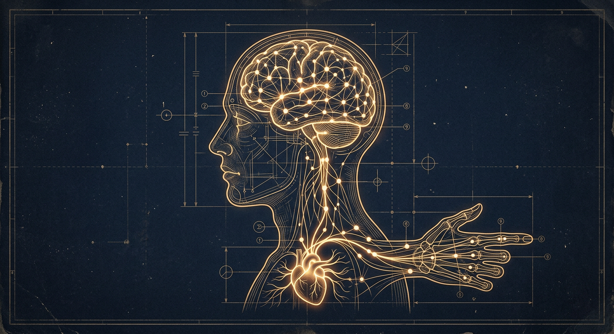

```
╔══════════════════════════════════════════════════════════════╗
║              А К А Д Е М И Я   К О М И Т Е Т А                ║
║                                                               ║
║   ФАКУЛЬТЕТ МОТИВАЦИИ                                         ║
║   КУРС: «МОТИВЫ И МОТИВАЦИЯ: ТЕОРИЯ,                         ║
║          ДИАГНОСТИКА И ОШИБКИ»                               ║
║                                                               ║
║   ГРИФ: ДЛЯ СЛУЖЕБНОГО ПОЛЬЗОВАНИЯ      ЭКЗ. № ___           ║
║   ОБЪЁМ: 7 МОДУЛЕЙ · 22 ЛЕКЦИИ · 12 КЕЙСОВ                   ║
╚══════════════════════════════════════════════════════════════╝
```

> *«Человек всегда делает что-то по какой-то причине. Работа агента — узнать причину раньше, чем человек её осознает.»*

---

## О ДОКУМЕНТЕ

### Что это

Курс о том, **почему люди делают то, что делают** — и почему попытки «замотивировать» так часто дают обратный результат. Это прикладной разбор мотивации: от устройства мотива до типичных ошибок, из-за которых мотив ломают там, где хотели укрепить.

Курс написан для работы сотрудника Комитета: с источниками, с подозреваемыми, с фракциями, с собственными людьми. Но он одинаково применим к любому человеку на сервере — от новичка у спавна до комиссара.

### Принципы

1. **Мотив существует всегда.** Нет «немотивированных» людей — есть люди, чей мотив мы не нашли или не принимаем. «Он ничем не мотивирован» — это диагноз нашему наблюдению, а не человеку.
2. **Мотив виден в свободном выборе.** Что человек делает, когда за это не платят и не наказывают, — и есть его настоящий мотив.
3. **Качество мотива важнее его силы.** Мотив, рождённый интересом и выбором, держится месяцами; мотив, рождённый страхом, держится до первой возможности.
4. **Вмешательство имеет цену.** Любое внешнее воздействие на мотив может его **усилить**, а может **вытеснить**. Курс учит различать эти два исхода до, а не после.
5. **Ошибка проекции — главная.** Самая частая ошибка не в выборе награды, а в том, что мы приписываем человеку свой мотив.

### Как читать курс

- **Модули 1–2** — теория: что такое мотив и какими картами его описывают.
- **Модуль 3** — диагностика: как узнать мотив, не спрашивая о нём напрямую.
- **Модуль 4** — работа: усиление, удержание и корректное завершение.
- **Модуль 5** — ошибки. Если читать только один модуль — читайте этот.
- **Модули 6–7** — практикум и инструменты.

### Что внутри, кроме текста

- **10 схем и диаграмм** в папке `img/` (континуум мотивации, пирамида потребностей с критикой, кривая Йеркса — Додсона, эффект переоправдания с размерами эффектов, формула Врума, карта Бартла, модель Фогга, шкалы Герцберга, кривая насыщения, карта ошибок);
- **4 иллюстрации** (обложка, весы внешнего и внутреннего, золотая клетка переоправдания, компас мотивов);
- **около 40 таблиц и соотношений**;
- **12 разобранных кейсов** из практики сервера.

---

## ОГЛАВЛЕНИЕ

| Раздел | Содержание |
|---|---|
| [Глоссарий](#глоссарий) | 24 термина курса |
| [Модуль 1](#модуль-1-что-такое-мотив) | Что такое мотив: анатомия, внутреннее и внешнее, уровень возбуждения |
| [Модуль 2](#модуль-2-карты-мотивов) | Пять систем координат: содержательные, процессуальные, игровые теории |
| [Модуль 3](#модуль-3-диагностика-мотива) | Как узнать мотив: наблюдение, разговор, проверка, карточка |
| [Модуль 4](#модуль-4-работа-с-мотивом) | Усиление, удержание, насыщение, корректный выход |
| [Модуль 5](#модуль-5-ошибки) | Двенадцать ошибок и карта их тяжести |
| [Модуль 6](#модуль-6-практикум) | 12 кейсов с разбором |
| [Модуль 7](#модуль-7-инструменты) | Бланки, формулы, шпаргалка |
| [Итоговая аттестация](#итоговая-аттестация) | Билеты, практическое задание, критерии |
| [Источники](#источники) | Список литературы и ссылок |

---

# ГЛОССАРИЙ

| Термин | Значение |
|---|---|
| **Мотив** | Внутреннее основание действия: то, ради чего человек действует |
| **Потребность** | Состояние нужды; источник мотива, но ещё не сам мотив |
| **Стимул** | Внешнее воздействие, которое может задеть мотив, а может и нет |
| **Цель** | Представляемый результат, к которому направлено действие |
| **Валентность** | Субъективная ценность результата для конкретного человека |
| **Внутренняя мотивация** | Действие ради интереса и удовольствия от самого процесса |
| **Внешняя мотивация** | Действие ради отделённого от процесса результата |
| **Интроекция** | Мотив, запущенный чувством вины или гордости («надо», «стыдно») |
| **Идентификация** | Мотив, принятый как лично значимый («мне это важно») |
| **Автономия** | Потребность быть источником собственных действий |
| **Компетентность** | Потребность чувствовать себя эффективным |
| **Связанность** | Потребность в принадлежности и значимых отношениях |
| **Самодетерминация** | Степень, в которой действие ощущается своим, а не навязанным |
| **Переоправдание** | Ошибка: награда за уже интересное дело гасит интерес к нему |
| **Вытеснение (crowding out)** | То же в экономической формулировке: внешний стимул вытесняет внутренний мотив |
| **Эскалация ставки** | Потребность увеличивать награду ради того же отклика |
| **Гедоническая адаптация** | Привыкание: радость от повторяющегося блага убывает |
| **Инструментальность** | Вера в то, что результат действительно будет оплачен |
| **Ожидание (expectancy)** | Вера в то, что усилие приведёт к результату |
| **Атрибуция** | Объяснение причин поведения — своего и чужого |
| **Реактантность** | Сопротивление, возникающее при ощущении давления на выбор |
| **Насыщение** | Падение отклика на повторяющийся стимул |
| **Переменное подкрепление** | Награда, приходящая не каждый раз и не по расписанию |
| **Петля привычки** | Схема: сигнал → действие → награда → закрепление |

---

# МОДУЛЬ 1. ЧТО ТАКОЕ МОТИВ

## Лекция 1.1. Анатомия мотива: от нужды к действию

**Цель:** перестать путать потребность, мотив, стимул и цель — и научиться видеть всю цепочку целиком.

### Ключевые понятия

- **Потребность** — исходное состояние нужды.
- **Мотив** — опредмеченная потребность: нужда, нашедшая свой объект.
- **Стимул** — внешний толчок, который может совпасть с мотивом, а может пройти мимо.
- **Цель** — образ желаемого результата.
- **Обратная связь** — то, что закрепляет или гасит мотив.

### Содержание

Мотивация — это не «когда человек хочет». Это **процесс**, в котором нужда превращается в действие и возвращается результатом.

**Полная цепочка:**

```
ПОТРЕБНОСТЬ        чего-то не хватает (безопасности, признания, смысла)
      ↓
   МОТИВ           нужда нашла свой предмет: «мне нужно именно это»
      ↓
   СТИМУЛ          внешнее событие задевает мотив (или не задевает)
      ↓
   ОЦЕНКА          «смогу ли? оплатят ли? насколько мне это надо?»
      ↓
   ЦЕЛЬ            конкретный представляемый результат
      ↓
 ДЕЙСТВИЕ          то, что можно наблюдать
      ↓
  РЕЗУЛЬТАТ        приближение к цели или промах
      ↓
 ОБРАТНАЯ СВЯЗЬ    пересборка мотива: усиливает, гасит или не меняет
      ↓
     ↺  возврат к потребности на новом уровне
```

**Четыре вещи, которые путают чаще всего:**

| Понятие | Где находится | Пример |
|---|---|---|
| **Потребность** | Внутри, не оформлена | «Чего-то не хватает в общении» |
| **Мотив** | Внутри, оформлен | «Хочу быть в ядре фракции» |
| **Стимул** | Снаружи | Приглашение на сбор |
| **Цель** | Впереди | «Пройти отбор за две недели» |

**Ключевое следствие.** Стимул работает **только если попадает в мотив**. Одно и то же предложение — приглашение, деньги, угроза, похвала — для одного человека становится пусковым крючком, для другого проходит мимо, а для третьего отталкивает. Отсюда главная практика курса: **сначала мотив, потом предложение**.

**Мотив всегда сложнее одного слова.** У человека обычно работает связка: ведущий мотив плюс фоновые. Например: «хочет признания» (ведущий) + «боится подставить друга» (сдерживающий) + «устал от игры» (фон). Работа идёт не с одним мотивом, а с их конфигурацией: что тянет, что держит, что тянет в другую сторону.

> **Правило Комитета:** не спрашивай «что ему предложить». Спрашивай «чего он хочет и что его останавливает».

### Пример из полевой практики

Двум игрокам предложили одинаковое: место в патруле. Один согласился в тот же день — ему нужна была принадлежность: он уже третий месяц болтался у спавна без дела. Второй отказался, хотя ресурсов у него было меньше: у него был мотив независимости, а патруль — это подчинённость и форма. Позже он согласился на роль детектива-одиночки: тот же статус, но без строя.

### Практикум

Возьмите двух знакомых игроков с похожим положением. Опишите для каждого: потребность, мотив, что будет стимулом, что станет целью. Найдите, где их мотивы расходятся при одинаковой внешней ситуации.

### Контрольные вопросы

1. Чем потребность отличается от мотива?
2. Почему одинаковый стимул по-разному действует на разных людей?
3. Из скольких звеньев состоит полная цепочка мотивации?
4. Что означает «у человека конфигурация мотивов, а не один мотив»?

---

## Лекция 1.2. Внутреннее и внешнее: континуум, а не переключатель

**Цель:** понять, что мотивация — не «или внутренняя, или внешняя», а шкала со степенью присвоенности.

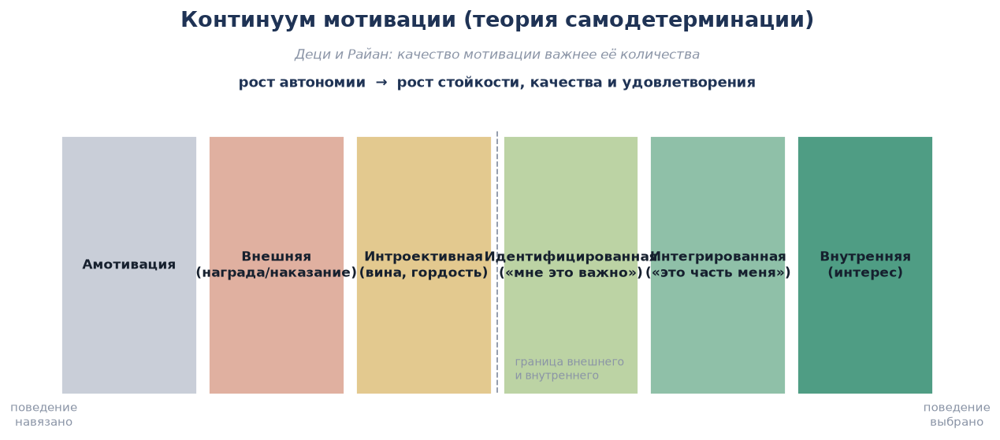

### Ключевые понятия

- **Амотивация** — нет ни интереса, ни смысла, ни внешнего давления.
- **Внешняя регуляция** — действие ради награды или избегания наказания.
- **Интроективная** — действие из вины, стыда или гордости.
- **Идентифицированная** — действие потому, что человек сам признаёт его важным.
- **Интегрированная** — действие согласовано с остальными ценностями человека.
- **Внутренняя** — действие ради самого процесса.

### Содержание

Теория самодетерминации Деци и Райана описывает мотивацию не как переключатель «своё — чужое», а как **континуум присвоенности**: от полностью навязанного поведения до полностью выбранного [1](https://www.verywellmind.com/what-is-self-determination-theory-2795387) [2](https://en.wikipedia.org/wiki/Self-determination_theory).

**Почему качество важнее количества:**

| Тип мотивации | Стойкость | Качество работы | Что происходит при снятии давления |
|---|---|---|---|
| Внешняя (награда) | До окончания выплат | Минимально необходимое | Действие прекращается |
| Интроективная (вина, гордость) | Средняя | Среднее, с напряжением | Чувство облегчения и отказ |
| Идентифицированная | Высокая | Хорошее | Продолжает, но без огня |
| Внутренняя | Наивысшая | Лучшее, с выдумкой | Продолжает — это и есть награда |

**Три базовые потребности.** Внутренняя мотивация вырастает не из «позитивного настроя», а из удовлетворения трёх потребностей [3](https://www.apa.org/research-practice/conduct-research/self-determination-theory):

| Потребность | Человек говорит | Признак удовлетворения | Признак дефицита |
|---|---|---|---|
| **Автономия** | «Я сам так решил» | Предлагает своё, спорит по существу | Делает только по инструкции; ждёт команды |
| **Компетентность** | «У меня получается» | Берёт более сложное, просит обратную связь | Избегает оценки; выбирает заведомо лёгкое |
| **Связанность** | «Я здесь свой» | Помогает другим, защищает группу | Держится особняком; не верит в доброжелательность |

**Важнейший практический вывод:** давление, контроль, публичная оценка и жёсткие сроки бьют по автономии — и тем самым **снижают** внутреннюю мотивацию даже там, где она была [2](https://en.wikipedia.org/wiki/Self-determination_theory). Одно и то же действие можно задать двумя способами:

- «Нужно, чтобы ты собрал сведения по фракции, доложишь к вечеру» — контроль, дедлайн, внешняя регуляция.
- «Смотри, тут странное совпадение. Что ты об этом думаешь? Тебе интересно будет раскопать?» — выбор, интерес, внутренняя регуляция.

Результат тот же, но во втором случае человек ещё и останется мотивирован после того, как задача будет закрыта.

> **Правило Комитета:** давай задачу так, чтобы человек мог сказать «я сам это выбрал». Тогда он доделает её и без напоминания.

### Пример из полевой практики

Игрок сам, по собственной инициативе, составил карту торговых путей и прислал её в Комитет. Куратор поблагодарил и попросил «продолжать, в том же духе, каждый четверг». Через три недели поток иссяк: добровольное дело превратилось в обязанность с дедлайном. Та же работа, но заданная как просьба о помощи в конкретный момент, возобновилась и шла ещё два месяца.

### Практикум

Возьмите три поручения, которые вы выдавали за последнюю неделю. Перепишите каждое так, чтобы в нём появился выбор (автономия), ясность успеха (компетентность) и обращение к общему делу (связанность).

### Контрольные вопросы

1. Почему мотивацию называют континуумом, а не переключателем?
2. Назовите три базовые потребности и признаки их дефицита.
3. Как формулировка задания влияет на тип мотивации?
4. Почему жёсткий дедлайн иногда снижает мотивацию?

---

## Лекция 1.3. Уровень возбуждения: почему «больше давления» не значит «больше результата»

**Цель:** научиться дозировать давление — и понимать, когда человек уже за гранью.

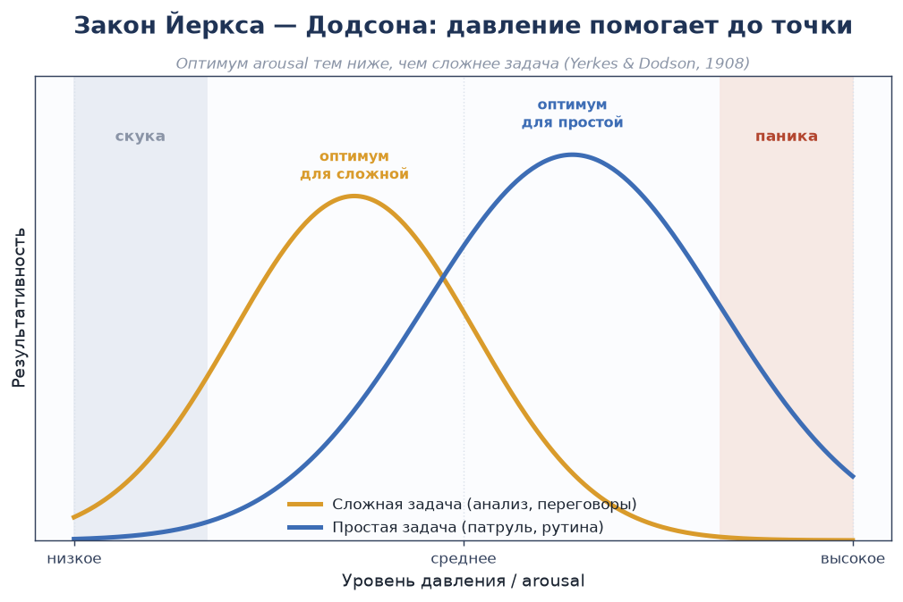

### Ключевые понятия

- **Возбуждение (arousal)** — уровень активации: от сонливости до паники.
- **Закон Йеркса — Додсона** — связь возбуждения и результата имеет форму перевёрнутой U.
- **Эустресс и дистресс** — полезное и разрушительное напряжение.
- **Поток** — состояние, когда сложность и мастерство совпадают.

### Содержание

Классический результат 1908 года, подтверждаемый и сегодня: результативность растёт с ростом возбуждения **до оптимума**, после чего падает; причём чем сложнее задача, тем ниже этот оптимум [1](https://grokipedia.com/page/Yerkes%E2%80%93Dodson_law) [5](https://www.albert.io/blog/arousal-theory-of-motivation-ap-psychology-review/).

**Практическая таблица дозирования:**

| Задача | Оптимум давления | Что происходит при недоборе | Что происходит при переборе |
|---|---|---|---|
| Рутина (обход, дежурство) | Средне-высокое | Скука, пропуски | Терпимо, ошибки растут медленно |
| Работа по инструкции (протокол, осмотр) | Среднее | Небрежность | Пропуск деталей, «лишь бы сдать» |
| Анализ, переговоры, вербовка | Низко-среднее | Человек не включается | Сужение внимания, шаблонные решения, потеря тонкости |
| Творчество, поиск нестандартного | Низкое | Лень | Блок: человек повторяет известное |

**Три следствия для практики:**

1. **Сложную работу нельзя делать под давлением.** Допрос «на нервах» даёт быстрые признания и плохую информацию. Человек под давлением говорит то, что от него хотят услышать.
2. **Скука разрушает не меньше стресса.** Недогруженный сотрудник теряет бдительность не потому, что плохой, а потому что система не даёт ему задачи под его уровень.
3. **Давление привыкаемо.** То, что вчера мобилизовало, сегодня воспринимается как фон. Отсюда эскалация: чтобы получить прежний отклик, начальство добавляет давление — и рано или поздно переходит оптимум.

**Поток.** Оптимальное состояние — не расслабленность, а **совпадение сложности и мастерства**. Задача чуть выше текущего уровня, мгновенная обратная связь, ясная цель. Это и есть то состояние, когда человек работает часами и не замечает времени. Задача руководителя — держать человека в этой узкой полосе: повышать сложность по мере роста мастерства.

> **Правило Комитета:** прежде чем давить, проверь, не перешёл ли человек оптимум. Иногда лучшее управление — снять лишнее давление.

### Пример из полевой практики

Агент три недели не мог выйти на нужного человека: тот отвечал односложно и явно тяготился беседами. Выяснилось, что беседы шли в часы, когда у него на сервере шла стройка, а куратор требовал «результата к вечеру каждую неделю». Дедлайн сняли, встречи перенесли на спокойное время, а вопросы сократили до одного за раз. Через две недели человек сам начал рассказывать: давление мешало не мотиву, а способности говорить.

### Практикум

Опишите задачу, которую вы сейчас выполняете. Оцените по шкале 1–10: ваш уровень возбуждения, сложность задачи и место оптимума. Что нужно изменить — добавить давления или снять его?

### Контрольные вопросы

1. Как форма кривой Йеркса — Додсона зависит от сложности задачи?
2. Что опаснее для сложной работы: недобор или перебор давления?
3. Почему давление со временем требует эскалации?
4. Что такое состояние потока и как его удерживать?

---

# МОДУЛЬ 2. КАРТЫ МОТИВОВ

> Пять систем координат. Ни одна не является «правильной» — каждая отвечает на свой вопрос.

## Лекция 2.1. Содержательные теории: ЧЕГО человек хочет

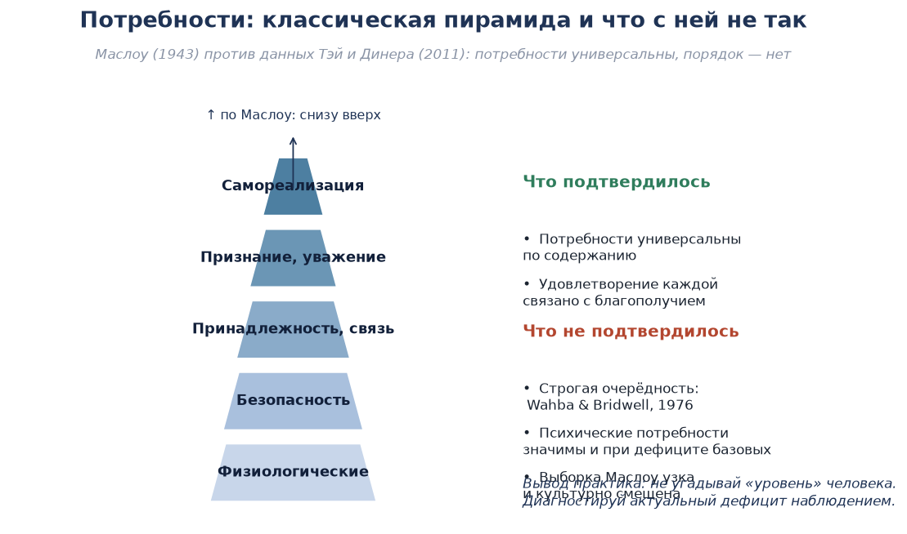

### Ключевые понятия

- **Маслоу** — пять уровней потребностей (1943).
- **ERG Альдерфера** — существование, связанность, рост; уровни могут действовать одновременно.
- **Герцберг** — гигиенические факторы против мотиваторов.
- **Макклелланд** — достижение, соучастие, власть.
- **Райсс** — 16 базовых желаний с индивидуальным профилем.

### Содержание

**Маслоу: пирамида и её пределы.** Пирамида полезна как напоминание, что человек без безопасности не думает о признании. Но строгой очерёдности исследование не подтверждает: обзор Уобы и Бридуэлла (1976) нашёл ей мало поддержки, а данные Тэй и Динера (2011) показали, что потребности универсальны по **содержанию**, но не по **порядку** — психические потребности остаются значимыми и при дефиците базовых [1](https://www.simplypsychology.org/maslow.html) [3](https://simplyputpsych.co.uk/psych-101-1/criticism-of-maslows-hierarchy-of-needs). Практический вывод: **не угадывай уровень человека — диагностируй актуальный дефицит**.

**ERG Альдерфера** убирает жёсткость: три группы потребностей действуют одновременно, и неудовлетворённость верхней может вернуть человека к нижней (не получил признания — ушёл в накопительство).

**Герцберг: две разные шкалы.** Главный практический результат этой теории: **удовлетворение и неудовлетворение — не концы одной оси** [3](https://www.earlyyears.tv/herzbergs-two-factor-theory/).

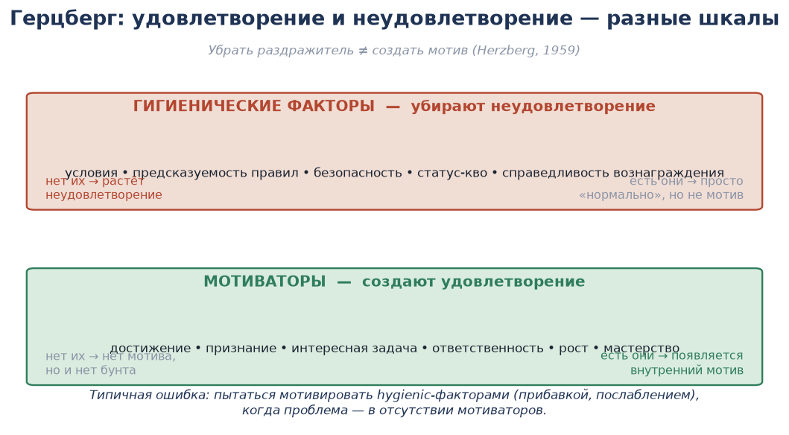

| | Убрать плохо | Добавить хорошо |
|---|---|---|
| **Гигиена** (условия, правила, предсказуемость, справедливость) | Снимает раздражение | Даёт «нормально», но не мотив |
| **Мотиваторы** (достижение, признание, рост, ответственность) | Не вызывает бунта | Даёт настоящий мотив |

Отсюда типичная ошибка руководителя: пытаться мотивировать прибавкой там, где человек задыхается от отсутствия признания и роста.

**Макклелланд: три приобретённых потребности** [1](https://www.ijesh.com/j/article/download/211/219/418):

| Потребность | Что двигает | Как распознать | Что предлагать | Что не предлагать |
|---|---|---|---|---|
| **Достижение (nAch)** | Сделать трудное, лучше прежнего | Любит задачи средней трудности, просит обратную связь | Конкретная цель, измеримый прогресс, усложнение | Лотерею, задачу без шанса, похвалу без содержания |
| **Соучастие (nAff)** | Принадлежать, быть принятым | Избегает конфликтов, держится группы | Команду, общее дело, тёплый приём | Изоляцию, публичную конкуренцию, роль судьи |
| **Власть (nPow)** | Влиять, определять исход | Спорит, берёт слово, тянет организовывать других | Полномочия, ответственность за других, видимость влияния | Бесправное исполнение, роль «при ком-то» |

**Райсс: 16 желаний и профиль, а не среднее.** Стивен Райсс и Сьюзен Хейверкэмп на выборках в тысячи человек выделили 16 базовых желаний — власть, независимость, любопытство, принятие, порядок, накопление, честь, идеализм, общение, семья, статус, месть, романтика, еда, физическая активность, спокойствие [3](https://news.osu.edu/new-theory-of-motivation-lists-16-basic-desires-that-guide-us/). Ключевая идея: **уникален не набор, а профиль** — то, как желания ранжируются у конкретного человека. Двое могут хотеть одного и того же, но с разной силой, и это меняет всё.

### Практикум

Возьмите трёх знакомых. Опишите каждого по Макклелланду (ведущая потребность) и по Райссу (три верхних желания). Где две модели расходятся?

### Контрольные вопросы

1. Что именно не подтвердилось в пирамиде Маслоу?
2. Чем гигиенические факторы отличаются от мотиваторов?
3. Опишите три потребности по Макклелланду.
4. Почему в модели Райсса важен профиль, а не список?

---

## Лекция 2.2. Процессуальные теории: КАК человек решает действовать

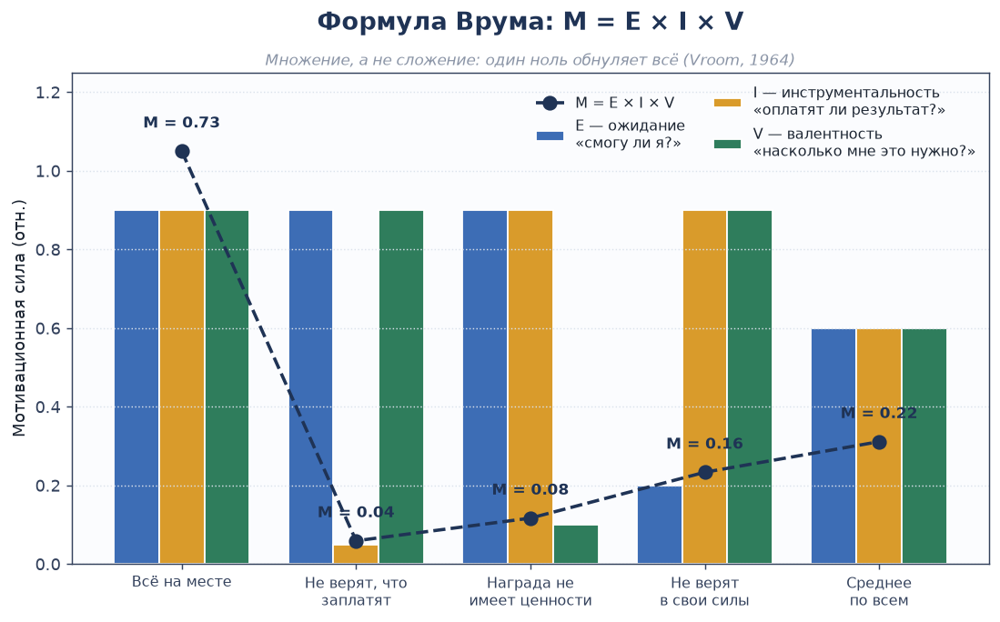

### Ключевые понятия

- **Ожидание (E)** — «смогу ли я?».
- **Инструментальность (I)** — «оплатят ли результат?».
- **Валентность (V)** — «насколько мне это нужно?».
- **Цель по Локку** — конкретная и трудная цель даёт больше, чем «старайся».
- **Справедливость по Адамсу** — сравнение своего вклада и вознаграждения с чужим.

### Содержание

**Врум: мотивация как произведение.** В 1964 году Виктор Врум предложил формулу **M = E × I × V** [1](https://pubadmin.institute/administrative-theory/victor-vrooms-expectancy-theory-work-motivation) [2](https://yukaichou.com/behavioral-analysis/expectancy-theory-vroom-motivation-formula/). Важнее всего в ней знак умножения: **один ноль обнуляет всё**. Нельзя компенсировать отсутствие веры в свои силы размером награды — и нельзя заменить ценность награды ясностью задачи.

**Диагностика по формуле — три разных ремонта:**

| Что сломалось | Симптом | Что чинить |
|---|---|---|
| **E ≈ 0** — не верит, что справится | «Это невозможно», откладывает, не начинает | Обучение, разбивка на шаги, первый маленький успех |
| **I ≈ 0** — не верит, что заплатят | «Всё равно не заметят», «обещали уже» | Прозрачность критериев, оплата по факту, публичное подтверждение правила |
| **V ≈ 0** — награда безразлична | «Мне это не нужно», равнодушие при высокой способности | Персонализация: выяснить, что ценно именно этому человеку |

**Локк и Лэтэм: цель как инструмент.** Конкретная и трудная цель даёт больший результат, чем абстрактная или лёгкая. Но есть три условия: человек принимает цель, получает обратную связь по пути и **не обманывает ради неё** (о цене этой ошибки — в лекции 5.3).

**Адамс: справедливость.** Человек сравнивает **своё** соотношение вклада и вознаграждения с **чужим**. Важна не абсолютная величина, а соотношение. Отсюда правило: несправедливость демотивирует сильнее, чем скупость. Скупой, но последовательный начальник теряет меньше, чем щедрый, но произвольный.

**Фогг: поведение как произведение трёх.** B = M · A · P — поведение случается, когда сошлись мотивация, способность и сигнал [3](https://www.behaviormodel.org/) [2](https://www.thebehavioralscientist.com/articles/fogg-behavior-model).

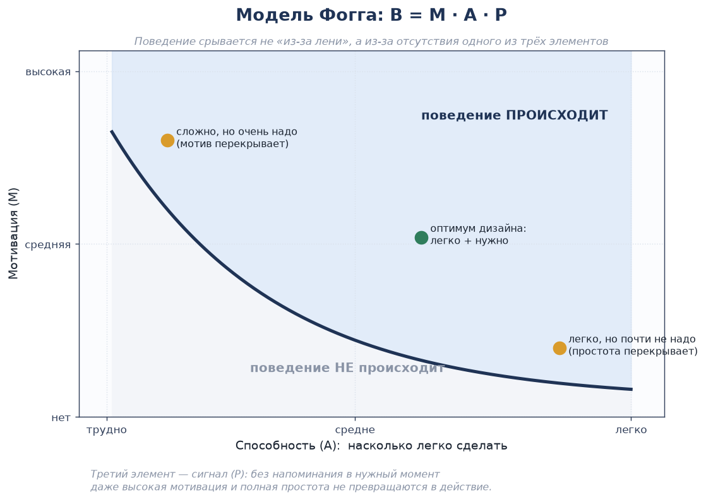

Практическая ценность модели — в диагностике: если действие не происходит, **всегда** можно указать, чего именно не хватило. И главный вывод Фогга: **проще сделать действие легче, чем поднять мотивацию**. Снижение трения устойчивее, чем уговаривание.

### Пример из полевой практики

Агент не понимал, почему источник перестал отвечать на задания. Проверка по Вруму: ожидание высокое (человек способный), валентность высокая (статус ему важен), инструментальность — нулевая: трижды выполненные задания не привели ни к признанию, ни к обещанной встрече. Починка заняла пять минут: куратор показал, куда конкретно пошли его сведения и что они изменили. Поток возобновился без всякой новой награды.

### Практикум

Возьмите человека, который «не хочет» делать нужное вам дело. Проверьте по очереди E, I и V. Какой из трёх элементов ближе всего к нулю и что вы сделаете?

### Контрольные вопросы

1. Почему в формуле Врума именно умножение?
2. Как диагностировать, какой из трёх элементов сломан?
3. Почему несправедливость демотивирует сильнее скупости?
4. Что дешевле: поднять мотивацию или снизить трение?

---

## Лекция 2.3. Игровые мотивы: карта для сервера

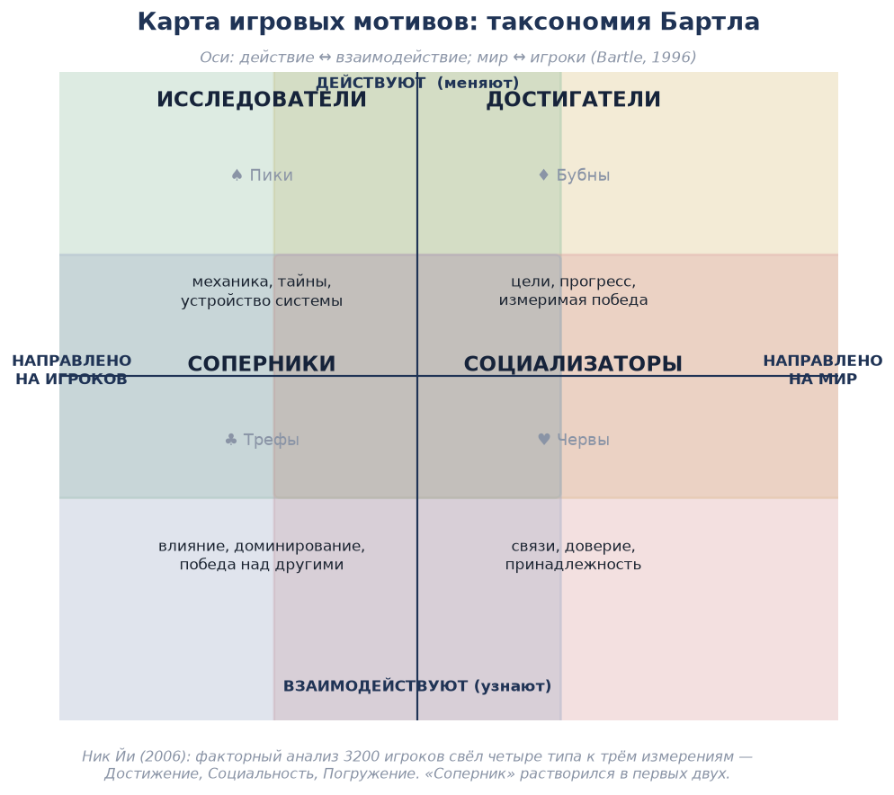

### Ключевые понятия

- **Бартл** — четыре типа игроков по двум осям (1996).
- **Йи** — три измерения: достижение, социальность, погружение (2006).
- **HEXAD** — шесть типов, включая филантропа и нарушителя.
- **Сдвиг типа** — игрок меняет ведущий мотив по мере освоения сервера.

### Содержание

Ричард Бартл разделил игроков MUD по двум осям: **действуют ↔ взаимодействуют** и **направлено на мир ↔ на игроков** [2](https://gdad.wiki/wiki/game-design/player-psychology/bartle-taxonomy).

| Тип | Ведущий мотив | Что он делает на сервере | Что его удерживает | Что его отталкивает |
|---|---|---|---|---|
| **Достигатель** | Прогресс, измеримая победа | Строит эффективно, собирает, бьёт рекорды | Цели, ранги, сравнение с собой прежним | Бесцельность, отсутствие измеримого прогресса |
| **Исследователь** | Понимание устройства | Ищет механику, тестирует границы, картографирует | Тайны, сложные системы, редкие знания | Заскриптованность, отсутствие неизвестного |
| **Социализатор** | Связь и принадлежность | Торгует, помогает, сводит людей, ведёт чат | Доверие, история отношений, роль в группе | Токсичность, изоляция, анонимность |
| **Соперник** | Влияние и доминирование | Сражается, доминирует, ломает чужие планы | Соперничество, репутация силы, статус | Отсутствие достойного противника, скучный мир |

Ник Йи, опросив более трёх тысяч игроков, показал, что четыре типа статистически сворачиваются в **три измерения** — достижение, социальность, погружение; «соперник» распределился между первыми двумя [5](https://yukaichou.com/entrepreneurship/bartles-player-types-octalysis-core-drives/). Для практики это означает: **не навешивайте ярлык, оценивайте измерения** — у одного человека может быть высокое достижение и низкая социальность, и это меняет подход полностью.

**Сдвиг типа — правило, а не исключение.** Новичок — исследователь (всё ново), через месяц — достигатель (понял систему, хочет прогресса), через полгода — социализатор (остаётся ради людей) или соперник (ради влияния). Работа с человеком должна меняться вместе с ним: то, что привлекало его в первый месяц, через полгода может вызывать скуку.

**Привязка к серверу:**

| Проявление на сервере | Скорее всего, ведущий мотив |
|---|---|
| Идеальные фермы, учёт ресурсов, таблицы | Достижение |
| Знает механику лучше админов, ищет край карты, тестирует границы | Исследование |
| Торгует, знакомит новичков, держит «дом» | Социальность |
| Ивент-победы, споры в чате, желание решать споры | Влияние / статус |
| Собирает «на всякий случай», не тратит | Накопление (по Райссу) |
| Ломает чужое, не забирая себе | Влияние или месть (по Райссу) |

> **Правило Комитета:** тип игрока — не приговор, а гипотеза. Проверяй её по тому, что человек делает в свободное время, а не по тому, что он о себе говорит.

### Практикум

Выберите пять игроков сервера. Для каждого укажите ведущее измерение по Йи и три поведенческих признака, подтверждающих гипотезу. Отметьте, у кого за последний месяц тип мог сдвинуться.

### Контрольные вопросы

1. Каковы две оси таксономии Бартла?
2. Чем модель Йи отличается от модели Бартла?
3. Что такое сдвиг типа и почему он важен?
4. Почему заявления человека о себе — слабое доказательство его мотива?

---

## Лекция 2.4. Какую карту когда брать

### Содержание

Пять карт — не конкурирующие теории, а пять вопросов. Сводная таблица:

| Карта | Вопрос | Когда брать | Ограничение |
|---|---|---|---|
| **Потребности (Маслоу, ERG, Герцберг)** | Чего не хватает прямо сейчас? | Когда человек «вялый», жалуется, уходит | Порядок уровней не подтверждается; не годится как классификация людей |
| **Макклелланд** | К чему он стремится: сделать, принадлежать, влиять? | Быстрая гипотеза о ведущем мотиве | Огрубляет: три потребности на всех |
| **Райсс** | Каков его профиль из 16 желаний? | Когда стандартные подходы не работают | Требует наблюдения или теста; 16 шкал сложно держать в уме |
| **Врум** | Почему он не делает? Что обнулилось? | Диагностика конкретного бездействия | Предполагает рациональность; плохо ловит эмоции |
| **Бартл / Йи** | Как он играет? | Прогноз поведения на сервере | Описывает «что», а не «почему» |

**Порядок применения:**

```
1. Йи / Бартл     → первая гипотеза по поведению на сервере
2. Макклелланд    → ведущий мотив: сделать / принадлежать / влиять
3. Герцберг       → проверка: не задыхается ли он от гигиены
4. Врум           → диагностика: что именно обнулилось прямо сейчас
5. Райсс          → уточнение профиля, если первые четыре не объясняют
```

> **Правило Комитета:** карта — это способ задать вопрос, а не наклеить ярлык. Ярлык снимает необходимость наблюдать; карта её создаёт.

### Практикум

Возьмите человека, чьё поведение вам непонятно. Прогоните его по всем пяти картам подряд. Какая карта дала новое понимание?

### Контрольные вопросы

1. В каком порядке применяются пять карт?
2. Какая карта лучше всего подходит для диагностики бездействия?
3. Какая — для быстрой гипотезы о ведущем мотиве?
4. Почему карту нельзя превращать в ярлык?

---

# МОДУЛЬ 3. ДИАГНОСТИКА МОТИВА

> *«Спросить человека, почему он это делает, — самый надёжный способ получить не ответ, а оправдание.»*

## Лекция 3.1. Наблюдение: что человек делает бесплатно

**Цель:** научиться читать мотив по поведению, а не по словам.

### Ключевые понятия

- **Свободный выбор** — то, что человек делает без оплаты и принуждения.
- **Валюта времени** — куда уходят часы.
- **Предметы раздражения** — что человек защищает, когда не обязан.
- **Спонтанное внимание** — на что он реагирует первым.

### Содержание

Люди плохо знают свои мотивы и ещё хуже о них рассказывают — не из лжи, а потому что объясняют себя постфактум. Поэтому первый источник данных — **поведение в свободном выборе**.

**Шесть наблюдаемых признаков:**

| Что наблюдать | Что это говорит о мотиве |
|---|---|
| На что уходит время без обязательств | Ведущий мотив: во что человек вкладывается добровольно |
| О чём он говорит первым | Что у него «болит» или радует прямо сейчас |
| Что он защищает в споре | Ценность, а не интерес: человек защищает то, с чем себя отождествляет |
| На что он соглашается быстро | Актуальный дефицит |
| От чего он отказывается, даже выгодного | Сдерживающий мотив: страх, лояльность, принцип |
| Как он реагирует на признание | Потребность в статусе против потребности в мастерстве |

**Признание как диагностический инструмент.** Похвалите человека — и смотрите, что он сделает с похвалой:

| Реакция на похвалу | Что это означает |
|---|---|
| Просит подробностей, хочет знать, как сделать лучше | Компетентность |
| Рассказывает другим, хочет публичности | Статус, признание |
| Смущается и переводит на группу: «мы старались» | Связанность |
| Сразу спрашивает «а что дальше?» | Достижение, прогресс |
| Безразличен | Значит, вы похвалили не за то, что ему важно |

**Три вопроса наблюдателя:**

1. Что он делает, когда за это ничего не будет?
2. Что он делает, когда никто не видит?
3. Что он продолжает делать, когда это перестало быть выгодным?

> **Правило Комитета:** слова описывают, как человек хочет выглядеть. Поведение показывает, каков он есть.

### Пример из полевой практики

Игрок уверял, что ему «просто интересна торговля». Наблюдение показало иное: он стабильно тратил время не на выгодные сделки, а на посредничество в чужих спорах — бесплатно, затратно, иногда в убыток. Ведущий мотив оказался влиянием и статусом арбитра. Работа, построенная на выгоде, давала нулевой отклик; работа, построенная на признании его роли, — полный.

### Практикум

Выберите игрока. Неделю наблюдайте без вмешательства. Заполните таблицу шести признаков. Сформулируйте гипотезу мотива в одном предложении.

### Контрольные вопросы

1. Почему слова человека — слабый источник данных о мотиве?
2. Назовите шесть наблюдаемых признаков.
3. Как реакция на похвалу выдаёт потребность?
4. Сформулируйте три вопроса наблюдателя.

---

## Лекция 3.2. Разговор: вопросы, которые не подсказывают ответ

**Цель:** получить от человека его мотив, не вложив в него свой.


### Ключевые понятия

- **Открытый вопрос** — вопрос, не предполагающий короткого ответа.
- **Наводящий вопрос** — вопрос, содержащий ожидаемый ответ.
- **Шкала готовности** — измерение мотивации числом от 1 до 10.
- **Мотивационное интервьюирование** — стиль беседы, в котором человек сам проговаривает свои причины.
- **GROW** — структура разговора: цель, реальность, варианты, намерение.

### Содержание

**Главное правило:** тот, кто больше говорит, тот и управляется. Задача агента — говорить меньше и слушать дольше.

**Три уровня вопросов:**

| Уровень | Пример | Когда применять |
|---|---|---|
| **Открытый** | «Как ты к этому пришёл?» | В начале: дать человеку выговориться |
| **Уточняющий** | «Что именно тебя там зацепило?» | Углубление без подсказки |
| **Шкальный** | «Насколько тебе это важно — от одного до десяти?» | Измерение силы мотива |

**Шкала готовности и её главный приём.** Спросите: «Насколько тебе важно это сделать — от 1 до 10?» Если человек отвечает «4», не спрашивайте «почему 4». Спросите: **«Почему не 2?»** — человек начнёт объяснять, почему ему всё-таки важно, и сам произнесёт аргументы за действие. Вопрос «почему 4» заставит его оправдываться и закрепит бездействие.

**Мотивационное интервьюирование** — четыре приёма:

1. **Открытые вопросы** — чтобы человек сам формулировал причины. Самопроизнесённый аргумент убеждает сильнее чужого.
2. **Подтверждение** — признание права человека на его чувства и сомнения. Снимает необходимость защищаться.
3. **Рефлексивное слушание** — возврат услышанного своими словами; человек уточняет и углубляет.
4. **Резюмирование** — связка сказанного воедино: человек слышит свою позицию целиком и часто сам её корректирует.

Теория самодетерминации объясняет, почему это работает: такой стиль разговора поддерживает автономию [3](https://www.apa.org/research-practice/conduct-research/self-determination-theory).

**GROW — каркас разговора о задаче:**

| Шаг | Вопрос | Что получаем |
|---|---|---|
| **G** — цель | «Чего ты хочешь добиться?» | Цель в его формулировке, а не в вашей |
| **R** — реальность | «Что происходит сейчас?» | Факты, а не оценки |
| **O** — варианты | «Что можно сделать?» | Он сам предлагает решения |
| **W** — намерение | «Что ты сделаешь и когда?» | Обязательство, взятое добровольно |

**Что разрушает разговор:**

| Ошибка | Что происходит |
|---|---|
| Наводящий вопрос | Человек отвечает то, что от него ждут |
| Спор и возражения | Человек защищается и укрепляется в своей позиции |
| Совет до того, как о нём попросили | Совет воспринимается как давление; автономия падает |
| Допрос под давлением | Сужение внимания, потеря деталей (см. лекцию 1.3) |

> **Правило Комитета:** если вы говорили больше половины беседы, вы её не провели.

### Пример из полевой практики

Кандидат на роль информатора колебался. Прямое «почему ты не хочешь?» дало перечень отговорок. Куратор сменил тактику: «Насколько тебе это важно — от одного до десяти?» — «Три». — «Почему не один?» — и человек сам, двумя фразами, назвал настоящую причину интереса: его обошли при распределении добычи. Мотив был найден без единого подсказанного слова.

### Практикум

Разыграйте в паре один и тот же разговор двумя способами: через наводящие вопросы и через шкалу готовности. Сравните, что удалось узнать.

### Контрольные вопросы

1. Почему «почему не 2?» работает лучше, чем «почему 4?»?
2. Назовите четыре приёма мотивационного интервьюирования.
3. Что такое GROW?
4. Почему совет, данный слишком рано, снижает автономию?

---

## Лекция 3.3. Проверка: как отличить настоящий мотив от правдоподобного

**Цель:** превратить догадку о мотиве в проверенное утверждение.

### Ключевые понятия

- **Гипотеза мотива** — проверяемое утверждение о том, что движет человеком.
- **Поведенческий эксперимент** — проверка через выбор, а не через вопрос.
- **Различающая ситуация** — ситуация, в которой два мотива дают разное поведение.
- **Перепроверка временем** — мотив подтверждается повторяемостью.

### Содержание

Гипотеза о мотиве — это не «мне кажется». Это утверждение, которое можно **опровергнуть**. Формулировка:

```
«Если им движет мотив X, то в ситуации Y он выберет Z,
потому что альтернатива W ему недоступна или невыгодна».
```

**Три способа проверки:**

| Способ | Как делается | Сила |
|---|---|---|
| **Различающая ситуация** | Создать выбор, в котором мотивы дают разные действия | Высокая |
| **Предложение-проба** | Предложить то, что ценно при мотиве X и безразлично при мотиве Y | Средняя |
| **Проверка временем** | Повторяемость в разных обстоятельствах без напоминаний | Высокая, но медленная |

**Таблица: мотив → индикатор → как проверить**

| Предполагаемый мотив | Индикатор | Проверка |
|---|---|---|
| Признание / статус | Говорит о себе, хочет публичности | Дать выбор: публичная благодарность или большая, но тихая награда |
| Мастерство | Просит обратную связь, берёт сложное | Дать выбор: лёгкая задача с похвалой или сложная без гарантий |
| Принадлежность | Держится группы, боится изгнания | Дать выбор: выгодное, но изолированное задание или невыгодное, но с командой |
| Справедливость / обида | Возвращается к старой обиде | Дать выбор: сделка с обидчиком или выгода без него |
| Безопасность / страх | Избегает риска, считает потери | Дать выбор: риск с большой выгодой или скромная гарантия |
| Независимость | Отказывается от подчинения | Дать выбор: высокий статус со строем или скромная роль без начальника |

**Признаки, что гипотеза неверна:**

- проверка даёт обратный результат;
- человек выбирает неожиданно и не может это объяснить — значит, действует мотив, которого вы не видите;
- поведение не повторяется: один раз — случай, два — тенденция, три — мотив.

**Ошибка, которую надо ловить в себе:** влюблённость в первую версию. Она возникает быстро, потому что объясняет всё сразу. Лечение: **назначьте себе альтернативную гипотезу и ищите подтверждения ей**.

> **Правило Комитета:** мотив доказан не тогда, когда он объясняет факты, а тогда, когда он предсказал новый факт.

### Пример из полевой практики

Гипотеза: игрок помогает Комитету из страха. Проверка: ему предложили публичное признание его заслуг перед Администрацией. Если бы двигал страх, он бы отказался: публичность означает засветку. Он согласился с готовностью — и тем самым опроверг гипотезу. Повторная проверка выявила настоящий мотив: статус «посвящённого», принадлежность к закрытому кругу.

### Практикум

Сформулируйте гипотезу о мотиве знакомого в проверяемой форме. Придумайте различающую ситуацию. Опишите, какой результат подтвердит гипотезу, а какой опровергнет.

### Контрольные вопросы

1. Как формулируется проверяемая гипотеза мотива?
2. Что такое различающая ситуация?
3. Назовите три признака того, что гипотеза неверна.
4. Почему нужно искать подтверждения альтернативной гипотезе?

---

## Лекция 3.4. Карточка мотива

**Цель:** получить документ, работающий после вашего ухода.

### Содержание

```
┌────────────────────────────────────────────────────────────┐
│ КАРТОЧКА МОТИВА · КОМИТЕТ                                  │
│ Объект (ник): .................. Дата: .................   │
│ Составил: ...................... Срок пересмотра: ......   │
├────────────────────────────────────────────────────────────┤
│ 1. НАБЛЮДАЕМОЕ ПОВЕДЕНИЕ (факты, без интерпретаций)        │
│    Что делает добровольно: .............................   │
│    На что тратит время: ................................   │
│    Что защищает: .......................................   │
│    От чего отказывается: ...............................   │
├────────────────────────────────────────────────────────────┤
│ 2. ГИПОТЕЗА МОТИВА                                         │
│    Ведущий мотив: ......................................   │
│    Сдерживающий мотив: .................................   │
│    Фоновый мотив: ......................................   │
│    Уверенность: низкая / средняя / высокая                 │
├────────────────────────────────────────────────────────────┤
│ 3. ПРОВЕРКИ (что и когда подтвердило или опровергло)       │
│    Дата | Проверка | Ожидалось | Получено | Вывод           │
│    .....................................................   │
├────────────────────────────────────────────────────────────┤
│ 4. ПОТРЕБНОСТИ (по SDT)                                    │
│    Автономия:  дефицит / норма / избыток                   │
│    Компетентность: дефицит / норма / избыток               │
│    Связанность: дефицит / норма / избыток                  │
├────────────────────────────────────────────────────────────┤
│ 5. ЧТО ПРЕДЛАГАТЬ / ЧТО НЕ ПРЕДЛАГАТЬ                      │
│    Работает: ...........................................   │
│    Не работает: ........................................   │
│    Категорически нельзя: ...............................   │
├────────────────────────────────────────────────────────────┤
│ 6. ДИНАМИКА                                                │
│    Что изменилось за период: ...........................   │
│    Признаки насыщения: .................................   │
└────────────────────────────────────────────────────────────┘
```

**Правила ведения:**

- срок пересмотра — месяц; карточка старше месяца считается устаревшей;
- раздел 1 — только наблюдаемое; интерпретации идут в раздел 2;
- каждое изменение гипотезы сопровождается записью, **что именно** заставило её изменить;
- раздел 5 заполняется по факту, а не по ожиданиям: «не работает» — это честная и ценная запись.

### Практикум

Заведите карточку на одного человека и заполните её по результатам недели наблюдений. Передайте коллеге: пусть он скажет, что непонятно без вас.

### Контрольные вопросы

1. Почему раздел наблюдений отделён от раздела гипотез?
2. Что означает «категорически нельзя»?
3. Почему карточка имеет срок годности?
4. Зачем фиксировать, что именно заставило изменить гипотезу?

---

# МОДУЛЬ 4. РАБОТА С МОТИВОМ

## Лекция 4.1. Сборка предложения под мотив

**Цель:** строить предложение так, чтобы оно попадало в мотив, а не в ваше представление о выгоде.

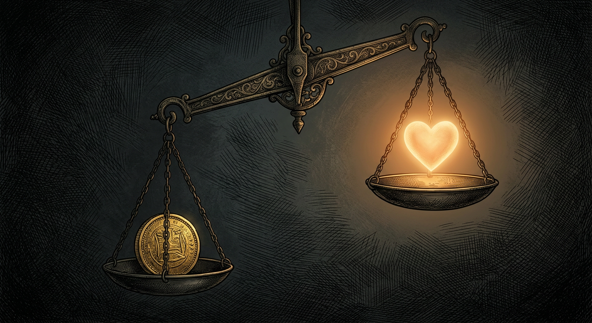

### Ключевые понятия

- **Сборка** — подбор предложения под конкретный мотив.
- **Валюта мотива** — то, что имеет ценность именно для этого человека.
- **Минимально достаточное предложение** — наименьшее, что запускает действие.
- **Запрещённое предложение** — то, что бьёт по мотиву человека.

### Содержание

Ошибка номер один: предлагать **свою** валюту. Деньги — тому, кому нужно признание; публичность — тому, кто ценит безопасность; свободу — тому, кто ищет структуру.

**Матрица сборки:**

| Ведущий мотив | Что предложить | Формулировка | Что не предлагать |
|---|---|---|---|
| **Достижение** | Измеримую цель чуть выше уровня | «Это сложнее того, что ты делал. Справишься?» | Размытую задачу, похвалу без сути |
| **Мастерство** | Обратную связь и усложнение | «Вот что получилось. Что бы ты сделал иначе?» | Лёгкую рутину, оценку без разбора |
| **Признание / статус** | Публичность, видимый ранг | «Это стоит того, чтобы об этом знали» | Тихую награду, анонимность |
| **Принадлежность** | Команду, общее дело, роль в группе | «Это нужно всем нам, и особенно тебе» | Изоляцию, работу в одиночку |
| **Справедливость** | Исправление обиды, восстановление | «Это твоя возможность вернуть своё» | Сделку с обидчиком |
| **Независимость** | Свободу способа, выбор пути | «Как сделаешь — решать тебе» | Жёсткий регламент, контроль каждого шага |
| **Безопасность** | Гарантии, предсказуемость, защиту | «Риск минимален, я просчитал» | Риск без страховки |
| **Любопытство** | Недосказанность, загадку | «Тут есть одна странность. Хочешь — посмотри?» | Готовый ответ, инструкцию |

**Принцип минимальной достаточности.** Предложение должно быть ровно настолько сильным, чтобы запустить действие, — и не сильнее. Избыточное предложение:

- стоит дороже необходимого;
- выглядит подозрительно: «за что мне так много?»;
- создаёт привычку: следующий раз потребуется уже эта, повышенная планка.

**Проверка сборки перед предложением:**

1. В какой мотив я попадаю? Какой факт это подтверждает?
2. Что будет, если я ошибусь в мотиве? Какой ущерб?
3. Это минимально достаточное предложение или я переплачиваю?
4. Есть ли в предложении что-то, бьющее по **другому** мотиву человека?
5. Как я пойму, что попал?

> **Правило Комитета:** предложение — это не «что я могу дать», а «что ему нужно». Разница в экономической цене одного и того же действия может быть двадцатикратной.

### Пример из полевой практики

Комитет два месяца пытался привлечь опытного строителя: предлагали ресурсы, оплату, защиту. Он вежливо отказывался. Диагностика показала мотив любопытства и признания мастерства. Предложение изменили: «Есть задача, которую никто не смог решить. Посмотри — интересно ли?» Он согласился в тот же день и работу сделал лучше, чем ожидали, — ресурсы не потребовались вовсе.

### Практикум

Возьмите задачу, которую нужно поручить. Соберите три варианта предложения под три разных мотива. Оцените каждый по цене и риску ошибки.

### Контрольные вопросы

1. Что такое валюта мотива?
2. Почему избыточное предложение вредно?
3. Перечислите пять пунктов проверки перед предложением.
4. Почему одно и то же действие может стоить в двадцать раз дешевле?

---

## Лекция 4.2. Усиление: автономия, мастерство, смысл, прогресс

**Цель:** собрать условия, в которых мотив растёт сам, без подталкивания.

### Ключевые понятия

- **Автономия** — возможность выбора способа.
- **Мастерство** — видимый рост умения.
- **Смысл** — связь действия с тем, что человеку важно.
- **Прогресс** — видимое приближение к цели.
- **Признание** — подтверждение ценности вклада.

### Содержание

Внутреннюю мотивацию нельзя «выдать» — можно только создать условия. Условия собираются из пяти элементов.

**Пять усилителей:**

| Усилитель | Что делает | Как выглядит на практике | Признак, что его нет |
|---|---|---|---|
| **Автономия** | Даёт выбор способа | «Сделай как считаешь нужным, важен результат» | Ждёт указаний, не предлагает своего |
| **Мастерство** | Даёт ощущение роста | Разбор ошибок, усложнение следующей задачи | Берёт только знакомое, боится оценки |
| **Смысл** | Связывает действие с ценностью | Объяснение «зачем»: что именно это изменит | «Зачем мы это делаем?» |
| **Прогресс** | Делает движение видимым | Этапы, отметки, «ты прошёл две трети» | Человек не знает, на каком он этапе |
| **Признание** | Подтверждает ценность вклада | Конкретная похвала за конкретное действие | «Мою работу всё равно не заметят» |

**Лестница видимого прогресса.** Прогресс — самый недооценённый усилитель. Работает схема:

```
ЦЕЛЬ
 │
 ├── этап 1  ──✓────  отметка: «первый шаг закрыт»
 ├── этап 2  ──✓────  отметка: «половина»
 ├── этап 3  ──✓────  отметка: «осталось чуть-чуть»
 └── этап 4  ──✓────  финал: признание результата
```

Каждая отметка возвращает мотивацию на подъёме. Без отметок работа превращается в «делаю и делаю, конца не видно».

**Правила признания:**

1. **Признание должно быть конкретным.** «Молодец» не работает; «ты нашёл то совпадение в логах, которое все пропустили» — работает.
2. **Признание за процесс, а не за личность.** «Ты справился, потому что проверил третий источник» укрепляет мастерство. «Ты гений» — нет.
3. **Признание вовремя.** Похвала через месяц не подкрепляет ничего.
4. **Признание должно быть правдой.** Ложная похвала обесценивает настоящую.

**Таблица: что убивает мотив, даже если всё остальное сделано верно**

| Действие | Что разрушает |
|---|---|
| Микроконтроль каждого шага | Автономию |
| Оценка без разбора («принято / не принято») | Мастерство |
| Отсутствие объяснения «зачем» | Смысл |
| Отсутствие обратной связи | Прогресс |
| Публичное сравнение с более успешным | Достоинство |
| Обещанное, но не выполненное | Инструментальность (см. Врума) |

> **Правило Комитета:** мотив растёт не от награды, а от того, что человек видит: его действия что-то меняют.

### Пример из полевой практики

Группа патрульных за месяц снизила число жалоб вдвое. Начальник объявил благодарность «лучшему патрульному месяца». Через две недели взаимопомощь в группе исчезла: совместная работа превратилась в соревнование за звание. Мотив признания, включённый в систему, вытеснил мотив общего дела. Позже благодарность переделали в командную — с публичным разбором конкретных действий каждого.

### Практикум

Возьмите задачу подчинённого. Опишите, как вы добавите в неё каждый из пяти усилителей — по одному конкретному действию на каждый.

### Контрольные вопросы

1. Назовите пять усилителей мотива.
2. Почему прогресс недооценивают?
3. Сформулируйте четыре правила признания.
4. Почему публичное сравнение разрушает мотив?

---

## Лекция 4.3. Удержание: привычка, насыщение, смена валюты

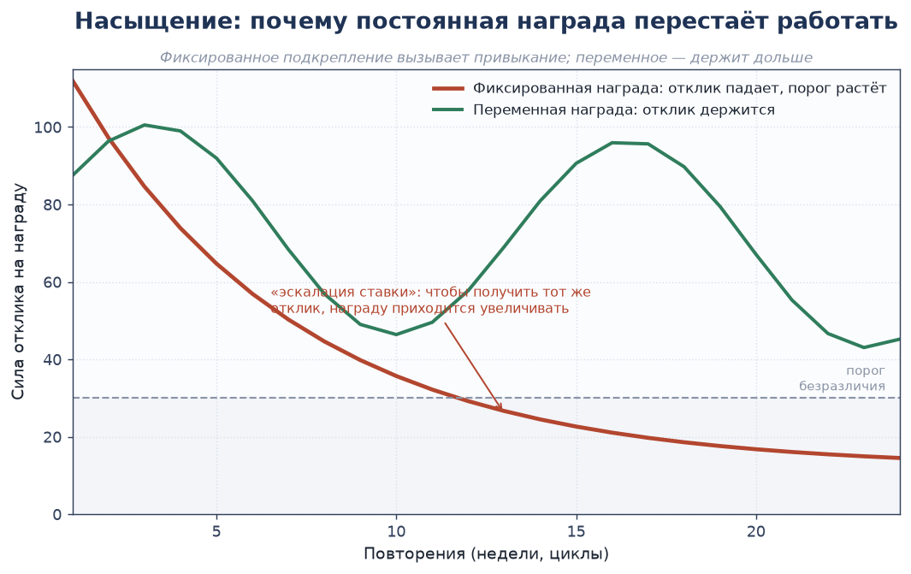

**Цель:** удерживать мотив месяцами, а не днями — и вовремя заметить, что он выдохся.

### Ключевые понятия

- **Петля привычки** — сигнал → действие → награда → закрепление.
- **Переменное подкрепление** — награда не каждый раз и не по расписанию.
- **Насыщение** — падение отклика на повторяющийся стимул.
- **Эскалация ставки** — необходимость увеличивать награду ради того же отклика.
- **Смена валюты** — перевод мотива с одной валюты на другую.

### Содержание

**Петля привычки.** Действие закрепляется, когда за ним следует награда, а перед ним — устойчивый сигнал. Четыре элемента:

| Элемент | Что делает | Пример |
|---|---|---|
| **Сигнал** | Запускает действие | Начало смены, сообщение куратора |
| **Действие** | То, что нужно закрепить | Доклад, проверка, запись в журнал |
| **Награда** | Подкрепляет | Обратная связь, признание, результат |
| **Инвестиция** | Увеличивает ценность следующего цикла | Человек видит, что его записью воспользовались |

**Переменное подкрепление держит дольше.** Награда, приходящая не каждый раз, поддерживает действие устойчивее, чем награда по расписанию: ожидание само становится частью мотива. Но есть цена — непредсказуемость утомляет, если затягивается. Правило: **переменной должна быть награда, а не признание**. Человек должен быть уверен, что его работу заметят; переменной пусть будет форма и размер поощрения.

**Насыщение неизбежно.** Повторяющийся стимул вызывает всё меньший отклик — это гедоническая адаптация. Кривая показывает: при фиксированной награде отклик падает, и чтобы вернуть прежний уровень, ставку приходится повышать. Дорога эта короткая: очень скоро награда становится либо неподъёмно дорогой, либо перестаёт работать вовсе [3](https://simplyputpsych.co.uk/psych-101-1/criticism-of-maslows-hierarchy-of-needs).

**Признаки насыщения:**

| Признак | Что означает |
|---|---|
| Человек выполняет минимум | Награда уже не мотивирует, держит только привычка |
| Растёт число «а что мне за это?» | Валютная зависимость: внутренний мотив вытеснен |
| Качество падает при том же объёме | Работает только внешний контур |
| Появляется торг до начала дела | Сформировалась привычка к плате за вход |
| Прежняя награда вызывает раздражение | Насыщение перешло в отторжение |

**Четыре приёма против насыщения:**

1. **Смена валюты.** Перевод с внешней награды на внутреннюю: признание → мастерство → смысл → автономия. Это единственный устойчивый выход.
2. **Пауза.** Прекращение стимула на время: после перерыва отклик частично восстанавливается.
3. **Новизна.** Новый элемент задачи возвращает внимание без повышения ставки.
4. **Рост сложности.** Если человека держит мастерство, повышайте сложность, а не награду.

**Таблица смены валюты:**

| Было | Стало | Как переводить |
|---|---|---|
| Деньги, ресурсы | Признание | Платить реже, но вслух отмечать конкретный вклад |
| Признание | Мастерство | Меньше похвал, больше содержательного разбора |
| Мастерство | Смысл | Показывать, что именно изменила его работа |
| Смысл | Автономия | Передавать выбор способа и право решения |

> **Правило Комитета:** если для сохранения поведения вам приходится всё время повышать награду — вы не удерживаете мотив, вы его арендуете.

### Пример из полевой практики

Источник работал за ресурсы полгода. Ставка выросла втрое, качество упало. Куратор сменил валюту: перестал платить, но начал показывать человеку, какие решения принимались на основе его сведений, и советоваться с ним как с экспертом. Два месяца — поток информации восстановился, а расход ресурсов стал нулевым. Мотив сменился с выгоды на мастерство и значимость.

### Практикум

Опишите ситуацию удержания, в которой вы повышали ставку. Найдите признаки насыщения и предложите смену валюты.

### Контрольные вопросы

1. Из четырёх элементов состоит петля привычки?
2. Что такое эскалация ставки и чем она кончается?
3. Назовите четыре приёма против насыщения.
4. Как переводить мотив с денег на признание, а с признания — на мастерство?

---

## Лекция 4.4. Гашение и выход: как перестать, не сломав человека

**Цель:** уметь завершать работу с мотивом так, чтобы не создавать врага и не оставлять выжженного поля.

### Ключевые понятия

- **Гашение** — прекращение подкрепления, ведущее к угасанию поведения.
- **Всплеск при гашении** — кратковременное усиление попыток перед прекращением.
- **Корректный выход** — завершение с сохранением достоинства.
- **Открытая дверь** — возможность вернуться без потери лица.

### Содержание

Мотив можно погасить намеренно — и это почти всегда делают неправильно.

**Как ведёт себя поведение при гашении.** Сразу после прекращения подкрепления поведение **усиливается**: человек делает больше и настойчивее, пытаясь вернуть прежний отклик. Это не рост мотива, а реакция на отмену. Тот, кто не знает этого эффекта, сдаётся именно в этот момент, принимая всплеск за преданность, и возобновляет награду — закрепляя поведение прочнее прежнего.

**Три способа прекратить работу:**

| Способ | Как выглядит | Последствия |
|---|---|---|
| **Резкий обрыв** | Прекращение без объяснения | Обида, поиск причины, месть или утечка |
| **Истощение** | Постепенное угасание без разговора | Затянутая неопределённость, потеря времени |
| **Корректный выход** | Объяснение, признание, закрытие, дверь | Сохранённые отношения и репутация |

**Протокол корректного выхода:**

1. **Сказать прямо.** Неопределённость разрушает сильнее отказа.
2. **Назвать настоящую, безопасную причину.** Без лжи и без компрометации других.
3. **Признать вклад конкретно.** Что именно сделал человек и что это дало.
4. **Объяснить правила завершения.** Что произошло с его материалами, кто дальше работает, что с его рисками.
5. **Оставить дверь.** «Если позже понадобишься — я обращусь. Если понадоблюсь я — обращайся».
6. **Проверить через неделю.** Короткая проверка стоит дешевле, чем разбор последствий.

**Чего нельзя при выходе:**

- исчезать молча;
- валить вину на человека («ты не справился»), если причина в изменении задач;
- оставлять человека с его риском (засветка, долг, обещание) — это прямая дорога к мести;
- угрожать: угроза превращает уходящего в источника угрозы для вас.

> **Правило Комитета:** человек, с которым расстались достойно, остаётся активом. Человек, которого бросили, становится проблемой — и проблемой дорогой.

### Пример из полевой практики

Работу с источником прекращали дважды разными кураторами. Первый просто перестал выходить на связь. Через месяц сведения о Комитете всплыли в чате фракции. Второй — тот же человек, другой куратор — собрал встречу: объяснил, что направление закрыто, назвал три конкретные вещи, которые источник сделал полезного, передал контакт дежурного и предупредил, что в случае вопросов тот может обратиться. Утечки не было. Разница — тридцать минут разговора.

### Практикум

Опишите завершение работы с человеком, которое вы проводили или наблюдали. Найдите, какой пункт протокола был пропущен и к чему это привело.

### Контрольные вопросы

1. Что такое всплеск при гашении и почему он опасен?
2. Назовите шесть шагов корректного выхода.
3. Почему нельзя оставлять человека с его риском?
4. Что даёт «открытая дверь»?

---

# МОДУЛЬ 5. ОШИБКИ

> *«Большинство провалов в работе с людьми — не от недостатка умения убеждать, а от ошибки в устройстве мотива. Мотив ломают там, где хотели укрепить.»*

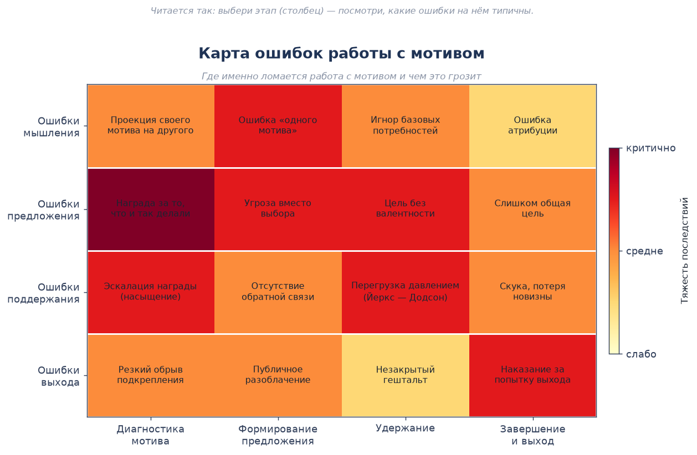

## Лекция 5.1. Ошибка переоправдания: награда, которая гасит интерес

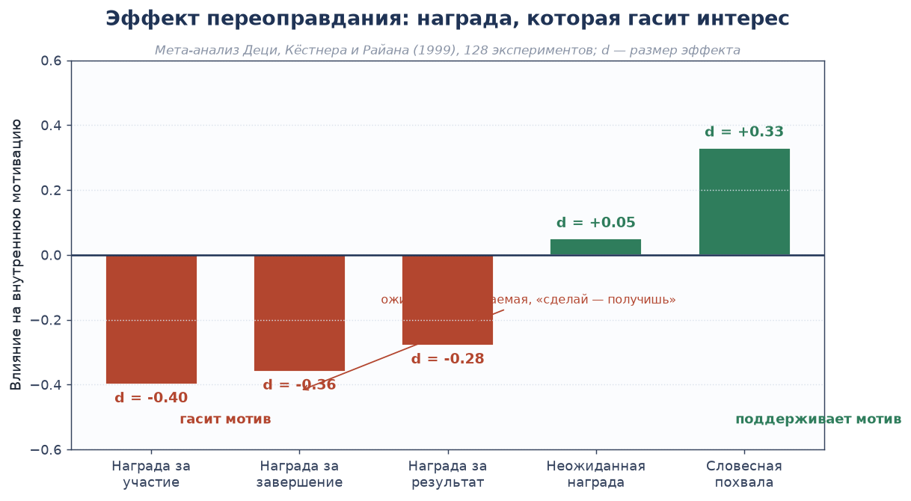

**Цель:** понять, как вознаграждение за уже желанное дело убивает желание его делать.

### Ключевые понятия

- **Переоправдание (overjustification)** — внешнее обоснование вытесняет внутреннее.
- **Вытеснение (crowding out)** — то же в формулировке экономики.
- **Контролирующая награда** — воспринимается как управление: «делай это, получишь то».
- **Информационная награда** — воспринимается как подтверждение мастерства.
- **Локус причинности** — «почему я это делаю: потому что хочу или потому что платят?»

### Содержание

Это центральная ошибка курса — и самая дорогая, потому что совершается из лучших побуждений.

**Механизм.** Человек делал что-то по внутренней причине — интересно, важно, приятно. Появилась внешняя награда. Он пересчитывает причину своего поведения: «раз мне за это платят, значит, самому мне это не так уж интересно». Локус причинности смещается внутрь→наружу. Награда убирается — поведение падает **ниже исходного уровня**, потому что внутренняя причина уже не работает [2](https://www.psychologynoteshq.com/overjustification-effect/).

**Что показал мета-анализ.** Деци, Кёстнер и Райан (1999) свели 128 экспериментов [2](https://www.psychologynoteshq.com/overjustification-effect/):

| Тип вознаграждения | Эффект на внутреннюю мотивацию (d) |
|---|---|
| Награда за участие | **−0.40** |
| Награда за завершение | **−0.36** |
| Награда за результат | **−0.28** |
| Неожиданная награда | ≈ 0 (нейтрально) |
| Словесная похвала | **+0.33** |

Разберём выводы:

- **Вредна ожидаемая, осязаемая, обусловленная награда** за то, что человек и так делал с интересом.
- **Неожиданная награда не вредит** — человек не воспринимал её как причину действия.
- **Похвала работает в плюс**, потому что она информационная: подтверждает мастерство, а не управляет.
- **Награда за результат вредит меньше**, чем за участие: она несёт информацию о качестве.

**Экономическая сторона.** Бруно Фрей оформляет то же самое как теорию вытеснения мотива: внешний стимул может вытеснить внутренний (crowding out), а может и усилить его (crowding in), если воспринимается как поддержка, а не контроль [1](https://grokipedia.com/page/Motivation_crowding_theory) [2](https://psychology.iresearchnet.com/social-psychology/social-psychology-theories/motivation-crowding-theory/). Есть и парадоксальный частный случай: **слабая награда демотивирует сильнее, чем отсутствие награды**, — она одновременно сигнализирует, что деятельность того не стоит, и не компенсирует потерю интереса.

**Правила назначения награды:**

1. **За скучное — плати.** Награда уместна там, где внутреннего интереса нет и не будет.
2. **За интересное — не плати.** Платите признанием, вниманием, содержательной обратной связью.
3. **Неожиданно лучше, чем по договору.** Не объявляйте награду заранее, если хотите сохранить интерес.
4. **Хвалите процесс, а не личность.** «Ты проверил третий источник — это и решило» вместо «ты молодец».
5. **Проверяйте до и после.** Замерьте поведение до награды; через месяц после введения сравните. Если упало — отменяйте награду, а не усиливайте человека.

**Как распознать ошибку уже совершённой:**

| Симптом | Что произошло |
|---|---|
| После введения награды качество упало | Внимание сместилось с задачи на условие |
| Человек спрашивает «а что мне будет?» перед делом, которое раньше делал сам | Локус причинности сместился |
| После отмены награды поведение ниже исходного | Классическое переоправдание |
| Работа идёт ровно до выполнения условия | Награда стала единственным мотивом |

> **Правило Комитета:** прежде чем платить, ответь на вопрос: «он это и так делает?» Если да — платить нельзя. Платить нужно признанием.

### Пример из полевой практики

Игрок полгода вёл публичный архив сделок — бесплатно, аккуратно, с удовольствием. Администрация решила «поддержать полезную инициативу» и назначила еженедельную выплату. Через полтора месяца аккуратность упала, записи стали короткими, а на третьей неделе после отмены выплат архив перестал вестись вовсе. Интерес, который держался полгода сам по себе, был вытеснен за шесть недель.

### Практикум

Найдите три случая, где вы (или ваше руководство) платили за то, что человек делал добровольно. Опишите, что изменилось после введения платы.

### Контрольные вопросы

1. Что такое локус причинности и как он смещается?
2. Какая награда вредит сильнее: за участие или за результат?
3. Почему слабая награда иногда хуже её отсутствия?
4. Сформулируйте пять правил назначения награды.

---

## Лекция 5.2. Ошибка проекции: приписывание своего мотива

**Цель:** научиться ловить себя на подмене «что нужно мне» на «что нужно ему».

### Ключевые понятия

- **Проекция** — приписывание другим своих мотивов.
- **Ошибка внешних мотивов (extrinsic incentives bias)** — другим мы приписываем корысть, себе — интерес.
- **Ложный консенсус** — переоценка того, насколько другие с нами согласны.
- **Фундаментальная ошибка атрибуции** — чужие поступки мы объясняем характером, свои — обстоятельствами.
- **Зеркальное мышление** — «я бы на его месте поступил так».

### Содержание

Это ошибка по умолчанию: мы знаем наверняка только один мотив — свой. И подставляем его вместо чужого.

**Классическая связка из четырёх искажений:**

| Искажение | Как звучит внутри | К чему ведёт |
|---|---|---|
| **Проекция** | «Конечно, он хочет того же, чего и я» | Предложение в чужой мотив не попадает |
| **Ошибка внешних мотивов** | «Ему просто нужна выгода» | Мы платим там, где человек ищет смысла |
| **Ложный консенсус** | «Все так считают» | Мы не видим несогласия, пока не станет поздно |
| **Фундаментальная ошибка атрибуции** | «Он подвёл, потому что он такой» | Мы не видим ситуации и не можем её исправить |

Список когнитивных искажений, включая ошибку внешних мотивов и ложный консенсус, подробно разобран в сводке Википедии по когнитивным искажениям [1](https://en.wikipedia.org/wiki/Cognitive_bias) [2](https://www.wikiwand.com/en/List_of_cognitive_biases).

**Пять признаков, что вы проецируете:**

1. Предложение кажется вам щедрым, а человек не реагирует.
2. Вы уверенно объясняете его поведение, не имея данных о его ситуации.
3. Вы не можете назвать ни одного факта, противоречащего вашей версии его мотива.
4. Вы ловите себя на словах «я бы на его месте…».
5. Ваше объяснение делает человека глупым, жадным или трусливым — это почти всегда ошибка атрибуции.

**Противоядия:**

| Приём | Как применять |
|---|---|
| **Альтернативная гипотеза** | Обязательно сформулируйте вторую версию мотива и ищите ей подтверждения |
| **Данные вместо догадок** | Три наблюдаемых факта на каждое утверждение о мотиве |
| **Ситуативная проверка** | Прежде чем судить характер, опишите ситуацию, в которой человек действовал |
| **Чужой взгляд** | Попросите коллегу, не погружённого в дело, описать мотив по тем же фактам |
| **Различающая ситуация** | Проверьте мотив выбором, а не разговором (см. лекцию 3.3) |

> **Правило Комитета:** если ваше объяснение чужого поведения делает человека хуже вас — почти наверняка вы ошиблись. Люди чаще поступают разумно в своей ситуации, чем глупо в вашей.

### Пример из полевой практики

Куратор, человек с сильным мотивом достижения, три месяца пытался заинтересовать источника «результатом»: показывал сводки, ставил задачи, отмечал прогресс. Отклик был нулевым. Второй куратор, глядя на те же факты, предположил мотив принадлежности: человек держался за свою фракцию и боялся стать изгоем. Работа перестроилась: вместо задач ему предложили роль защитника своих же людей. Отклик появился в первую неделю.

### Практикум

Вспомните человека, чьё поведение вы объясняли его характером. Опишите ситуацию, в которой он действовал, так, чтобы его поступок выглядел разумным. Изменилась ли оценка?

### Контрольные вопросы

1. Что такое ошибка внешних мотивов?
2. Назовите пять признаков проекции.
3. Почему объяснение через характер почти всегда ошибочно?
4. Сформулируйте четыре противоядия.

---

## Лекция 5.3. Ошибка меры: когда показатель съедает цель

**Цель:** увидеть, как измеритель превращается в цель и порождает ложь.

### Ключевые понятия

- **Подмена цели средством** — показатель становится важнее того, что он измерял.
- **Закон Гудхарта** — «когда мера становится целью, она перестаёт быть хорошей мерой».
- **Кобра-эффект** — стимул порождает прямо противоположное поведение.
- **Показатель-заменитель (суррогат)** — величина, подменяющая реальную цель.
- **Тёмная сторона амбициозных целей** — завышенная цель провоцирует обман.

### Содержание

Мера нужна, чтобы видеть результат. Но как только за меру начинают платить, поведение перестраивается **под меру**, а не под цель.

**Типовые проявления на сервере:**

| Мера | Что хотели | Что получили |
|---|---|---|
| Число раскрытых дел | Безопасность | Мелкие дела вместо важных; раздувание случаев |
| Число патрулей | Порядок | Проходка по маршруту без внимания к обстановке |
| Число протоколов | Учёт | Протоколы ради протоколов, качество падает |
| Время реагирования | Скорость | Приезд без результата, чтобы «отметиться» |
| Число донесений источника | Осведомлённость | Поток малозначимых сведений и выдумок |
| Отсутствие жалоб | Удовлетворённость | Жалобы просто перестают принимать |

**Кобра-эффект.** Название — от исторической истории: вознаграждение за сданных кобр привело к их разведению ради выплаты. Механизм тот же, что у нас: **если платить за симптом, вы получите больше симптома, а не меньше проблемы**.

**Завышенная цель провоцирует обман.** Исследования по постановке целей показывают: когда цель высока, а контроль неполон, люди достигают её способами, которые система не предусмотрела. Особенно это вероятно, если:

- цель поставлена без обсуждения;
- награда велика;
- контроль охватывает только результат, а не способ;
- среда допускает «серые» пути.

**Пять защит от ошибки меры:**

1. **Мерьте двумя показателями.** Один отвечает за объём, другой — за качество. Их взаимное противоречие удерживает систему от перекоса.
2. **Мерьте способ, а не только результат.** Проверяйте, как достигнут показатель, а не только достигнут ли.
3. **Проверяйте меру на обход.** Спросите: «как я сам обманул бы эту систему, если бы захотел?» — и закройте найденный путь.
4. **Меняйте меру.** Любая мера со временем обрастает способами обхода. Мера, живущая больше полугода, почти наверняка уже искажена.
5. **Держите настоящую цель вслух.** Регулярно возвращайте разговор к тому, зачем всё это: «жалобы упали, или просто их перестали записывать?»

> **Правило Комитета:** любая мера рано или поздно становится мишенью. Проверяйте не цифру, а то, что стоит за цифрой.

### Пример из полевой практики

Ввели отчётность «по числу проверенных сигналов». За месяц число выросло вдвое. Число жалоб не изменилось. Разбор показал: проверяли тех, кого проще проверить, — новичков и мелкие случаи; крупные дела, требующие недель, остались без внимания. Меру заменили на две: доля жалоб, закрытых в срок, и число повторных обращений по тому же вопросу. Через два месяца картина стала честной.

### Практикум

Возьмите показатель, по которому вас оценивают. Опишите три способа достичь его, не улучшая реального дела. Что нужно изменить в системе учёта?

### Контрольные вопросы

1. Сформулируйте закон Гудхарта.
2. Что такое кобра-эффект?
3. При каких условиях завышенная цель провоцирует обман?
4. Назовите пять защит от ошибки меры.

---

## Лекция 5.4. Ошибка интенсивности: «больше» не значит «лучше»

**Цель:** научиться останавливаться у оптимума — и в давлении, и в награде, и в контроле.

### Содержание

Эта ошибка следует из лекций 1.3 и 4.3, но заслуживает отдельного разбора, потому что встречается чаще всех остальных вместе взятых.

**Три кривые, у которых есть оптимум:**

| Что увеличиваем | Что происходит | Где оптимум |
|---|---|---|
| **Давление** | Результат растёт, затем человек срывается | Тем ниже, чем сложнее задача (Йеркс — Додсон) |
| **Награда** | Отклик растёт, затем насыщается и требует эскалации | Минимально достаточная |
| **Контроль** | Исполнение растёт, затем гаснет инициатива | Пока не начал убивать автономию |

**Четыре частных ошибки интенсивности:**

1. **«Нажмём сильнее».** Когда человек не делает, первая мысль — усилить давление. Но если он уже за оптимумом, давление ухудшит и результат, и отношение.
2. **«Заплатим больше».** Если причина в инструментальности или в способностях, деньги не помогут: обнулён другой множитель формулы Врума.
3. **«Проверим чаще».** Учащение контроля снижает автономию — а вместе с ней и внутреннюю мотивацию. В пределе получается исполнитель без инициативы.
4. **«Повторим объяснение».** Если человек не сделал из-за валентности (ему не надо), объяснение не поможет, сколь бы подробным ни было.

**Диагностика перед усилением.** Прежде чем что-либо увеличивать, ответьте:

| Вопрос | Если да |
|---|---|
| Это уже пробовали, и сработало слабее? | Вы за оптимумом: усиление не поможет |
| Человек понимает, что делать? | Проблема не в объяснении |
| Он верит, что справится? | Если нет — дело в обучении, а не в давлении |
| Он верит, что это заметят? | Если нет — проблема в инструментальности |
| Ему это нужно? | Если нет — проблема в валентности |

> **Правило Комитета:** прежде чем добавлять, проверь, не нужно ли убавить. Половина задач решается снятием лишнего давления, а не добавлением нового.

### Пример из полевой практики

Агент два месяца не мог получить отчёт от источника: напоминал, объяснял, ужесточал сроки. Отклик падал. Разбор показал: источник не справлялся с формой отчёта — ему было непонятно, что писать. Сроки сняли, форму сократили до трёх строк. Отчёты пошли с первой недели. Проблема была в способности, а не в мотиве, и всё давление было потрачено впустую.

### Практикум

Вспомните ситуацию, где вы усиливали воздействие. Проверьте по пяти вопросам: был ли выбран правильный множитель?

### Контрольные вопросы

1. Назовите три кривые с оптимумом.
2. Почему учащение контроля снижает инициативу?
3. В каких случаях увеличение награды бесполезно?
4. Что нужно проверить перед тем, как усиливать воздействие?

---

## Лекция 5.5. Ошибка однородности: одна карта на всех

**Цель:** увидеть предел любой классификации и научиться работать с профилем, а не с ярлыком.

### Содержание

Классификации экономят время и этим опасны: они создают иллюзию, что человек понят.

**Четыре разновидности ошибки:**

| Ошибка | Как звучит | Чем грозит |
|---|---|---|
| **Один ярлык на человека** | «Он достигатель» | Мы не видим сдвига мотива со временем |
| **Один мотив на всех** | «Всем нужно признание» | Система работает только для части людей |
| **Один мотив навсегда** | «У него всегда так было» | Мы пропускаем момент, когда мотив сменился |
| **Одна карта на задачу** | «Мы всегда работаем по Вруму» | Мы не видим того, что лежит вне модели |

**Люди меняются — и это норма.** Сдвиг мотива вызывается:

- **насыщением** (то, что радовало, перестало);
- **ростом** (освоил — стало скучно);
- **событием** (обида, потеря, успех, предательство);
- **сменой окружения** (ушли друзья, пришли новые);
- **возрастом и стажем** (то, что было важно в начале, перестаёт быть важным через год).

**Правило пересмотра:** гипотеза о мотиве пересматривается не реже раза в месяц, а после любого из пяти событий выше — немедленно.

**Работа с профилем вместо ярлыка.** В модели Райсса подчёркивается: уникальна не комбинация желаний, а их **ранжирование** у конкретного человека [3](https://news.osu.edu/new-theory-of-motivation-lists-16-basic-desires-that-guide-us/). Практический приём: оценивайте не «какой он тип», а три верхних и одну нижнюю шкалу. Нижняя важна не меньше: то, в чём у человека дефицит желания, объясняет его отказы лучше, чем верхние шкалы объясняют согласия.

**Таблица пересборки:**

| Ситуация | Что пересмотреть |
|---|---|
| Человек резко снизил активность | Ведущий мотив: насыщение или потеря инструментальности |
| Он внезапно согласился на невыгодное | Появился новый мотив, которого мы не видели |
| Он отказался от привычного | Сдвиг: прежняя валюта обесценилась |
| Он конфликтует с группой | Конфликт мотивов: личный против группового |

> **Правило Комитета:** тип человека — это его текущее состояние, а не его природа. Проверяйте состояние, а не досье.

### Пример из полевой практики

Игрок год был образцовым социализатором: сводил людей, держал чат, решал споры. Затем резко ушёл в одиночное строительство и перестал общаться. Досье говорило «социальность» — и все попытки вернуть его через компанию провалились. Пересмотр показал сдвиг: после предательства внутри группы ведущим стал мотив безопасности и контроля. Работа возобновилась, когда ему предложили одиночную задачу с гарантированной анонимностью.

### Практикум

Возьмите трёх людей с одинаковым «типом» по Бартлу. Найдите три различия в их поведении, которые тип не объясняет.

### Контрольные вопросы

1. Назовите четыре разновидности ошибки однородности.
2. Что вызывает сдвиг мотива?
3. Почему нижняя шкала профиля важна?
4. Когда гипотеза о мотиве пересматривается немедленно?

---

## Лекция 5.6. Ошибки влияния и завершения

**Цель:** увидеть, где приёмы влияния оборачиваются против того, кто их применил.

### Ключевые понятия

- **Реактантность** — сопротивление при ощущении, что выбор отнимают.
- **Сорванный покров** — обнаружение человеком самого факта воздействия.
- **Подмена мотива страхом** — замена внутреннего мотива внешним принуждением.
- **Разрыв обещания** — невыполненное условие, рушащее инструментальность.

### Содержание

**Семь принципов влияния, шесть из которых описал Чалдини в 1984 году, а седьмой — единство — добавил в 2016-м** [2](https://www.suebehaviouraldesign.com/en/blog/cialdini-principles-of-persuasion/) [4](https://cxl.com/blog/cialdinis-principles-persuasion/):

| Принцип | Механизм | Как выглядит на сервере | Ошибка применения |
|---|---|---|---|
| **Взаимность** | Обязанность вернуть услугу | Помочь до просьбы | Услуга с очевидным подвохом вызывает отторжение |
| **Обязательство и последовательность** | Малое «да» открывает путь к большему | Сначала мелкая просьба | Резкий скачок от мелкого к крупному срывает согласие |
| **Социальное доказательство** | В неопределённости смотрят на других | «Все уже сдали отчёты» | Ссылка на вымышленное большинство |
| **Авторитет** | Снижение тревоги через эксперта | Ссылка на правило, знание дела | Давление авторитетом без сути |
| **Симпатия** | Соглашаются тем, кто приятен | Общий интерес, сходство | Лесть, которую видно |
| **Дефицит** | Ценность растёт при нехватке | «Место одно, и то до вечера» | Ложный дефицит: после разоблачения теряется всё |
| **Единство** | «Мы — одни» сильнее симпатии | Общая принадлежность | Объявление «своим» того, кто им не стал |

**Три системные ошибки влияния:**

1. **Реактантность.** Когда человек замечает, что его подталкивают, он делает обратное — не из вредности, а чтобы вернуть себе выбор. Чем сильнее давление и чем яснее его источник, тем сильнее откат. Лечение: оставить видимость выбора там, где результат от выбора не зависит.
2. **Сорванный покров.** Если человек понимает, что его мотивом управляли, разрушается не только текущее согласие — разрушается доверие ко всем будущим предложениям. Восстанавливается оно годами.
3. **Подмена мотива страхом.** Принуждение работает быстрее убеждения и потому соблазнительно. Но мотив страхом:
   - требует постоянного присутствия принуждающего;
   - исчезает, как только появляется безопасная возможность;
   - порождает не лояльность, а умение скрываться;
   - заражает среду: наблюдающие тоже начинают бояться.

**Четыре правила завершения (ошибки выхода):**

| Ошибка | Последствие |
|---|---|
| Резкий обрыв без объяснения | Обида, месть, утечка |
| Оставление человека с его риском | Прямой путь к разоблачению вас |
| Невыполненное обещание | Обнуление инструментальности навсегда |
| Угроза при выходе | Уходящий становится источником угрозы |

> **Правило Комитета:** влияние, которое человек заметил, перестаёт быть влиянием и становится обидой. Работай так, чтобы твой приём не был виден.

### Пример из полевой практики

Чтобы склонить торговца к сотрудничеству, применили дефицит: сообщили, что «мест в программе защиты осталось два». Через неделю он увидел в программе шестерых. Сотрудничество прекратилось мгновенно, а рассказ о «разводе» разошёлся по торговой зоне: следующие три месяца ни один торговец не соглашался ни на что. Экономия на честности стоила квартала работы.

### Практикум

Разберите случай применения влияния, который вы наблюдали. Что именно человек заметил, и как можно было сделать то же самое незаметно?

### Контрольные вопросы

1. Что такое реактантность и как её снизить?
2. Почему сорванный покров опаснее, чем отказ?
3. Назовите четыре цены мотива страхом.
4. Каковы четыре ошибки завершения?

---

## Лекция 5.7. Сводная таблица ошибок

**Диагноз по симптому:**

| Симптом | Вероятная ошибка | Что делать |
|---|---|---|
| После введения награды качество упало | Переоправдание | Отменить награду, вернуть признание |
| Человек спрашивает «а что мне будет?» | Локус смещён наружу | Смена валюты: с платы на смысл |
| Награда перестала работать | Насыщение | Пауза, новизна, смена валюты |
| Предложение щедрое — отклика нет | Проекция | Пересборка под другой мотив |
| То же предложение работало раньше | Сдвиг мотива | Пересмотр гипотезы |
| Показатель растёт, дела не прибавилось | Ошибка меры | Второй показатель, проверка способа |
| Усилили давление — стало хуже | Ошибка интенсивности | Снять лишнее, проверить множители |
| Человек делает минимум | Вытеснение внутреннего мотива | Вернуть автономию и смысл |
| Человек ушёл и вредит | Ошибка завершения | Протокол выхода постфактум: объяснение, признание, дверь |
| Объяснение поведения «он такой» | Ошибка атрибуции | Описать ситуацию, а не характер |
| Человек делает обратное просьбе | Реактантность | Вернуть видимость выбора |
| Работает только под надзором | Мотив страхом | Стоимость надзора выше результата: менять основу мотива |

**Проверка перед любым воздействием (чек-лист из восьми пунктов):**

1. ☐ Какой мотив я считаю ведущим и какими тремя фактами это подтверждается?
2. ☐ Какая альтернативная гипотеза и проверял ли я её?
3. ☐ Работает ли человек уже сейчас без награды? (если да — не платить)
4. ☐ Не за оптимумом ли давление для этой задачи?
5. ☐ Что именно я измеряю и как эту меру обмануть?
6. ☐ Виден ли мой приём? Что будет, если человек его заметит?
7. ☐ Как я пойму, что сработало, и через какое время?
8. ☐ Что я буду делать, если станет хуже?

---

# МОДУЛЬ 6. ПРАКТИКУМ

> Двенадцать кейсов. Порядок работы: сначала сформулируйте гипотезу сами, только потом читайте разбор.

## Кейс 1. Новичок-грифер

**Обстановка.** Новичок за две недели сломал три чужие постройки. Ничего не крал: ломал, ставил таблички с бессмыслицей, убегал. На замечания отвечает грубо, но не уходит.

**Гипотеза.** Внимание. Реакция — даже отрицательная — это подтверждение существования. Гриф с нулевой выгодой почти всегда мотив принадлежности, реализованный криво.

**Разбор.** Наказание усилит поведение: оно даёт ту самую реакцию. Работает перевод мотива: дать роль, в которой внимание будет заслуженным. Назначить ответственным за уборку территории, публично поблагодарить за первую уборку. Через две недели ломка прекратилась, а через месяц он привёл двух друзей.

## Кейс 2. Молчаливый свидетель

**Обстановка.** Игрок видел кражу, всё рассказал на словах, но отказался давать письменное объяснение: «Не хочу ввязываться».

**Гипотеза.** Безопасность выше справедливости; скрытый страх мести.

**Разбор.** Уговоры и объяснение важности бесполезны: мотив не в том, чтобы помочь. Работает снижение цены участия: запись свидетелем без указания ника в материалах, формулировка «сведения получены от очевидца, личность зафиксирована отдельно». Показания получены в тот же день.

## Кейс 3. Источник, который хвастается

**Обстановка.** Источник сообщает много, охотно, красиво. Сведения всегда подтверждают то, во что Комитет уже верит, и никогда не содержат неожиданного.

**Гипотеза.** Мотив значимости; возможная работа на две стороны.

**Разбор.** Признак двойной игры — сведения всегда удобны. Проверка мечением: трём людям сообщили слегка различающиеся версии одной новости. Ушла версия, сообщённая ему. Канал подтверждён; работа с ним перестроена на каналирование: через него стали подавать то, что полезно знать противнику.

## Кейс 4. Уставший патрульный

**Обстановка.** Полтора года безупречной службы. В последний месяц: минимум инициативы, формальные отчёты, раздражение на мелочи.

**Гипотеза.** Насыщение и отсутствие роста; возможно, дефицит признания.

**Разбор.** Усиление контроля ускорит уход. Проверка показала: он не знает, зачем его отчёты, — обратной связи не было ни разу. Мера: разбор с показом, какие решения принимались по его записям (смысл и прогресс), плюс новая задача выше уровня (мастерство) и выбор способа (автономия). Через три недели инициатива вернулась.

## Кейс 5. Торговец-посредник

**Обстановка.** Успешный торговец бесплатно посредничает в чужих спорах, тратит время, иногда в убыток. Предложения о выгоде игнорирует.

**Гипотеза.** Влияние и статус арбитра, а не выгода.

**Разбор.** Сборка под статус: предложили официальную роль арбитра по торговым спорам с публичным объявлением. Согласился немедленно. Выгода не понадобилась.

## Кейс 6. Доносчик из мести

**Обстановка.** Игрок охотно сдаёт бывших соратников. Сведения детальные, но всегда направлены против одних и тех же людей.

**Гипотеза.** Месть (высокая шкала «месть» по Райссу); высокий риск искажения.

**Разбор.** Мотив понятен и использоваться может, но сведения требуют перекрёстной проверки в обязательном порядке: заинтересованность максимальна. Категория достоверности снижается на шаг. Решение по его данным принимать только при подтверждении из независимого источника.

## Кейс 7. Лидер, держащийся на одном

**Обстановка.** Фракция сильная, но все решения принимает один человек. Заместитель формальный.

**Гипотеза.** Для работы с фракцией это означает: канал один, уязвимость — потеря лидера.

**Разбор.** Прямое воздействие на лидера дорого и ненадёжно. Работает усиление второго лица: признание, задачи, видимость роли. Через два месяца канал стал дублированным, а зависимость фракции от одного человека — ниже.

## Кейс 8. Строитель-одиночка

**Обстановка.** Опытный строитель отказывается от всех предложений: ресурсов, оплаты, защиты.

**Гипотеза.** Любопытство и мастерство; платные валюты для него не работают.

**Разбор.** Сборка под любопытство: «есть задача, которую никто не решил». Согласился в тот же день. Вывод: валюта мотива иногда не стоит ничего в материальном смысле.

## Кейс 9. Провокатор

**Обстановка.** Игрок регулярно подстрекает других к нарушениям, но сам почти не нарушает.

**Гипотеза.** Влияние без риска; мотив — статус кукловода.

**Разбор.** Прямое воздействие на него бесполезно: он ничего не нарушил. Работает воздействие на среду: лишить аудитории. Когда его реплики перестали подхватывать, активность сошла на нет за две недели. Вывод: иногда правильный объект — не человек, а его аудитория.

## Кейс 10. Человек, который не уходит

**Обстановка.** Работа с источником завершена, но он продолжает присылать сведения и обижается на молчание.

**Гипотеза.** Мотив принадлежности; работа воспринималась как отношения, а не как сделка.

**Разбор.** Молчание — худший из вариантов. Протокол: объяснение, конкретное признание вклада, передача контакта дежурного, открытая дверь. Через месяц он сам вышел на связь по другому поводу и оказался полезен снова.

## Кейс 11. Свой среди чужих

**Обстановка.** Сотрудник полтора года ведёт одну фракцию. За год по ней не было ни одного отрицательного сообщения, хотя независимые данные о нарушениях есть.

**Гипотеза.** Сращивание: не коррупция, а потеря дистанции.

**Разбор.** Наказание не исправит того, что сделано без умысла. Мера системная — ротация: ограничение срока работы на одном участке. Плюс ревизия: перекрёстная проверка его материалов другим сотрудником.

## Кейс 12. Команда, где появилось соревнование

**Обстановка.** Группа работала сообща, результаты росли. После введения звания «лучший месяца» взаимопомощь исчезла, качество выросло у двух человек и упало у остальных.

**Гипотеза.** Признание как мотив включён в систему и вытеснил мотив общего дела.

**Разбор.** Мера работала, но разрушила среду. Пересборка: командное признание плюс публичный разбор действий каждого. Соревнование убрали. Взаимопомощь вернулась за месяц; общий результат стал выше, чем в пик соревнования.

---

# МОДУЛЬ 7. ИНСТРУМЕНТЫ

## 7.1. Бланк: разбор мотива за десять минут

```
1. НАБЛЮДЕНИЕ
   Что человек делает бесплатно: .........................
   На что тратит время: ..................................
   Что защищает: .........................................
   От чего отказывается: .................................

2. ГИПОТЕЗА
   Ведущий мотив: ........................................
   Сдерживающий: .........................................
   Альтернативная гипотеза: ...............................

3. ПРОВЕРКА ПО ВРУМУ
   E (верит, что справится):      0 ─ 1 ─ 2 ─ 3
   I (верит, что заметят):        0 ─ 1 ─ 2 ─ 3
   V (это ему нужно):             0 ─ 1 ─ 2 ─ 3
   Обнулённый множитель: .................................

4. СБОРКА
   Что предложить: .......................................
   Что НЕ предлагать: ....................................
   Минимально достаточное: ................................

5. КОНТРОЛЬ
   Как пойму, что попал: .................................
   Через сколько проверю: ................................
   Что буду делать, если станет хуже: .....................
```

## 7.2. Формулы и соотношения курса

| Формула | Что означает | Главный вывод |
|---|---|---|
| **M = E × I × V** | Мотивация как произведение ожидания, инструментальности и валентности | Один ноль обнуляет всё; чинить надо обнулённый множитель |
| **B = M · A · P** | Поведение = мотивация × способность × сигнал | Дешевле снизить трение, чем поднять мотив |
| **Усилие ∝ ценность × вероятность** | Оценка перед действием | Невидимая награда не мотивирует |
| **Отклик ∝ новизна × (1 − насыщение)** | Награда теряет силу при повторении | Переменное подкрепление и новизна |
| **Результат = f(возбуждение)** — перевёрнутая U | Оптимум давления зависит от сложности | Сложную работу нельзя делать под давлением |
| **Удовлетворение ≠ отсутствие неудовлетворения** | Две независимые шкалы Герцберга | Убрать плохое ≠ создать мотив |
| **Внутренний мотив → награда → падение ниже исходного** | Переоправдание | За интересное не платят |
| **Стоимость принуждения растёт, согласие падает** | Цена мотива страхом | Принуждение требует присутствия принуждающего |

## 7.3. Шпаргалка: что делать и чего не делать

| Делать | Не делать |
|---|---|
| Сначала мотив, потом предложение | Предлагать свою валюту |
| Платить за скучное | Платить за то, что человек и так любит |
| Хвалить процесс конкретно | Хвалить личность абстрактно |
| Давать выбор способа | Контролировать каждый шаг |
| Показывать, что изменила работа | Требовать отчёты без обратной связи |
| Проверять альтернативную гипотезу | Влюбляться в первую версию |
| Мерять двумя показателями | Мерять одним |
| Снимать лишнее давление | Добавлять давление при отказе |
| Завершать по протоколу | Исчезать молча |
| Обновлять карточку мотива раз в месяц | Считать тип человека его природой |

## 7.4. Где смотреть иллюстрации курса

| Файл | Что на нём |
|---|---|
| `img/motiv_cover.png` | Обложка курса |
| `img/motiv_sdt_continuum.png` | Континуум мотивации по Деци и Райану |
| `img/motiv_needs.png` | Пирамида потребностей и её критика |
| `img/motiv_yerkes_dodson.png` | Закон Йеркса — Додсона для простой и сложной задачи |
| `img/motiv_crowding_out.png` | Размеры эффекта переоправдания по мета-анализу 1999 года |
| `img/motiv_vroom.png` | Формула Врума на пяти сценариях |
| `img/motiv_bartle.png` | Таксономия Бартла с привязкой к модели Йи |
| `img/motiv_fogg.png` | Модель Фогга и линия действия |
| `img/motiv_herzberg.png` | Две шкалы Герцберга |
| `img/motiv_saturation.png` | Кривая насыщения: фиксированная и переменная награда |
| `img/motiv_errors_map.png` | Карта ошибок по этапам работы с мотивом |
| `img/motiv_scales.png` | Внешнее и внутреннее: весы |
| `img/motiv_cage.png` | Золотая клетка переоправдания |
| `img/motiv_compass.png` | Компас мотивов |

---

# ИТОГОВАЯ АТТЕСТАЦИЯ

## Часть 1. Теория (билет, 30 минут)

1. Цепочка мотивации: от потребности до обратной связи. Чем мотив отличается от стимула?
2. Континуум самодетерминации: шесть уровней, три базовые потребности.
3. Закон Йеркса — Додсона и практика дозирования давления.
4. Маслоу: что подтвердилось, что нет. Чем ERG отличается от пирамиды?
5. Герцберг: почему удовлетворение и неудовлетворение — разные шкалы.
6. Макклелланд: три потребности, распознавание и сборка предложения.
7. Райсс: почему важен профиль, а не список желаний.
8. Формула Врума: три множителя и три разных ремонта.
9. Локк, Адамс, Фогг: цель, справедливость, снижение трения.
10. Бартл и Йи: четыре типа, три измерения, сдвиг типа.
11. Порядок применения пяти карт мотивов.
12. Диагностика наблюдением: шесть признаков.
13. Разговор: шкала готовности и вопрос «почему не два?».
14. Проверка гипотезы мотива: различающая ситуация.
15. Переоправдание: механизм, размеры эффекта, правила награды.
16. Ошибка меры: закон Гудхарта, кобра-эффект, пять защит.
17. Ошибка интенсивности: четыре частные ошибки.
18. Ошибки влияния: реактантность, сорванный покров, цена страха.

## Часть 2. Практическое задание (60 минут)

Выдаётся описание игрока: деятельность, круг общения, недавние события, реакция на похвалу, три отказа за последний месяц. Требуется:

1. Составить карточку мотива (раздел 3.4).
2. Сформулировать основную и альтернативную гипотезу.
3. Придумать различающую ситуацию для проверки.
4. Собрать три варианта предложения под три разных мотива; выбрать минимально достаточный.
5. Оценить по Вруму: какой множитель ближе всего к нулю.
6. Назвать две ошибки, наиболее вероятные в этой работе, и меры против них.

## Часть 3. Защита разбора

Слушатель защищает разбор реального случая из своей практики. Вопросы экзаменатора:

- Какие три факта подтверждают вашу гипотезу мотива?
- Какая альтернативная гипотеза и вы её проверяли?
- Что произойдёт, если вы ошиблись? Какова цена ошибки?
- Как вы поймёте, что попали, и через какое время?
- Что вы сделаете, если станет хуже?

## Критерии

| Оценка | Требования |
|---|---|
| **Отлично** | Гипотеза подтверждена фактами; есть альтернатива; предложение минимально достаточно; названы риски переоправдания и ошибки меры |
| **Хорошо** | Гипотеза обоснована; альтернатива названа, но не проверена; предложение избыточно |
| **Удовлетворительно** | Мотив описан общо; предложение построено на своей валюте; риски не названы |
| **Неуд.** | Мотив выдан за факт без проверки; предложение бьёт по мотиву; не названа ни одна ошибка |

**Автоматическая неудовлетворительная оценка**, если слушатель:

- предлагает заплатить за то, что человек делает добровольно;
- строит воздействие на страхе без оценки его цены;
- не может назвать ни одной альтернативной гипотезы;
- путает потребность, мотив, стимул и цель.

---

# ИСТОЧНИКИ

**Теория самодетерминации и внутренняя мотивация**

- Обзор теории и трёх базовых потребностей [1](https://www.verywellmind.com/what-is-self-determination-theory-2795387)
- Теория самодетерминации: устройство, мини-теории, мотивационное интервьюирование [2](https://en.wikipedia.org/wiki/Self-determination_theory)
- APA: четверть века исследований SDT, практические применения [3](https://www.apa.org/research-practice/conduct-research/self-determination-theory)

**Переоправдание и вытеснение мотива**

- Механизм, мета-анализ Деци, Кёстнера и Райана (1999), условия вреда [2](https://www.psychologynoteshq.com/overjustification-effect/)
- Первоисточник мета-анализа с размерами эффектов по типам наград [5](https://depts.washington.edu/techdocs/papers/deciExtrinsicRewardsAndIntrinsicMotivation99.pdf)
- Теория вытеснения мотива: crowding out и crowding in [1](https://grokipedia.com/page/Motivation_crowding_theory) [2](https://psychology.iresearchnet.com/social-psychology/social-psychology-theories/motivation-crowding-theory/)

**Содержательные теории**

- Герцберг, Макклелланд и их применение [1](https://www.ijesh.com/j/article/download/211/219/418)
- Две шкалы Герцберга: гигиена против мотиваторов [3](https://www.earlyyears.tv/herzbergs-two-factor-theory/)
- Потребностные теории: двухфакторная модель и приобретённые потребности [5](https://ecampusontario.pressbooks.pub/communicationpsychology/chapter/4-2-need-based-theories-of-motivation/)
- Критика пирамиды Маслоу: очерёдность не подтверждается [1](https://www.simplypsychology.org/maslow.html) [3](https://simplyputpsych.co.uk/psych-101-1/criticism-of-maslows-hierarchy-of-needs)
- Райсс: 16 базовых желаний и индивидуальный профиль [3](https://news.osu.edu/new-theory-of-motivation-lists-16-basic-desires-that-guide-us/) [1](https://reference.jrank.org/psychology/Intrinsic_Motivation_and_the_1.html)

**Процессуальные теории**

- Формула Врума и диагностика по трём множителям [1](https://pubadmin.institute/administrative-theory/victor-vrooms-expectancy-theory-work-motivation) [2](https://yukaichou.com/behavioral-analysis/expectancy-theory-vroom-motivation-formula/)
- Модель Фогга B = MAP [3](https://www.behaviormodel.org/) [2](https://www.thebehavioralscientist.com/articles/fogg-behavior-model)

**Закон Йеркса — Додсона**

- Происхождение, форма кривой, зависимость от сложности задачи [1](https://grokipedia.com/page/Yerkes%E2%80%93Dodson_law) [5](https://www.albert.io/blog/arousal-theory-of-motivation-ap-psychology-review/)

**Игровые мотивы**

- Таксономия Бартла: четыре типа, оси, конфликты между типами [2](https://gdad.wiki/wiki/game-design/player-psychology/bartle-taxonomy)
- Бартл против модели Йи: сворачивание четырёх типов в три измерения [5](https://yukaichou.com/entrepreneurship/bartles-player-types-octalysis-core-drives/)

**Когнитивные искажения и влияние**

- Сводка когнитивных искажений, включая ошибку внешних мотивов, ложный консенсус, фундаментальную ошибку атрибуции [1](https://en.wikipedia.org/wiki/Cognitive_bias) [2](https://www.wikiwand.com/en/List_of_cognitive_biases)
- Семь принципов влияния Чалдини [2](https://www.suebehaviouraldesign.com/en/blog/cialdini-principles-of-persuasion/) [4](https://cxl.com/blog/cialdinis-principles-persuasion/)

---

> **Завершение курса.** Курс считается пройденным при наличии зачёта по семи модулям и положительной итоговой аттестации. Слушатель допускается к самостоятельной диагностике мотивов и к сборке предложений; работа, связанная с удержанием и завершением, требует согласования с куратором.

> *«Мотив найти легче, чем кажется, — люди показывают его постоянно. Трудно другое: не принять за чужой мотив свой.»*
