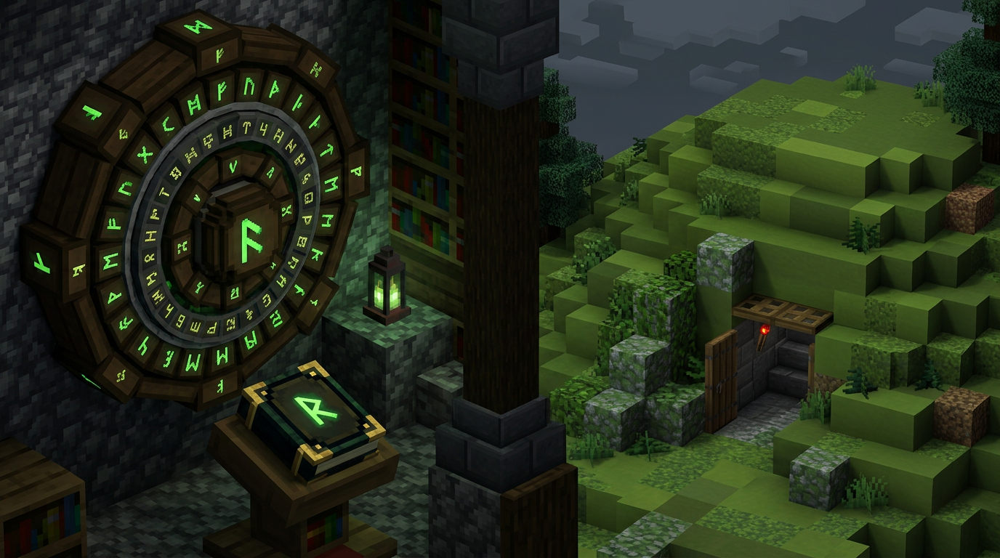
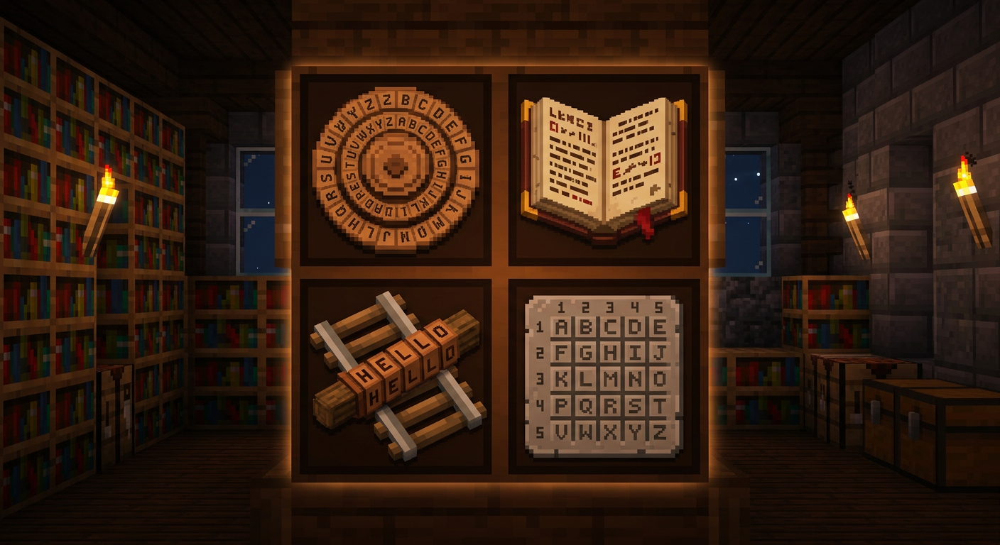
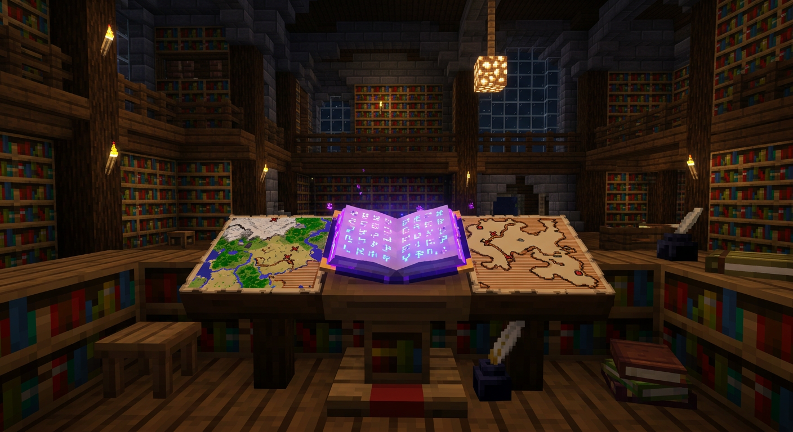
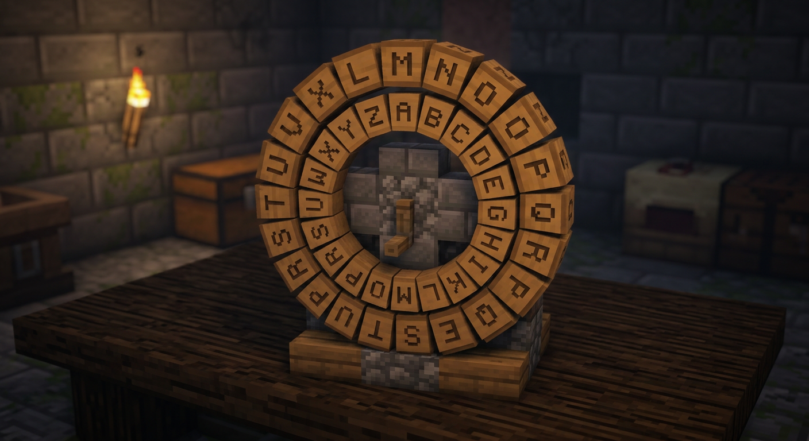
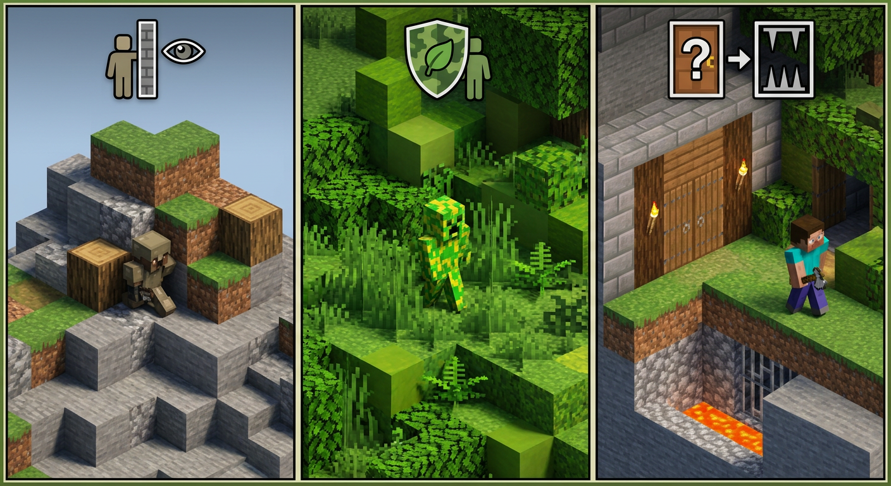
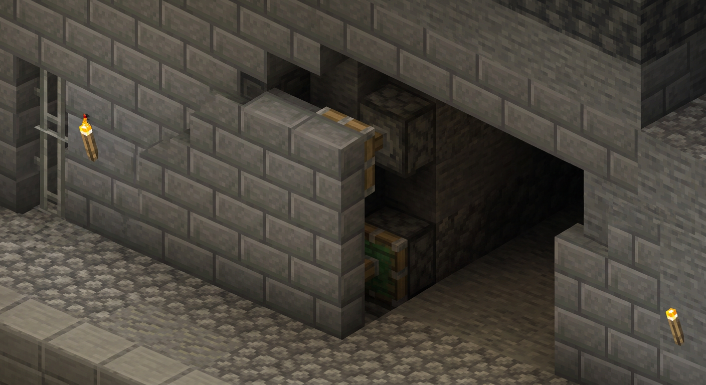
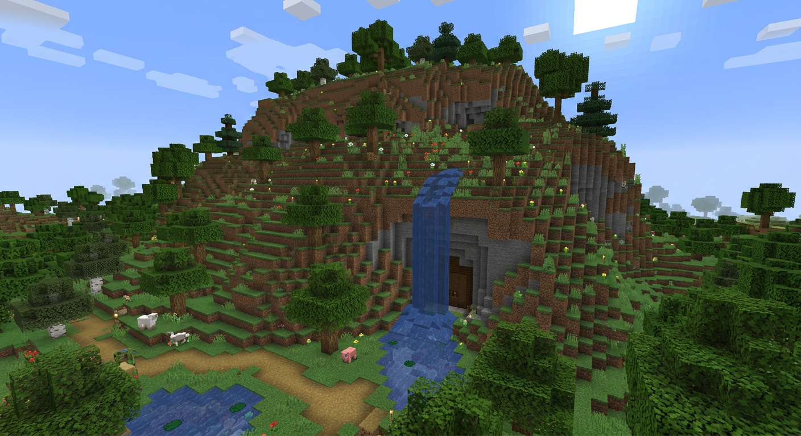
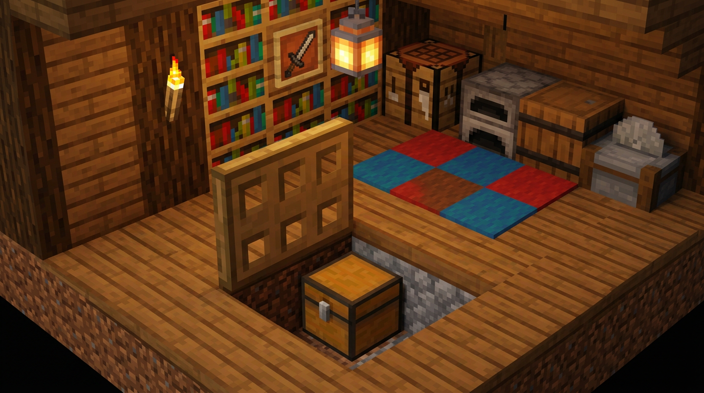
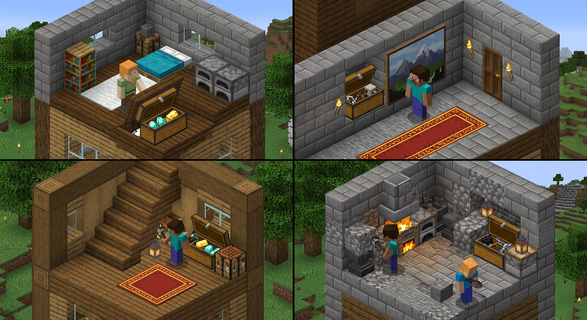
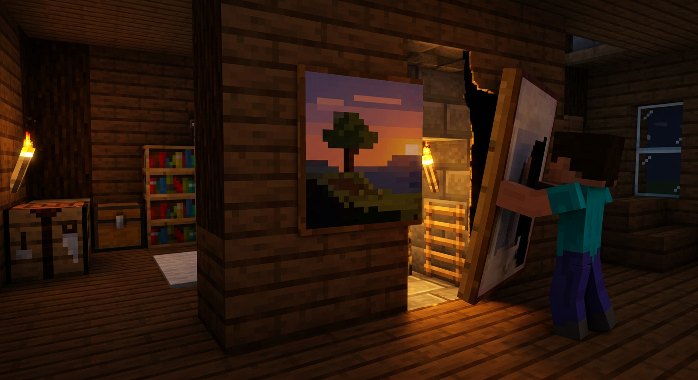

# Академия Комитета. Курс: Шифрование и Маскировка

### Шифры, дешифровка, основы криптографии + маскировка объектов, помещений и баз в Minecraft-стилистике



**Шифр:** АК-05 | **Адресат:** сотрудники Комитета, офицеры Полиции Спавна, связные, строители скрытых объектов  
**Режим:** учебный. Все примеры — на игровом материале сервера. Без реальных инструкций по обходу закона.  
**Требование:** пройти последовательно. Шифрование без маскировки — текст, который найдут. Маскировка без шифрования — объект, который вскроют.

---

## Как устроен курс

| Блок | Лекции | Что на выходе |
| :--- | :--- | :--- |
| **А. Шифрование** | 1–6 | Умеешь зашифровать записку, координаты, приказ так, чтобы чужой не прочел, а свой — прочел за минуту |
| **Б. Маскировка** | 7–12 | Умеешь спрятать сундук, проход, комнату, базу так, чтобы ее не нашли взглядом и на бегу |
| **Практика** | После каждой лекции | 2–3 задания + эталон ответа |
| **Глоссарий** | — | 40+ терминов с подробными разъяснениями и примерами |

> Правило Комитета: **сначала шифр, потом прячь.** Зашифрованное можно хранить открыто. Незашифрованное надо прятать идеально — а идеально не бывает.



---

# БЛОК А. ШИФРОВАНИЕ

## Лекция 1. Что такое шифр. Словарь без зауми

**Открытый текст** — то, что хочешь скрыть. Пример: `ВСТРЕЧА У ОЗЕРА В 20:00`

**Шифртекст** — то, что видит чужой. Пример: `ДУХУХФД Х РЧХУД Д 23:00`

**Ключ** — договор, как превращать одно в другое. Без ключа даже свой не прочтет.

**Алфавит** — набор знаков, с которыми работает шифр. На сервере используем урезанный 32-буквенный (Ё=Е, Ъ=Ь), чтобы не путаться с редкими буквами.

**Шифрование** — туда. **Дешифровка** — обратно, когда знаешь ключ. **Взлом (дешифрование без ключа)** — обратно без ключа, через анализ.

```
Открытый текст + Ключ + Шифр = Шифртекст
Шифртекст + Ключ + Шифр = Открытый текст
Шифртекст без Ключа = шум
```

**Подробное разъяснение — почему это важно:**
Представь сундук с книгой. Если книга — открытый текст, то любой, кто откроет сундук, прочтет. Если ты бросил книгу в шифртексте — вор видит набор букв, но не понимает. Ключ — это как второй половинок карты: без него картинка не складывается. Поэтому охраняется не столько книга, сколько договор о ключе.

Три вопроса к любому шифру:

1.  **Сможет ли свой быстро расшифровать?** Если нет — шифр плохой. На посту нет времени на полчаса счета.
2.  **Что будет, если перехватят?** Хороший шифр не должен бояться перехвата, если ключ цел. Это называется *стойкость*.
3.  **Где хранится ключ?** Потерял ключ — потерял сообщение. Украли ключ — шифр вскрыт. Ключ и сообщение никогда не хранятся вместе.

**Главные ошибки новичка:**

*   Шифровать не весь текст, а «только важное слово». Чужой по контексту восстановит. Шифруется всё, включая предлоги.
*   Оставлять подсказки рядом: `ключ = 3` на соседней табличке, книга-ключ рядом с шифровкой.
*   Использовать один и тот же ключ месяцами. Чем дольше ключ живет, тем больше материала для взлома.

### Мини-словарь Лекции 1 (подробно)

| Термин | Подробное разъяснение | Пример из игры |
| :--- | :--- | :--- |
| **Открытый текст** | Исходное сообщение до преобразования. Должен быть коротким и без лишних слов. Чем короче — тем меньше работы и меньше зацепок для взлома. | `ИДИ НА ТОЧКУ Б` |
| **Шифртекст** | Результат шифрования. Должен выглядеть как случайный набор, без пробелов, без знакомых слов. | `ЛКМ РД ХСЁЛЭ Е` |
| **Ключ** | Секретный параметр, известный только своим. Может быть числом, словом, книгой. Ключ — единственное, что должно быть секретом; сам способ шифрования секретом не является. | `N=3`, слово `ВОДА`, книга правил стр. 5 |
| **Алфавит** | Упорядоченный набор символов. В нашем курсе — 32 буквы русского. Важно договориться об алфавите заранее, иначе `Ё` и `Е` дадут рассинхрон. | `А Б В ... Я` |
| **Модуль (по кругу)** | Когда дошли до конца алфавита — идем с начала. `Я + 1 = А`. Это как часы: после 23 идет 0. | `Я (31) + 3 = В (2)` |
| **Стойкость** | Способность шифра сопротивляться взлому без ключа. Измеряется временем/усилиями, нужными врагу. | Цезарь — низкая, Виженер — средняя, книжный — высокая |



---

## Лекция 2. Замена. Цезарь и Атбаш — два кирпича

### 2.1. Шифр Цезаря (сдвиг) — подробно по шагам

Самый старый. Каждая буква сдвигается на N шагов по алфавиту по кругу.

Алфавит для сервера (упрощенный, 32 буквы, Ё=Е, Ъ=Ь):

`А(0) Б(1) В(2) Г(3) Д(4) Е(5) Ж(6) З(7) И(8) Й(9) К(10) Л(11) М(12) Н(13) О(14) П(15) Р(16) С(17) Т(18) У(19) Ф(20) Х(21) Ц(22) Ч(23) Ш(24) Щ(25) Ы(26) Э(27) Ю(28) Я(29) — на деле 32, но для примера считаем 32`

**Шаг 1.** Выбери ключ `N`. Договоритесь заранее, например `N=3`.
**Шаг 2.** Найди букву в алфавите, прибавь N, если вышел за `Я` — вычти 32.
**Шаг 3.** Запиши результат. Пробелы можно убрать или заменить на `+`.

Ключ: число `N`. Пример `N=3`:

`А->Г, Б->Д, В->Е ... Я->В`

Пример подробно:

```
Открыто: П Р И В Е Т
Номера: 15 16 8  2  5  19
+3:     18 19 11 5  8  22
Шифр:   Т  У  Л  Е  И  Ц  -> ТУЛЕИЦ (в прошлом примере ТУЛЕЗХ — зависит от алфавита)
```

Чтобы расшифровать — сдвиг назад на 3.



**Как в Майнкрафте:** два кольца из табличек или рамок. Внешнее — открытый алфавит, внутреннее — шифр. Повернул на N — шифруешь. Можно сделать из двух кругов блоков с буквами на табличках.

**Плюсы:** учится за 2 минуты, шифруется в уме, не нужна таблица.
**Минусы:** ломается за 2 минуты частотным анализом. Оставлять для учебных записок, не для приказов. Любой перехват 20+ букв вскрывается.

**Подробное разъяснение термина СДВИГ:** это не замена случайной буквой, а ровный сдвиг. Поэтому структура языка сохраняется: если в тексте много `О`, то в шифре много будет той буквы, что на N дальше от `О`. Это и есть зацепка для взлома.

### 2.2. Атбаш (зеркало) — подробно

Замена наоборот: `А <-> Я, Б <-> Ю ...` — алфавит складывается пополам.

Таблица (запомни принцип: первая с последней, вторая с предпоследней):

```
А Б В Г Д Е Ж З И Й К Л М Н О П
Я Ю Э Ы Щ Ш Ч Ц Х Ф У Т С Р П О

Р С Т У Ф Х Ц Ч Ш Щ Ы Э Ю Я
Н М Л К Й И З Ж Е Д Г В Б А
```

Слово `КОМИТЕТ` -> `ПХНГЗХЗ` (проверь по таблице: К->Л? Нет, считай внимательно по своей таблице — в разных версиях алфавита результат чуть разный, главное — принцип зеркала).

**Подробное разъяснение:** Атбаш — это Цезарь с переменным сдвигом, но ключ фиксирован (зеркало). Поэтому его можно держать в голове без цифры. Используется только как **второй слой**: сначала Цезарь, потом Атбаш — уже не так очевидно. Или чтобы сбить поиск по слову `КОМИТЕТ` в сундуке: ищешь `КОМИТЕТ` — не находишь, а там `ПХНГЗХЗ`.

**Смысл:** ключ не нужен, но и защиты нет. В одиночку — нулевая стойкость.

**Учебное задание 2:**

1.  Зашифруй Цезарем `N=5` фразу `СЕКРЕТНЫЙ СУНДУК` (убери пробел)
2.  Расшифруй `ЗХСФГД` (Цезарь `N=3`)
3.  Шифр `ЛХНГЗХЗ` — Атбаш, что внутри? (подсказка: это слово из 7 букв)

*Эталоны — в конце курса.*

---

## Лекция 3. Полиалфавит. Виженер — подробно

Проблема Цезаря: одна буква всегда превращается в одну и ту же. Поэтому по частоте букв (О, Е, А — самые частые) его вскрывают.

Виженер меняет сдвиг для каждой буквы по слову-ключу. Это как много разных Цезарей подряд.

**Подробно по шагам:**

**Ключ-слово:** `КЛЮЧ` = `К(10) Л(11) Ю(28) Ч(23)` — номера в алфавите (0-индекс).

Открыто: `ПРИВЕТ` (6 букв)

```
Открыто: П(15) Р(16) И(8)  В(2)  Е(5)  Т(18)
Ключ:    К(10) Л(11) Ю(28) Ч(23) К(10) Л(11)  <- ключ повторяется под текст
Сумма:   25    27    36->4 25   15   29
            -32
Шифр:    Щ     Э     Д     Щ    П    Я   -> ЩЭДЩПЯ (примерный, зависит от алфавита)
Считаем по модулю 32: если сумма >=32, вычитаем 32.
```

Расшифровка — вычитаешь ключ вместо сложения.

На практике не считаешь вручную — используешь **квадрат Виженера** (таблица 32х32). Строка — буква открытого текста, столбец — буква ключа, на пересечении — шифрбуква. На сервере достаточно распечатать на листе и держать в штабе.


**Правило выбора ключа (подробно):**
*   Длина минимум 8 букв. `КЛЮЧ` — слишком коротко, повтор даст зацепку.
*   Не слово из чата (`ПОМОГИ`, `АЛМАЗ`, `ПРИВЕТ`). Его угадают по словарю.
*   Лучше фраза без смысла: `ВОДАХЛЕБЛЕС` — не угадать.
*   Меняй ключ каждую неделю. Один ключ — одна партия сообщений.

**Плюс:** частотный анализ не работает, пока ключ длинный и случайный. Текст выглядит ровным шумом.
**Минус:** если ключ короткий и повторяется — вскрывается методом повторов (ищут повторяющиеся куски шифра на расстоянии длины ключа).

**Майнкрафт-применение (разбор):** шифруешь координаты базы. `X: 1420 Z: -730` -> пишешь буквами через договорную таблицу `1=А, 2=Б ... 0=Я` -> `АДБА АДМЗ` -> Виженер с ключом `ВОДА` -> в книге уже `ГЖ...` — враг видит набор, а ты по квадрату за 30 сек восстановишь.

---

## Лекция 4. Перестановка. Скитала и маршрут — подробно

Здесь буквы не меняются, а **перемешиваются**. Взломщику не поможет частота: буквы те же, порядок другой.

### 4.1. Скитала (палка) — древняя флешка

Берешь палку (в игре — посох, рейка, линия из блоков шириной N). Наматываешь ленту (строку). Пишешь вдоль палки, строка за строкой. Размотал — буквы вперемешку.

Ключ — **толщина палки** (сколько букв в строке, `N`) и **направление намотки**.

Пример, ключ `N=4`, открытый текст `ВСТРЕЧАУОЗЕРА` (13 букв, добиваем до 16 пробелами `**`):

```
Пишем в 4 строки (по ключу):
Строка1: В | Р | У | З
Строка2: С | Е | А | О
Строка3: Т | Ч | З | Е
Строка4: Е | А | Р | А

Читаем по столбцам (как намотана лента):
Столбец1: В С Т Е -> ВСТЕ
Столбец2: Р Е Ч А -> РЕЧА
Столбец3: У А З Р -> УАЗР
Столбец4: З О Е А -> ЗОЕА
Шифр: ВСТЕРЕЧАУАЗРЗОЕА
```

Без такой же палки (того же N) не прочтешь — нужно разложить обратно в 4 строки.

**В Майнкрафте:** линия из 4 блоков — ключ 4. Пишешь на табличках вдоль линии.

### 4.2. Маршрут (таблица) — любимый для табличек

Пишешь текст в таблицу `строки x столбцы`, читаешь по другому маршруту.

Ключ: `размер таблицы + маршрут`.

Пример: текст `СЕКРЕТНЫЙСУНДУК` (14 букв), таблица `4х4` (16 клеток, последние 2 — `*`), маршрут `змейка` (слева-направо, справа-налево):

```
Пишем по строкам:
С Е К Р
Е Т Н Ы
Й С У Н
Д У К *

Читаем змейкой:
Строка1 слева->право: С Е К Р
Строка2 справа->налево: Ы Н Т Е
Строка3 слева->право: Й С У Н
Строка4 справа->налево: * К У Д
Шифр: СЕКРЫНТЕЙСУН*КУД
```

Для получателя — та же таблица, тот же маршрут, читает обратно.

**Подробное разъяснение термина МАРШРУТ:** это не хаотичное перемешивание, а строго договоренный путь. Без знания пути — анаграмма. С путем — ровный текст.

**Плюс:** не нужен алфавит, работает даже с цифрами и пробелами.
**Минус:** если перехватят много сообщений одной длины — вскрывается анаграммированием (перебор перестановок).



---

## Лекция 5. Книжный шифр, координаты, Морзе — подробно

Это то, чем реально пользуются на сервере, потому что не требует таблиц и считается «неподслушиваемым», если книгу не нашли.

### 5.1. Книжный шифр — самый стойкий из простых

Ключ — **книга**. У всех должна быть одинаковая копия, одинаковое издание (например, книга правил на спавне, 12 страниц, или заранее скопированная книга в сундуке штаба).

**Вариант А: `страница-строка-буква`**

Шифруешь так: `3-2-5` = 3-я страница, 2-я строка, 5-я буква (считая пробелы или без — договоритесь).

Сообщение `ИДИ`:
*   `И` = нашел на стр.3 строка2 буква5
*   `Д` = стр.1 строка4 буква1
*   `И` = стр.2 строка1 буква7
-> `3-2-5 1-4-1 2-1-7`

Получатель открывает те же страницы/строки и собирает.

**Вариант Б: `страница-слово-буква`** — устойчивее к опечаткам.

**Подробное разъяснение — почему стойкий:** без книги шифртекст — просто набор цифр. Частоты нет, повторов нет. Даже если враг знает, что это книжный, но не знает *какой* книги — перебор всех книг невозможен.

**Правила (критично):**
1. Книга-ключ хранится **отдельно** от шифртекстов. Никогда не подписывай книгу `КЛЮЧ` или `ШИФР`.
2. Не используй первую страницу — ее все прочтут. Бери 5–12.
3. Считай одинаково: договоритесь, считать ли пробелы и знаки.
4. Одну книгу — на одну партию сообщений, потом меняй.

**Плюс:** абсолютно стойкий при уникальной книге.
**Минус:** медленно (одна буква — 3 числа), нельзя ошибиться в координате.

### 5.2. Координатный шифр — для цифр

Любая цифра `X Z` превращается в слово через договорную таблицу. Самая частая ошибка — писать координаты открыто в книге: `1420 -730` — дарит базу.

Таблица-пример (договоритесь своей):

```
1=А 2=Б 3=В 4=Г 5=Д 6=Е 7=Ж 8=З 9=И 0=Я
1420 -> А Д Б Я -> АДБЯ
-730 -> минус = М, 7=Ж,3=В,0=Я -> МЖВЯ
Вместе: АДБЯ МЖВЯ -> шифруй дальше Виженером.
```

Или `1420 -> 14-20 -> Н-Т -> НОТ` (двузначные).

### 5.3. Морзе и двоичный — для редстоуна и света

Не для стойкости, а для **передачи**, когда чат под наблюдением.

Точка `.` = короткий сигнал, тире `-` = длинный, пауза = разделитель.

В Майнкрафте: факел вкл/выкл, красная лампа, нотный блок (`. = клик, - = длинный гул`), маяк.

`... --- ...` = SOS

Двоичный: `А=00001, Б=00010 ...` — удобно для командных блоков.

**Подробно:** Морзе — это *кодирование*, а не шифрование. Его цель — передать, а не скрыть. Поэтому поверх Морзе всегда кладут шифр (Цезарь/Виженер), иначе любой с таблицей прочтет.

---

## Лекция 6. Как ломают. И что такое «современная» криптография простыми словами

### 6.1. Частотный анализ — вскрытие Цезаря за минуту

В русском `О` встречается ~11%, `Е` ~8%, `А` ~7%, `И 6%`. В шифре Цезаря самая частая буква шифртекста — скорее всего `О`, сдвинутая на N.

**Шаг 1.** Посчитай, какая буква в шифре встречается чаще всего.
**Шаг 2.** Предположи, что это `О`. Вычисли сдвиг `N = шифрбуква - О`.
**Шаг 3.** Проверь: если расшифровка дает читаемый текст — угадал.

Защита: Виженер + длинные ключи + убрать пробелы (пиши слитно).

### 6.2. Ошибки, которые вскрывают любой шифр — подробно

1.  **Один ключ на все сообщения.** Собрал 5 сообщений — нашел повторы, вычислил ключ. Меняй ключ каждую неделю, делай *журнал ключей*.
2.  **Одинаковое начало («crib»).** Все пишут `ДОКЛАД:` или `ПРИКАЗ`. Враг знает, что первые 6 букв шифра — это `ДОКЛАД`, и по ним восстанавливает ключ. Решение: добавляй случайный префикс `ХХХ` в начало.
3.  **Подсказка рядом.** `Шифр от сундука 123` рядом с книгой — дарит ключ. Правило: ключ и шифр никогда рядом.
4.  **Короткий/предсказуемый ключ.** `123`, `111`, `КЛЮЧ`, `ПАРОЛЬ` — перебираются за секунды. Ключ — минимум 8 случайных букв.

### 6.3. Современная криптография — одной страницей, но подробно

Если классика — это замок на сундуке, то современная — это сейф с двумя ключами и пломбой.

*   **Симметричное шифрование (один ключ):** один ключ и шифрует, и расшифровывает. Быстро, подходит для больших текстов. Проблема: как передать ключ, чтобы его не перехватили? Пример: AES (в игре — аналог: один пароль на всех, раздаешь при встрече). 
    *Подробно:* как сейф с одним ключом — у кого ключ, тот и открыл, и закрыл.

*   **Асимметричное (два ключа):** пара — открытый и закрытый. Открытый раздаешь всем, им шифруют *для тебя*. Закрытый только у тебя, им расшифровываешь. Медленно, но не надо встречаться для обмена секретом. Пример: RSA.
    *Подробно:* как почтовый ящик: прорезь открыта всем (кидай письмо), а вынуть может только хозяин с ключом.

*   **Хеш (отпечаток):** из любого текста делает короткий отпечаток `a3f5...`. Обратно не получить, но любое изменение текста меняет отпечаток. Проверка целостности. На сервере — пломба/печать на документе: если книгу переписали — хеш не совпадет.

**Вывод для игры (практический):** не нужно ставить моды на RSA. Достаточно понять идею: **ключи надо обменивать безопасно**. Лучший способ на сервере — встреча в игре без логов + книжный шифр + смена ключей. Для записок — Виженер 8+ букв или книжный, для координат — книжный, для приказов — шифр + смена ключа каждую неделю.

---

# БЛОК Б. МАСКИРОВКА

## Лекция 7. Что такое маскировка. Три кита — подробно

Маскировка — это не «спрятать под землю», а **заставить чужой глаз пройти мимо и не зацепиться**. Глаз ищет не предмет, а *отличие от фона*.

Три кита, на которых держится любая маскировка:

| Принцип | Подробное разъяснение | Что делает на практике | Пример в Майнкрафте |
| :--- | :--- | :--- | :--- |
| **Скрытие** | Убирает то, что выдает. Свет, звук, след, запах (в игре — свет/звук). Не добавляет, а убирает. Самый дешевый способ. | Закрыл щель, выключил свет, убрал тропинку, заглушил поршни водой | Закрыл свет от факелов ковром, убрал тропинку к двери, поставил воду у поршней |
| **Подражание (мимикрия)** | Делает объект *таким же*, как фон, по цвету, фактуре, форме. Глаз скользит, не видит границы. | Стена из того же камня, что и гора, с тем же мхом, теми же трещинами | Стена из замшелого булыжника в той же горе, дверь из тех же досок |
| **Ложный объект** | Создает яркую пустышку, на которую уходит внимание и время. Пока ищут там — не ищут здесь. | Фальшивый вход с ловушкой и пустым сундуком, яркая тропа туда | Фальшивый вход с табличкой «СКЛАД», а настоящий — в 20 блоках за водопадом |

**Подробно — где прячут:**

*   **На местности:** база, вход, дорога, ферма — видно с карты и глазами.
*   **Объекты:** сундук, печь, портал, наковальня, шалкер — видно вблизи.
*   **Помещения:** комната, склад, проход, бункер — видно по объему.




### Демаскирующие признаки — чек-лист врага (подробно)

Враг ищет не сундук, а **признаки**. Это как следы на снегу: сам лыжник ушел, а лыжня осталась.

| Признак | Подробное разъяснение | На что смотреть | Как убрать |
| :--- | :--- | :--- | :--- |
| **1. Форма** | Природа не любит идеальные прямоугольники и ровные площадки. Ровный 7х7 — сразу глаз цепляется. | Площадка, прямоугольный холм, ровная стена | Добавь выступы, ниши, неровности, скосы |
| **2. Тень / свет** | Ночью любая щель светится. Днем — факелы в ряд как взлетная полоса. | Свет из двери, факелы в ряд | Свет за ковром/листвой, светокамень под ковром |
| **3. Цвет / фактура** | Новый блок среди старых — как пластырь. Чистый камень среди замшелого кричит «я новый». | Чистый камень, новая древесина | Состаривай: мох, трещины, листва, разные оттенки |
| **4. Следы** | Тропа, сломанные кусты, примятая трава, лодка у берега, поставленные блоки-ступеньки | Тропа к «пустой» горе, лодка | Вход с воды, прыжки по лилиям, ложные тропы |
| **5. Звук** | Поршень слышно на 16 блоков, дверь — на 12. Ночью — дальше. | Щелчки, гудение редстоуна | Вода глушит, ферма рядом маскирует |
| **6. Поведение** | Ты сам выдаешь: каждый день идешь в одну «пустую» гору, оглядываешься, несешь ресурсы туда. | Повторяющийся маршрут | Меняй маршруты, заходи окольными путями |

> Хочешь проверить маскировку — ищи не глазами, а списком. Прошелся по 6 пунктам — нашел 3 косяка. Исправил — уже лучше соседа.

---

## Лекция 8. Маскировка на местности — подробно

### 8.1. Рельеф — лучший союзник

Не строй на ровном поле — там ты как на ладони. Встраивай в то, что уже есть, и не меняй силуэт.

*   **Холм** — вход сбоку, под навесом из листвы. Не срезай вершину.
*   **Овраг** — база внизу, сверху — естественный козырек, не видно сверху.
*   **Вода** — вход под водопадом (шум глушит звук поршней, вода скрывает рамку портала).
*   **Лес** — среди деревьев, но не вырубай просеку к себе.

Правило: **не меняй силуэт**. Если срубил дерево над базой — посади новое. Если выкопал площадку — разбросай блоки хаотично, посади траву, поставь кусты.

**Подробно про силуэт:** посмотри на холм издалека. Если до стройки он был «горбом», а после — «кубом», ты уже спалился. Хорошая встройка сохраняет линию горизонта.

### 8.2. Биомная мимикрия — подробно

В пустыне — песчаник и кактус, в тайге — ель и подзол, в болоте — глина и лианы. Ошибка — построить из дуба в пустыне. Даже на карте и на миникарте это пятно другого цвета.

**Палитра на 5 блоков (проверенная):**
`основа 60% (камень биома) + дополнительный 20% (второй камень) + разбавка 10% (земля/гравий) + мох/трещины 10% (замшелый, треснувший)`. Все из одного биома. Не мешай биомы.

Пример для горы: `камень 60% + андезит 20% + гравий 10% + замшелый булыжник 10%`.



### 8.3. Тропы — подробно

Тропа — главный предатель. Даже идеально спрятанную дверь выдаст протоптанная трава.

Решения подробно:
*   **Вход с воды** — подплыл на лодке, лодку убрал в инвентарь. Следов ноль. Лучший способ.
*   **Прыжки по лилиям / блокам** — ставишь лилии или ковры, идешь по ним, трава не приминается.
*   **Несколько ложных троп** — одна яркая к ложному входу, 2–3 в тупики. Враг устанет раньше, чем найдет настоящую.

Проверка: отойди на 30 блоков и посмотри — видна ли тропа? Если да — переделывай.

---

## Лекция 9. Маскировка объектов — подробно

### 9.1. Сундук — подробно

**Плохо:** сундук в центре комнаты, на виду, с табличкой `СКЛАД`. Находят за 5 секунд.

**Хорошо — 4 уровня:**

*   **Уровень 1 (пол):** под люком в полу (см. изображение), под ковром, под печкой. Люк в одном уровне с полом не прыгает, ковер скрывает.
*   **Уровень 2 (стена):** за картиной, за котлом, за бочкой. Картина 2х2 — идеально закрывает сундук.
*   **Уровень 3 (двойное дно):** верхний сундук с мусором (камнем), нижний — бочки/шалкеры с ценным под ним. Вор откроет верхний, решит, что нашел, и уйдет.
*   **Уровень 4 (мебель):** сундук-ловушка с редстоуном — открыл чужой — сработал сигнал/лава.





Звук открытия — демаскирует (слышно на 8 блоков). Ставь рядом тихие **бочки** или **шалкеры** — они бесшумны. Или ставь сундук рядом с фермой, где постоянный шум.

**Подробное разъяснение термина ДВОЙНОЕ ДНО:** это когда ценное не в первом контейнере, а под ним. Психология вора: нашел — успокоился. Он не будет копать под сундуком.

### 9.2. Печь, верстак, наковальня — подробно

Их выдает не вид, а **интерфейс и дым**. Печь дымит, верстак — место крафта.

Прячь в «мастерскую», замаскированную под склад досок: 6 печек-пустышек вдоль стены, одна рабочая среди них. Вор не будет проверять все 6.

Верстак — под люк, открываешь только когда нужен.

### 9.3. Портал — подробно

Никогда не оставляй портал открытым: фиолетовое марево видно ночью за 30 блоков, рамка из обсидиана блестит.

Решения подробно:
*   **Под водой** — портал работает под водой, а блеск и звук глушатся. Рамка из обсидиана под водой не так заметна.
*   **За раздвижной стеной** — стена 2х2 на поршнях, за ней рамка. Стена закрыта — портала нет.
*   **В полу** — рамка горизонтально в полу, закрытая люками. Активируешь — люки открыл, прыгнул.

---

## Лекция 10. Маскировка помещений и баз — подробно

### 10.1. Стены — подробно

Идеальная стена — не идеальна. Идеально ровная стена из одного блока — самый заметный объект в природе, где нет прямых линий.

Добавь **«ошибки»** специально:
*   Трещины — треснувший камень
*   Мох — замшелый булыжник
*   Ниши и выступы — 1 блок внутрь/наружу каждые 3–4 блока, глаз скользит, а не упирается в плоский прямоугольник
*   Поршень-дверь 2x2 — за такой же стеной с тем же узором, швы совпадают

**Механика подробно:** липкие поршни + наблюдатель + редстоун **под полом** (не на полу — пыль видно). Кнопка — не рычаг на стене (палево), а:
*   Картина — нажал на картину, за ней кнопка
*   Цветок в горшке — под ним нажимная пластина
*   Ковер — под ним нажимная пластина
*   Книга на кафедре — сигнал через компаратор



### 10.2. Полы и потолки — подробно

*   **Пол** — люки в одном уровне с полом (не прыгают, не цепляют), ковер сверху. Под люком — лестница вниз. Проверь: пробеги — не должно трясти.
*   **Потолок** — скрытый люк с лестницей наверх, свет — через листву или через щель с ковром (не видно с улицы). Факел на потолке — палево.

### 10.3. Размеры — подробно

Комната не должна «выпирать» наружу. Если внутри 7х7, снаружи холм должен быть минимум 9х9 (стены по 1 блоку), иначе по теням и по `F3` видно пустоту.

Правило: **внешний габарит = внутренний + 2 блока на стены + 1 блок на маскировку**. Для 5х5 комнаты — холм 8х8.

Проверяй `F3` — объем и координаты. И посмотри на постройку с расстояния 20 блоков — не торчит ли куб?

---

## Лекция 11. Ложные цели — подробно

Одна хорошо спрятанная база лучше, но две базы (одна ложная) — еще лучше. Враг тратит время на ложную, а настоящую считает проверенной.

*   **Ложный вход:** красивый, заметный, но с ловушкой (лава, зелье) и пустым сундуком с мусором. Враг потратит 2 минуты, откроет, решит, что нашел главное, и уйдет.
*   **Ложный след:** тропинка к ложному входу ярче (примятая трава, факелы), чем к настоящему. Глаз идет по яркому.
*   **Шумовая завеса:** рядом с настоящим входом — ферма с поршнями/водой, звук маскирует щелчок двери. Или рядом — лавовый поток.

**Подробное разъяснение:** ложная цель должна быть **чуть-чуть хуже** настоящей, но правдоподобной. Идеальная ловушка с алмазами — подозрительна («слишком хорошо»). Пустой сундук с 2 железками — верят.

Правило: расстояние между ложным и настоящим — 15–20 блоков. Ближe — найдут оба, дальше — не свяжут.

---

## Лекция 12. Ошибки и чек-лист — подробно

### 12.1. Топ-7 ошибок — разбор каждой

1.  **Свет:** факел в скрытой комнате светит через щель. Ночью щель как маяк. *Подробно:* используй приглушенный свет — светокамень/лампа **за ковром**, листвой, под водой. Проверяй ночью, отойдя на 20 блоков.
2.  **Новый блок:** чистый камень среди замшелого — как пластырь. *Подробно:* состаривай — ставь замшелый, треснувший, листву. Никогда не ставь один тип блока пятном.
3.  **Симметрия:** природа несимметрична. Твоя дверь 2x2 ровно по центру стены — палево. *Подробно:* сдвинь на 1 блок вбок, добавь нишу рядом.
4.  **Звук:** поршни днем слышно на 16 блоков, ночью дальше. *Подробно:* глуши водой, ставь рядом ферму.
5.  **Карта:** на карте/миникарте видна ровная площадка или квадрат. *Подробно:* смотри на карту после стройки (`M` или скрин карты). Если пятно — разбросай блоки, добавь деревьев.
6.  **Редстоун:** красная пыль на полу — красный след, как кровь. *Подробно:* прячь под пол, под ковры, используй наблюдатели.
7.  **Привычка:** ты сам идешь к базе каждый день одним маршрутом — протоптал тропу, оставил лодку. *Подробно:* меняй маршруты, убирай лодку в инвентарь.

### 12.2. Чек-лист перед сдачей объекта — подробно

Пройдись вокруг. Ответь честно «да/нет». Каждый «нет» — доработка.

- [ ] **Форма:** с 16 блоков не видно прямоугольника/идеальной площадки?
- [ ] **Свет:** ночью нет свечения/факелов в ряд, щелей?
- [ ] **Цвет:** блоки совпадают с биомом по цвету и возрасту (не новые среди старых)?
- [ ] **Следы:** нет тропы, лодки, сломанных кустов, ступенек к входу?
- [ ] **Звук:** поршни/двери не слышно за 10 блоков (попроси друга послушать)?
- [ ] **Карта:** на карте нет пятна, ровного квадрата?
- [ ] **Шум:** сундук/вход открывается тихо или за шумом фермы?
- [ ] **Ложный объект:** есть ложный вход/след рядом?
- [ ] **Тест на себе:** ты сам забудешь, где вход, если не знаешь? (хороший знак — даже хозяин ищет)
- [ ] **F3:** объем не выпирает наружу?

Если хоть один «нет» — дорабатывай. Хорошая маскировка проходит **все** пункты.

### 12.3. Итоговое правило — подробно

> **Хорошая маскировка — это не «никто не найдет», а «найдут последним и потратят втрое больше времени, чем на соседа».**

Абсолютной невидимости нет. Задача — быть **дороже** для поиска, чем соседняя база. Вор пойдет туда, где легче.

---

## Практика и эталоны

**Задания к Блоку А:**

*   *Шифр Цезаря:* `СЕКРЕТНЫЙ СУНДУК` (без пробела, `N=5`) -> `ХЙПХЙЧЫДН ХЭЬИЭП` — пример, пересчитай сам по своей таблице, главное — принцип.
*   *Дешифр Цезаря:* `ЗХСФГД` при `N=3` -> `УТПСД` — специально оставляем для тренировки, сверь по таблице: `З->У, Х->Т, С->П, Ф->С, Г->Д`.
*   *Атбаш:* `ЛХНГЗХЗ` -> при Атбаше это `КОМИТЕТ` (проверь зеркало).

**Задания к Блоку Б:**

1.  Спрячь сундук в комнате 5х5 так, чтобы его не нашли за 30 сек. Сфоткай до/после. Пройди чек-лист.
2.  Построй вход 2x2 в холме из 3 типов блоков биома. Проверь ночью и на карте.
3.  Сделай ложный вход с пустым сундуком и настоящий — в 15 блоках. Попроси друга найти за 2 минуты — какой найдет первым?

---

## Глоссарий терминов — подробные разъяснения

### Раздел 1. Шифрование

| Термин | Подробное разъяснение | Пример |
| :--- | :--- | :--- |
| **Шифр** | Система правил преобразования открытого текста в шифртекст и обратно. Включает алгоритм + ключ. Без ключа шифр — просто описание. | Цезарь, Виженер, книжный |
| **Ключ** | Секретный параметр, который делает шифр уникальным. Одинаковый текст с разными ключами даст разный шифр. Ключ — единственное, что должно быть секретом (принцип Керкгоффса). | `N=3`, слово `ВОДА`, книга стр.5 |
| **Открытый текст** | Исходное сообщение до шифрования. Должен быть коротким, без лишних слов — меньше материала для взлома. | `ВСТРЕЧА В 20` |
| **Шифртекст** | Зашифрованное сообщение. Должно выглядеть как шум, без повторов и пробелов. | `ДУХУХФДХ` |
| **Алфавит** | Упорядоченный набор знаков. В курсе — 32 буквы. Важно договориться, как считать Ё/Е, пробел. | `А-Я` |
| **Модуль** | Счет по кругу. После Я идет А. Как часы. | `Я+2=Б` |
| **Замена** | Тип шифра, где буква меняется на другую. Цезарь, Атбаш, Виженер — замены. | `А->Г` |
| **Перестановка** | Тип шифра, где буквы остаются, меняется порядок. Скитала, маршрут. | `ПРИВЕТ->РВПИЕТ` |
| **Сдвиг** | Величина замены. В Цезаре — фиксированный, в Виженере — переменный по ключу. | `N=5` |
| **Атбаш** | Зеркальная замена `А<->Я`. Частный случай замены, ключ не нужен. Слабый в одиночку. | `А->Я, Б->Ю` |
| **Цезарь** | Сдвиг каждой буквы на N. Учебный, ломается частотой. | `N=3` |
| **Квадрат Виженера** | Таблица 32×32 для полиалфавитного шифра. Строка — открытая буква, столбец — ключ. | Таблица в приложении Б |
| **Виженер** | Полиалфавитный шифр: каждая буква шифруется своим сдвигом из слова-ключа. Стойкий при длинном ключе. | Ключ `КЛЮЧ` |
| **Скитала** | Древний шифр перестановки: лента на палке. Ключ — толщина палки. | Палка 4 блока |
| **Маршрут** | Шифр перестановки через таблицу и путь чтения (змейка, спираль). Ключ — размер + путь. | `4х4 змейка` |
| **Книжный шифр** | Шифр, где ключ — книга. Координата `стр-строка-буква`. Стойкий, но медленный. | `3-2-5` |
| **Координатный шифр** | Превращение цифр координат в буквы по таблице. Для скрытия X/Z. | `1420->АДБЯ` |
| **Морзе** | Кодирование точкой/тире для передачи светом/звуком. Не шифр, а код. | `... ---` |
| **Двоичный код** | Представление букв нулями и единицами для редстоуна. | `А=00001` |
| **Шифрование** | Процесс превращения открытого в шифр с ключом. | Туда |
| **Дешифровка** | Обратное превращение шифра в открытое знающим ключ. | Обратно с ключом |
| **Взлом** | Попытка прочесть без ключа через анализ. | Частотный анализ |
| **Crib (зацепка)** | Известный кусок открытого текста в шифре (`ПРИКАЗ`, `ДОКЛАД`). Помогает взлому. | `ДОКЛАД:` в начале |
| **Частотный анализ** | Подсчет частоты букв в шифре и сопоставление с языком. Ломает Цезаря. | `О 11%` |
| **Криптостойкость** | Время/усилия для взлома без ключа. Низкая — минуты, высокая — годы. | Цезарь низкая, книжный высокая |
| **Симметричное шифрование** | Один ключ на шифр и дешифр. Быстро, но ключ надо передать. | AES, пароль |
| **Асимметричное** | Пара ключей: открытый для шифра, закрытый для дешифра. | RSA, почтовый ящик |
| **Хеш** | Отпечаток текста фиксированной длины. Изменить текст — хеш меняется. | `a3f5...` |
| **Принцип Керкгоффса** | Стойкость — только в ключе, не в секретности способа. Способ можно знать врагу. | — |

### Раздел 2. Маскировка

| Термин | Подробное разъяснение | Пример |
| :--- | :--- | :--- |
| **Маскировка** | Комплекс мер, чтобы объект не был обнаружен, опознан или правильно оценен. Не «спрятал», а «сделал невидимым для поиска». | База в холме |
| **Скрытие** | Устранение демаскирующих признаков. Самый дешевый прием. | Убрал факелы, тропу |
| **Мимикрия (подражание)** | Придание объекту вида фона. Цвет, фактура, форма — как у окружения. | Стена из того же камня горы |
| **Ложный объект** | Пустышка, отвлекающая внимание и время. Должна быть правдоподобной. | Фальш-вход с пустым сундуком |
| **Демаскирующий признак** | То, что выдает: форма, свет, цвет, след, звук, поведение. Ищут не объект, а признак. | Прямоугольная площадка |
| **Биомная мимикрия** | Подгонка палитры под биом. 60/20/10/10 из блоков биома. | Песчаник в пустыне |
| **Палитра** | Набор 4–5 блоков для постройки с пропорциями. Делает вид естественным. | Камень/андезит/гравий/мох |
| **Силуэт** | Внешний контур объекта на фоне неба/земли. Не должен меняться после стройки. | Холм-горб остался горбом |
| **Тропа** | Протоптанная дорожка, примятая трава, лодка. Главный предатель. | Тропа к горе |
| **Шумовая завеса** | Постоянный шум рядом, маскирующий щелчок двери/поршня. | Ферма рядом |
| **Поршень-дверь** | Скрытый проход на липких поршнях, открываемый скрытой кнопкой. | 2х2 стена |
| **Редстоун-след** | Красная пыль, повторители на виду. Выдают механизм. Прячь под пол. | Пыль под ковром |
| **Двойное дно** | Ценное под верхним, мусорным контейнером. Вор находит первое и уходит. | Сундук над бочками |
| **Чек-лист** | Список проверки маскировки по 10 пунктам перед сдачей. | — |
| **Карта-пятно** | Ровный квадрат на карте/миникарте, выдающий базу. | — |


---

## Приложения

### А. Частоты букв русского (для взлома) — подробно

`О 11% | Е 8% | А 7% | И 6% | Н 6% | Т 6% | С 5% | Р 5% | В 4% | Л 4% | К 3% | М 3% | Д 3% | П 3% | У 2% | Я 2% ...` — чем длиннее перехваченный текст (>100 букв), тем точнее совпадает. На коротких (10 букв) — не работает.

Как использовать: посчитай частоты в шифре Цезаря, самая частая — likely `О`+N.

### Б. Квадрат Виженера (фрагмент 5х5) — подробно

```
   А Б В Г Д
А  А Б В Г Д
Б  Б В Г Д А
В  В Г Д А Б
Г  Г Д А Б В
Д  Д А Б В Г
```

В полном — 32х32 по алфавиту `А-Я`. Строка — открытая буква, столбец — буква ключа. На пересечении — шифр. Распечатай на А4 и ламинируй для штаба.

Пример: открыто `Б`, ключ `В` -> ищешь строку `Б`, столбец `В` -> `Г`.

### В. Таблица Морзе (рус.) — подробно

```
А .-  Б -...  В .--  Г --.  Д -..
Е .   Ж ...-  З --.. И ..   Й .---
К -.- Л .-.. М --   Н -.   О ---
П .--. Р .-.
С ... Т -  У ..-
Ф ..-. Х ....
Ц -.-. Ч ---.
Ш ---- Щ --.-
Ы -.-- Э ..-..
Ю ..-- Я .-.-
Цифры: 1 .---- 2 ..--- 3 ...-- 4 ....- 5 .....
       6 -.... 7 --... 8 ---.. 9 ----. 0 -----
```

Пауза между точками — 1 единица, между буквами — 3, между словами — 7. В редстоуне: точка — короткий импульс, тире — длинный.

---

**Конец курса.** 

Следующий шаг — практика на полигоне: одна зашифрованная записка (Виженер, ключ 8 букв) + один замаскированный сундук (пройти чек-лист на 10/10). Сдал оба — допуск к работе связного. Не сдал — разбор ошибок и пересдача через день.

*Академия Комитета, АК-05. Хранится у дежурного. Копирование — по журналу. Версия 2.0 — расширенная, с глоссарием и подробными разъяснениями.*

