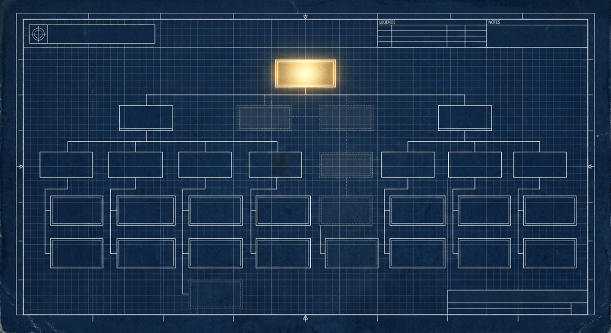
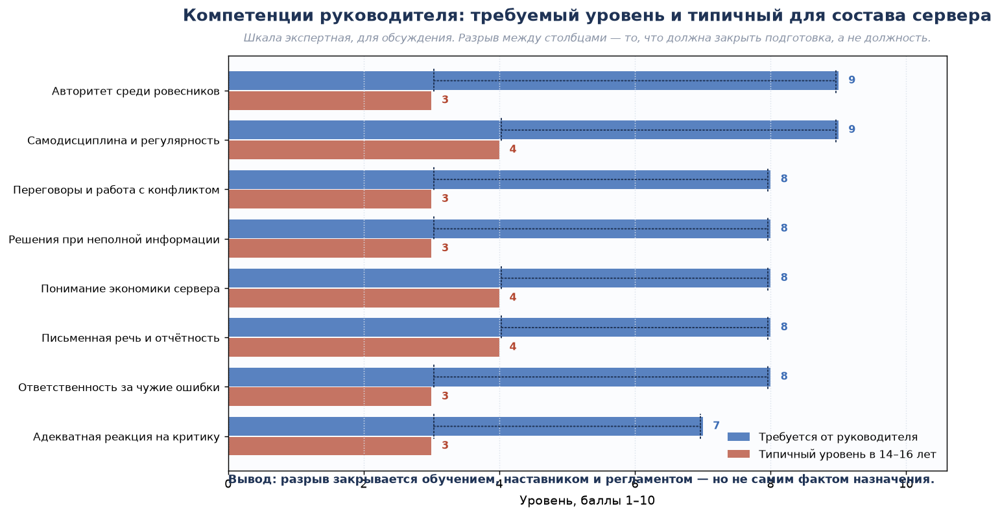
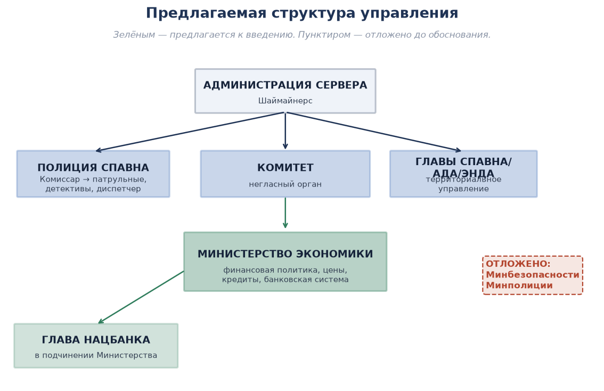
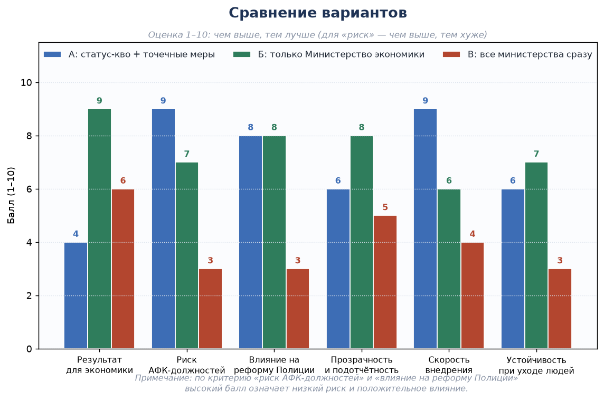
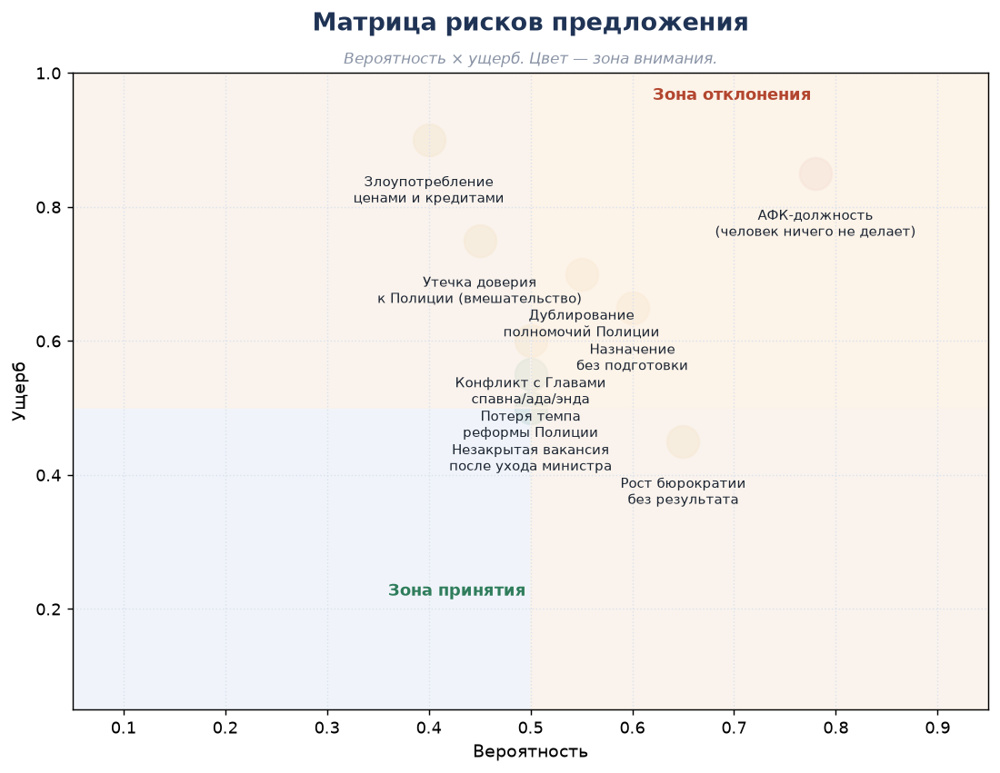
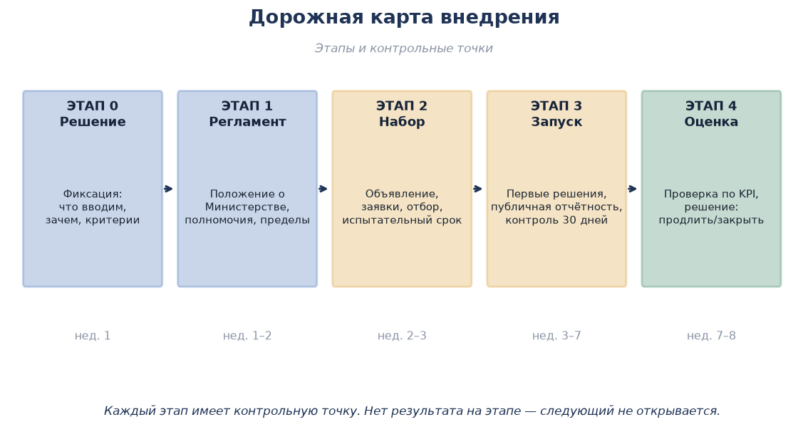

# АНАЛИЗ ПРЕДЛОЖЕНИЯ: ВВЕДЕНИЕ МИНИСТЕРСТВ

## Материал к обсуждению Администрации сервера



```
╔══════════════════════════════════════════════════════════════════╗
║                                                                  ║
║   А Н А Л И З   П Р Е Д Л О Ж Е Н И Я                            ║
║                                                                  ║
║   ТЕМА: введение министерств (экономики, безопасности,          ║
║         полиции) и набор на министерские должности               ║
║                                                                  ║
║   АВТОР ПРЕДЛОЖЕНИЯ:   onesecond661                              ║
║   РАЗБОР И ПОЗИЦИЯ:    GeneralStrasse                            ║
║   СЕРВЕР:         ванильный сервер                              ║
║   СТАТУС:              материал к обсуждению                     ║
║   ДАТА:                сентябрь 2026                             ║
║                                                                  ║
╚══════════════════════════════════════════════════════════════════╝
```

> *«Должность — это не награда и не украшение. Это функция, под которую есть задача, человек и ответственность. Если чего-то из трёх нет, должность становится памятником.»*

---

# 0. РЕЗЮМЕ: ВЕРДИКТ ОДНОЙ ТАБЛИЦЕЙ

| Что предложено | Решение | Коротко почему |
|---|---|---|
| **Министр экономики** | ✅ **ПОДДЕРЖАТЬ** — при выполнении условий | Задача есть (цены, кредиты, финансовая политика), зона ответственности свободна, измеримый результат возможен |
| **Министр безопасности** | ❌ **ОТКЛОНИТЬ** | Функция уже распределена между Полицией Спавна и Комитетом; введение дубля создаст конфликт полномочий, а не безопасность |
| **Министр полиции** | ❌ **ОТКЛОНИТЬ** — вредно на этом этапе | Полиция проходит реформирование; внешний руководитель, не прошедший путь вместе с ней, сломает и реформу, и мотивацию |
| **Набор на министров сейчас** | ⏸ **ОТЛОЖИТЬ** | Сначала положение и критерии, потом объявление о наборе. Набор без положения — это обещание должности, а не отбор |

**Четыре опоры вердикта:**

1. **Должность вводится под задачу, а не под желание.** У Министерства экономики задача есть. У министра полиции и министра безопасности — либо нет, либо она уже выполняется другими.
2. **Проблема «полиция АФК» не решается новой должностью.** Она решается задачами, диспетчером, обратной связью и измеримыми целями. Новый начальник над демотивированной структурой даёт ей повод ничего не делать окончательно: «теперь за это отвечает министр».
3. **Порядок имеет значение.** Сначала положение → потом критерии → потом отбор → потом испытательный срок. Обратный порядок даёт АФК-должность с вероятностью, близкой к единице.
4. **Состав сервера — школьники 14–16 лет.** Должность сама по себе не даёт ни авторитета, ни умения руководить ровесниками. Без подготовки, наставника и регламента она даёт либо АФК-должность, либо «игру в начальника» (подробнее — раздел 3).

**Что в предложении верно** — и это нужно сказать отдельно:

| Сильная сторона предложения | Почему это ценно |
|---|---|
| Замечена реальная проблема: Полиция выглядит неактивной | Это правда, и об этом надо говорить, а не делать вид, что всё хорошо |
| Предложен конкретный и узкий функционал для экономики | Это именно то, чего серверу не хватает: кто-то, кто системно ведёт цены и финансы |
| Поставлен вопрос о развитии РП-части | Запрос на смысл и роль — правильный запрос; спорить надо о способе, а не о цели |

---

# 1. ИСХОДНЫЕ МАТЕРИАЛЫ

## 1.1. Предложение (onesecond661)

```
┌──────────────────────────────────────────────────────────────────┐
│ ИСХОДНОЕ ПРЕДЛОЖЕНИЕ · onesecond661                              │
├──────────────────────────────────────────────────────────────────┤
│ «После того как администрация поменяла минимальные цены,         │
│  обсуждалась возможность в будущем добавить министра экономики.  │
│  Дополнительно можно добавить министра безопасности или          │
│  министра полиции.                                               │
│                                                                  │
│  Министра полиции — так как нынешняя полиция АФК, и стоило бы    │
│  в каком-то смысле вмешаться и возродить интересную РП-часть.    │
│                                                                  │
│  А министра экономики — чтобы, как говорилось, следил за         │
│  экономикой и изменял, добавлял и как-то ещё влиял на            │
│  минимальные цены и на экономику в общем.                        │
│                                                                  │
│  Хотелось бы видеть набор на министров.»                         │
└──────────────────────────────────────────────────────────────────┘
```

## 1.2. Позиция (GeneralStrasse)

```
┌──────────────────────────────────────────────────────────────────┐
│ ПОЗИЦИЯ · GeneralStrasse                                         │
├──────────────────────────────────────────────────────────────────┤
│ 1. Полиция находится в работе и уже проходит этап                │
│    реформирования. Ей до конца сезона нужно набить руку,         │
│    получить опыт, понять свои ошибки, плюсы и минусы.            │
│                                                                  │
│ 2. Зачем вводить кучу министерств и должностей? Чтобы туда       │
│    встал школьник и ничего не делал? Будет ещё больше АФК-       │
│    должностей и не более того.                                   │
│                                                                  │
│ 3. Не у всех есть должный опыт, компетенции или желание          │
│    играть. Пускай идёт всё своим чередом.                        │
│                                                                  │
│ 4. Единственное, что я бы поддержал — Министр Экономики.         │
│    И то независимый от главы спавна/ада/энда: чтобы управлял     │
│    финансами, банковской деятельностью, кредитами, ценами,       │
│    задавал финансовую политику + к нему в подчинение —           │
│    Главу Нацбанка.                                               │
│                                                                  │
│ 5. Введению каких-либо должностей должно быть обоснование,       │
│    нормальное обоснование + подготовка людей.                    │
└──────────────────────────────────────────────────────────────────┘
```

## 1.3. О чём спор на самом деле

Предложение и возражение говорят о разных вещах. Предложение говорит о **структуре** («давайте добавим должности»), возражение — о **готовности** («должности некому и незачем занимать»).

| Уровень | Вопрос | Где здесь правда |
|---|---|---|
| **Симптом** | Полиция выглядит неактивной | onesecond661 прав: это заметно и это плохо |
| **Причина** | Нет задач, обратной связи и измеримых целей | GeneralStrasse прав: причина не в отсутствии министра |
| **Предлагаемое решение** | Новая должность над Полицией | Не лечит причину, а добавляет слой управления |
| **Реальное решение** | Задачи, диспетчер, регламенты, обратная связь | Уже есть инструменты: ПС-Д-01 (план-задания), ПС-Р-02/03 (регламенты), ПС-А-01 (аттестация) |

> **Ключевой тезис материала:** назначить министра полиции — значит нанять человека, который будет руководить людьми, у которых нет задач. Задачи появятся не раньше, чем их кто-то начнёт ставить. А ставить их умеет диспетчер, а не министр.

---

# 2. РАЗБОР ПО ПУНКТАМ

## Пункт 1. Полиция находится в работе и проходит реформирование

**Тезис.** Полиция Спавна сейчас не «готова» и не «провалилась» — она находится в процессе. Вмешательство сверху на этом этапе ломает процесс, а не ускоряет его.

**Обоснование:**

- Реформа проходит фазу накопления опыта: люди учатся на своих ошибках. Ошибки этой фазы — рабочий материал, а не приговор.
- Новый руководитель, не прошедший этот путь, не знает, какие ошибки были сделаны и почему решения принимались именно так. Он начнёт «наводить порядок» с нуля — и обнулит то, что уже наработано.
- Демотивация гарантирована: людям, которые тянули реформу месяц, сообщают, что над ними ставят человека со стороны. Это читается как «вы не справились» — даже если этого не говорили вслух.

**Что сделать вместо:**

| Мера | Зачем | Срок |
|---|---|---|
| Дать Полиции доработать сезон без внешнего руководства | Завершение фазы накопления опыта | До конца сезона |
| Ввести измеримые показатели (жалобы, сроки разбирательств, доля закрытых дел) | Появится объективная картина вместо «кажется, АФК» | Немедленно |
| Провести разбор итогов сезона с участием комиссара | Решение принимать по фактам, а не по впечатлению | Конец сезона |
| Вернуться к вопросу о структуре управления **после** разбора | Обоснование появится из данных | Следующий сезон |

## Пункт 2. Куча министерств = АФК-должности

**Тезис.** Должность без ежедневной обязательной работы превращается в строчку в списке через две-три недели.

**Обоснование.** АФК-должность возникает не потому, что человек плохой, а потому что должность **ничего не требует**:

| Признак должности-пустышки | Что происходит |
|---|---|
| Нет обязательной периодической задачи | Нечего делать — значит, делать не надо |
| Нет измеримого результата | Нечего предъявить — значит, и спрашивать не за что |
| Нет отчётности | Деятельность невидима — значит, её как бы нет |
| Нет ответственности за бездействие | Бездействие — безопасная стратегия |
| Есть только статус | Приходят ради статуса, а не ради работы |

**Правило:** должность жива ровно до тех пор, пока у неё есть **еженедельная обязательная задача с измеримым результатом**. Нет такой задачи — должность не вводится.

**Проверка на практике:** из четырёх предлагаемых и существующих направлений еженедельную задачу имеют ровно два — экономика (цены, кредиты, отчёт по рынку) и диспетчеризация Полиции (план-задания). Остальные направления этой задачи не имеют, а значит — должности под них преждевременны.

## Пункт 3. Нет опыта, компетенций и желания

**Тезис.** Кадровое предложение должно отвечать на вопрос «кто?», а не только «что?».

**Три фильтра кандидата:**

| Фильтр | Что проверяем | Как проверяем |
|---|---|---|
| **Компетенции** | Понимает ли человек предмет | Разговор по существу: что он сам изменил бы и почему |
| **Опыт** | Доводил ли дела до конца раньше | Факты: что сделано, а не что обещано |
| **Желание** | Готов ли тратить время регулярно | Пробная задача до назначения |

**Пробная задача — обязательный этап.** Кандидат выполняет одну реальную задачу **до** назначения. Кто не сделал пробную, тот не обсуждается. Это дешевле, чем потом снимать человека с должности.

**И отдельно — о возрастном факторе.** Основа активного состава — школьники 14–16 лет, и это меняет саму конструкцию отбора. Речь не о том, что «молодым нельзя», а о том, что руководителя из ровесника надо **вырастить**: должность не даёт авторитета, а без авторитета руководитель либо бездействует, либо компенсирует это формой. Подробнее — раздел 3.

## Пункт 4. Единственное, что поддерживается — Министерство экономики

**Тезис.** Экономическое направление — единственное из предложенных, где есть и задача, и полномочия, и измеримый результат.

**Условия поддержки (обязательные):**

1. **Независимость** от глав спавна / ада / энда: министр экономики не подчиняется территориальным главам и не совмещает должности с ними.
2. **Подчинение Главы Нацбанка** — напрямую министру.
3. **Публичный регламент** изменения минимальных цен: как, как часто, с каким уведомлением.
4. **Отчётность** — еженедельно, в установленном месте.
5. **Пределы полномочий** — зафиксированы письменно (см. раздел 5).
6. **Испытательный срок и снимаемость** — должность не пожизненная.

## Пункт 5. Обоснование и подготовка

**Тезис.** Любая должность вводится в порядке: **задача → положение → критерии → человек**. Не наоборот.

```
ПРАВИЛЬНЫЙ ПОРЯДОК              НЕПРАВИЛЬНЫЙ ПОРЯДОК
                                
1. Задача и её измеритель       1. Идея должности
        ↓                               ↓
2. Положение о должности        2. Объявление набора
        ↓                               ↓
3. Критерии и отбор             3. Назначение «по симпатии»
        ↓                               ↓
4. Испытательный срок           4. АФК-должность
        ↓                               ↓
5. Назначение                   5. Вопрос «а зачем это было?»
```

---

# 3. ВОЗРАСТНОЙ ФАКТОР: КОМУ МЫ ДАЁМ ДОЛЖНОСТЬ

## 3.1. Исходное условие, которое нельзя игнорировать

> **Основу активного состава сервера составляют школьники 14–16 лет.**
>
> Это не оценка личности и не упрёк: среди них есть и умные, и ответственные, и по-настоящему увлечённые игрой ребята. Но при проектировании структуры управления это **исходное условие**, а не деталь.

Из этого условия следует простая вещь: **структуру нужно строить под реальный уровень подготовки людей, а не под воображаемого взрослого управленца.**

Должность, рассчитанная на зрелого руководителя, в руках неподготовленного подростка даёт один из двух результатов — третьего не бывает:

```
               ДОЛЖНОСТЬ БЕЗ ПОДГОТОВКИ
                           │
            ┌──────────────┴──────────────┐
            │                             │
      АФК-ДОЛЖНОСТЬ              «ИГРА В НАЧАЛЬНИКА»
            │                             │
    человек не знает,             человек подменяет
   что именно делать,           отсутствие умения
      и тихо ничего              руководить формой:
        не делает               звания, наказания
            │                             │
            └──────────────┬──────────────┘
                           │
                 СТРУКТУРА НЕ РАБОТАЕТ
```

## 3.2. Главная проблема: умение поставить себя в коллективе

**Чем отличается взрослый руководитель от ровесника-руководителя:**

| Опора руководителя | У взрослого | У школьника 14–16 |
|---|---|---|
| Должность как источник авторитета | Работает: статус признаёт среда | **Не работает**: ровесник сначала личность, потом начальник |
| Жизненный и управленческий опыт | Есть | Нет — его нечем заменить |
| Дистанция между руководителем и подчинённым | Естественная | Её нет: все играют вместе каждый вечер |
| Умение требовать с подчинённого | Отработано | **Самая сложная точка**: требовать с друга психологически тяжело |
| Реакция на возражения и критику | Выдержанная | Часто — обида или резкость |

**Откуда берётся авторитет в среде ровесников.** Его не выдают вместе с должностью. Он складывается из четырёх вещей:

1. **Личный пример** — руководитель делает больше и раньше, чем требует.
2. **Понятность решений** — каждое решение объяснено, а не спущено.
3. **Справедливость** — правило одно для всех, включая друзей руководителя.
4. **Поддержка сверху** — Администрация подтверждает решения руководителя, иначе они ничего не стоят.

**Типичный сбой.** Получив должность без авторитета, человек начинает компенсировать отсутствие первого **формой**: требует обращения по званию, наказывает «для порядка», собирает вокруг себя друзей и опирается на них, обижается на любую критику. Это и есть «игра в начальника» — и она разрушает структуру **быстрее, чем если бы человек просто ничего не делал**: бездействие хотя бы не отталкивает людей.

**Отдельный риск — нежелание быть «плохим».** Требовать с человека, с которым ты сидишь в одном чате и играешь по вечерам, трудно в любом возрасте, а в 14–16 — особенно. Отсюда типичная картина: своим — спускается, чужим — строгость. Именно это убивает доверие к структуре.

## 3.3. Компетенции: что требует роль и что реально есть



| Компетенция | Требуется | Типично в 14–16 | Чем закрываем разрыв |
|---|:--:|:--:|---|
| Авторитет среди ровесников | 9 | 3 | Наставник, поддержка Администрации, личный пример |
| Самодисциплина и регулярность | 9 | 4 | Регламент отчётности, напоминания, автоснятие за пропуски |
| Переговоры и работа с конфликтом | 8 | 3 | Обучение (АК-04), разбор реальных кейсов |
| Решения при неполной информации | 8 | 3 | Сначала право предлагать, потом право решать |
| Понимание экономики сервера | 8 | 4 | Пробная задача, собеседование по существу |
| Письменная речь и отчётность | 8 | 4 | Шаблоны отчётов (ПС-Д-02), образец для подражания |
| Ответственность за чужие ошибки | 8 | 3 | Наставник; разбор ошибок без поиска виновных |
| Адекватная реакция на критику | 7 | 3 | Обратная связь по правилам (ПС-Р-02) |

> Шкала экспертная, вынесена на обсуждение. Смысл не в точных цифрах, а в **разрыве**: он закрывается обучением, наставником и регламентом — но не самим фактом назначения.

## 3.4. Следствия для рассматриваемого предложения

| № | Следствие | Что это меняет |
|---|---|---|
| 1 | **Сначала подготовка, потом должность** | Порядок из пункта 5 позиции становится обязательным, а не пожеланием |
| 2 | Чем выше должность, тем жёстче должен быть внешний каркас: регламент, отчётность, наставник | Должность «без бумаги» вводить нельзя |
| 3 | **Министерство экономики — единственная роль, где каркас реален** | Работа с числами, а не с людьми; результат измерим; подчинённый один |
| 4 | **Министр полиции — худший вариант именно по возрастному фактору** | Дисциплинарная власть над ровесниками + конфликты + отсутствие опыта = максимум риска |
| 5 | Руководителей надо **растить внутри структуры** | Появляется лестница подготовки вместо разового набора |

**Почему экономика — исключение.** Министерство экономики требует работы с числами, а не с людьми. Ошибка в цене исправляется за пять минут и видна сразу. Ошибка в управлении людьми не исправляется месяцами и разрушает коллектив. Поэтому именно экономическая роль — та, с которой можно начинать: цена ошибки минимальна, а результат измерим.

**Почему полиция — нет.** Министр полиции — это ежедневная дисциплинарная власть над ровесниками, разбор конфликтов и право наказывать. Это самая сложная управленческая задача из возможных, и отдавать её неподготовленному человеку — значит обрушить и структуру, и человека: он либо сломается, либо начнёт «играть в начальника».

## 3.5. Лестница подготовки: растим, а не назначаем

```
ИСПОЛНИТЕЛЬ → СТАРШИЙ ИСПОЛНИТЕЛЬ → ЗАМЕСТИТЕЛЬ → ИСПОЛНЯЮЩИЙ ОБЯЗАННОСТИ → РУКОВОДИТЕЛЬ
```

| Ступень | Что делает | Срок | Проверка |
|---|---|---|---|
| **Исполнитель** | Выполняет план-задания, учится на практике | 2–4 недели | Оценка диспетчера: регулярность, качество |
| **Старший исполнитель** | Ведёт направление, помогает новичкам | 4–6 недель | Самостоятельно закрытые задачи |
| **Заместитель** | Замещает руководителя в его отсутствие | 4–8 недель | Отчёт по направлению за период замещения |
| **Исполняющий обязанности** | Ведёт направление под наблюдением наставника | 3 недели | Испытательный срок: отчётность, решения, реакция на критику |
| **Руководитель** | Полномочия в полном объёме | Сезон | Решение Администрации по итогам испытательного срока |

**Правила лестницы:**

1. **Ни одна ступень не пропускается «за заслуги».** Хороший патрульный — не значит готовый комиссар.
2. **У каждого кандидата — наставник** из Администрации или из числа опытных руководителей. Наставник отвечает за результат вместе с кандидатом.
3. **Сначала право предлагать, потом право решать.** Первые недели кандидат готовит предложения; право окончательного решения получает после испытательного срока.
4. **Обучение обязательно.** Курсы АК-03 (мотивация) и АК-04 (управление и влияние) — минимум для руководящей должности. Хочешь руководить людьми — сначала пойми, почему они вообще что-то делают.
5. **Оценка не по возрасту, а по делу:** что сделано, как регулярно, как реагирует на критику.

## 3.6. Возраст — не фильтр, критерии — фильтр

| Подход | Почему так |
|---|---|
| ❌ Ввести возрастной ценз | Отсечёт и тех немногих, кто действительно готов; создаст обиду и формализм |
| ✅ Ввести единые проверяемые критерии | Отсеют неподготовленных любого возраста |
| ✅ Проверять делом, а не словами | Пробная задача покажет больше, чем любой разговор |
| ✅ Давать наставника вместо отказа | Неготовность сегодня — не приговор: её можно закрыть за месяц |

**Формулировка для объявления о наборе:**

```
Ограничений по возрасту нет. Требования едины для всех
и проверяются делом: пробная задача, собеседование,
испытательный срок, работа с наставником.
```


# 4. ПРИЧИНА, А НЕ СИМПТОМ: ЧТО НА САМОМ ДЕЛЕ С ПОЛИЦИЕЙ

## 4.1. Дерево причин «полиция АФК»

```
                  «ПОЛИЦИЯ АФК»
                                  «ПОЛИЦИЯ АФК»
                                        │
             ┌─────────────────┬─────────────────┬─────────────────┐
             │                 │                 │                 │
         НЕТ ЗАДАЧ       НЕТ ОБРАТНОЙ      НЕТ ИЗМЕРИМОЙ        НЕ ТОТ
                             СВЯЗИ             ЦЕЛИ             СОСТАВ
             │                 │                 │                 │
         нет плана       работа уходит    непонятно, что       люди без
       от диспетчера      «в никуда»:        считается         интереса
                          доклады не          хорошей           к роли
                        комментируются        работой        полицейского
             │                 │                 │                 │
             └─────────────────┴─────────────────┴─────────────────┘
                                        │
                                НИ ОДНА ИЗ ПРИЧИН
                              НЕ ЛЕЧИТСЯ МИНИСТРОМ
```

## 4.2. Что делать вместо министерства полиции

| Симптом | Настоящая причина | Мера | Уже есть инструмент |
|---|---|---|---|
| Патрульные стоят без дела | Нет потока задач | Диспетчер выдаёт план-задания | **ПС-Д-01**, формы ПЗ-01…ПЗ-12 |
| Доклады ни на что не влияют | Нет обратной связи | Показывать, что изменилось по материалам | **ПС-Р-02** (разбор), курс мотивации |
| Непонятно, хорошо ли работают | Нет показателей | Ввести 4–5 измерителей | ПС-Д-01 (журнал), ПС-Р-03 |
| Качество протоколов низкое | Нет обучения и проверки | Аттестация и пересдача | **ПС-А-01** (тест + ключ) |
| Сотрудники без интереса к роли | Отбор не по мотивам | Собеседование по мотивам | **ПС-Р-01** (аудиенция) |
| Токсичность и грубость | Нет закреплённого стандарта | Регламент общения и взыскания | **ПС-Р-02, ПС-Р-03** |

**Вывод.** У Полиции есть инструменты. У неё нет применённого управления. Министр эту проблему не решает: он добавляет ещё один уровень между задачей и исполнителем.

---

# 5. ПРЕДЛАГАЕМАЯ МОДЕЛЬ: МИНИСТЕРСТВО ЭКОНОМИКИ



## 5.1. Статус и независимость

| Параметр | Значение |
|---|---|
| **Кому подотчётен** | Администрации сервера |
| **От кого независим** | От глав спавна / ада / энда; не вправе совмещать эти должности |
| **Кто в подчинении** | Глава Нацбанка |
| **Срок полномочий** | Один сезон, с возможностью продления по итогам отчёта |
| **Испытательный срок** | 3 недели с момента назначения |
| **Снимаемость** | Администрацией по итогам проверки; автоматически — при двух пропущенных отчётах подряд |

## 5.2. Функции

| Функция | Что конкретно делает |
|---|---|
| **Ценовая политика** | Ведёт минимальные цены: пересмотр, обоснование, уведомление игроков |
| **Финансовая политика** | Определяет правила оборота валюты и расчётов |
| **Банковская система** | Курирует банковскую деятельность через Главу Нацбанка |
| **Кредиты** | Правила выдачи, лимиты, ответственность за невозврат |
| **Аналитика рынка** | Еженедельный отчёт: что подорожало, что подешевело, почему |
| **Антикризисные меры** | Предложения Администрации при резких колебаниях |

## 5.3. Полномочия и пределы

**Может:**

- изменять минимальные цены в установленном порядке;
- устанавливать правила кредитования и банковской деятельности;
- запрашивать у Администрации данные по рынку;
- ставить задачи Главе Нацбанка;
- объявлять разъяснения игрокам по экономической части.

**Не может:**

- менять цены без уведомления и обоснования;
- вмешиваться в территориальное управление (спавн / ад / энд);
- вмешиваться в работу Полиции и Комитета;
- вводить налоги, сборы и обязательные платежи без решения Администрации;
- совмещать должность с любой другой руководящей должностью;
- принимать решения, меняющие правила сервера, в одиночку.

> **Главный предел:** министр экономики **предлагает и устанавливает экономические параметры**, но не меняет правила сервера. Граница проводится там, где изменение касается не чисел, а правил.

## 5.4. Требования к кандидату и порядок отбора

| Требование | Проверка |
|---|---|
| Понимание рынка сервера | Собеседование: что и почему он изменил бы прямо сейчас |
| Опыт доведения дел до конца | Факты: что сделано ранее |
| Регулярность | Пробная задача до назначения |
| Отсутствие конфликта интересов | Не является главой территории и владельцем крупного магазина |
| Готовность к публичной отчётности | Согласие с регламентом отчётности |
| Подготовка к руководству | Обучение АК-03 и АК-04; опыт хотя бы на ступени «старший исполнитель» (раздел 3.5) |
| Наличие наставника | Опытный руководитель согласен курировать первые три недели |

**Этапы отбора:** объявление → заявки → собеседование (по мотивам и компетенциям) → пробная задача → назначение наставника → решение Администрации → испытательный срок (3 недели, с обучением АК-03 и АК-04) → отчёт → закрепление.

## 5.5. Отчётность и показатели

**Еженедельный отчёт (обязательный):**

1. Что изменилось на рынке за неделю.
2. Какие решения приняты и почему.
3. Какие вопросы вынесены на Администрацию.
4. Что планируется на следующую неделю.

**Показатели (проверка раз в месяц):**

| Показатель | Как измеряем |
|---|---|
| Регулярность | Доля недель с отчётом (цель — 100%) |
| Обоснованность | Есть ли обоснование у каждого изменения цен |
| Предсказуемость | Соблюдается ли срок уведомления об изменениях |
| Работа системы | Есть ли активные кредиты и банковские операции |
| Обратная связь игроков | Число и содержание обращений по экономике |

---

# 6. ФИЛЬТР ДОЛЖНОСТЕЙ: ВОСЕМЬ ВОПРОСОВ

> Универсальный тест. Любая новая должность — министерская или рядовая — проходит его до обсуждения кандидатур.

| № | Вопрос | Если ответ «нет» |
|---:|---|---|
| 1 | Есть ли **задача**, которую никто сейчас не выполняет? | Должность не нужна |
| 2 | Есть ли **еженедельная обязательная работа**? | Должность станет АФК |
| 3 | Есть ли **измеримый результат**? | Спрашивать будет не за что |
| 4 | Понятно ли, **кому** должность подотчётна? | Возникнет конфликт полномочий |
| 5 | Есть ли хотя бы **два подготовленных кандидата**? | Набор превратится в назначение первого желающего |
| 6 | Есть ли **положение** о должности? | Полномочия будут определяться по ходу |
| 7 | Понятно ли, **как снимать** с должности? | Должность станет пожизненной |
| 8 | Есть ли **наставник** и пройдено ли обучение? | Неподготовленный человек останется один на один с ролью — получим АФК-должность или «игру в начальника» (раздел 3) |

**Применяем к предложению:**

| Должность | 1 | 2 | 3 | 4 | 5 | 6 | 7 | 8 | Итог |
|---|---|---|---|---|---|---|---|---|---|
| Министр экономики | ✅ | ✅ | ✅ | ✅ | ⚠ | ⚠ | ✅ | ⚠ | **Готовить** (нужны кандидаты, положение, наставник) |
| Министр безопасности | ❌ | ❌ | ❌ | ❌ | ❌ | ❌ | ❌ | ❌ | **Отклонить** |
| Министр полиции | ❌ | ❌ | ❌ | ⚠ | ❌ | ❌ | ❌ | ❌ | **Отклонить** |

---

# 7. СРАВНЕНИЕ ВАРИАНТОВ



| Критерий | А: статус-кво + точечные меры | Б: только Министерство экономики | В: все министерства сразу |
|---|---|---|---|
| Решает проблему экономики | Нет | **Да** | Частично |
| Решает проблему «полиция АФК» | Да (через задачи и диспетчера) | Нет | Нет — усугубляет |
| Риск АФК-должностей | Минимальный | Средний (закрыт регламентом) | **Высокий** |
| Влияние на реформу Полиции | Положительное | Нейтральное | **Разрушительное** |
| Прозрачность и подотчётность | Средняя | **Высокая** | Низкая |
| Скорость внедрения | Высокая | Средняя | Низкая |
| Требует новых людей | Нет | 1–2 | 3+ |
| Обратимость (легко отменить) | Да | Да | Тяжело (люди уже назначены) |

**Рекомендация: комбинация А + Б.** Точечные меры по Полиции — немедленно; Министерство экономики — после утверждения положения и появления кандидатов. Вариант В — отклонить полностью.

---

# 8. РИСКИ И МЕРЫ



| Риск | Вероятность | Ущерб | Мера |
|---|---|---|---|
| **АФК-должность**: человек ничего не делает | Высокая | Высокий | Еженедельная задача + отчёт; автоснятие при двух пропусках отчёта |
| **Дублирование полномочий** Полиции и министра безопасности | Средняя | Высокий | Не вводить министерство безопасности; разделение зафиксировать документально |
| **Слом реформы Полиции** внешним руководителем | Средняя | Высокий | Мораторий на изменения в управлении Полицией до конца сезона |
| **Злоупотребление ценами и кредитами** | Средняя | Высокий | Регламент изменений, уведомление игроков, право вето Администрации |
| **Конфликт с главами спавна/ада/энда** | Средняя | Средний | Прямая независимость министра; запрет совмещения должностей |
| **Назначение без подготовки** | Средняя | Средний | Пробная задача до назначения; минимум два кандидата |
| **Потеря темпа реформы Полиции** из-за споров о структуре | Средняя | Средний | Спор о структуре закрыть решением; вернуться к нему после разбора сезона |
| **Незакрытая вакансия после ухода министра** | Средняя | Средний | Срок полномочий — один сезон; заранее готовить заместителя |
| **Неподготовленный кандидат 14–16 лет на руководящей роли** | Высокая | Высокий | Лестница подготовки (раздел 3.5); наставник; испытательный срок 3 недели |
| **«Игра в начальника»**: форма вместо сути, потеря авторитета | Средняя | Высокий | Регламент; обучение АК-03 и АК-04; еженедельная встреча с наставником; поддержка решений Администрацией |

**Суммарная оценка риска:** вариант Б (только экономика) при выполнении мер — **приемлемый**; вариант В (все министерства) — **неприемлемый**: четыре риска из таблицы находятся в зоне отклонения одновременно, и два из них (неподготовленный руководитель и «игра в начальника») связаны именно с возрастным составом.

---

# 9. ДОРОЖНАЯ КАРТА



| Этап | Что делаем | Кто | Контрольная точка |
|---|---|---|---|
| **0. Решение** | Фиксируем: экономику — да, остальное — нет. Утверждаем состав показателей | Администрация | Решение оформлено и опубликовано |
| **1. Регламент** | Положение о Министерстве экономики: функции, пределы, отчётность, снимаемость | GeneralStrasse + Администрация | Текст положения согласован |
| **2. Набор** | Объявление, приём заявок, собеседования, пробная задача, назначение наставника | Администрация | Минимум два кандидата, выполнивших пробную задачу; наставник назначен |
| **3. Запуск** | Назначение с испытательным сроком 3 недели; обучение АК-03 и АК-04; первые решения; еженедельные отчёты | Министр, наставник | Первый отчёт опубликован; обучение пройдено; изменения цен обоснованы |
| **4. Оценка** | Проверка по показателям; решение: продлить / продлить с замечанием / закрыть | Администрация | Отчёт по итогам месяца |

**Правило этапов:** следующий этап не открывается, пока не закрыт предыдущий. Открыть набор до утверждения положения — значит повторить именно ту ошибку, о которой предупреждает пункт 5 позиции.

---

# 10. КРИТЕРИИ УСПЕХА И ТОЧКИ ОТКАТА

## 10.1. Признаки, что Министерство экономики работает

- еженедельный отчёт выходит без напоминаний;
- каждое изменение цен сопровождается обоснованием и уведомлением;
- игроки знают, к кому идти по экономическим вопросам;
- появилась работающая банковская и кредитная система;
- решения министра можно проверить: есть дата, причина, результат.

## 10.2. Точки отката

| Событие | Действие |
|---|---|
| Два пропущенных отчёта подряд | Автоматическое снятие |
| Изменение цен без обоснования и уведомления | Предупреждение; повторно — снятие |
| Три недели без единого решения по направлению | Проверка на предмет АФК, снятие при подтверждении |
| Жалобы игроков на злоупотребление | Проверка Администрации; при подтверждении — снятие |
| Использование должности для личной выгоды | Немедленное снятие |

> **Принцип:** должность легко дать и тяжело отобрать, если не договориться об условиях заранее. Условия фиксируются до назначения — пунктом в положении, а не в разговоре.

---

# 11. ТЕКСТ ВЫСТУПЛЕНИЯ

> Готовый текст для озвучивания на обсуждении. Расчётное время — 3 минуты.

---

«Коллеги, разберём предложение onesecond661. Начну с того, в чём он прав.

Полиция действительно выглядит неактивной. Это заметно, и молчать об этом неправильно. И запрос на развитие РП-части — правильный запрос. Спорить нужно не о цели, а о способе.

Теперь о способе. Предлагается ввести министра безопасности и министра полиции. Посмотрим, что они будут делать.

Министр безопасности — чем? Безопасностью занимаются Полиция Спавна и Комитет. Если мы ставим над ними третьего, мы не усиливаем безопасность. Мы создаём ситуацию, в которой непонятно, кто за что отвечает. А когда непонятно, кто отвечает, — не отвечает никто.

Министр полиции — отдельный разговор. Полиция сейчас проходит реформирование. Люди набивают руку, учатся на своих ошибках, и ошибки этой фазы — нормальная рабочая вещь. Если сейчас поставить над ними человека со стороны, который не прошёл этот путь, мы получим две вещи. Первое: он начнёт наводить порядок с нуля и обнулит то, что уже наработано. Второе — и это главное — людям, которые тянули реформу месяц, мы скажем: вы не справились, теперь над вами будет другой. Они это прочитают именно так, даже если мы не скажем ни слова. И после этого тянуть реформу будет некому.

А теперь главное. Почему полиция выглядит АФК? Не потому, что нет министра. А потому, что нет задач, нет обратной связи и нет измеримых целей. Патрульный выходит в смену — и ему нечего делать, потому что никто не поставил план-задание. Он пишет доклад — и не знает, что изменилось по его докладу. Он работает — и не понимает, хорошо ли работает. Ни одна из этих трёх причин министром не лечится. Министр добавит ещё один уровень между задачей и исполнителем. А нужен не уровень — нужен диспетчер, план-задания и обратная связь. Это уже написано: ПС-Д-01, регламенты, аттестация. Инструменты есть. Их надо применять.

А теперь о том, о чём обычно молчат. Основа нашего состава — школьники, четырнадцать-шестнадцать лет. Я никого не хочу обидеть: среди них есть ребята умнее и ответственнее иных взрослых. Но есть вещь, которую должность не даёт, — умение поставить себя в коллективе. Взрослый начальник опирается на опыт и на дистанцию. У четырнадцатилетнего этого нет: он среди ровесников, с которыми играет каждый вечер. Авторитет в такой среде не выдаётся вместе с должностью — он зарабатывается примером, понятными решениями, справедливостью и нашей поддержкой. А когда авторитета нет, его начинают заменять формой: называйте меня по званию, я наказываю для порядка, а в опоре — свои друзья. Это и есть игра в начальника. И она убивает структуру быстрее, чем если бы человек просто ничего не делал.

Поэтому я настаиваю: руководителя не назначают, его растят. Исполнитель, старший, заместитель, исполняющий обязанности под присмотром наставника — и только потом руководитель. И для руководящей должности я считаю обязательным минимумом наши же курсы: мотивацию и управление. Хочешь руководить людьми — сначала пойми, почему они вообще что-то делают.

Возрастной ценз вводить я не предлагаю: он отсечёт и тех, кто действительно готов. Критерии должны быть едины для всех и проверяться делом. Не «сколько тебе лет», а «покажи, что ты сделал».

Второй мой тезис короткий. Должность без еженедельной обязательной задачи становится памятником. Через две недели она просто строчка в списке. И я не хочу гадать, кто туда встанет, — я хочу, чтобы у этой должности было, чем заниматься каждый день.

Что я поддерживаю — так это министра экономики. И поддержка не на словах, а с условиями.

Первое: независимость. Министр экономики не подчиняется главам спавна, ада и энда и не совмещает с ними должности. Иначе экономика станет инструментом территориальной политики.

Второе: в подчинении — Глава Нацбанка. Банки, кредиты, денежная политика должны управляться из одного места.

Третье: регламент. Любое изменение минимальных цен — с обоснованием и уведомлением игроков. Не «решил и поменял», а «объявил, объяснил, дал срок».

Четвёртое: отчётность и снимаемость. Еженедельный отчёт, испытательный срок, автоматическое снятие при двух пропущенных отчётах. Должность должна быть легко отбираемой — иначе она становится пожизненной.

И последнее. Я за то, чтобы порядок был правильным: сначала задача, потом положение, потом критерии, потом человек. Не наоборот. Если мы объявим набор до того, как написали, что этот человек будет делать, — мы получим ровно то, чего боимся: человека, который не знает, зачем он здесь.

Поэтому моё предложение такое: министерство безопасности и министерство полиции — отклонить, вернуться к вопросу после разбора итогов сезона. Министерство экономики — готовить: сначала положение и показатели, потом набор. А Полиции сейчас дать то, что ей действительно нужно, — задачи, обратную связь и понятные цели. И тогда вопрос о министре полиции либо отпадёт сам, либо к следующему сезону будет обоснован фактами, а не впечатлением.

Спасибо.»

---

# 12. ВОЗМОЖНЫЕ ВОЗРАЖЕНИЯ И ОТВЕТЫ

| Возражение | Ответ |
|---|---|
| «Министр полиции как раз и заставит их работать» | Не заставит: он добавит уровень управления, а не задачу. Работа появляется от диспетчера и плана-заданий, а не от начальника |
| «Без министра никто не будет отвечать за экономику» | С министром без регламента тоже не будет. Ответственность появляется из положения и отчётности, а не из титула |
| «Набор на министров сам по себе оживит сервер» | Оживит на неделю: новизна быстро проходит. Долгосрочно работает только то, что имеет задачу |
| «Давайте попробуем — хуже не будет» | Будет. Назначенного человека тяжело снять: это демотивирует и его, и тех, кто работал. Цена эксперимента — репутация и люди |
| «У нас уже есть должности, и ничего страшного» | Именно поэтому нужна пауза: сначала разобрать существующие, потом добавлять новые |
| «А кто будет ставить задачи полиции, если не министр?» | Диспетчер по ПС-Д-01. Это и есть его работа — а не министерская |
| «Среди школьников есть вполне взрослые и ответственные ребята» | Согласен. Именно поэтому возрастного ценза не будет: критерии едины для всех и проверяются делом, а не паспортом |
| «Это несправедливо — равнять всех по возрасту» | Мы равняем не по возрасту, а по подготовке. Кто готов — пройдёт лестницу быстро. Кто не готов — получит наставника вместо отказа |
| «Молодой министр — это свежий взгляд, дайте шанс» | Шанс даём: стажировка и исполняющий обязанности. Но не должность с властью над ровесниками в первый же день |
| «Министр экономики будет единолично менять цены — это опасно» | Согласен. Поэтому полномочия ограничены: уведомление, обоснование, право вето Администрации, снимаемость |

---

# 13. ПРОЕКТ РЕШЕНИЯ

> Выносится на голосование Администрации.

```
┌──────────────────────────────────────────────────────────────────┐
│ ПРОЕКТ РЕШЕНИЯ                                                   │
├──────────────────────────────────────────────────────────────────┤
│ 1. Предложение onesecond661 принять к сведению и поблагодарить   │
│    автора за поднятую тему.                                      │
│                                                                  │
│ 2. Введение должности «Министр безопасности» — ОТКЛОНИТЬ.        │
│                                                                  │
│ 3. Введение должности «Министр полиции» — ОТКЛОНИТЬ.             │
│    Вернуться к вопросу после разбора итогов сезона и только при  │
│    наличии обоснованных показателей неэффективности.             │
│                                                                  │
│ 4. Поручить Полиции Спавна до конца сезона:                      │
│    4.1. ввести еженедельные план-задания через диспетчера;       │
│    4.2. определить 4–5 измеримых показателей работы;             │
│    4.3. наладить обратную связь по материалам сотрудников.       │
│                                                                  │
│ 5. Инициативу по Министерству экономики — ПОДДЕРЖАТЬ при         │
│    выполнении условий:                                           │
│    5.1. независимость от глав территорий, запрет совмещения;     │
│    5.2. подчинение Главы Нацбанка;                               │
│    5.3. регламент изменения цен: обоснование + уведомление;      │
│    5.4. еженедельная отчётность; испытательный срок 3 недели;    │
│    5.5. автоматическое снятие при двух пропущенных отчётах.      │
│                                                                  │
│ 6. Объявление о наборе открыть ПОСЛЕ утверждения положения       │
│    о Министерстве экономики и только при наличии не менее двух   │
│    кандидатов, прошедших пробную задачу.                         │
│                                                                  │
│ 7. Любые новые должности впредь вводить только по фильтру        │
│    из восьми вопросов (раздел 6).                                │
│                                                                  │
│ 8. Утвердить лестницу подготовки руководителей:                  │
│    исполнитель → старший исполнитель → заместитель →             │
│    исполняющий обязанности → руководитель (раздел 3.5).          │
│    Каждый кандидат на руководящую должность обязан               │
│    иметь наставника и пройти обучение АК-03 и АК-04.             │
│    Возрастных ограничений не вводить: критерии едины             │
│    для всех и проверяются делом.                                 │
└──────────────────────────────────────────────────────────────────┘
```

---

# 14. ПРИЛОЖЕНИЯ

## 14.1. Проект объявления о наборе (публикуется после утверждения положения)

```
┌──────────────────────────────────────────────────────────────────┐
│ НАБОР НА ДОЛЖНОСТЬ: МИНИСТР ЭКОНОМИКИ                            │
│ Сервер                                              │
├──────────────────────────────────────────────────────────────────┤
│ ЧТО ДЕЛАТЬ:                                                      │
│  • вести минимальные цены: пересмотр, обоснование, уведомление;  │
│  • задавать финансовую политику;                                 │
│  • курировать банковскую систему и кредиты;                      │
│  • руководить Главой Нацбанка;                                   │
│  • публиковать еженедельный отчёт по рынку.                      │
│                                                                  │
│ ЧТО НЕЛЬЗЯ:                                                      │
│  • совмещать с должностью главы территории;                      │
│  • менять цены без обоснования и уведомления;                    │
│  • вмешиваться в работу Полиции и Комитета;                      │
│  • вводить налоги и сборы без решения Администрации.             │
│                                                                  │
│ ТРЕБОВАНИЯ:                                                      │
│  • понимание рынка сервера;                                      │
│  • готовность работать еженедельно;                              │
│  • пройти обучение АК-03 и АК-04;                                │
│  • опыт хотя бы на ступени «старший исполнитель»;                │
│  • отсутствие конфликта интересов;                               │
│  • выполнение пробной задачи до назначения.                      │
│                                                                  │
│ УСЛОВИЯ:                                                         │
│  срок полномочий — сезон; испытательный срок — 3 недели;         │
│  наставник от Администрации на весь испытательный срок;          │
│  сначала право предлагать, затем — право решать;                 │
│  снятие — автоматически при двух пропущенных отчётах.            │
│                                                                  │
│ ЗАЯВКА:                                                          │
│  1) ник;  2) почему вы;  3) что бы вы изменили первым делом;     │
│  4) сколько времени готовы уделять еженедельно.                  │
│  5) кто готов стать вашим наставником.                           │
│                                                                  │
│ Ограничений по возрасту нет. Требования едины для всех           │
│ и проверяются делом: пробная задача, собеседование,              │
│ испытательный срок, работа с наставником.                        │
└──────────────────────────────────────────────────────────────────┘
```

## 14.2. Бланк заявки кандидата

```
┌──────────────────────────────────────────────────────────────────┐
│ ЗАЯВКА НА ДОЛЖНОСТЬ · МИНИСТР ЭКОНОМИКИ                          │
│ Ник: ______________   Дата: ______________                       │
├──────────────────────────────────────────────────────────────────┤
│ Почему вы: ..................................................    │
│ Что изменили бы первым делом и почему: .......................   │
│ Время в неделю: ............................................     │
│ Опыт (что сделано на сервере): ..............................    │
│ Конфликт интересов (магазины, должности): ...................    │
│ Кто рекомендует / готов быть наставником: ..................     │
├──────────────────────────────────────────────────────────────────┤
│ Пробная задача: .............................................    │
│ Обучение АК-03 и АК-04: пройдено / в процессе / не пройдено      │
│ Результат пробной задачи: ...................................    │
│ Решение: допущен / не допущен    Причина: ...................    │
└──────────────────────────────────────────────────────────────────┘
```

## 14.3. Чек-лист готовности должности к введению

```
☐ 1. Сформулирована задача, которую никто не выполняет
☐ 2. Определена еженедельная обязательная работа
☐ 3. Определён измеримый результат
☐ 4. Назначен орган, которому должность подотчётна
☐ 5. Есть не менее двух кандидатов, прошедших пробную задачу
☐ 6. Утверждено положение о должности
☐ 7. Зафиксирован порядок снятия
☐ 8. Назначен срок полномочий
☐ 9. Проверено отсутствие конфликта интересов
☐ 11. Назначен наставник из Администрации или опытный руководитель
☐ 12. Кандидат прошёл обучение (АК-03, АК-04) или допущен с условием
☐ 13. Объявлен набор
```

---

# 15. ПЛАН ПРЕЗЕНТАЦИИ (12 СЛАЙДОВ)

| Слайд | Содержание | Визуал |
|---|---|---|
| 1 | Титул: тема, автор предложения, докладчик | `img/anal_cover.png` |
| 2 | Резюме: вердикт одной таблицей, четыре опоры | — |
| 3 | Исходное предложение: цитата | — |
| 4 | Что в предложении верно (признание сильных сторон) | — |
| 5 | **Возрастной фактор: состав сервера 14–16 лет** | `img/anal_readiness.png` |
| 6 | Компетенции руководителя: требуется и что есть; «игра в начальника» | схема разрыва |
| 7 | Симптом против причины: почему полиция АФК | дерево причин |
| 8 | Что делать вместо министерства полиции | таблица мер |
| 9 | Предлагаемая модель: Министерство экономики | `img/anal_org.png` |
| 10 | Лестница подготовки руководителей | схема лестницы |
| 11 | Риски и сравнение вариантов | `img/anal_risks.png`, `img/anal_options.png` |
| 12 | Дорожная карта, проект решения | `img/anal_roadmap.png` |

---

> **Итог материала:** предложение onesecond661 ценно тем, что подняло две настоящие проблемы — неактивность Полиции и отсутствие экономической политики. Но лечатся они по-разному: экономика — новой должностью при жёстком регламенте, а Полиция — не должностью, а задачами, диспетчером и обратной связью. Смешивать эти два решения — значит получить две новые АФК-должности и потерять реформу.

И третье обстоятельство, которое определяет конструкцию: **состав сервера — школьники 14–16 лет**. Должность не даёт авторитета и не учит руководить ровесниками. Значит, любая новая роль должна комплектоваться не только человеком, но и подготовкой: положением, наставником, обучением и регламентом. Иначе вместо работающего министерства мы получим либо тихую АФК-должность, либо «игру в начальника» — а отбить у людей желание играть гораздо легче, чем вернуть его.
