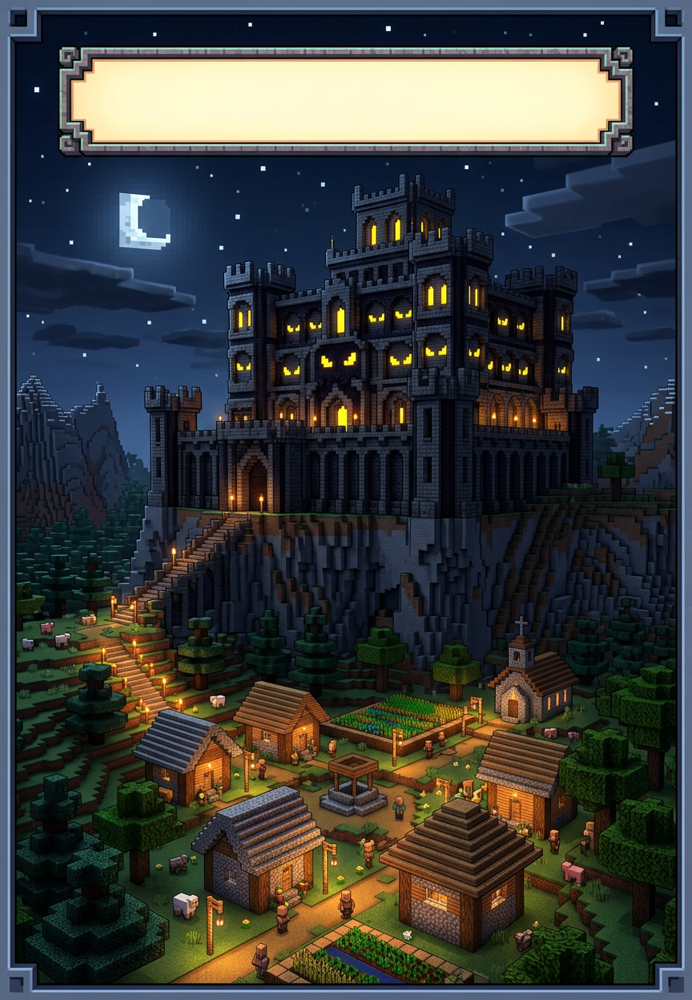
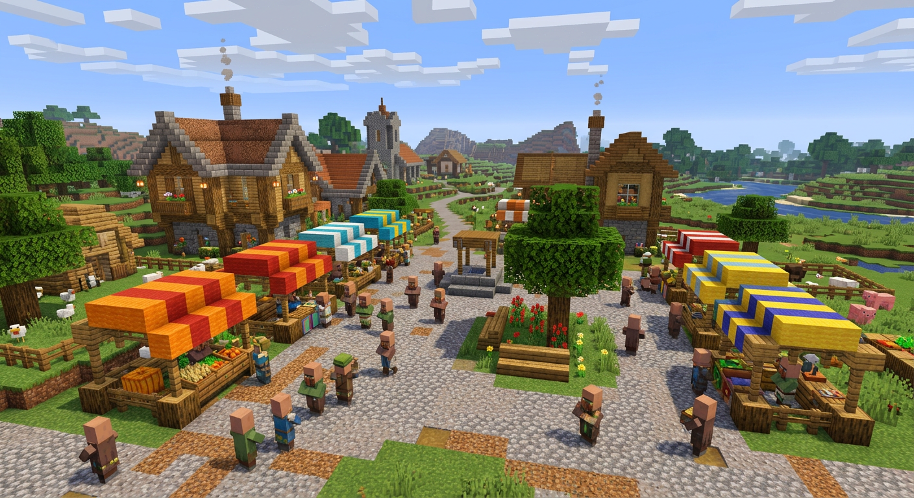
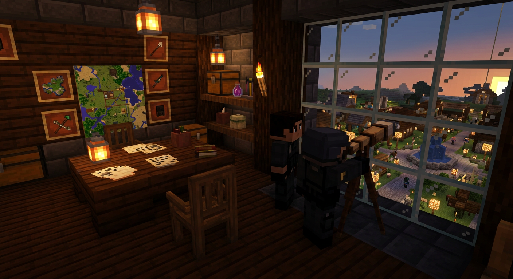
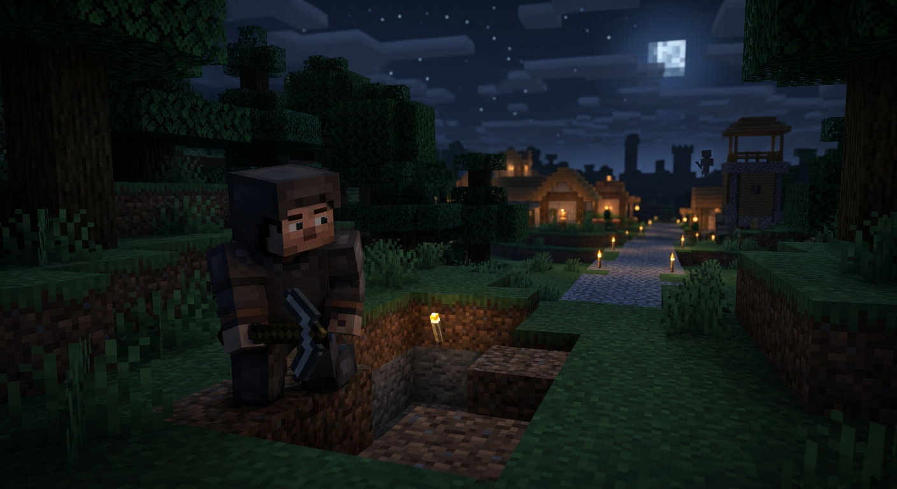
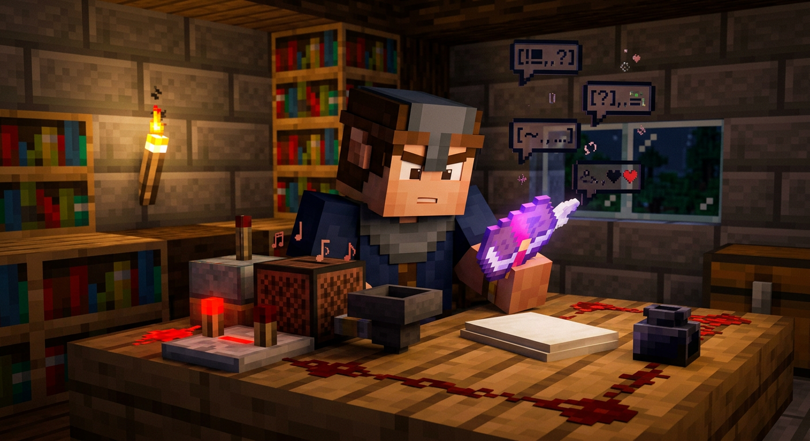
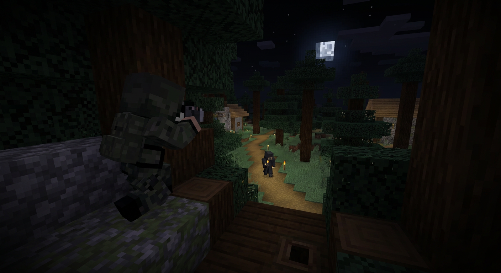
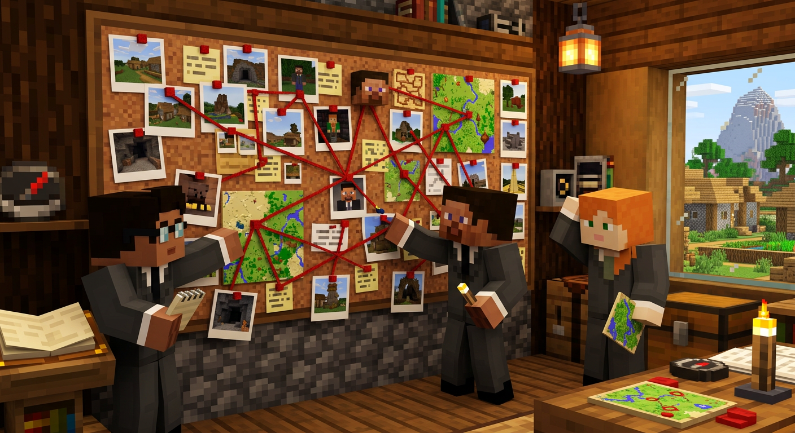
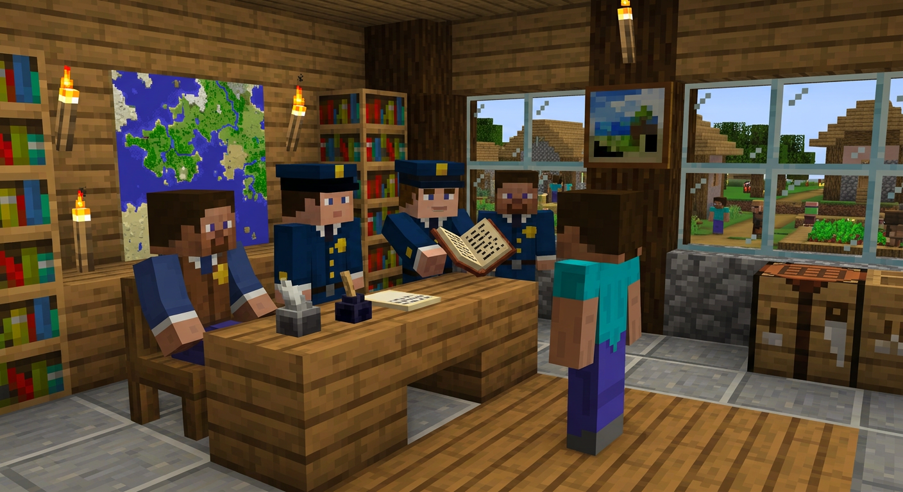
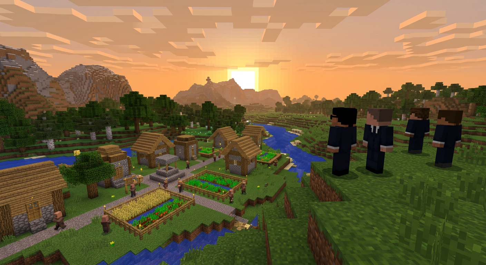

# КОМИКС: КОМИТЕТ. НАБЛЮДЕНИЕ

### Minecraft-комикс про службу наблюдения — как работает Комитет на спавне. Без насилия, только внимание, логи и порядок.

**Жанр:** детектив / повседневность | **Место:** сервер «Шаймайнерс», спавн и наблюдательный пункт | **Герои:** Агент Ворон, Агент Лиса, дежурный, игрок Тень

> Комикс — игровой лор. Вся «прослушка» — это чтение открытого чата и логов по правилам сервера, с разрешения Администрации. Никаких реальных инструкций по вторжению в приватность.

---

## Страница 1. Спокойный спавн

**Текст:**
*Спавн днём. Рынок, новички, торговцы. Всё спокойно — пока спокойно.*

Дежурный (в рацию): — Пост-1, обстановка?
Пост-1: — Чисто. Патруль прошёл.

---

## Страница 2. Пост наблюдения

**Текст:**
*Над площадью — наблюдательный пункт Комитета. Карты, журнал, бинокль. Не для слежки за всеми, а для фиксации нарушений по регламенту ПС-И-01.*

Агент Лиса: — Смена началась. Пишем только факты: время, место, действие.
Агент Ворон: — Без домыслов. Фото — только с F3 и координатами.

---

## Страница 3. Тревожный сигнал

**Текст:**
*23:14. Игрок Тень копает у самого спавна, оглядывается. По правилам — копать у спавна нельзя.*

Лиса (шепотом): — Вижу активность у границы. Фиксируем?
Ворон: — Фиксируем. Без выхода. Два независимых наблюдения.

---

## Страница 4. Открытые источники

**Текст:**
*«Прослушка» в игре — это не жучок, а открытый чат и книга жалоб. Всё, что игрок сам написал в чат.*

Ворон листает книгу: — В чате Тень писал: «надо быстро взять камень у спавна». Совпадает с действием.
Лиса: — Запишем как косвенное. Нужен второй источник.

> **Пояснение для читателя:** Комитет не читает личные сообщения вне игры. Работает только с тем, что игрок оставил в общем чате и в логах, доступных Администрации.

---

## Страница 5. Тихое сопровождение

**Текст:**
*Правило — не спугнуть. Дистанция, скриншоты, без контакта.*

Лиса: — Скрин F2, F3 включен. Время 23:16.
Ворон: — Второй ракурс. Видим, что берёт именно блоки спавна, не дикий камень.

---

## Страница 6. Стена доказательств

**Текст:**
*Утро. Штаб. Стена с фото, картой, нитками. Не для красоты — для проверки.*

Ворон: — Смотри: фото 23:14, фото 23:16, запись в чате 23:12. Три точки — один маршрут.
Лиса: — Добавим рапорт патруля: на обходе в 23:10 этого подкопа не было. Значит, время сужается.

> Комитет работает по ПС-Д-01: план-задание → фото → рапорт. Без этого — это не доказательство, а мнение.

---

## Страница 7. Разговор, а не расправа

**Текст:**
*Тень приглашён в кабинет. Без наручников, с книгой доказательств.*

Ворон: — Тень, покажи, откуда камень в инвентаре? Вот фото.
Тень: — ...Думал, никто не заметит. Хотел быстро дом.
Лиса: — Поняли. По ПС-Р-03 — предупреждение и возврат блоков. Без штрафа, ты впервые и признал.

---

## Страница 8. Спавн снова спокоен

**Текст:**
*Рассвет. Тень восстанавливает стену вместе с патрулём. Наблюдательный пункт снова просто смотрит.*

Текст за кадром: *Комитет — это не «всевидящее око». Это журнал, фотоаппарат и умение ждать, пока факты сами сложатся в линию. Тихо, по правилам, без мести.*

**Конец выпуска №1.**

---

### Как это устроено в игре — памятка на последней странице

| Что в комиксе | Что в реальности сервера |
| :--- | :--- |
| Бинокль, пост | Наблюдательный пункт над спавном (постройка) |
| «Прослушка» | Чтение общего чата + логи, доступные только Администрации |
| Фото F2+F3 | Скриншоты — единственное доказательство на ванильном сервере |
| Стена с нитками | Папка с рапортами ПС-Д-02 |
| Разговор | Разбор по ПС-Р-02 и ПС-Р-03, без мата и угроз |

*Хочешь продолжение — напиши, какую историю разобрать: «Сундук-призрак», «Чужой портал» или «Карта-ловушка».*
