# ОТКРЫТЫЙ КУРС: УПРАВЛЕНИЕ, ФРАКЦИИ, ЭТИКА, РИТОРИКА

## Материалы для общего собрания игроков сервера «Шаймайнерс»

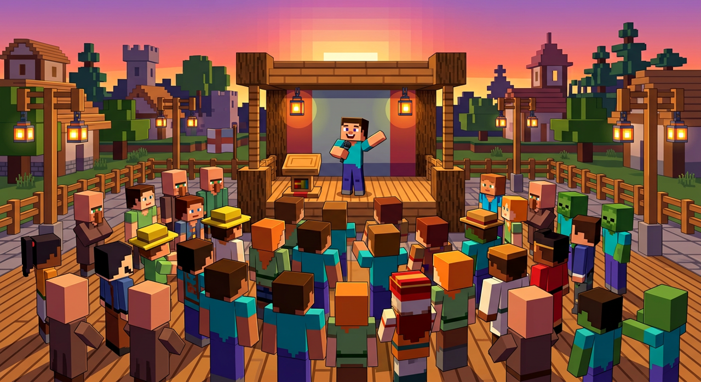

```
╔══════════════════════════════════════════════════════════════════╗
║                                                                  ║
║   О Т К Р Ы Т Ы Й   К У Р С                                      ║
║                                                                  ║
║   Управление · Фракции · Проблемы управления                    ║
║   Юридическая этика · Лексика · Риторика                         ║
║                                                                  ║
║   Для общего собрания игроков.                                   ║
║   Открытый материал: можно читать всем.                          ║
║   Никаких тонкостей спецслужб — только то,                      ║
║   что нужно каждому игроку.                                      ║
║                                                                  ║
║   Ведущий: GeneralStrasse                                        ║
║   Сервер: «Шаймайнерс»                                           ║
║                                                                  ║
╚══════════════════════════════════════════════════════════════════╝
```

> *«Управлять — не значит командовать. Управлять — значит сделать так, чтобы десять человек сделали одно дело и не перессорились.»*

---

# 0. КАК ПОЛЬЗОВАТЬСЯ ЭТИМ КУРСОМ

## 0.1. Для кого

Этот курс — для всех игроков. Не для Комитета, не для Полиции, не для «посвящённых». Здесь нет ни слежки, ни агентов, ни оперативных хитростей. Здесь есть вещи, которые нужны каждому, кто играет рядом с другими людьми: **как договариваться, как руководить, как спорить и как выступать перед людьми**.

## 0.2. Как устроена каждая лекция

| Блок | Что это |
|---|---|
| **Скажите так** | Готовый текст, который ведущий может произнести почти дословно. Простые слова, короткие фразы |
| **Пример** | Живая история или разговор персонажей. Люди запоминают историю, а не определение |
| **Таблица или схема** | То, что можно показать глазами или нарисовать на доске |
| **Вывод одной фразой** | То, что человек должен унести с собой |
| **Вопрос залу** | Чем включить людей: пусть отвечают, а не только слушают |

## 0.3. Главное правило подачи

```
СНАЧАЛА  ИСТОРИЯ  →  ПОТОМ  ПРИМЕР  →  ПОТОМ  ВЫВОД  →  И ТОЛЬКО ПОТОМ  СЛОВО
```

Не наоборот. Если начать со слова «делегирование», половина зала перестанет слушать. Если начать с истории про то, как Кирпич строил амбар и сорвался, — дослушают до конца, а слово запомнят само.

**Правило «одна лекция — одна мысль».** За собрание люди уносят не больше трёх мыслей. Поэтому каждая лекция заканчивается ровно одной фразой.

## 0.4. Состав курса

| Модуль | О чём | Лекции |
|---|---|---|
| **1. Управление** | Что это, откуда берётся право решать, как принимать решения, какие бывают правила | 1–4 |
| **2. Фракции** | Что такое группа, как она живёт, как фракциям друг с другом быть, почему они распадаются | 5–8 |
| **3. Проблемы управления** | Десять ошибок, конфликты, наказания, что делать с плохим руководителем | 9–12 |
| **4. Юридическая этика** | Правила и закон, справедливость, этика спора | 13–15 |
| **5. Лексика** | Общие слова простыми словами; как говорить, чтобы понимали | 16–17 |
| **6. Риторика** | Как выступать, как отвечать на вопросы и возражения | 18–19 |

**Итог:** 19 лекций, 40+ примеров и разговоров, 13 иллюстраций, готовый сценарий собрания на 40 минут и памятка для раздачи игрокам.

---

# 1. ЧТО ТАКОЕ УПРАВЛЕНИЕ ПРОСТЫМИ СЛОВАМИ

## Лекция 1. Управление — это не приказы

**Скажите так:**

«Давайте начнём с простого. Что такое управление? Большинство думает: управление — это когда человек стоит сверху и командует. Это не так. Командовать умеет каждый, для этого много ума не надо.

Управление — это когда **десять человек делают одно дело и не перессорились**. Вот и всё определение. Посмотрите: если десять человек делают одно дело — это уже половина. А если при этом ещё и не перессорились — это и есть управление.

Проверьте на себе. У нас на спавне каждую неделю кто-то что-то строит. Строить — это не управление. А вот когда пять человек строят одну стену, у них есть общий план, есть кто главный, есть кто носит камень, кто ставит блоки, кто проверяет — и никто ни на кого не обиделся — вот это управление.

И ещё важная вещь. Управление — это не разовое решение. Это **круг**, который повторяется».

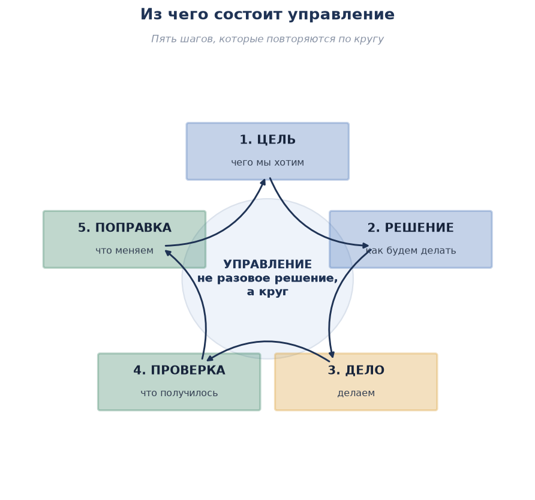

**Как объяснить круг:**

| Шаг | Что делаем | Как это выглядит на сервере |
|---|---|---|
| **1. Цель** | Решаем, чего хотим | «Построить общий амбар у спавна к субботе» |
| **2. Решение** | Решаем, как делать | «Кирпич — старший, трое копают, двое носят, один ведёт учёт» |
| **3. Дело** | Делаем | Строим три дня |
| **4. Проверка** | Смотрим, что вышло | «Стены есть, крыши нет, камня не хватило» |
| **5. Поправка** | Меняем, что не так | «Ещё два человека на камень, срок — до воскресенья» |

И после пятого шага круг начинается заново: новая цель, новое решение. **Управление, которое остановилось на третьем шаге, — это не управление, а бардак.** Люди побежали делать и так и остались бежать — кто куда.

**Пример.**

> **Кирпич** (старший на стройке): «Ребята, строим амбар. Всем копать камень».
>
> Через три дня: семь человек накопали три сундука камня. Амбара нет. Все устали, двое обиделись, потому что копали больше всех.
>
> **Гвоздь** (старый игрок): «Кирпич, ты цель поставил, а про остальное забыл. Сколько камня надо? Кто считает? Кто кладёт стены? Когда смотрим?»
>
> **Кирпич**: «Ну… я думал, сами разберутся».
>
> **Гвоздь**: «Вот именно что не разберутся. Кто-то должен был посчитать, сколько надо, и проверить, что вышло. Ты старший — это твоя работа».

**Разбор примера.** Кирпич сделал шаг 1 (цель есть: амбар) и шаг 3 (люди работают). Но пропустил шаг 2 (решение: кто и что делает, сколько надо) и шаг 4 (проверка). В итоге работа была, результата нет.

**Вывод одной фразой:** *Управление — это круг из пяти шагов, а не один приказ.*

**Вопрос залу:** «Поднимите руку, у кого было так: все старались, работали, а результата нет или он не такой, как хотели? … Вот почему это случилось — мы сейчас разобрали».

---

## Лекция 2. Откуда берётся право решать

**Скажите так:**

«Следующий вопрос. Почему одних слушают, а других нет? Вы же замечали: один человек скажет — и все пошли. Другой кричит, угрожает — и никто не шевелится. Почему?

Потому что право решать берётся из трёх разных мест. И работают они по-разному».

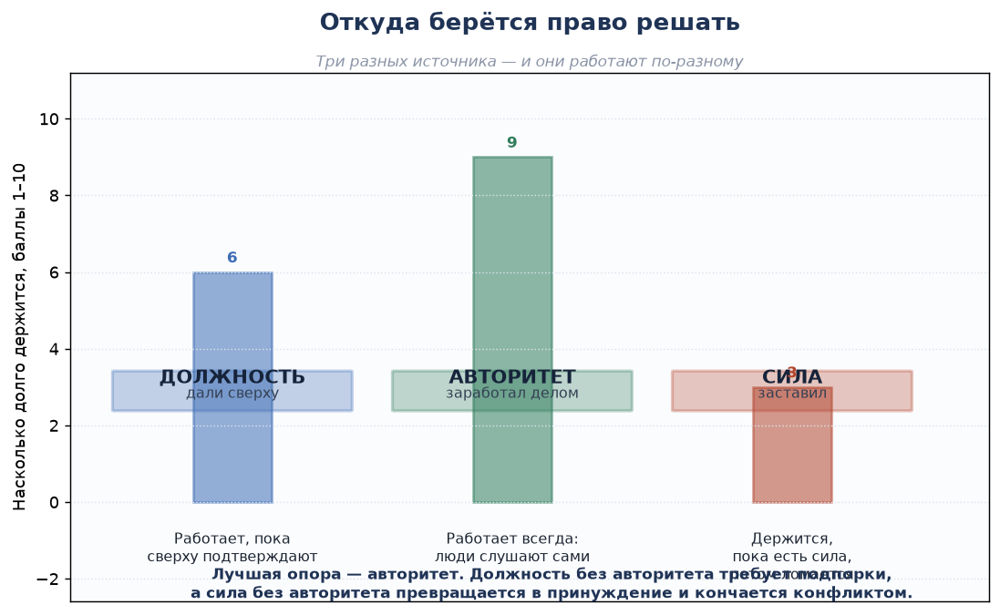

| Источник | Откуда берётся | Как работает | Сколько держится |
|---|---|---|---|
| **Должность** | Дали сверху: назначили главным | Работает, пока сверху подтверждают. Снимут — и всё | 6 из 10 |
| **Авторитет** | Заработал делом: человек сам построил, помог, разобрал спор | Работает всегда: люди слушают, потому что привыкли уважать | 9 из 10 |
| **Сила** | Заставил: у меня больше алмазов, больше людей, я главный | Держится, пока есть сила. Потом всё ломается сразу | 3 из 10 |

**Как объяснить:**

«Должность — это как ключ от амбара. Дали ключ — ты главный. Забрали ключ — ты никто. Поэтому на одну должность надеяться нельзя.

Авторитет — это когда ключа у тебя нет, а тебе всё равно открывают. Потому что знают: ты не обманешь, ты поможешь, ты разберёшь спор по справедливости. Авторитет зарабатывается месяцами, а теряется за один вечер — достаточно один раз предать или свалить вину на другого.

Сила — самая плохая опора. Сила работает быстро и выглядит эффектно. Но она не держится: как только сильный отходит, всё, что он держал, рассыпается. И ещё сила портит того, кто её применяет — человек перестаёт объяснять, потому что проще пригрозить».

**Пример.**

> **Шакал**: «Я главный, у меня три стека алмазной руды. Делайте, что сказал».
>
> **Копатель**: «И сколько ты так продержишься? Неделю? Пока руда не кончится?»
>
> **Марфа** (торговка): «А Гвоздь ничего не кричит. Просто приходит, когда у тебя обвал, и помогает разобрать. Ему и без алмазов верят».
>
> **Шакал**: «Ну и пусть верит. Мне главное, чтобы слушались».
>
> **Марфа**: «Слушаются и верят — разные вещи. Тебя слушаются, пока ты рядом. Ему верят, даже когда его нет».

**Разбор примера.** Шакал опирается на силу и рассчитывает, что её хватит. Марфа показывает: опора на помощь и справедливость работает дольше и дешевле.

**Вывод одной фразой:** *Должность дают, авторитет зарабатывают, силу терпят — и только до первого удобного случая.*

**Вопрос залу:** «Назовите человека на сервере, которого вы послушаете просто так, без всякой должности. … А теперь скажите — за что? Вот это и есть авторитет».

---

## Лекция 3. Как принять решение

**Скажите так:**

«А теперь — самое полезное на сегодня. Как принимать решение, чтобы потом не переделывать.

Большинство решений у нас принимаются так: что-то случилось — человек расстроился — человек решил. Быстро, но криво. А нужно пять шагов, и они занимают пять минут».

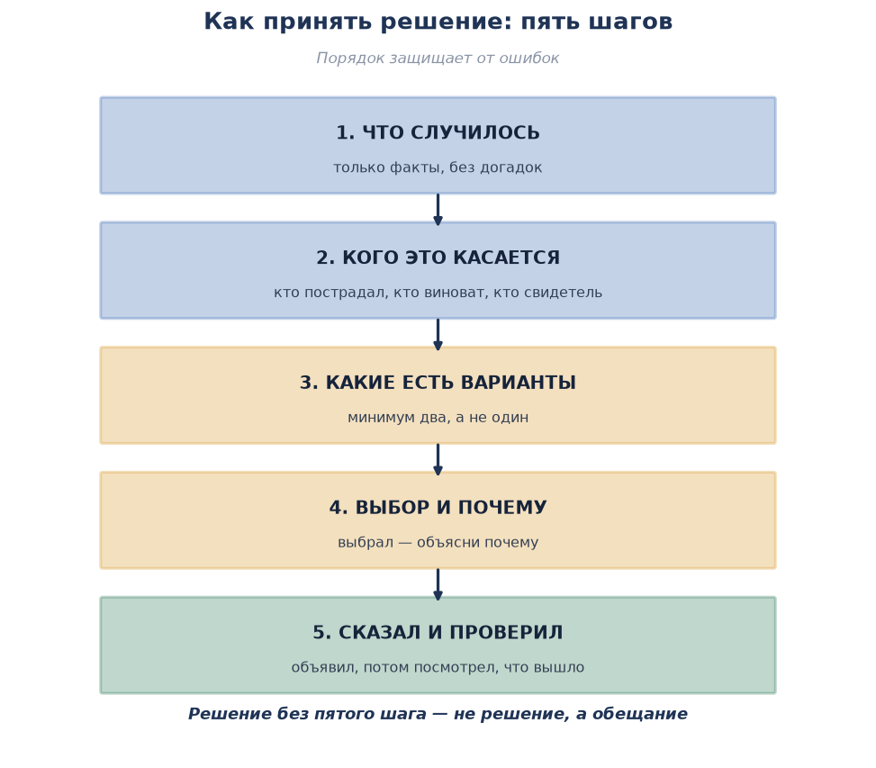

| Шаг | Что делаем | Частая ошибка |
|---|---|---|
| **1. Что случилось** | Собираем только факты | Мешаем факты и догадки: «я думаю, это он» |
| **2. Кого касается** | Кто пострадал, кто нарушил, кто видел | Забыли спросить свидетелей |
| **3. Варианты** | Придумываем минимум два | Решение одно — и сразу неверное |
| **4. Выбор** | Выбираем и объясняем почему | Выбрал, но не объяснил — люди не поняли |
| **5. Сказал и проверил** | Объявил решение, потом посмотрел, что вышло | Объявил и забыл |

**Как объяснить первый шаг:**

«Факт — это то, что можно проверить. "У Марфы пропали два стека железных слитков" — это факт. "Это сделал Шакал, он вчера крутился" — это догадка. Догадка не доказательство, хотя очень на неё похожа. Пока вы не отделили одно от другого, решения принимать нельзя».

**Как объяснить третий шаг:**

«Всегда придумывайте два варианта. Один вариант — это не выбор, это судьба. Два варианта — уже выбор. А когда их два, вы видите, чем один лучше другого, и можете объяснить людям почему».

**Пример.**

> **Факт**: на складе у спавна за ночь пропали инструменты. Трое человек говорят, что видели Шакала у склада вечером.
>
> **Вариант первый (быстрый)**: объявить Шакала вором и выгнать.
>
> **Вариант второй**: сначала спросить самого Шакала, сверить время, посмотреть, кто ещё заходил.
>
> **Гвоздь**: «Первый вариант мы примем за минуту. А если ошибёмся, человека потеряем навсегда — он не вернётся. Второй займёт вечер, но и ошибку исправить можно».
>
> **Проверка**: оказалось, Шакал приходил не воровать, а отнести свой долг — и инструменты унёс другой человек, который знал, что все подумают на Шакала.

**Разбор примера.** Факт (инструменты пропали, Шакал был у склада) не равен вине. Шаг «что случилось» отделил бы факт от догадки. Шаг «варианты» спас бы человека от незаслуженного изгнания.

**Вывод одной фразой:** *Сначала факты, потом варианты, потом объяснение вслух.*

**Вопрос залу:** «Кто-нибудь может привести случай, когда поспешили и ошиблись? … Что было бы, если бы потратили ещё пять минут?»

---

## Лекция 4. Какими должны быть правила

**Скажите так:**

«Правила нужны не для того, чтобы людей мучить. Они нужны, чтобы **не решать один и тот же спор каждый раз заново**. Представьте: каждый раз, когда кто-то кого-то ударил, мы собираемся и спорим час — можно было или нельзя. Правило избавляет от этого спора: написано — нельзя, значит нельзя.

Но правило работает, только если оно хорошее. У хорошего правила четыре признака».

**Четыре признака хорошего правила:**

| Признак | Как проверить | Пример плохого | Пример хорошего |
|---|---|---|---|
| **Понятно** | Любой новичок поймёт с первого раза | «Веди себя достойно» | «Не ломай чужие постройки» |
| **Исполнимо** | Человек может это сделать | «Никогда не спорь с главой» | «Спорь по делу, без мата и оскорблений» |
| **Проверяемо** | Видно, нарушил или нет | «Будь хорошим соседом» | «Ставь забор не ближе трёх блоков к чужому участку» |
| **Одинаково для всех** | Правило одно и для друга, и для врага | «Своим можно» | Правило не знает, кто свой |

**Как объяснить четвёртый признак:**

«Самое важное — одинаковость. Если правило работает для всех, кроме друзей главного, — это не правило, а издевательство. Люди очень быстро это видят. И после первого же случая "своим можно" остальные правила перестают работать: люди решают, что правила — это для лохов, а настоящая жизнь по понятиям.

Поэтому самый быстрый способ убить порядок — один раз не наказать своего».

**Пример.**

> **Рысь**: «Правило есть: за кражу — штраф двойной стоимостью. У Сани украли, у него украли — вопрос в том, что вор — мой друг».
>
> **Гвоздь**: «И что?»
>
> **Рысь**: «Ну… жалко его. Он впервые».
>
> **Гвоздь**: «Впервые — так и скажи: впервые, поэтому только предупреждение. Но если ты просто ничего не сделаешь, потому что он твой друг, — завтра к тебе не придут со вторым спором. Придут с ножом. Потому что договорятся сами».

**Разбор примера.** Одинаковость не значит «всем одинаково строго». Одинаковость значит: **одинаковый подход** — смотрим на то же, что и у других (впервые или нет, признал или нет, вернул или нет), и объясняем решение вслух.

**Вывод одной фразой:** *Правило, которое не работает для друга главного, не работает ни для кого.*

**Вопрос залу:** «Назовите правило нашего сервера, которое понятно любому новичку. … А теперь — которое понимают только старики. Вот второе надо переписать».

---

# 2. ФРАКЦИИ

## Лекция 5. Что такое фракция

**Скажите так:**

«Фракция — слово красивое, но означает оно простую вещь: **группа людей, у которых общая цель и общие правила**. Всё.

Трое друзей, которые решили вместе строить город, — это фракция. Десять человек, которые решили торговать вместе, — тоже фракция. Двое, которые решили воевать со всеми, — тоже фракция, просто маленькая и глупая.

Из чего состоит фракция? Из четырёх вещей».

| Часть | Что это | Без чего фракция развалится |
|---|---|---|
| **Цель** | Зачем собрались | Без цели люди просто болтаются |
| **Люди** | Кто в группе | Без людей нет группы |
| **Правила** | Как живём, что можно | Без правил начинается спор за каждое место |
| **Руководитель** | Кто решает, когда спора не избежать | Без руководителя спор решает тот, кто громче |

**Как объяснить:**

«Посмотрите: цель есть — люди приходят. Правила есть — люди не ссорятся. Руководитель есть — спор решается за пять минут, а не за три дня.

И наоборот: нет правил — строят на одном месте три дома внахлёст. Нет руководителя — спорят неделю, пока не перестреляются или не разойдутся».

**Пример.**

> **Саня** (новичок): «Я хочу вступить к вам. Что у вас за фракция?»
>
> **Кирпич**: «Мы строим город у большой горы».
>
> **Саня**: «А правила какие?»
>
> **Кирпич**: «Правила… ну, веди себя нормально».
>
> **Саня**: «А кто главный?»
>
> **Кирпич**: «Никто. Мы все равные».
>
> **Через месяц**: Кирпич и двое других поссорились из-за участка у реки, разошлись, город остался недостроенным.

**Разбор примера.** Цель была (город), но правил не было («веди себя нормально» — не правило, каждый понимает по-своему), и руководителя не было, поэтому спор решил не тот, кто прав, а тот, кто громче.

**Вывод одной фразой:** *Фракция держится на четырёх вещах: цель, люди, правила, тот, кто решает спор.*

**Вопрос залу:** «У вашей группы есть цель, которую можно сказать одной фразой? … Если нет — люди не понимают, зачем они здесь».

---

## Лекция 6. Как живёт фракция: четыре стадии

**Скажите так:**

«У фракции, как у человека, есть возраст. И болезни у каждого возраста свои. Это важно понимать: то, что спасало группу в начале, её же и погубит в конце».

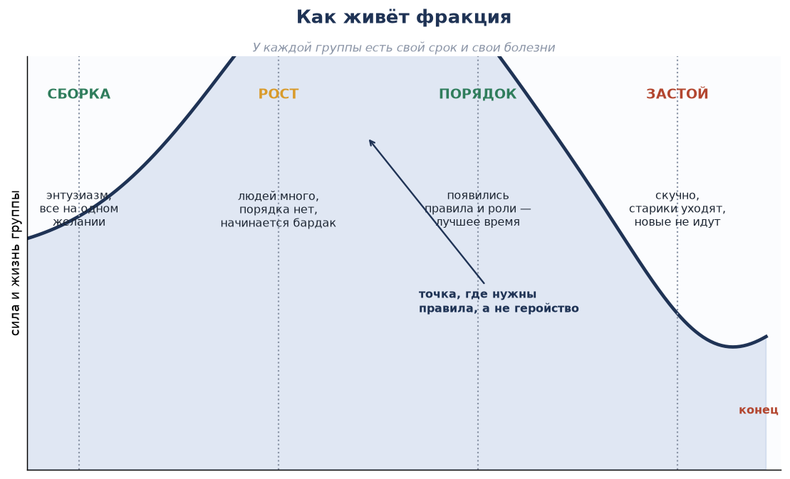

| Стадия | Что происходит | Главная опасность | Что делать |
|---|---|---|---|
| **Сборка** | Все горят идеей, работают бесплатно, спорят редко | Показалось, что так будет всегда | Записать цель и первые правила, пока все согласны |
| **Рост** | Людей много, порядка нет: все тащат, кто что умеет | Бардак: непонятно, кто что делает | Ввести роли и правила. Срочно |
| **Порядок** | Правила есть, роли понятны, споры решаются быстро | Почивать на лаврах | Держать правила и готовить замену |
| **Застой** | Скучно, всё построено, старики уходят, новые не идут | Смерть от скуки | Новая цель или честный роспуск |

**Как объяснить главное:**

«Самая важная точка — между ростом и порядком. Пока группа маленькая, она держится на энтузиазме. Как только людей становится больше десяти, энтузиазм перестаёт работать: человек приходит, а ему никто не сказал, что делать. И он уходит.

Именно в этот момент нужны **правила**, а не геройство. Не надо работать больше — надо написать, кто за что отвечает».

**Пример.**

> **Марфа**: «У нас было весело, когда нас было пятеро. Кто во что горазд. А сейчас двадцать человек, и половина просто стоит».
>
> **Гвоздь**: «А ты попробуй им сказать, что конкретно делать».
>
> **Марфа**: «Я пробовала. Говорю: помогайте. Они помогают — кто идёт копать, кто просто ходит рядом».
>
> **Гвоздь**: «Потому что "помогайте" — это не задача. Задача — это "ты, ты и ты: накопать двести блоков камня к вечеру, склад — третий сундук". Пять человек, которые знают, что делать, сделают больше, чем двадцать, которые не знают».

**Разбор примера.** Группа перешла из стадии сборки в рост, но правила остались на уровне «пятерых друзей». Ошибка не в людях, а в том, что управление не выросло вместе с группой.

**Вывод одной фразой:** *Пять человек с задачей сделают больше, чем двадцать без задачи.*

**Вопрос залу:** «На какой стадии ваша группа? … Если "рост", то вам нужны роли уже вчера».

---

## Лекция 7. Как фракциям быть друг с другом

**Скажите так:**

«Теперь — про то, как группам жить рядом. Отношения между фракциями — это не "дружим или воюем". Это шкала с пятью положениями. И двигаться по ней можно в обе стороны».

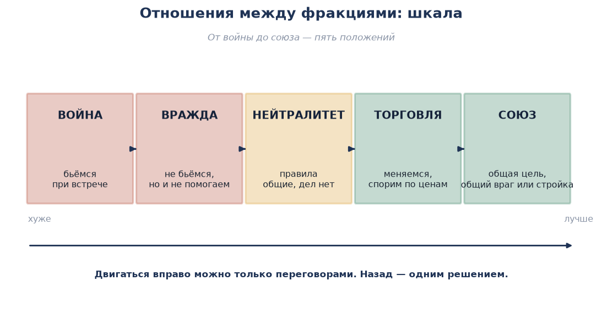

| Положение | Как выглядит | Что делать |
|---|---|---|
| **Война** | Бьёмся при встрече, урон разрешён | Воевать по правилам: объявили цель, срок, условия мира |
| **Вражда** | Не бьёмся, но и не помогаем | Зафиксировать границы и не провоцировать |
| **Нейтралитет** | Общие правила соблюдаем, дел вместе не имеем | Договориться о правилах на общей земле |
| **Торговля** | Меняемся, спорим по ценам | Записать цены и порядок обмена |
| **Союз** | Общая цель: стройка, защита, война с третьим | Записать, кто что даёт и кто за что отвечает |

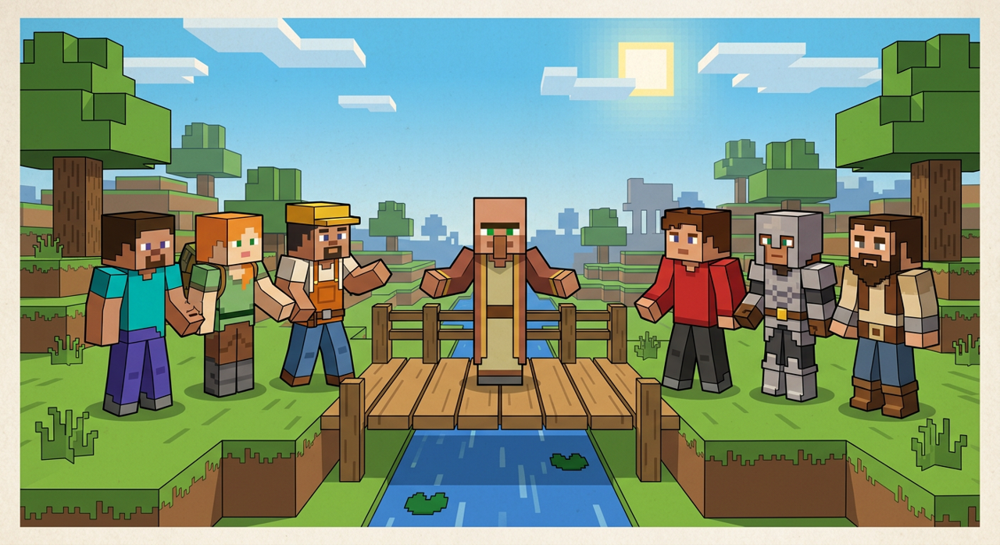

**Как объяснить:**

«Двигаться вправо — к миру и союзу — можно только переговорами. Назад, к войне, — одним решением, за секунду. Поэтому помните: **разрушить отношения легко, строить их долго**. Одна драка — и вы слетели с союза до вражды. А обратно — месяц разговоров.

И ещё: любой союз надо записывать. Не "мы договорились", а "мы, Кирпич и Марфа, договорились: я даю камень, она даёт еду, раз в неделю, по вторникам". Не записали — через неделю каждый помнит по-своему».

**Пример.**

> **Кирпич** (строители): «Мы хотим построить мост через реку. Он заденет край участка фермеров».
>
> **Фермеры**: «Мост нам не нужен, ещё затопчут грядки».
>
> **Гвоздь**: «Давайте так. Пишем: мост идёт по северному краю, строители ставят забор, ходят только по дорожке, за потоптанное — выплата. Фермеры получают право бесплатно возить по мосту. Подписали — и стройте».
>
> **Кирпич**: «А если кто-то из наших не будет соблюдать?»
>
> **Гвоздь**: «Тогда отвечаешь ты. Ты за своих отвечаешь — или не договаривайся».

**Разбор примера.** Нейтралитет превратился в торговлю и частичный союз через конкретные условия: что можно, что нельзя, кто платит, кто отвечает. Именно конкретика превращает «договорились» в работающий договор.

**Вывод одной фразой:** *Договор, который не записан, — это два разных договора, по одному в каждой голове.*

**Вопрос залу:** «С кем из соседей у вас нейтралитет и можно было бы торговать? … Что для этого нужно написать?»

---

## Лекция 8. Почему фракции распадаются

**Скажите так:**

«Теперь неприятная часть. Фракции умирают. Почти всегда — по одним и тем же причинам. Их пять».

| Причина | Как выглядит | Как заметить заранее | Что делать |
|---|---|---|---|
| **Цель пропала** | «А зачем мы вообще это строим?» | Люди перестали спрашивать «когда закончим» | Придумать новую цель или честно распуститься |
| **Правила разные для всех** | Другу главного можно, остальным нет | Первая же жалоба «а ему можно было» | Наказать своего — один раз, но сразу |
| **Руководитель тянет всё на себе** | Он пашет за десятерых, остальные смотрят | Он отвечает на все вопросы, никто другой не может | Раздать роли. Обязанность, а не просьба |
| **Нет замены** | Ушёл один человек — и всё встало | Все знания в одной голове | У каждого дела — второй человек, который умеет то же |
| **Группа закрылась** | Новые не приходят, старые уходят | Месяц без новичков | Принимать новичков и обучать |

**Как объяснить третью причину:**

«Руководитель, который тянет всё на себе, выглядит героем. На самом деле он готовит катастрофу. Почему? Потому что люди вокруг него ничему не учатся. Они привыкают, что "дядя сделает". А когда дядя уходит — насовсем или на неделю — выясняется, что никто ничего не умеет.

Поэтому раздавать дела — это не слабость. Это единственный способ, чтобы группа жила дольше одного человека».

**Пример.**

> **Марфа**: «Наша фракция умерла. Почему?»
>
> **Гвоздь**: «Где твой заместитель?»
>
> **Марфа**: «Какой заместитель? Я всё сама вела, пять месяцев, без выходных».
>
> **Гвоздь**: «И где ты сейчас?»
>
> **Марфа**: «Устала. Ушла на две недели. Вернулась — никого нет, все разбежались».
>
> **Гвоздь**: «Они не разбежались. Они просто не знали, что делать без тебя. Ты их пяти месяцам обучения не дала — ты всё делала сама».

**Разбор примера.** Причина смерти — не в людях и не в цели. Причина — в руководителе, который не оставил замены и не научил никого принимать решения.

**Вывод одной фразой:** *Если группа держится на одном человеке, она живёт ровно до его усталости.*

**Вопрос залу:** «Кто из вас уйдёт на неделю — и что встанет? Вот это и есть ваша главная дыра».

---

# 3. ПРОБЛЕМЫ УПРАВЛЕНИЯ

## Лекция 9. Десять ошибок руководителя

**Скажите так:**

«Собрал десять ошибок, которые совершают почти все — и я в том числе. Посмотрите на список. Уверяю, вы узнаете себя минимум в двух пунктах».

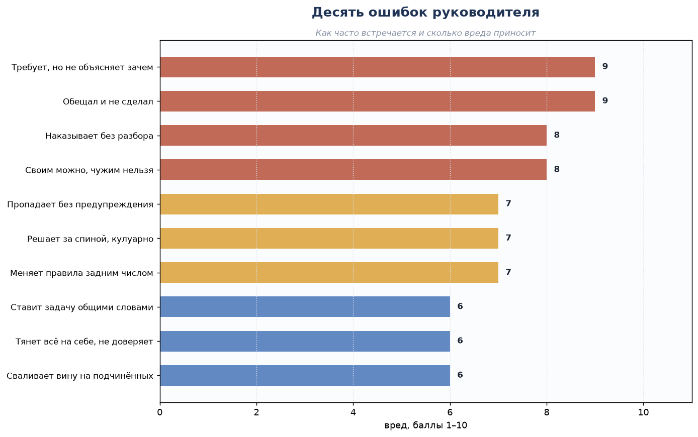

| Ошибка | Почему это плохо | Как делать правильно |
|---|---|---|
| **1. Требует, но не объясняет зачем** | Люди не понимают смысла и делают «для галочки» | Объясняйте зачем. Одна фраза решает |
| **2. Обещал и не сделал** | После второго раза вам не верят вообще | Обещайте только то, что точно сделаете. Не уверен — не обещай |
| **3. Наказывает без разбора** | Наказали не того — потеряли и его, и доверие остальных | Сначала факты и свидетели, потом решение |
| **4. Своим можно, чужим нельзя** | Все правила перестают работать в тот же день | Одинаковый подход. Своего наказывать тяжело, но нужно |
| **5. Пропадает без предупреждения** | Группа встала, вопросы висят | Сказал: «уезжаю на неделю, вместо меня — такой-то» |
| **6. Решает за спиной, кулуарно** | Люди уверены, что решение несправедливое, даже если оно верное | Решение объявляется вслух и с объяснением |
| **7. Меняет правила задним числом** | Нельзя наказывать за то, что не было запрещено | Правило действует с момента объявления |
| **8. Ставит задачу общими словами** | «Сделай нормально» — каждый понимает по-своему | Задача: что, сколько, к какому сроку, как проверим |
| **9. Тянет всё на себе** | Люди не учатся, группа гибнет без него | Раздать роли и проверять |
| **10. Сваливает вину на подчинённых** | Авторитет теряется за один вечер | Руководитель отвечает за своих. Вслух — особенно |

**Как объяснить вторую ошибку:**

«Обещания — это валюта руководителя. Сказал и сделал — доверие растёт. Сказал и не сделал — доверие падает, и не на одну ступень, а сразу на несколько. Промолчать и не обещать — нейтрально. Обещать и не сделать — минус.

Правило простое: **не уверен — не обещай**. Скажите "постараюсь" или "узнаю и скажу во вторник" — это не обещание, это договорённость о сроке. И её вы выполните".

**Как объяснить седьмую ошибку:**

«Правила не работают назад. Если сегодня запретили строить у реки, нельзя наказывать человека, который построил там в прошлом месяце. Ему можно сказать: "перенеси, даю неделю". Но штрафовать — нельзя. Люди это очень хорошо чувствуют: наказание за то, что не было запрещено, воспринимается как произвол, даже если само правило правильное».

**Пример.**

> **Рысь**: «Я не понимаю, почему от меня все ушли. Я же для них старался!»
>
> **Гвоздь**: «Ты обещал им общий склад. Где склад?»
>
> **Рысь**: «Ну… не успел».
>
> **Гвоздь**: «Второй раз не успел. Ты им обещал ещё в апреле. А ещё: ты в мае наказал Копателя за то, что он строил у реки, — а правило про реку ты написал в июне».
>
> **Рысь**: «Но он же мешал!»
>
> **Гвоздь**: «Может, и мешал. Но ты наказал за правило, которого тогда не было. Для него это произвол. А для остальных — сигнал: тут наказывают за то, что не запрещено. Угадай, почему они ушли».

**Разбор примера.** Две ошибки из списка — обещание без выполнения и правило задним числом — сложились в потерю людей.

**Вывод одной фразой:** *Доверие копится месяцами и тратится за один вечер.*

**Вопрос залу:** «Какая ошибка из десяти — ваша? … Назовите вслух. Признать — уже половина исправления».

---

## Лекция 10. Конфликт: как его разобрать

**Скажите так:**

«Конфликт — это нормально. Плохо не то, что люди спорят. Плохо, когда спор не разобран, и люди расходятся, каждый при своём. Неразобранный конфликт не исчезает — он зреет и возвращается через месяц втрое хуже.

Поэтому разбирать надо быстро и по одному и тому же порядку. Пять шагов».

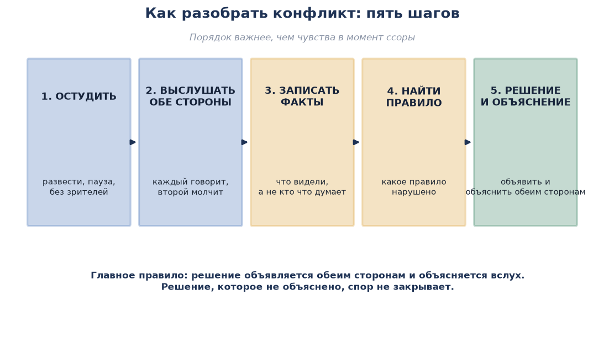

| Шаг | Что делаем | Как сказать |
|---|---|---|
| **1. Остудить** | Развести стороны, дать паузу, убрать зрителей | «Спокойно. Сейчас разберёмся. Разойдитесь на пять минут» |
| **2. Выслушать обе стороны** | Каждый говорит, второй молчит. Не перебивать | «Говори ты. Ты молчишь, потом скажешь» |
| **3. Записать факты** | Что видели, а не кто что думает | «Кто ещё это видел? Что именно произошло?» |
| **4. Найти правило** | Какое правило нарушено или чего не хватает | «Какое правило здесь работает?» |
| **5. Решение и объяснение** | Объявить обеим сторонам и объяснить почему | «Решение такое. Почему — объясняю» |

**Как объяснить первый шаг:**

«Пока люди горячие, разбирать бесполезно: они слышат не слова, а обиду. Дайте паузу — пять-десять минут, а иногда и до следующего дня. И обязательно уберите зрителей: при зрителях никто не может признать неправоту, потому что это "проигрыш". Один на один человек признаёт ошибку. При толпе — никогда».

**Как объяснить четвёртый шаг:**

«Если правила нет, его надо придумать — прямо сейчас, во время разбора. И объявить: "раньше правила не было, поэтому наказывать не буду, но с сегодняшнего дня правило такое-то". Это честно, и люди это принимают».

**Пример.**

> **Спор**: Копатель поставил забор, Зот говорит, что забор на его земле.
>
> **Гвоздь**: «Спокойно. Сначала ты, Копатель: что и где ставил. Зот, ты молчишь».
>
> **Копатель**: «Ставил по метке, которую ты сам в марте ставил».
>
> **Гвоздь**: «Зот, теперь ты».
>
> **Зот**: «Метку я ставил, но потом границу сдвинули, когда реку копали».
>
> **Гвоздь**: «Факты: метка есть, а границу сдвинули и нигде не записали. Правила про это нет. Решение: границу записываем сейчас, забор переносим на два блока, переносит тот, кто границу сдвинул и не записал, — то есть я. Объясняю почему: кто меняет границу, тот и записывает. С сегодняшнего дня это правило».

**Разбор примера.** Пять шагов: остудил, выслушал по очереди, записал факты (метка есть, сдвиг не записан), нашёл отсутствующее правило, объявил решение с объяснением — и, главное, показал, что правило действует на всех, включая его самого.

**Вывод одной фразой:** *Решение без объяснения спор не закрывает — человек уходит с обидой, а не с пониманием.*

**Вопрос залу:** «Кто-нибудь был в споре, который так и не разобрали? … Что осталось после него?»

---

## Лекция 11. Наказание: по лестнице и по справедливости

**Скажите так:**

«Наказание — самая тонкая часть. Ошибка здесь стоит дороже всего: можно потерять и человека, и доверие остальных.

Наказание нужно не для мести. Оно нужно для трёх вещей: **человек понял, остальные увидели, правило подтверждено**. Если после наказания этого нет — вы наказали зря».

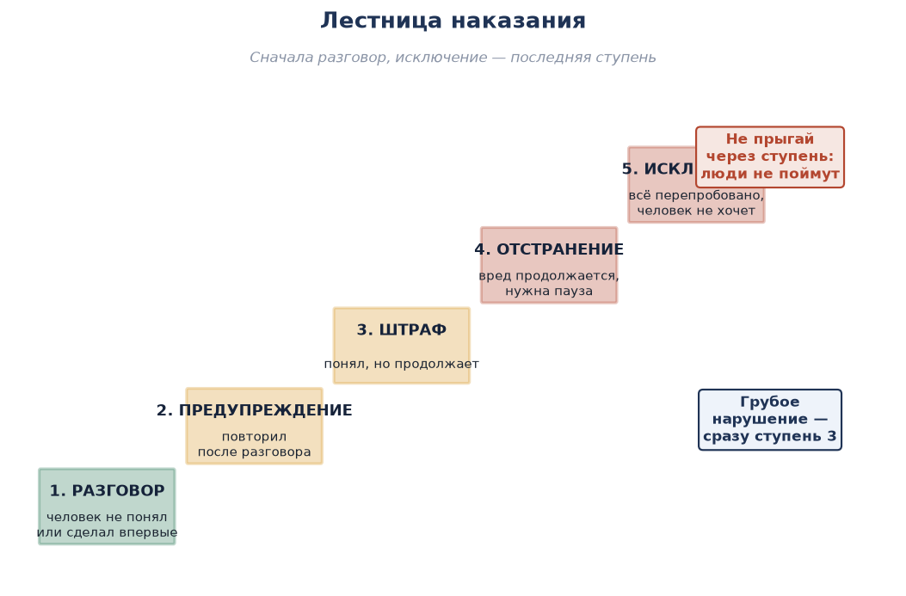

| Ступень | Когда | Пример |
|---|---|---|
| **1. Разговор** | Человек не понял или сделал впервые | «Слушай, ты поставил забор на чужом. Убери, пожалуйста» |
| **2. Предупреждение** | Повторил после разговора | Официальное предупреждение: записали, сказали срок |
| **3. Штраф** | Понял, но продолжает | Возмещение ущерба или штраф по правилам сервера |
| **4. Отстранение** | Вред продолжается, нужна пауза | Временно отстранён от должности или от общей стройки |
| **5. Исключение** | Всё перепробовано, человек не хочет | Уходит с сервера или из группы |

**Три правила лестницы:**

1. **Не прыгайте через ступень.** Если сразу за мелкое дали исключение — люди не поймут и перестанут верить вам.
2. **Грубое нарушение — сразу третья ступень.** Мат, оскорбление, угрозы, поджог, кража крупная — тут предупреждения не нужны, потому что человек всё понимал.
3. **Считайте три вещи:** впервые или нет, признал или нет, убрал последствия или нет. Три «да» — мягче, три «нет» — строже.

**Как объяснить соразмерность:**

«Наказание должно быть соразмерно. Сломал один блок — заставил починить и извиниться. Украл сундук — вернул двойне. Угрожал человеку — серьёзный разговор и предупреждение. Если за сломанный блок выгонять, вы скоро останетесь одни. Если за кражу сундука "пожурить", у вас будут красть каждый день.

Проверка простая: **объясните наказание вслух пострадавшему и нарушителю**. Если вы сами слышите, что звучит глупо, — значит, наказание несоразмерно».

**Пример.**

> **Тень** (молчун, впервые сломал чужую стену): «Я не знал, что это чья-то».
>
> **Рысь**: «Выгнать его, он стену сломал!»
>
> **Гвоздь**: «Стоп. Три вопроса. Впервые? Да. Признал? Да. Убрал последствия?»
>
> **Тень**: «Починил. Вот, смотрите».
>
> **Гвоздь**: «Тогда — разговор и починка. Записали: первый случай. Второй — предупреждение. Рысь, если бы ты сейчас выгнал человека, который всё признал и починил, завтра к тебе с поломкой не пришли бы — стали бы мстить молча».

**Разбор примера.** Соразмерность: ущерб мал, человек признал и исправил — наказание минимальное. При этом случай записан, то есть повтор уже не будет «впервые».

**Вывод одной фразой:** *Наказание не для мести, а для того, чтобы правило работало, а человек остался.*

**Вопрос залу:** «Вспомните случай, когда наказали слишком строго. Что было после? … А слишком мягко?»

---

## Лекция 12. Что делать, если руководитель не справляется

**Скажите так:**

«Тяжёлый вопрос, но обходить его нельзя. Что делать, если руководитель плохой? Или просто пропал?

Сначала разделим: есть три разных беды, и лечатся они по-разному».

| Беда | Как узнать | Что делать |
|---|---|---|
| **Не справляется** | Старается, но не выходит: задачи не ставит, путается, всё валится | Наставник, обучение, упростить задачи. Дать срок — месяц |
| **Не хочет** | Не появляется, не отвечает, обещания не выполняет | Прямой разговор. Нет результата — замена |
| **Вредит** | Обманывает, ворует, свои интерес выше правил | Снимать сразу. Без обсуждений и сроков |

**Как объяснить разницу:**

«"Не справляется" и "не хочет" выглядят одинаково: результата нет. Но лечатся по-разному. Тот, кто не справляется, рад помощи. Тот, кто не хочет, помощь воспринимает как посягательство и злится. Проверка простая: предложите помощь и посмотрите на реакцию. Обрадовался — значит, надо учить. Обиделся — значит, не хочет».

**Порядок действий (если вы снизу):**

1. **Сначала сказать ему лично**, а не в чате. При людях — значит унизить, и он пойдёт в глухую оборону.
2. **Говорить про дело, а не про личность.** Не «ты плохой», а «задачи нет третью неделю, люди простаивают».
3. **Предложить решение, а не просто пожаловаться.** «Давай я возьму учёт, а ты — стройку».
4. **Если не помогло — идти к тем, кто выше.** Не «жаловаться», а «ставить вопрос»: «вот факты, вот что пробовали, вот что предлагаю».
5. **Не поднимать бунт.** Люди, которые скидывают руководителя криком, на следующий день скинут и вас.

**Порядок действий (если вы и есть руководитель):**

| Что сделать | Зачем |
|---|---|
| Назначить заместителя и научить его | Чтобы группа не встала, если вы уедете |
| Сказать заранее, когда уезжаете | Пропажа без предупреждения — ошибка номер пять |
| Раз в месяц спрашивать: «что мне делать по-другому?» | Услышать раньше, чем люди уйдут |
| Признать ошибку вслух | Признанная ошибка почти не вредит авторитету |

**Пример.**

> **Саня**: «Наш главный пропал. Третья неделя. Что делать?»
>
> **Гвоздь**: «А вы ему писали?»
>
> **Саня**: «В чате писали. Он не отвечает».
>
> **Гвоздь**: «В чате не считается. Напиши лично, спокойно: "Иван, мы стоим третью неделю, нужны задачи. Если не можешь — скажи, найдём другого". Одно сообщение, без упрёков».
>
> **Через день**: главный отвечает — заболел, дел вести не может, просит передать группу.
>
> **Гвоздь**: «Видишь? Он не враг, он просто молчал. А если бы вы в чате устроили голосование "кто вместо", он бы обиделся и начал бы воевать за место».

**Разбор примера.** Прямой личный разговор решил то, что публичное обсуждение превратило бы в войну.

**Вывод одной фразой:** *Сначала скажи лично и про дело; только потом — наверх и по фактам.*

**Вопрос залу:** «У кого был опыт, когда руководитель пропал? Что вы сделали и что вышло?»

---

# 4. ЮРИДИЧЕСКАЯ ЭТИКА

## Лекция 13. Правило, закон, справедливость

**Скажите так:**

«Слово "юридический" звучит страшно, а означает оно просто: **как решать споры по правилам, а не по силе**. Вот и всё.

Закон, правило, устав — это одно и то же по сути: заранее записанная договорённость, как мы поступаем в спорной ситуации. Разница только в том, на сколько людей она распространяется».

| Понятие | По-простому | Пример на сервере |
|---|---|---|
| **Правило** | Договорились и записали | «Не ломай чужие постройки» |
| **Закон** | Правило для всех, а не для группы | Правила сервера, за нарушение — бан |
| **Договор** | Правило для двоих-троих | «Я даю камень, ты даёшь еду, по вторникам» |
| **Справедливость** | Одинаковый подход к одинаковым случаям | За одно и то же — одно и то же наказание |
| **Ответственность** | За последствия отвечает тот, кто сделал | Сломал — почини и верни |

**Как объяснить, зачем нужны правила:**

«Правила нужны не для наказания. Они нужны, чтобы **спор решался быстро и одинаково**. Без правил каждый спор решается заново: кто громче, у кого больше друзей, кто дольше играет. С правилами — одинаково для всех.

Проверьте на себе. Вспомните спор, который длился три дня. Почти наверняка в нём не было правила, по которому можно было решить. Или правило было, но непонятное».

**Три вопроса к любому правилу:**

1. **Оно объявлено заранее?** Нельзя наказывать за то, что не было запрещено.
2. **Оно понятно новичку?** Если новичок не понимает — правила нет.
3. **Оно работает для всех?** Проверка: применили бы вы его к своему другу?

**Пример.**

> **Шакал**: «Правила — это для слабых. Сильный сам решает».
>
> **Гвоздь**: «Хорошо. Ты сильный. Пришёл другой, сильнее тебя. Он решил, что твой дом — теперь его. Ты пойдёшь разбираться?»
>
> **Шакал**: «Пойду. И верну».
>
> **Гвоздь**: «А если он сильнее?»
>
> **Шакал**: «Ну… тогда соберу людей».
>
> **Гвоздь**: «Вот ты и собрал совет — то есть правило. Ты сам только что построил правило: решения принимает не один сильный, а те, кого собрали. Так почему бы не записать его заранее, пока дом ещё твой?»

**Разбор примера.** Правила защищают в первую очередь тех, кто слабее. Сильный может обойтись без правил ровно до встречи с более сильным.

**Вывод одной фразой:** *Правила — это защита слабого от сильного; сильный защищает себя сам, но только до встречи с тем, кто сильнее.*

**Вопрос залу:** «Какое правило нашего сервера защищает вас лично? … А какое вы не понимаете до конца?»

---

## Лекция 14. Справедливость: четыре вопроса перед решением

**Скажите так:**

«Справедливость — это не "по-доброму" и не "пожалеть". Справедливость — это **одинаковый подход и проверенные факты**.

Прежде чем наказать человека, ответьте на четыре вопроса. Если хоть на один ответ "не знаю" — решения принимать нельзя».

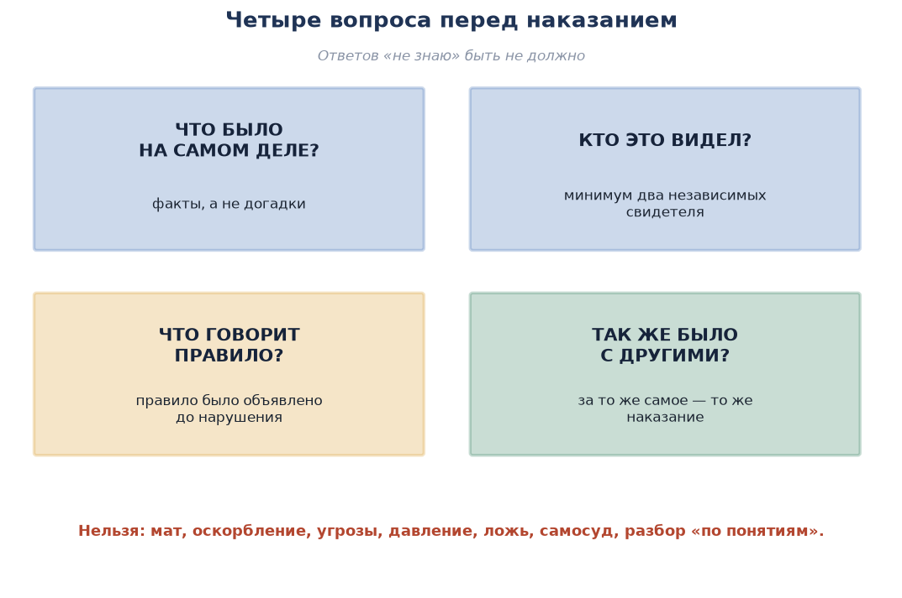

| Вопрос | Что проверяем | Почему это важно |
|---|---|---|
| **Что было на самом деле?** | Факты, а не догадки | Догадка похожа на факт, но ошибка стоит человека |
| **Кто это видел?** | Минимум два независимых свидетеля | Один человек может ошибаться или врать |
| **Что говорит правило?** | Правило было объявлено до нарушения | Нельзя наказывать за несуществующее правило |
| **Так же было с другими?** | Сравните с похожими случаями | Одинаковые случаи — одинаковое решение |

**Как объяснить второй вопрос:**

«Один свидетель — это не доказательство. Человек мог ошибиться, мог не так понять, мог быть заинтересован. Два независимых свидетеля — это уже проверка. Независимых — значит, они не друзья и не сговорились.

Если свидетель один, а других нет — решение отложите. Лучше не наказать виноватого, чем наказать невиновного. Невиновный не вернётся, а виноватый ещё попадётся».

**Как объяснить четвёртый вопрос:**

«Самый недооценённый вопрос. Перед тем как решить, спросите: а был ли у нас похожий случай, и что мы тогда решили? Если тогда простили, а теперь наказываем, — объясните разницу вслух. Разница может быть (впервые против повторного, признал против запирательства), но она должна быть названа.

Если разницы нет, а решение разное, — это и есть несправедливость, даже если вы очень старались».

**Пример.**

> **Случай**: у Марфы пропали слитки. Подозревают Сашу.
>
> **Гвоздь**: «Что видели?»
>
> **Марфа**: «Саня видел, как он заходил».
>
> **Гвоздь**: «Один свидетель. Второй есть?»
>
> **Марфа**: «Нет. Но Саня точно видел!»
>
> **Гвоздь**: «Я верю, что он видел, как человек заходил. Но "заходил" и "украл" — разные вещи. Пока второго свидетеля или вещественного следа нет — решения не будет. Искать будем, но обвинять — нет».

**Разбор примера.** Факт (человек заходил) не равен вине (человек украл). Пока нет второго подтверждения, решение откладывается.

**Вывод одной фразой:** *Лучше не наказать виноватого, чем наказать невиновного: первый попадётся ещё, второй не вернётся.*

**Вопрос залу:** «Был ли у вас случай, когда обвинили не того? Что было потом?»

---

## Лекция 15. Этика спора: что можно и чего нельзя

**Скажите так:**

«Последняя лекция этого блока — про то, как спорить. Потому что спор у нас есть каждый день, а правил спора почти никто не знает.

Запомните границу: **спорить можно о деле, а не о личности**. Как только спор перешёл на личность, он перестал быть спором и стал войной».

| Можно | Нельзя |
|---|---|
| Спорить о деле: что случилось, кто прав по правилам | Мат, оскорбления, унижение |
| Требовать объяснения решения | Угрозы: «я тебя найду», «ты пожалеешь» |
| Приводить свидетелей и факты | Выдумывать факты и приписывать слова |
| Признать, что был не прав | Давление числом: «нас десять, ты один» |
| Попросить паузу, если закипел | Разбираться «по понятиям»: самосуд, месть, поджог |
| Обратиться к третьему, кто разберёт | Давить на человека сверху: «я тебя исключу» |

**Как объяснить про мат и оскорбления:**

«Мат в споре — это не "крепкое слово". Это способ показать, что вы больше не спорите, а воюете. После первого мата человек уже не слышит аргументов, он слышит угрозу. Спор закрыт, разбирательство не состоялось.

Поэтому правило простое: **в споре мат запрещён**. Не потому, что мы против крепких выражений, а потому что мат превращает разбирательство в драку».

**Как объяснить про давление и самосуд:**

«Самосуд — это когда человек решает сам: "я знаю, кто виноват, и накажу сам". Он может быть прав на все сто процентов. Но он всё равно сделал хуже: он показал всем, что правила можно обойти. После первого самосуда правила не работают — каждый начнёт наказывать сам.

Поэтому: **наказание налагает только тот, кто на это уполномочен**. Остальные — собирают факты и передают».

**Три приёма, чтобы спор не сорвался:**

1. **Пауза.** Закипел — скажите: «давай через десять минут». Это не слабость, это управление собой.
2. **Возврат к делу.** «Мы сейчас не про то, кто какой. Мы про то, что случилось со складом».
3. **Признание части.** «В этом ты прав, а в этом — нет». Признанная часть снимает половину накала.

**Пример.**

> **Шакал**: «Да ты вообще ничего не понимаешь, иди отсюда!»
>
> **Рысь**: «Стоп. Мы о деле или обо мне?»
>
> **Шакал**: «О тебе! Ты всё испортил!»
>
> **Рысь**: «Тогда разговор окончен. Когда будешь готов говорить про склад — приходи. Не про склад — не надо».
>
> **Через десять минут**: Шакал возвращается: «Ладно. Склад — я зашёл позже всех, дверь была открыта. Но я не брал».
>
> **Рысь**: «Вот теперь спор есть. Разбираем».

**Разбор примера.** Рысь не ответил на оскорбление, вернул разговор к делу и дал паузу. Спор из войны превратился в разбирательство.

**Вывод одной фразой:** *Спорят о деле, а не о личности; как только перешли на личность — разбирательство провалено.*

**Вопрос залу:** «Кто умеет первым остановиться в споре? … Это ценнее, чем умение спорить».

---

# 5. ЛЕКСИКА: ОБЩИЕ СЛОВА ПРОСТЫМИ СЛОВАМИ

## Лекция 16. Словарь: что всё это значит на самом деле

**Скажите так:**

«Сейчас будет скучный, но самый полезный кусок. Слова. Почему это важно: когда мы называем вещи по-разному, мы не можем договориться. Один говорит "ответственность", другой слышит "накажут". И всё — разговор рассыпался.

Поэтому давайте договоримся о словах. Я буду говорить просто, а вы перебивайте, если что-то непонятно. Договорились?»

### 16.1. Слова про управление

| Слово | По-простому | Пример |
|---|---|---|
| **Управление** | Делать так, чтобы люди делали общее дело и не перессорились | Распределил, кто копает, кто строит |
| **Цель** | Того, чего хотим добиться, — одним предложением | «Амбар к субботе» |
| **Задача** | Конкретное дело: что, сколько, к какому сроку | «Накопать двести камня к вечеру» |
| **Решение** | Выбор из двух и больше вариантов | Взяли северный берег, а не южный |
| **Ответственность** | За последствия отвечает тот, кто решил | Решил ты — отвечаешь ты |
| **Полномочие** | Право решать в своей зоне | Главный стройки решает, где ставить стены |
| **Делегирование** | Отдал дело другому — вместе с правом решать | Не «помогай мне», а «ты за склад» |
| **Проверка** | Посмотреть, что получилось | Пришёл, посчитал, сверил |
| **Отчётность** | Рассказал вслух, что сделал | Раз в неделю — три строчки в чат |
| **Прозрачность** | Решения видны и объяснены | Решение объявлено вслух с причиной |
| **Преемник** | Человек, который заменит, если вы ушли | Заместитель, который умеет то же |
| **Застой** | Всё работает, но скучно, и новые не приходят | Построили город и сидим |

### 16.2. Слова про правила и споры

| Слово | По-простому | Пример |
|---|---|---|
| **Правило** | Заранее записанная договорённость | «Не ломай чужое» |
| **Факт** | То, что можно проверить | «Двух сундуков нет» |
| **Догадка** | То, что кажется, но не проверено | «Кажется, это Шакал» |
| **Свидетель** | Кто видел своими глазами | «Я стоял рядом и видел» |
| **Доказательство** | Факт, который подтверждён дважды | Два свидетеля или запись |
| **Подозрение** | Мы думаем, что человек причастен | Пока не проверено — не вина |
| **Невиновность** | Пока не доказано — человек не виноват | Лучше отпустить виноватого, чем наказать невиновного |
| **Прецедент** | Случай, на который потом ссылаются | «В прошлый раз за это простили» |
| **Наказание** | Последствие за нарушение | От разговора до исключения |
| **Соразмерность** | Наказание по размеру проступка | Сломал блок — починил, а не выгнали |
| **Произвол** | Решение без правила и объяснения | «Потому что я так сказал» |
| **Самосуд** | Наказал сам, без права на это | Сжёг дом обидчика |
| **Апелляция** | Просьба пересмотреть решение | «Посмотрите ещё раз, есть новые факты» |
| **Конфликт интересов** | Человек решает дело, где ему самому выгодно | Судит спор, где замешан друг или выгода |
| **Медиатор** | Третий, кто помогает договориться | Позвали Гвоздя — он разобрал |

### 16.3. Слова про речь и спор

| Слово | По-простому | Пример |
|---|---|---|
| **Риторика** | Умение говорить так, чтобы тебя поняли | Не «красиво говорить», а «доходчиво» |
| **Аргумент** | Причина, почему вы так считаете | «Потому что правило было объявлено» |
| **Тезис** | Главная мысль одной фразой | «Правило работает для всех» |
| **Возражение** | Несогласие с причиной | «А если человек впервые?» |
| **Компромисс** | Оба уступили понемногу | Мост севернее, забор за ваш счёт |
| **Консенсус** | Все согласны, хоть и не на все сто | Спорили час и сошлись |
| **Обратная связь** | Сказали человеку, что у него вышло | «Сделал хорошо, но срок сорвал» |
| **Критика** | Разбор дела, а не личности | «Задача не поставлена», а не «ты никчёмный» |
| **Репутация** | Что о вас думают, когда вас нет рядом | Долго копится, быстро теряется |
| **Этика** | Что в споре и деле можно, а что нельзя | Мат и угрозы — нельзя |

**Как объяснить главное:**

«Обратите внимание: почти каждое умное слово означает простую вещь. "Делегирование" — это "отдал дело вместе с правом решать". "Прозрачность" — "решение объявили вслух и объяснили". "Прецедент" — "как было в прошлый раз".

Если вы выступаете перед людьми и видите, что глаза потухли, — значит, вы сказали умное слово. Остановитесь и переведите. Не стыдно объяснять просто: стыдно говорить так, чтобы никто не понял».

**Пример.**

> **Саня**: «Я слышал, у нас там конфликт интересов случился?»
>
> **Марфа**: «Проще говоря: Кирпич решал спор, в котором одна сторона — его брат».
>
> **Саня**: «И что, нельзя?»
>
> **Марфа**: «Можно, если он об этом скажет вслух и отведёт себя. А если промолчит и решит в пользу брата — всё, правилам конец».

**Вывод одной фразой:** *Умное слово — это короткая запись простой мысли; если мысли нет, слово ничего не спасёт.*

**Вопрос залу:** «Какое слово из списка вы слышали, но не понимали до конца? Давайте переведём прямо сейчас».

---

## Лекция 17. Как сказать, чтобы поняли

**Скажите так:**

«Одна и та же мысль может прозвучать тремя способами: грубо, обыкновенно и по-человечески. И от этого зависит, будет разговор или драка».

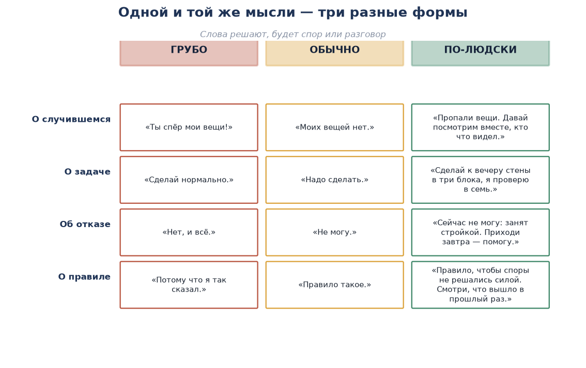

| Грубо | Обычно | По-человечески |
|---|---|---|
| «Ты спёр мои вещи!» | «Моих вещей нет». | «Пропали вещи. Давай посмотрим вместе, кто что видел». |
| «Сделай нормально». | «Надо сделать». | «Сделай к вечеру стены в три блока, проверю в семь». |
| «Нет, и всё». | «Не могу». | «Сейчас занят стройкой. Приходи завтра — помогу». |
| «Потому что я так сказал». | «Правило такое». | «Правило, чтобы споры не решались силой. Смотри, что вышло в прошлый раз». |

**Четыре правила понятной речи:**

1. **Короче.** Фраза длиннее двух строк не читается и не слушается. Сказали — остановились.
2. **Конкретнее.** Не «помоги», а «отнеси двадцать блоков к складу». Не «скоро», а «к семи вечера».
3. **Про действия, а не про качества.** Не «будь ответственным», а «проверь склад перед сном».
4. **Без обвинений.** Не «ты украл», а «вещей нет, давай разберёмся». Обвинение включает защиту, и человек перестаёт слышать.

**Пять слов-кирпичей, которые ломают разговор:**

| Слово | Почему ломает | Чем заменить |
|---|---|---|
| **«Ты всегда…» / «Ты никогда…»** | Обобщение: человек сразу защищается | «В этот раз…» |
| **«Все знают…»** | Ничего не доказывает, звучит как давление | «Я знаю вот что…» |
| **«Я же говорил!»** | Унижение после ошибки | «Что теперь сделаем?» |
| **«Потому что я так сказал»** | Отказ объяснять — конец авторитету | Объяснение одной фразой |
| **«Да ты сам…»** | Переход на личность — спор закрыт | «Вернёмся к делу» |

**Пример.**

> **Копатель** (подходит к Зоту): «Ты вечно ломаешь мои постройки!»
>
> **Зот**: «Я? Вечно? Я один раз зацепил стену, когда копал!»
>
> **Копатель**: «Все знают, что ты…»
>
> **Зот**: «Да ты сам…»
>
> **Гвоздь** (подходит): «Стоп. Копатель, попробуй ещё раз, но про дело и про один раз».
>
> **Копатель**: «Ладно. Вчера у меня обвалилась стена там, где ты копал. Давай посмотрим».
>
> **Зот**: «Давно бы так. Пошли, я и правда копал рядом».

**Разбор примера.** Одна и та же ситуация: «ты вечно» — война, «вчера обвалилась стена там, где ты копал» — разбирательство. Меняется не суть, а форма.

**Вывод одной фразой:** *Говорите про один случай и про действие — и половина споров закончится до начала.*

**Вопрос залу:** «Возьмите свою последнюю жалобу и переделайте её "по-человечески". Скажите вслух — почувствуете разницу».

---

# 6. РИТОРИКА: КАК ГОВОРИТЬ ПЕРЕД ЛЮДЬМИ

## Лекция 18. Как построить выступление

**Скажите так:**

«Риторика — это не умение красиво говорить. Это умение, чтобы тебя поняли. Разница большая: красиво можно говорить так, что никто не поймёт.

Структура выступления простая. Запомните её один раз — и она будет работать всегда: на собрании, в споре, в объявлении в чате».

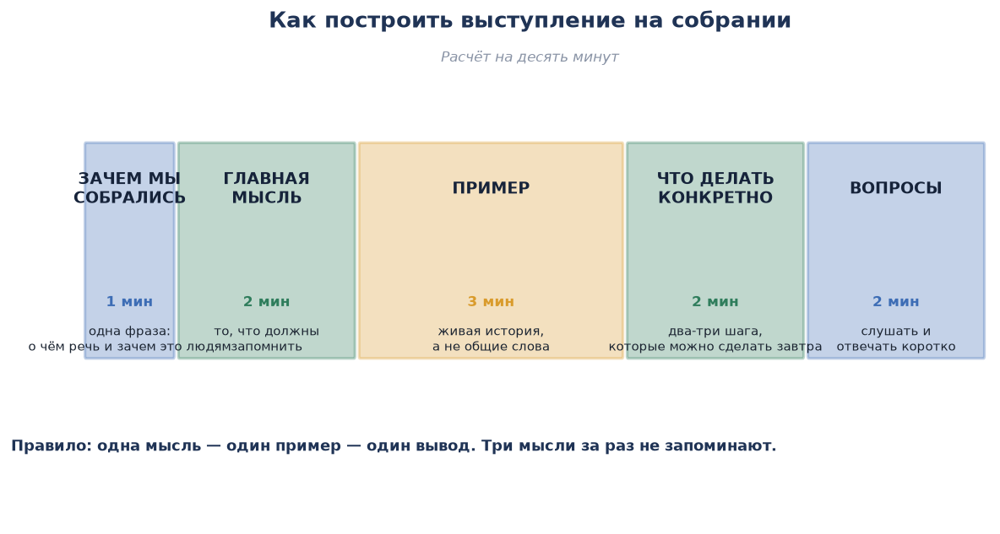

| Часть | Сколько | Что говорить |
|---|---|---|
| **Зачем собрались** | 1 минута | Одна фраза: о чём речь и почему это важно именно им |
| **Главная мысль** | 2 минуты | То, что должны запомнить. Одна мысль |
| **Пример** | 3 минуты | Живая история с людьми, а не общие слова |
| **Что делать** | 2 минуты | Два-три конкретных шага, понятных завтра утром |
| **Вопросы** | 2 минуты | Слушать и отвечать коротко |

**Пять приёмов, которые работают:**

1. **Повтор.** Главную мысль произнесите три раза: в начале, в середине и в конце. Люди запоминают то, что слышали трижды.
2. **Сравнение.** «Управление — это не приказы, это круг». Непонятное становится понятным через знакомое.
3. **Вопрос залу.** Задайте вопрос и сделайте паузу. Молчание в три секунды кажется вечностью — но именно тогда люди начинают думать.
4. **История.** Люди не помнят определения, но помнят истории. Одна история заменяет пять абзацев объяснений.
5. **Пауза.** Перед главной мыслью молчите секунду. Все поднимают голову. Это дешёвый и самый сильный приём.

**Как вести себя, если страшно:**

| Что делать | Как |
|---|---|
| Приготовить первую фразу наизусть | Самое трудное — начать. Первая фраза должна быть выучена |
| Смотреть на тех, кто кивает | Три-четыре дружелюбных лица — и вы говорите им, а не толпе |
| Говорить короче, чем хочется | Лучше недоговорить: вас позовут ещё |
| Держать в руках лист с тремя пунктами | Не текст, а три слова-опоры |
| Не извиняться за выступление | «Я плохо говорю…» — не надо. Начинайте сразу по делу |

**Пример плохого и хорошего начала.**

> **Плохо**: «Ну, я тут подготовил небольшое выступление про вопросы управления, может, кому-то будет интересно, я постараюсь коротко…»
>
> **Хорошо**: «Сегодня я отвечу на один вопрос: почему мы строим вместе три месяца и до сих пор не построили. Ответ короткий: у нас нет общих правил. Сейчас покажу, почему это и есть причина».

**Вывод одной фразой:** *Одна мысль, один пример, один вывод — и повторите мысль трижды.*

**Вопрос залу:** «Кто хочет попробовать? Выходите и скажите одну мысль за минуту. Остальные — слушаем и хлопаем».

---

## Лекция 19. Как отвечать на вопросы и возражения

**Скажите так:**

«Самое трудное в выступлении — не говорить, а отвечать. Потому что вопрос может быть неудобным, злым или не по теме. Но есть четыре приёма, и они закрывают почти всё».

**Пять типов вопросов — и что с ними делать:**

| Тип вопроса | Как звучит | Как отвечать |
|---|---|---|
| **По делу** | «А если человек впервые?» | Ответьте прямо и коротко. Это ваш лучший слушатель |
| **Уточняющий** | «То есть правило действует с сегодняшнего дня?» | Подтвердите: «Да, именно с сегодняшнего» |
| **Провокационный** | «А сам-то ты всегда по правилам?» | Признайте часть: «Не всегда. И вот что из этого вышло» |
| **Не по теме** | «А когда новый сезон?» | Отложите: «Хороший вопрос, отвечу после, отдельно» |
| **Злой** | «Ты вообще ничего не понимаешь!» | Верните к делу: «Давайте про склад. Что именно не так?» |

**Четыре приёма ответа:**

1. **Признать часть.** «В этом ты прав». Снимает половину накала и показывает, что вы не обороняетесь.
2. **Вернуть к делу.** «Мы сейчас не про то, кто какой. Мы про то, что случилось со складом».
3. **Отложить.** «Не знаю точно. Узнаю и скажу во вторник». Это не слабость — это ответственность.
4. **Попросить факт.** «Скажи, что именно видел. Запишем». Человек переходит от эмоции к фактам.

**Чего не надо делать:**

| Не надо | Почему |
|---|---|
| Оправдываться | Оправдание выглядит как слабость, даже когда вы правы |
| Отвечать на оскорбление оскорблением | Вы мгновенно теряете зал |
| Спорить с каждым | Если три человека не поняли — не поняли вы, а не они |
| Обещать сразу | Обещание без выполнения — ошибка номер два |
| Говорить «я уже отвечал» | Лучше повторить короче: люди правда не слышали |

**Пример.**

> **Шакал** (после выступления): «Всё это красиво, но ты сам в марте обещал склад и не построил!»
>
> **Гвоздь**: «Правда. Обещал и не построил — это моя ошибка, и она стоила нам двух человек».
>
> **Шакал** (растерян): «Ну… да».
>
> **Гвоздь**: «Поэтому я сегодня и говорю про обещания: не уверен — не обещай. Теперь твой вопрос по делу есть?»
>
> **Шакал**: «Есть. А кто за склад ответит теперь?»
>
> **Гвоздь**: «Кирпич. И он отчитается в воскресенье. Записали».

**Разбор примера.** Признание части сняло накал, вопрос превратился из атаки в дело, а ответ завершился конкретикой с ответственным и сроком.

**Вывод одной фразой:** *Признайте правду, верните разговор к делу, назовите ответственного и срок.*

**Вопрос залу:** «Задайте мне самый неудобный вопрос. Проверим приёмы на практике».

---

# 7. ГОТОВОЕ ВЫСТУПЛЕНИЕ НА ОБЩЕМ СОБРАНИИ

## 7.1. Сценарий собрания на сорок минут

| Что | Сколько | Как |
|---|---|---|
| **Открытие** | 2 минуты | Сказать, зачем собрались, и сразу назвать главный вопрос |
| **Выступление** | 12 минут | Текст ниже — с показом иллюстраций |
| **Разбор примера вместе с залом** | 8 минут | Взять реальный спор с сервера и разобрать по пяти шагам при всех |
| **Вопросы и возражения** | 10 минут | Отвечать по четырём приёмам из лекции 19 |
| **Упражнение** | 5 минут | Одно упражнение из раздела 9 |
| **Итог и договорённости** | 3 минуты | Что решили, кто ответственный, какой срок — записать при всех |

**Правило собрания:** в конце обязательно назвать **три вещи вслух** — что решили, кто отвечает, какой срок. Собрание без этого — просто разговор.

## 7.2. Текст выступления

> Расчётное время — 12 минут. Текст можно произносить почти дословно. В скобках — где показывать иллюстрации.

---

«Друзья, спасибо, что пришли. Соберусь коротко: зачем мы здесь?

Я хочу ответить на один вопрос. Мы играем вместе уже не первый месяц. Люди есть, желание есть, строим, воюем, торгуем. Но почти каждый месяц у нас одно и то же: кто-то обижается, кто-то уходит, кто-то спорит три дня из-за участка или сундука. И каждый раз всё решается заново — кто громче, у кого больше друзей, кто дольше на сервере.

Мой ответ: **потому что мы не договорились о правилах и не научились решать споры по правилам**. Всё остальное — следствие. Сегодня я расскажу, как это исправить. Расскажу просто, без умных слов. Если что-то непонятно — перебивайте сразу.

*(показать схему «Цикл управления»)*

Начну с главного. Управление — это не когда человек стоит сверху и командует. Командовать умеет каждый. Управление — это когда десять человек делают одно дело и не перессорились.

И ещё: управление — это не разовое решение, а круг. Цель. Решение. Дело. Проверка. Поправка. И снова по кругу. У нас почти всегда обрывается четвёртый шаг: мы побежали делать и так и бежим. Кто-то копает, кто-то строит, никто не считает, сколько надо и что вышло. В итоге работа была, а результата нет. Узнаёте?

*(показать схему «Откуда берётся право решать»)*

Второй вопрос: почему одних слушают, а других нет? У нас же бывает: один кричит, угрожает — и никто не шевелится. А другой скажет тихо — и все пошли.

Потому что право решать берётся из трёх мест. Должность — дали сверху. Авторитет — заработал делом. Сила — заставил. И работают они по-разному. Должность работает, пока сверху подтверждают. Сила держится, пока ты рядом. И только авторитет работает всегда: люди слушают, потому что привыкли — этот человек не обманет, поможет и разберёт спор по справедливости.

Я хочу, чтобы вы это запомнили: должность дают, авторитет зарабатывают. Авторитет копился месяцами, а теряется за один вечер — достаточно один раз предать или свалить вину на другого.

*(показать схему «Пять шагов решения»)*

Третье — самое полезное на сегодня. Как принимать решения, чтобы потом не переделывать. Пять шагов, и они занимают пять минут.

Первое: что случилось — только факты. Факт — это то, что можно проверить. «У Марфы пропал сундук» — факт. «Это сделал Шакал, он вчера крутился» — догадка. Догадка очень похожа на факт, но это не факт. Пока вы их не разделили, решения принимать нельзя.

Второе: кого это касается. Кто пострадал, кто нарушил, кто видел.

Третье: придумайте минимум два варианта. Один вариант — это не выбор, это судьба.

Четвёртое: выбрали — объясните почему. Решение без объяснения люди не принимают, даже если оно верное.

Пятое: объявили — проверьте, что вышло.

Решение без пятого шага — не решение, а обещание.

*(показать схему «Десять ошибок руководителя»)*

Теперь — про ошибки. Я собрал десять, и честно скажу: сам делал почти все.

Требует, но не объясняет зачем. Обещал и не сделал. Наказывает без разбора. Своим можно, чужим нельзя. Пропадает без предупреждения. Решает за спиной. Меняет правила задним числом. Ставит задачу общими словами. Тянет всё на себе. Сваливает вину на подчинённых.

Остановлюсь на двух.

Обещания — это валюта руководителя. Сказал и сделал — доверие растёт. Сказал и не сделал — падает сразу на несколько ступеней. Правило простое: не уверен — не обещай. Скажите «узнаю и отвечу во вторник». Это не обещание, это срок. И его вы выполните.

И вторая: «своим можно». Это самая опасная ошибка. Достаточно одного раза — не наказать своего, потому что жалко. Люди это видят мгновенно. И после этого все остальные правила перестают работать, потому что люди решают: правила — для лохов, а настоящая жизнь — по понятиям.

Хотите убить порядок — один раз не накажите друга. Больше ничего не нужно.

*(показать схему «Четыре вопроса перед наказанием»)*

Четвёртое — про справедливость. Справедливость — это не «по-доброму» и не «пожалеть». Справедливость — это одинаковый подход и проверенные факты.

Перед тем как наказать человека, ответьте на четыре вопроса. Что было на самом деле — факты или догадки? Кто это видел — есть ли два независимых свидетеля? Что говорит правило — и было ли оно объявлено до нарушения? И главное: так же было с другими?

Если хоть на один ответ «не знаю» — решения не принимаем.

Запомните: **лучше не наказать виноватого, чем наказать невиновного**. Виноватый попадётся ещё. Невиновный не вернётся.

И ещё: правила не работают назад. Нельзя наказывать за то, что не было запрещено. Правило действует с того дня, как его объявили.

*(показать схему «Как сказать»)*

Пятое — про слова. Одна и та же мысль звучит по-разному.

Можно сказать: «Ты спёр мои вещи». А можно: «Пропали вещи, давай посмотрим вместе, кто что видел». Первое — обвинение. После обвинения человек защищается и перестаёт слышать. Второе — разбирательство.

Можно сказать: «Сделай нормально». А можно: «Сделай к вечеру стены в три блока, я проверю в семь». В первом случае вы получите то, что получите. Во втором — стены.

Четыре правила: короче, конкретнее, про действия, и без обвинений. И выбросите пять слов, которые ломают любой разговор: «ты всегда», «ты никогда», «все знают», «я же говорил», «потому что я так сказал».

*(показать схему «Структура выступления»)*

И последнее. Почему я всё это говорю?

Потому что этот сервер — не только блоки. Это люди. И то, как мы друг с другом разговариваем, решает, будем ли мы здесь через год.

Что я предлагаю — три вещи, и все три простые.

Первое. Записать правила, по которым мы решаем споры. Не много — штук десять. Но чтобы они были понятны новичку и работали для всех, включая моих друзей.

Второе. У каждой общей стройки и у каждой группы — ответственный и срок. Не «все вместе», а конкретный человек и конкретный день.

Третье. Любой спор разбирается по пяти шагам, а решение объявляется вслух и объясняется. Не в личке, не за спиной, а вслух.

Я не прошу верить мне на слово. Давайте прямо сейчас возьмём один спор, который был на этой неделе, и разберём его вместе при всех. Посмотрим, работает или нет.

*(переход к разбору примера с залом)*

Кто готов рассказать, что случилось?»

---

## 7.3. Где показывать иллюстрации

| Минута | Иллюстрация | Что сказать в этот момент |
|---|---|---|
| 0:30 | `img/open_manage_loop.png` | «Управление — это круг, а не один приказ» |
| 3:00 | `img/open_authority.png` | «Должность дают, авторитет зарабатывают» |
| 5:00 | `img/open_decision.png` | «Пять шагов — это пять минут» |
| 7:00 | `img/open_problems.png` | «Узнаёте себя?» |
| 9:00 | `img/open_ethics.png` | «Четыре вопроса перед наказанием» |
| 11:00 | `img/open_words.png` | «Одна мысль — три формы» |
| 12:00 | `img/open_speech.png` | «Вот из чего состояло то, что вы только что услышали» |

Остальные иллюстрации (`open_meeting.png`, `open_faction_life.png`, `open_faction_relations.png`, `open_conflict.png`, `open_punishment.png`) — на стенде или в раздатке, для тех, кто захочет разобрать глубже.

## 7.4. Вопросы, чтобы включить зал

1. «Поднимите руку, у кого было: все старались, работали — а результата нет?»
2. «Назовите человека, которого вы послушаете без всякой должности. За что?»
3. «Кто-нибудь может привести случай, когда поспешили с обвинением и ошиблись?»
4. «Какое правило нашего сервера понятно новичку? А какое — только старикам?»
5. «На какой стадии ваша группа: сборка, рост, порядок, застой?»
6. «Кто из вас уйдёт на неделю — и что у нас встанет?»
7. «Какая ошибка из десяти — ваша? Назовите вслух».
8. «Ваш последний спор: что из него осталось неразобранным?»

## 7.5. Как закрыть собрание

| Шаг | Что сделать |
|---|---|
| 1 | Назвать вслух, что решили (не больше трёх пунктов) |
| 2 | Назвать ответственного по каждому пункту |
| 3 | Назвать срок — конкретный день |
| 4 | Записать это при всех, в чат или на стенд |
| 5 | Назначить дату, когда проверим |

**Форма записи (протокол):**

```
СОБРАНИЕ «ШАЙМАЙНЕРС»
Дата: __________   Присутствовало: ______ человек

РЕШИЛИ:
1. ............................  Ответственный: ________  Срок: ______
2. ............................  Ответственный: ________  Срок: ______
3. ............................  Ответственный: ________  Срок: ______

ПРОВЕРИМ: «___» __________ 20__ г.
```

---

# 8. РАЗДАТОЧНЫЙ МАТЕРИАЛ: ПАМЯТКА ИГРОКУ

> Распечатать или вывесить на спавне. Одна страница, десять строк.

```
┌──────────────────────────────────────────────────────────────────┐
│                    П А М Я Т К А   И Г Р О К А                   │
│                      сервер «Шаймайнерс»                         │
├──────────────────────────────────────────────────────────────────┤
│                                                                  │
│  1. Управление — это когда десять человек делают одно            │
│     дело и не перессорились.                                     │
│                                                                  │
│  2. Круг управления: цель → решение → дело → проверка →          │
│     поправка. Остановился на третьем — получил бардак.           │
│                                                                  │
│  3. Должность дают, авторитет зарабатывают. Авторитет            │
│     теряется за один вечер.                                      │
│                                                                  │
│  4. Решение за пять шагов: факты — кто причастен — два           │
│     варианта — выбор — проверка. Объяснение вслух                │
│     обязательно.                                                 │
│                                                                  │
│  5. Правило хорошее, если оно понятно, исполнимо,                │
│     проверяемо и одинаково для всех.                             │
│                                                                  │
│  6. Правила не работают назад. Не наказывают за то,              │
│     что не было запрещено.                                       │
│                                                                  │
│  7. Перед наказанием — четыре вопроса: что было, кто             │
│     видел, что говорит правило, как было с другими.              │
│                                                                  │
│  8. Наказание — не месть. Оно нужно, чтобы человек понял,        │
│     остальные увидели и правило подтвердилось.                   │
│                                                                  │
│  9. Спорят о деле, а не о личности. Мат, угрозы,                 │
│     оскорбления и самосуд — под запретом.                        │
│                                                                  │
│ 10. Говори про один случай и про действие: «вчера                │
│     обвалилась стена там, где ты копал», а не «ты вечно          │
│     всё ломаешь».                                                │
│                                                                  │
├──────────────────────────────────────────────────────────────────┤
│  Записать спор: факты · свидетели · правило · решение · срок     │
└──────────────────────────────────────────────────────────────────┘
```

---

# 9. ДЕСЯТЬ УПРАЖНЕНИЙ ДЛЯ ЗАЛА

| № | Упражнение | Как проводим | Что должно получиться |
|---|---|---|---|
| 1 | **Задача за минуту** | Ведущий называет задачу: «построить стену». Зал должен переделать её в конкретную | Конкретная задача: что, сколько, к какому сроку |
| 2 | **Факт или догадка** | Ведущий называет фразы, зал кричит «факт» или «догадка» | Умение разделять |
| 3 | **Три формы** | Одну мысль переделать: грубо → обычно → по-человечески | Таблица из лекции 17 |
| 4 | **Разбор спора** | Взять реальный спор и пройти пять шагов при всех | Решение с объяснением |
| 5 | **Лестница** | Дать проступок, зал определяет ступень наказания | Соразмерность |
| 6 | **Четыре вопроса** | Проверить готовое решение по четырём вопросам | Привычка проверять |
| 7 | **Ошибка из десяти** | Каждый называет свою ошибку вслух | Признание — половина исправления |
| 8 | **Одна минута** | Желающий выходит и говорит одну мысль за минуту | Тренировка структуры |
| 9 | **Неудобный вопрос** | Зал задаёт самый злой вопрос, ведущий отвечает по приёмам | Тренировка ответов |
| 10 | **Что у меня сломано** | Каждый пишет одну вещь, которая у него не работает | Повестка следующего собрания |

---

# 10. ЧАСТЫЕ ВОПРОСЫ И ОТВЕТЫ

| Вопрос | Ответ |
|---|---|
| «Зачем нам правила? Мы же и так нормально играем» | Именно потому и нормально, что правила есть. Споры решаются по ним, а не по силе |
| «А если правило несправедливое?» | Тогда его меняют. Но меняют наперёд: сначала новое правило, потом применение |
| «Почему своего наказывать надо строже?» | Не строже — так же. Но именно случай со своим проверяет, работают правила или нет |
| «Что делать, если главный не прав?» | Сказать лично и про дело. Предложить решение. Не помогло — идти наверх с фактами |
| «А если свидетель один?» | Решение отложить. Один свидетель — не доказательство |
| «Можно ли наказывать за то, что произошло до правила?» | Нельзя. Можно попросить исправить, выплатить, перенести — но не штрафовать |
| «Что делать, если человек не согласен с решением?» | Выслушать, проверить по четырём вопросам, объяснить ещё раз. Если решение верное — оставить в силе |
| «Почему нельзя решать спор в личке?» | Потому что остальные не видят, как решено, и решают, что по беспределу. Решение объявляется вслух |
| «А если все молчат на собрании?» | Задайте вопрос по именам: «Кирпич, что думаешь?» Молчание зала — не согласие, а нежелание первым |
| «Сколько правил нам нужно?» | Десять понятных лучше ста непонятных. Потом добавите по мере споров |

---

# 11. ЧТО ЗАБРАТЬ С СОБОЙ: ДЕВЯТНАДЦАТЬ ФРАЗ

> По одной фразе из каждой лекции. Если человек унесёт хотя бы пять — собрание удалось.

| Лекция | Фраза |
|---|---|
| 1 | Управление — это круг из пяти шагов, а не один приказ |
| 2 | Должность дают, авторитет зарабатывают, силу терпят |
| 3 | Сначала факты, потом варианты, потом объяснение вслух |
| 4 | Правило, которое не работает для друга главного, не работает ни для кого |
| 5 | Фракция держится на четырёх вещах: цель, люди, правила, тот, кто решает спор |
| 6 | Пять человек с задачей сделают больше, чем двадцать без задачи |
| 7 | Договор, который не записан, — это два разных договора |
| 8 | Если группа держится на одном человеке, она живёт ровно до его усталости |
| 9 | Доверие копится месяцами и тратится за один вечер |
| 10 | Решение без объяснения спор не закрывает |
| 11 | Наказание не для мести, а для того, чтобы правило работало |
| 12 | Сначала скажи лично и про дело; только потом — наверх и по фактам |
| 13 | Правила — это защита слабого от сильного |
| 14 | Лучше не наказать виноватого, чем наказать невиновного |
| 15 | Спорят о деле, а не о личности |
| 16 | Умное слово — это короткая запись простой мысли |
| 17 | Говори про один случай и про действие |
| 18 | Одна мысль, один пример, один вывод |
| 19 | Признай правду, верни к делу, назови ответственного и срок |

---

# 12. ИЛЛЮСТРАЦИИ К КУРСУ

| Файл | О чём | Где используется |
|---|---|---|
| `img/open_cover.png` | Обложка: собрание игроков | Титул, афиша собрания |
| `img/open_manage_loop.png` | Круг управления | Лекция 1, выступление |
| `img/open_authority.png` | Три источника права решать | Лекция 2, выступление |
| `img/open_decision.png` | Пять шагов решения | Лекция 3, выступление |
| `img/open_faction_life.png` | Четыре стадии жизни фракции | Лекция 6 |
| `img/open_faction_relations.png` | Шкала отношений между фракциями | Лекция 7 |
| `img/open_meeting.png` | Переговоры двух сторон | Лекция 7 |
| `img/open_problems.png` | Десять ошибок руководителя | Лекция 9, выступление |
| `img/open_conflict.png` | Пять шагов разбора конфликта | Лекция 10 |
| `img/open_punishment.png` | Лестница наказания | Лекция 11 |
| `img/open_ethics.png` | Четыре вопроса перед наказанием | Лекция 14, выступление |
| `img/open_words.png` | Три формы одной мысли | Лекция 17, выступление |
| `img/open_speech.png` | Структура выступления | Лекция 18, выступление |

---

> **Итог курса.** Управление — это не власть, а порядок, в котором людям понятно, что делать и как решать споры. Фракция живёт, пока у неё есть цель, правила и тот, кто решает. Справедливость — это одинаковый подход и проверенные факты. А говорить с людьми нужно просто: про один случай, про действие и с объяснением. Всё остальное — подробности.
