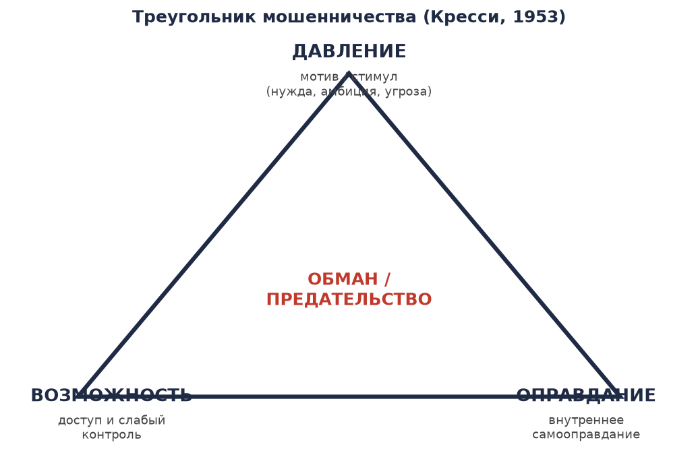
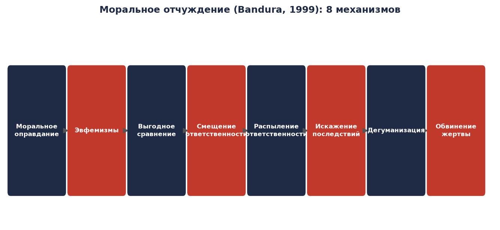
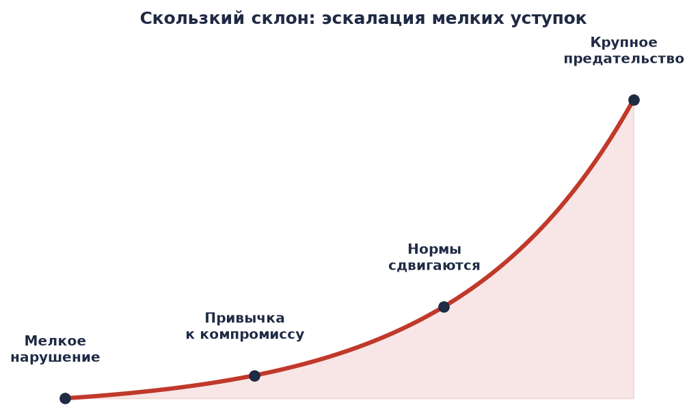
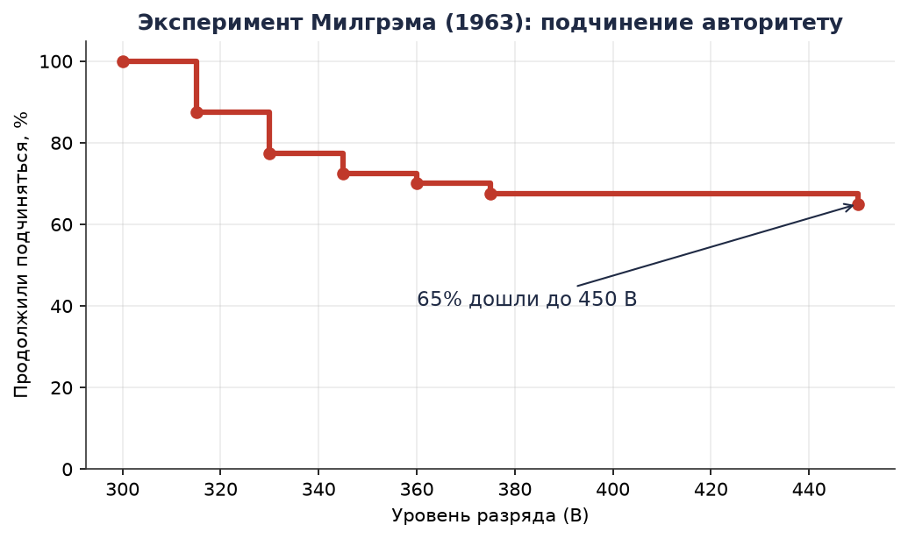
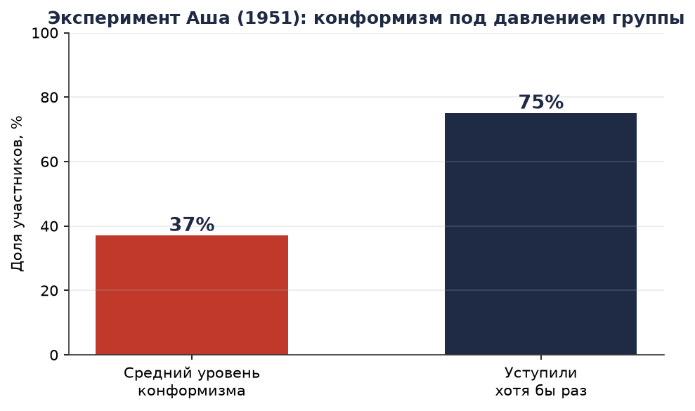
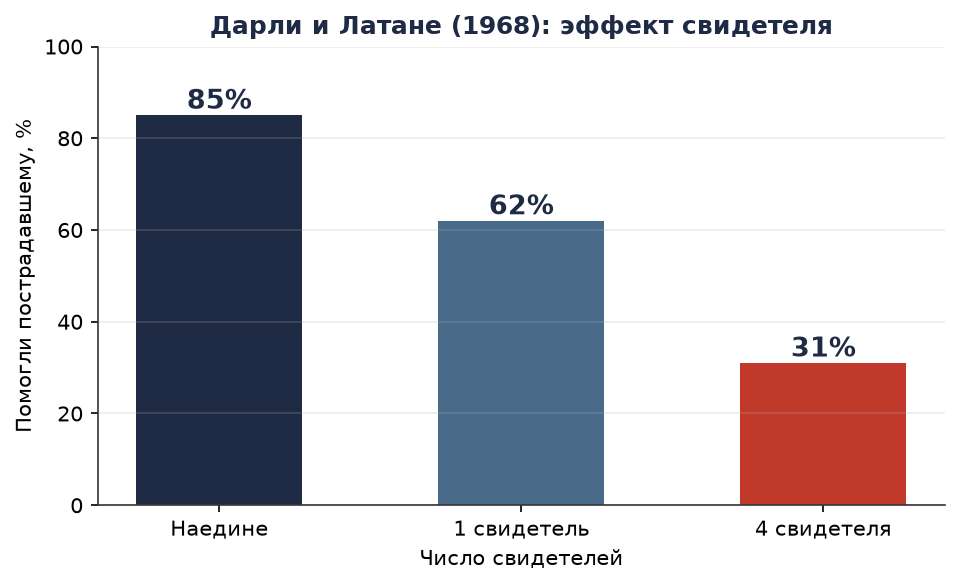
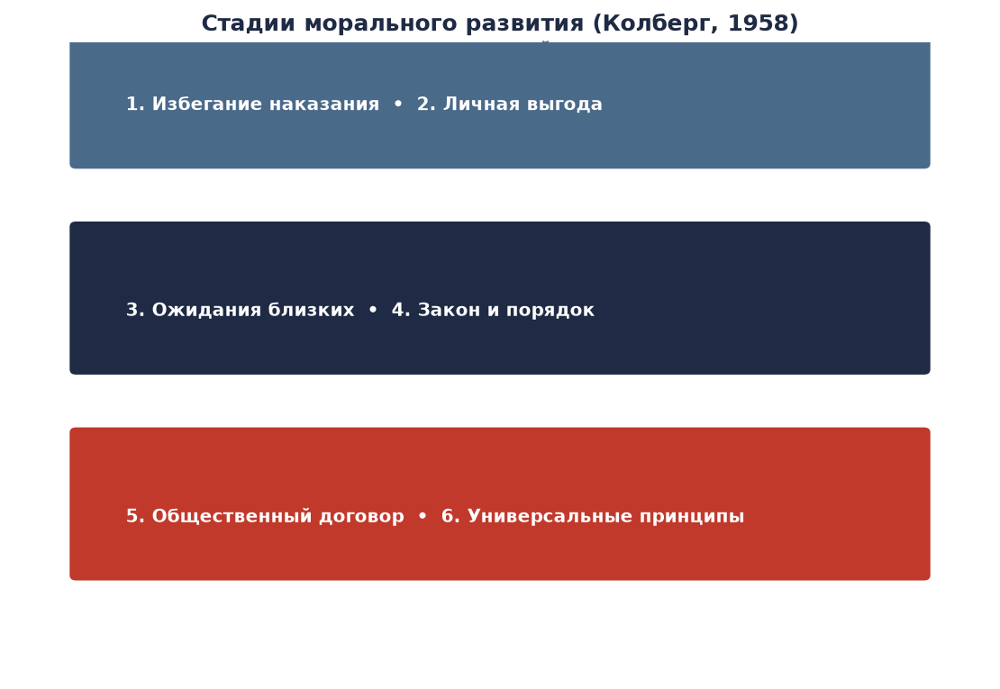

# ПСИХОЛОГИЯ ЧЕЛОВЕКА

## Слабости, предательство и моральное разложение

> **Научно-исследовательское приложение.** Документ опирается на рецензируемые экспериментальные и теоретические работы социальной и клинической психологии. Каждое утверждение сопровождается ссылкой на первоисточник; полный список — в разделе [«Приложение исследований»](#приложение-исследований).

---

## Оглавление

| Раздел | Содержание |
|---|---|
| [1. Введение и методология](#1-введение-и-методология) | Как читать этот документ; границы достоверности |
| [2. Почему человек предаёт: три условия](#2-почему-человек-предаёт-три-условия) | Треугольник мошенничества (Кресси) |
| [3. Моральное отчуждение](#3-моральное-отчуждение) | 8 механизмов самооправдания (Бандура) |
| [4. Скользкий склон](#4-скользкий-склон) | Эскалация мелких уступок |
| [5. Ситуация сильнее характера](#5-ситуация-сильнее-характера) | Эксперименты: Милгрэм, Аш, свидетель, Стэнфорд |
| [6. Личностные факторы: Тёмная триада](#6-личностные-факторы-тёмная-триада) | Нарциссизм, макиавеллизм, психопатия |
| [7. Когнитивные искажения](#7-когнитивные-искажения) | Ошибки мышления, облегчающие падение |
| [8. Моральное развитие](#8-моральное-развитие) | Стадии Колберга |
| [9. Групповые механизмы](#9-групповые-механизмы) | Группомыслие, деиндивидуация |
| [10. Практические выводы](#10-практические-выводы) | Сводные маркеры риска |
| [Приложение исследований](#приложение-исследований) | Полный список источников |

---

# 1. ВВЕДЕНИЕ И МЕТОДОЛОГИЯ

Цель документа — ответить на вопрос **«что заставляет человека предавать, "портиться", переходить моральную черту»**, опираясь не на мнения, а на воспроизводимые исследования.

### Базовые положения, разделяемые научным консенсусом

1. **Нет единой причины.** Предательство и моральное разложение — результат взаимодействия трёх групп факторов: **ситуационных** (обстоятельства, давление среды), **личностных** (устойчивые черты) и **когнитивных** (способы самооправдания).
2. **Ситуация объясняет больше, чем принято думать.** Ключевой вывод классических экспериментов (Милгрэм, Зимбардо) — обычные люди переходят черту чаще, чем предсказывает интуиция.
3. **Падение почти никогда не бывает одномоментным.** Это процесс: серия мелких уступок, каждая из которых кажется незначительной («скользкий склон»).
4. **Самооправдание — обязательное звено.** Человек редко совершает зло, считая себя злодеем. Почти всегда работает механизм, снимающий моральную ответственность.

### О границах достоверности

Ряд классических исследований (Стэнфордский тюремный эксперимент, ранние работы по эффекту свидетеля) впоследствии подвергался **методологической критике** — см. раздел [5](#5-ситуация-сильнее-характера). В документе такие ограничения отмечаются явно. Выводы, помеченные как «воспроизведено» или «мета-анализ», имеют более высокую доказательную силу, чем отдельные оригинальные эксперименты.

---

# 2. ПОЧЕМУ ЧЕЛОВЕК ПРЕДАЁТ: ТРИ УСЛОВИЯ

Одна из наиболее влиятельных моделей объяснения обмана и нарушения доверия — **треугольник мошенничества**, сформулированный криминологом **Дональдом Кресси** на основе интервью с осуждёнными растратчиками (Cressey, 1953). Кресси установил: для совершения предательства, как правило, должны **одновременно** сойтись три условия.

| Условие | Определение | Пример |
|---|---|---|
| **Давление (мотив)** | Внутренний или внешний стимул: нужда, долг, амбиция, шантаж, страх потери статуса | Чиновник берёт взятку, чтобы покрыть долги; игрок «сливает» данные, чтобы сохранить место |
| **Возможность** | Доступ к ресурсу при слабом контроле и низком риске разоблачения | Сотрудник с неограниченным доступом к данным без аудита |
| **Оправдание** | Внутренняя формула, снимающая вину | «Мне все должны», «так делают все», «это не вредит никому конкретному» |

> **Ключевой вывод:** устраните хотя бы один из трёх элементов — и вероятность предательства резко падает. На практике управлять проще всего **возможностью** (контроль, разделение доступа, аудит) и **оправданием** (среда, в которой самооправдание не поддерживается).

Кресси подчёркивал, что **оправдание** — не следствие, а *предпосылка*: человек сначала находит формулу, позволяющую считать поступок допустимым, и только затем совершает его.

---

# 3. МОРАЛЬНОЕ ОТЧУЖДЕНИЕ

Психолог **Альберт Бандура** показал, что люди нарушают собственные моральные нормы, не переживая угрызений совести, благодаря **моральному отчуждению** (moral disengagement) — набору из восьми когнитивных механизмов, которые «отключают» внутреннего цензора (Bandura, 1999).

### Восемь механизмов (по четырём локусам)

**A. Переосмысление самого поступка**

| Механизм | Суть | Формула |
|---|---|---|
| Моральное оправдание | Зло подаётся как служение высшей цели | «Это ради общего блага» |
| Эвфемистические ярлыки | Смягчённые названия скрывают суть | «зачистка» вместо «убийство» |
| Выгодное сравнение | Поступок «выглядит хорошо» на фоне худшего | «Мы хотя бы не как они» |

**B. Снятие ответственности с себя**

| Механизм | Суть | Формула |
|---|---|---|
| Смещение ответственности | «Меня заставили», «это приказ» | Ответственность — на авторитете |
| Распыление ответственности | «Все участвовали, я — лишь часть» | Диффузия в группе |

**C. Искажение последствий**

| Механизм | Суть | Формула |
|---|---|---|
| Искажение последствий | Минимизация или отрицание вреда | «Никто не пострадал» |

**D. Обесценивание жертвы**

| Механизм | Суть | Формула |
|---|---|---|
| Дегуманизация | Жертва лишается человеческих черт | «Они не люди» |
| Обвинение жертвы | «Сам виноват», «напросился» | Перенос вины на жертву |

> **Ключевой вывод:** моральное отчуждение — это не патология, а **штатный** механизм психики, доступный каждому. Именно поэтому предатели обычно искренне убеждены в собственной правоте: их совесть не «сломана», а **перепрограммирована** одной из восьми формул.

---

# 4. СКОЛЬЗКИЙ СКЛОН

Предательство и коррупция редко начинаются с крупного поступка. Типичная траектория — **скользкий склон** (slippery slope): последовательность мелких уступок, каждая из которых незначительно сдвигает личную норму (Milgram, 1974; Welsh et al., 2015 — о «постепенной эскалации»).

### Механизм

1. **Мелкое нарушение** — кажется допустимым и незначительным.
2. **Привычка к компромиссу** — психика снижает порог внутреннего запрета (когнитивный диссонанс гасится, Festinger, 1957).
3. **Сдвиг нормы** — то, что вчера было недопустимым, сегодня — «нормально, все так делают».
4. **Крупное предательство** — становится возможным без острого чувства вины.

Ключевую роль играет **эскалация обязательств** (escalation of commitment): вложившись в сомнительную линию поведения, человек продолжает её, чтобы не признавать прежние ошибки (Staw, 1976).

> **Ключевой вывод:** первый шаг — самый диагностичный. Человек, систематически позволяющий себе «мелкие» отступления от норм, статистически ближе к крупному нарушению, чем тот, кто принципиален в мелочах.

---

# 5. СИТУАЦИЯ СИЛЬНЕЕ ХАРАКТЕРА

## 5.1. Эксперимент Милгрэма (1963)

**Стэнли Милгрэм** (Йельский университет) проверял готовность обычных людей причинять боль по приказу авторитета. Испытуемый («учитель») должен был наносить «ученику» (подставному актёру) удары током возрастающей силы за ошибки — вплоть до смертельно опасных 450 В.

**Результат:** **65%** участников дошли до максимального разряда, несмотря на крики «ученика» и требования прекратить (Milgram, 1963). Эксперты предсказывали, что до конца дойдут единицы.

> **Вывод:** подчинение авторитету — мощнейший ситуационный фактор. Обычные люди способны на действия, которые сами считают недопустимыми, если ответственность переложена на «приказ».

*Методологическая оговорка:* эксперимент критикуют за этическую нагрузку и условия проведения, однако его общий результат многократно воспроизведён в разных культурах (мета-анализ Blass, 1999 — доля полного подчинения устойчиво выше половины).

## 5.2. Конформизм Аша (1951)

**Соломон Аш** проверял, уступит ли человек очевидной истине под давлением группы. Испытуемый должен был сравнить длину линий; подставные участники единогласно давали заведомо неверный ответ.

**Результат:** около **75%** участников хотя бы раз согласились с заведомо неверным мнением большинства; в среднем конформизм проявлялся примерно в трети критических испытаний (Asch, 1951).

> **Вывод:** даже при очевидности истины давление группы заставляет человека публично с ней расстаться. Механизм — страх отвержения и сомнение в собственном восприятии.

## 5.3. Эффект свидетеля (Дарли и Латане, 1968)

**Джон Дарли** и **Бибб Латане** исследовали, почему люди не приходят на помощь в присутствии других. В эксперименте участник слышал, как у «пострадавшего» случается приступ.

**Результат:** наедине помогали **85%** участников; при одном свидетеле — **62%**; при четырёх — лишь **31%** (Darley & Latané, 1968). Причины — **диффузия ответственности** («кто-нибудь другой поможет») и **плюралистическое невежество** («раз все спокойны, значит, ничего не происходит»).

*Оговорка о точности:* исходный сюжет (убийство Китти Дженовезе, 1964) в первоначальных сообщениях СМИ содержал преувеличение числа «38 бездействовавших свидетелей»; позднейшие разборы показали, что эта цифра ненадёжна (Manning, Levine & Collins, 2007). Сам эффект свидетеля, однако, подтверждён экспериментально и воспроизводится.

## 5.4. Стэнфордский тюремный эксперимент (Зимбардо, 1971)

**Филип Зимбардо** случайным образом разделил 24 здоровых студентов на «охранников» и «заключённых» в имитации тюрьмы.

**Результат:** в течение нескольких дней «охранники» начали проявлять жестокость, «заключённые» — признаки острого стресса и пассивности; эксперимент был прекращён досрочно (Zimbardo, 1971; книга «Эффект Люцифера», 2007).

> **Вывод Зимбардо:** поведение определяется **силой ситуации и роли** сильнее, чем характером. Анонимность формы и присвоенная роль «надзирателя» сами по себе провоцировали жестокость.

*Методологическая оговорка:* эксперимент критикуют за вмешательство самого Зимбардо, малую выборку и отсутствие контроля (Le Texier, 2019). Частичные воспроизведения (включая «BBC Prison Study» Рейхера и Хаслама, 2006) **не** подтвердили автоматического скатывания к тирании — группы нередко сопротивлялись. Корректный вывод: роль и ситуация — **сильные, но не абсолютные** факторы.

---

# 6. ЛИЧНОСТНЫЕ ФАКТОРЫ: ТЁМНАЯ ТРИАДА

Ситуация объясняет многое, но не всё: есть люди, предрасположенные к эксплуатации других **независимо от обстоятельств**. **Тёмная триада** (Paulhus & Williams, 2002) объединяет три пересекающиеся, но различные черты.

| Черта | Ядро | Поведенческий маркер |
|---|---|---|
| **Макиавеллизм** | Циничная установка «цель оправдывает средства», инструментальное отношение к людям | Холодный расчёт, манипуляция, низкая эмпатия |
| **Нарциссизм** | Грандиозность, потребность в восхищении, завышенная самооценка | Обидчивость при критике, эксплуатация ради статуса |
| **Психопатия** | Дефицит эмпатии и вины, импульсивность, поиск острых ощущений | Безжалостность, отсутствие раскаяния |

### Научные данные

- Черты Тёмной триады коррелируют с **готовностью к неэтичным поступкам** и обману (Furnham, Richards & Paulhus, 2013).
- У людей с высокими показателями по этим чертам слабее активируются структуры, связанные с **эмпатией**, и ниже реакция на чужое страдание (мета-анализ нейровизуализационных работ).
- Однако черты — это **континуум, а не диагноз**: выраженность варьирует у всех людей, а не только у «злодеев».

> **Ключевой вывод:** личность задаёт **порог** перехода черты, ситуация — **толчок**. Высокая Тёмная триада + благоприятная ситуация (возможность + оправдание) — наиболее прогностически опасное сочетание.

---

# 7. КОГНИТИВНЫЕ ИСКАЖЕНИЯ

Ряд устойчивых ошибок мышления снижает порог морального падения.

| Искажение | Описание | Роль в предательстве |
|---|---|---|
| **Фундаментальная ошибка атрибуции** (Ross, 1977) | Склонность объяснять чужие поступки характером, а свои — обстоятельствами | Своё предательство — «вынужденное», чужое — «подлость» |
| **Когнитивный диссонанс** (Festinger, 1957) | Дискомфорт от противоречия между поступком и убеждениями | Гасится переписыванием убеждений: «я поступил верно» |
| **Эскалация обязательств** (Staw, 1976) | Продолжение проигрышной линии ради оправдания прежних вложений | Углубление в обман вместо выхода из него |
| **Ложный консенсус** (Ross, Greene & House, 1977) | Переоценка того, насколько «все так делают» | «Все берут — и я беру» |
| **Обесценивание будущего** | Близкая выгода перевешивает отдалённые последствия | Разовый выигрыш важнее репутации |
| **Эффект авторитета** (Milgram, 1963) | Снижение критичности перед фигурой с властью | «Мне приказали» как оправдание |

> **Ключевой вывод:** большинство этих искажений работает **автоматически и бессознательно**. Их знание — не гарантия защиты, но необходимое условие распознавания риска у себя и у других.

---

# 8. МОРАЛЬНОЕ РАЗВИТИЕ

**Лоуренс Колберг** (1958) на основе дилемм (классическая «дилемма Хайнца») описал шесть стадий морального развития, объединённых в три уровня. Стадия определяет, **каким соображением** человек руководствуется, принимая моральное решение.

| Уровень | Ориентация | Стадии |
|---|---|---|
| **Доконвенциональный** | Наказание и выгода | 1. Избегание наказания; 2. Личная выгода |
| **Конвенциональный** | Ожидания окружающих и закон | 3. «Хороший мальчик/девочка»; 4. Закон и порядок |
| **Постконвенциональный** | Принципы | 5. Общественный договор; 6. Универсальные принципы |

**Практический смысл:** человек на доконвенциональном уровне удерживается от предательства **только страхом наказания или расчётом выгоды**; человек на постконвенциональном — внутренними принципами. Это объясняет, почему усиление контроля действует не на всех одинаково, и почему чисто карательная система бессильна против того, кто искренне переписал свои принципы (см. раздел 3).

---

# 9. ГРУППОВЫЕ МЕХАНИЗМЫ

## 9.1. Группомыслие (Janis, 1972)

**Ирвинг Дженис**, анализируя провал операции в заливе Свиней (1961), описал **группомыслие** (groupthink) — режим, в котором сплочённая группа принимает ошибочные решения ради сохранения единства.

**Симптомы:**

1. Иллюзия неуязвимости;
2. Коллективная рационализация («оправдание задним числом»);
3. Вера в собственную моральную безупречность;
4. Стереотипизация чужих;
5. Самоцензура несогласных;
6. Иллюзия единодушия;
7. Прямое давление на инакомыслящих;
8. «Хранители границ» (mindguards), фильтрующие информацию.

> **Вывод:** в сплочённой группе индивидуальная моральная ответственность растворяется. Человек, который в одиночку не совершил бы поступка, совершает его «как член команды» — групповые механизмы включают и диффузию ответственности, и моральное оправдание.

## 9.2. Деиндивидуация (Zimbardo, 1969)

**Деиндивидуация** — утрата личной идентичности и самоконтроля в группе или при анонимности (униформа, маска, толпа). Механизм усиливает агрессию и снижает чувство индивидуальной вины, что напрямую связано с феноменом «жестокости в форме» (см. 5.4).

---

# 10. ПРАКТИЧЕСКИЕ ВЫВОДЫ

Сводные **маркеры риска** — признаки, по совокупности которых повышается вероятность предательства или морального разложения.

### Ситуационные

- [ ] Слабость контроля и аудита (**возможность**).
- [ ] Наличие сильного мотива/давления (долг, угроза, амбиция).
- [ ] Среда, где «так делают все» (ложный консенсус).
- [ ] Анонимность или групповая принадлежность, снимающая личную ответственность.

### Личностные

- [ ] Высокие черты Тёмной триады (расчётливость, отсутствие эмпатии, обидчивость).
- [ ] Низкий уровень морального развития (ориентация только на наказание/выгоду).
- [ ] Систематические «мелкие» отступления от норм (скользкий склон).

### Речевые / поведенческие (маркеры морального отчуждения)

- [ ] Эвфемизмы и смягчённые названия поступков.
- [ ] Ссылки на приказ/группу как источник ответственности.
- [ ] Обесценивание или обвинение жертвы.
- [ ] Минимизация последствий («никто не пострадал»).

> **Итог:** предательство — это не внезапное «зло», а предсказуемый процесс, возникающий на пересечении **возможности, мотива и оправдания**, усиленный **ситуацией**, **чертами личности** и **ошибками мышления**. Понимание этих механизмов — единственный способ их распознать — и у других, и у себя.

---

# ПРИЛОЖЕНИЕ ИССЛЕДОВАНИЙ

Полный перечень первоисточников, на которые опирается документ.

| № | Автор(ы) | Год | Работа | Область |
|---|---|---|---|---|
| 1 | Cressey, D. R. | 1953 | *Other People's Money: A Study in the Social Psychology of Embezzlement* | Треугольник мошенничества |
| 2 | Bandura, A. | 1999 | *Moral Disengagement in the Perpetration of Inhumanities* (Pers. Soc. Psychol. Rev.) | Моральное отчуждение |
| 3 | Milgram, S. | 1963 | *Behavioral Study of Obedience* (J. Abnorm. Soc. Psychol.) | Подчинение авторитету |
| 4 | Milgram, S. | 1974 | *Obedience to Authority* | Скользкий склон |
| 5 | Asch, S. E. | 1951 | *Effects of Group Pressure upon the Modification and Distortion of Judgments* | Конформизм |
| 6 | Darley, J. M., & Latané, B. | 1968 | *Bystander Intervention in Emergencies: Diffusion of Responsibility* (J. Pers. Soc. Psychol.) | Эффект свидетеля |
| 7 | Zimbardo, P. G. | 1971 | Stanford Prison Experiment | Сила роли и ситуации |
| 8 | Zimbardo, P. G. | 2007 | *The Lucifer Effect* | Ситуационная психология зла |
| 9 | Reicher, S., & Haslam, S. A. | 2006 | *Rethinking the Psychology of Tyranny: The BBC Prison Study* | Критика/уточнение Зимбардо |
| 10 | Le Texier, T. | 2019 | *Debunking the Stanford Prison Experiment* (Am. Psychol.) | Критика методологии |
| 11 | Blass, T. | 1999 | *The Milgram Paradigm after 35 Years* (J. Appl. Soc. Psychol.) | Воспроизводимость Милгрэма |
| 12 | Manning, R., Levine, M., & Collins, A. | 2007 | *The Kitty Genovese Murder and the Social Psychology of Helping* (Am. Psychol.) | Критика «38 свидетелей» |
| 13 | Paulhus, D. L., & Williams, K. M. | 2002 | *The Dark Triad of Personality* (J. Res. Pers.) | Тёмная триада |
| 14 | Furnham, A., Richards, S., & Paulhus, D. L. | 2013 | *The Dark Triad of Personality: A 10 Year Review* (Soc. Pers. Psychol. Compass) | Обзор Тёмной триады |
| 15 | Kohlberg, L. | 1958 | *The Development of Modes of Moral Thinking and Choice* (диссертация) | Стадии морального развития |
| 16 | Janis, I. L. | 1972 | *Victims of Groupthink* | Группомыслие |
| 17 | Festinger, L. | 1957 | *A Theory of Cognitive Dissonance* | Когнитивный диссонанс |
| 18 | Staw, B. M. | 1976 | *Knee-deep in the Big Muddy* (Organ. Behav. Hum. Perform.) | Эскалация обязательств |
| 19 | Ross, L. | 1977 | *The Intuitive Psychologist and His Shortcomings* | Фундаментальная ошибка атрибуции |
| 20 | Zimbardo, P. G. | 1969 | *The Human Choice: Individuation, Reason, and Order vs. Deindividuation* | Деиндивидуация |
| 21 | Arendt, H. | 1963 | *Eichmann in Jerusalem: A Report on the Banality of Evil* | «Банальность зла» |

---

> **Примечание.** Документ носит научно-просветительский характер. Все графики построены по опубликованным экспериментальным данным, указанным в соответствующих разделах.
