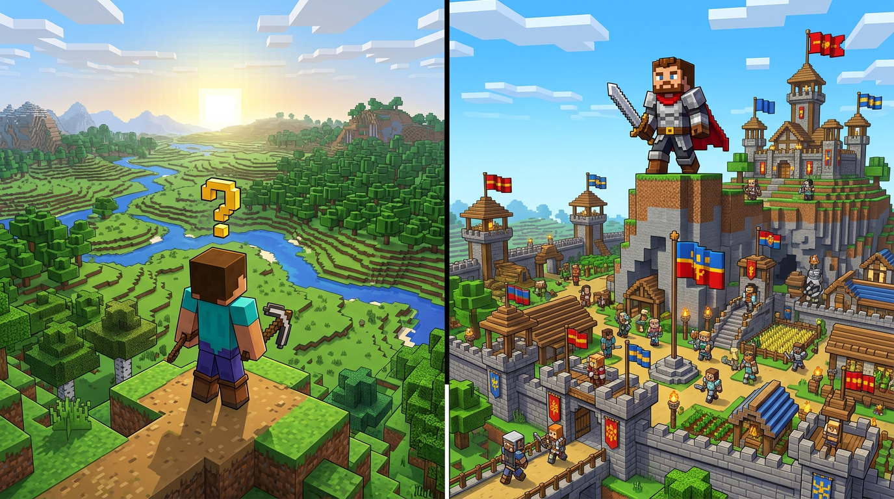

# ЦЕЛИ И ЗАДАЧИ В MINECRAFT

### Огромный список для игрока, который не знает чем заняться, и для лидера фракции / клана / ордена



**Для кого:** новички, вернувшиеся игроки, лидеры и заместители | **Сервер:** ванильный Minecraft (выживание, ваниль)  
**Как пользоваться:** выбери 3 цели на неделю из списка, отметь чек-боксы, покажи лидеру. Лидер — выбери 5 задач из своего раздела на месяц.

> **Правило 15 минут:** не знаешь, что делать — открой любой список, возьми первую неотмеченную задачу и делай 15 минут. Втянешься.

---

## ЧАСТЬ I. ОБЫЧНЫЙ ИГРОК — «ЗАШЁЛ И НЕ ЗНАЮ, ЧТО ДЕЛАТЬ»

### Уровень 0. Первые 30 минут (выжить)

- [ ] Нарубить 20 брёвен, сделать верстак, кирку, топор
- [ ] Накопать 20 камня, улучшить инструменты
- [ ] Найти 20 еды (хлеб, картошка, мясо) и приготовить
- [ ] Построить временное укрытие 5×5 с дверью и факелами
- [ ] Сделать сундук и кровать (постричь 3 овец)
- [ ] Закрыть вход, переждать первую ночь, не копать вниз без факелов

**Цель уровня:** не умереть, есть где спать, есть куда сложить.

### Уровень 1. Дом — твоя база (день 1–3)

**Выбор места:**
- [ ] Холм у воды / у леса / у деревни — рядом и дерево, и еда
- [ ] Отметить координаты дома на бумаге (F3)
- [ ] Поставить маяк-столб 1×50 вверх с факелом, чтобы не потеряться

**База 1.0:**
- [ ] Дом 7×7 из 2 типов блоков (основа + рама)
- [ ] Крыша, дверь, 4 окна, 10 факелов
- [ ] Сундуки с подписью: КАМЕНЬ / ДЕРЕВО / ЕДА / ИНСТРУМЕНТЫ
- [ ] Печь 2 шт, верстак, наковальня (позже)
- [ ] Огород 9×9 с водой в центре, 20 пшеницы
- [ ] Загон 5×5 для кур/коров (2 особи для разведения)
- [ ] Колодец / бочка с водой рядом
- [ ] Забор вокруг базы, освещение каждые 8 блоков (мобы не спавнятся при 8+ света)
- [ ] Подвал 5×5 на глубине -20 для тестов
- [ ] Секретный сундук под полом (см. курс маскировки)

### Уровень 2. Ресурсы — перестать бегать за каждым блоком (неделя 1)

**Шахта:**
- [ ] Лестница-шахта до -59, ветка 1×2 с факелами
- [ ] 1 стак угля, 1 стак железа, 10 редстоуна
- [ ] Полный железный комплект (броня + инструменты)
- [ ] Ведро воды и ведро лавы (портал без алмазов)

**Фермы-автоматы (выбери 2):**
- [ ] Ферма пшеницы/картошки на воде (механическая)
- [ ] Ферма кур (яйца → жареная курица)
- [ ] Ферма коров (кожа → книги)
- [ ] Ферма тростника 8×1 для бумаги и ракет
- [ ] Ферма кактуса/бамбука для опыта/топлива
- [ ] Ферма железа (деревня + зомби)
- [ ] Ферма опыта (мобоферма над океаном)
- [ ] Ферма дерева (2×2 ель)

**Заготовка:**
- [ ] 3 стака досок, 1 стак стекла, 1 стак булыжника в резерве
- [ ] Сундук «СТРОЙКА» всегда полон

### Уровень 3. Исследование — мир большой (неделя 1–2)

- [ ] Найти деревню, заключить 1 жителя в домик, поставить кровать и верстак
- [ ] Найти биомы: пустыня, саванна, тайга, болото, джунгли — взять по 1 саженцу/блоку
- [ ] Карта 3×3 (9 карт) стены у дома
- [ ] Портал в Нижний мир (10 обсидиана), база-точка 3×3 с сундуком
- [ ] Найти крепость Нижнего мира, 6 стержней ифрита
- [ ] Найти древний город / шахту / особняк — сфоткать координаты
- [ ] Лодка-путешествие 1000 блоков вдоль реки, поставить метки
- [ ] Подводные руины — 1 сердце моря
- [ ] Эндер-жемчуг 12 шт (торговля/охота на эндерменов)

### Уровень 4. Прокачка — стать сильнее (неделя 2–3)

- [ ] Стол зачарований (2 алмаза + 4 обсидиана + книга)
- [ ] Книжные полки 15 шт вокруг стола (30 уровень)
- [ ] Зачаровать полный комплект: Защита 4, Прочность 3, Починка (с жителей)
- [ ] Лук Сила 4 / Бесконечность или арбалет
- [ ] Кирка Эффективность 4 + Шёлковое касание и Удачность 3 (две кирки)
- [ ] Наковальня, 20 уровней опыта в запасе
- [ ] Зельеварня + 6 зелий огнестойкости/силы
- [ ] Ферма золота в аду для опыта

### Уровень 5. Экономика и торговля (можно с дня 3)

- [ ] Построить торговый зал на 6 жителей: оружейник, бронник, библиотекарь, фермер, каменщик, священник
- [ ] Вылечить 1 зомби-жителя (скидка 90%)
- [ ] Настроить цены: книга Починка за 5 изумрудов, морковь 1 изумруд
- [ ] Магазин-сундук у спавна: 1 стак булыжника = 1 изумруд (табличка)
- [ ] Накопить 1 стак изумрудных блоков
- [ ] Обмен с игроками: продать 3 стака дерева, купить седло/ярлык

### Уровень 6. Социалка — играть веселее

- [ ] Вступить в фракцию / клан или создать свою (см. часть II)
- [ ] Построить общий проект: дорога 200 блоков, мост, маяк
- [ ] Помочь новичку: отдать комплект железа + еда
- [ ] Участвовать в ивенте сервера (арена, стройка)
- [ ] Завести дневник в книге: день, что сделал, координаты находок

### Уровень 7. Творчество — когда ресурсы есть

- [ ] Дом 2.0 — перестроить красиво (5 типов блоков, крыша, декор)
- [ ] Пиксель-арт 16×16
- [ ] Статуя 10 блоков высотой
- [ ] Автоматический склад (сортировка воронками)
- [ ] Редстоун-дверь 2×2, скрытый проход за картиной
- [ ] Ферма-монумент: красивая, а не коробка
- [ ] Карта-арт

### Уровень 8. Челленджи — если скучно (выбери 1 на месяц)

- [ ] Пройти игру до дракона без брони
- [ ] Жизнь на острове 20×20
- [ ] Дом только из 1 типа блока
- [ ] Все достижения 100%
- [ ] Коллекция всех дисков, всех биомов
- [ ] Построить копию реального здания
- [ ] Хардкор 7 дней без смерти
- [ ] Нузлок: умер — снёс базу

**Итоговый чек-лист новичка на 30 дней:** 60 галочек. Закрыл 40 — ты уже не новичок, а житель.

---

## ЧАСТЬ II. ЛИДЕР ФРАКЦИИ / КЛАНА / ОРДЕНА

### Роль лидера — 5 шляп

Лидер одновременно: **строитель, снабженец, дипломат, судья, вдохновитель**. Если тянешь всё один — сгоришь. Раздай шляпы замам.

| Шляпа | Задача | Кому отдать, если не ты |
| :--- | :--- | :--- |
| **Прораб** | План стройки, раздача участков | Самый аккуратный строитель |
| **Снабженец** | Фермы, ресурсы, склад | Тот, кто любит автоматику |
| **Дипломат** | Союзы, торговля, переговоры | Самый спокойный в голосе |
| **Судья** | Правила внутри, разбор ссор | Самый справедливый, не друг всем |
| **Летописец** | Карта, история, пиар | Тот, кто любит писать и фоткать |

---

### Этап 0. Зачем вам фракция? (до создания)

- [ ] Сформулировать цель одной фразой: «Самый красивый город у моря» / «Торговая империя» / «Крепость, которую не взять» — без цели фракция распадётся за 2 недели
- [ ] Выбрать тип: город / клан-семья / орден-воины / торговый дом / монастырь-фермеры
- [ ] Придумать 3 правила, которые отличают вас: например, «1. Не воруем 2. Помогаем своим 3. Строим только из камня и дерева»
- [ ] Название, знамя (баннер), гимн-кричалка 1 строка
- [ ] Найти 2 сооснователя, а не делать всё одному

**Ошибка:** создать фракцию ради фракции. Если нет цели — это просто чат.

### Этап 1. Основание (неделя 1)

**Территория:**
- [ ] Выбрать место 100×100: вода + лес + ровное место + красиво
- [ ] Отметить углы столбами, сообщить Администрации/карте
- [ ] Карта 1:2000 территории на стене штаба
- [ ] Дорога от спавна до базы (200–500 блоков, освещение)
- [ ] Правила застройки: где дома, где фермы, где склад

**Люди:**
- [ ] Набор 3–5 первых: личное приглашение, а не спам в чат
- [ ] Вводный квест новичку: наруби 1 стак дерева → получи участок
- [ ] Выдать стартовый набор (не алмазы, а инструменты + еда + кровать)
- [ ] Чат/дискорд фракции, 2 канала: `общий` и `приказы`

**База:**
- [ ] Штаб 9×9: стол, карта, сундук с общими ресурсами, книга законов
- [ ] Общий склад 7×7 с сортировкой (таблички: КАМЕНЬ/ДЕРЕВО/ЕДА/РЕДСТОУН)
- [ ] Ферма еды общая на всех, 2 человека ответственных
- [ ] Спальня на 6 кроватей (скип ночи)

### Этап 2. Экономика — чтобы не просить (неделя 2–4)

- [ ] 3 общие фермы, которые кормят всех: еда + дерево + железо
- [ ] Налог/взнос: понятно и мало: 1 стак булыжника в неделю или 10% добычи
- [ ] Магазин фракции у спавна: что продаём (уникальное), цены
- [ ] Казна: 1 ответственный, книга учёта (приход/расход), скрин каждую неделю
- [ ] Резерв на чёрный день: 1 алмазный блок на каждого участника в Эндер-сундуке
- [ ] Торговые пути: договор с 2 соседями «камень — еда»

### Этап 3. Правила и порядок (неделя 2)

- [ ] Устав 1 страница: цель, 5 правил, как вступить/выйти, кто решает спор (см. лекцию 4 открытого курса)
- [ ] Лестница наказаний: разговор → предупреждение → штраф → исключение (без мата, без самосуда)
- [ ] Суд: кто судит, если спор с лидером? (зам или совет 3-х)
- [ ] Карта участков: кто где строит, запрет на стройку ближе 3 блоков к соседу
- [ ] Правило «не трогай чужой сундук» — под роспись

### Этап 4. Управление людьми — самое сложное

- [ ] План-задания каждую неделю: 3 задачи на человека (что, сколько, срок) — по ПС-Д-01
- [ ] Собрание 20 минут в неделю: что сделали, что не сделали, что на след. неделю (протокол 3 строки)
- [ ] Ротация: каждый новичок 2 недели — испытание, потом голосование
- [ ] Заместитель, который может всё, когда тебя нет (и наоборот)
- [ ] Похвала при всех, ругать — один на один
- [ ] Учить, а не кричать: показать, как копать, как ставить факелы

**Топ-5 ошибок лидера:**
1. Тянет всё сам → выгорает → фракция умирает
2. Друзья вне правил → остальные уходят
3. Нет плана → люди стоят без дела и скучают
4. Молчит неделю → думают, что бросил
5. Обещает и не делает → доверие 0

### Этап 5. Внешняя политика — соседи

- [ ] Карта соседей: кто рядом, нейтралитет/торговля/союз/вражда
- [ ] Договор с каждым соседом на 1 листе: границы, проход, цены
- [ ] Общий проект с соседом (мост, дорога) — лучший способ подружиться
- [ ] Нейтральная зона 20 блоков между базами — без построек
- [ ] Правило войны: объявили цель, срок, условия мира — иначе не война, а гриф

### Этап 6. Безопасность и маскировка

- [ ] Скрытый склад фракции (по курсу АК-05): сундук под полом штаба
- [ ] Резервная база-точка в 500 блоках, с кроватями и едой
- [ ] Пароли и шифры для координат (книжный шифр)
- [ ] Проверка новичков: 3 дня наблюдения, без доступа к складу

### Этап 7. Рост и известность

- [ ] Скриншоты до/после каждую неделю — летопись
- [ ] Пост в чате сервера: «Город N ищет плотников» — с координатами дороги, а не рекламы
- [ ] Ивент для сервера: ярмарка, турнир, экскурсия — 1 в месяц
- [ ] Достижения фракции: 1 маяк, 1 дракон на всех, 1 памятник

### Этап 8. Кризисы — когда всё идёт не так

- [ ] Ушёл ключевой игрок → у тебя есть второй, кто умеет то же (замена)
- [ ] Ссора → разбор по 5 шагам (остудить → выслушать → факты → правило → решение) — открытый курс, лекция 10
- [ ] Грифер → фото, логи, рапорт в Полицию, не самосуд
- [ ] Скука → новая цель: «строим порт» или «идём в древний город всем кланом»

**Чек-лист зрелой фракции (3 месяца):**
40 галочек выше. Закрыл 30 — фракция живая. Закрыл 20 — надо менять лидера или цель. Закрыл 10 — честно распусти и начни заново с новой идеей.

---

## БОНУС. ШАБЛОНЫ — КОПИРУЙ

### Шаблон план-задания на неделю (для лидера)

```
Неделя ___  Ответственный ___
1. Иван — накопать 3 стака камня к воскресенью, склад — сундук 2
2. Маша — посадить еловый лес 20×20, полив
3. Петя — продать 2 стака стекла у спавна, выручка в казну
Проверка: воскресенье 19:00 у штаба
```

### Шаблон устава (1 страница)

```
ФРАКЦИЯ «_____»  Цель: _____
1. Не воруем, не гриферим, не материмся
2. Помогаем своим, спрашиваем — прежде чем брать
3. Строим по плану, 3 блока от соседа
4. Спор — к заму, он решает за день
5. Не пришёл неделю без предупреждения — участок свободен
Вступить: пройти квест новичка 2 дня, голосование
```

### Шаблон казны

```
Дата | Кто | Приход | Расход | Остаток | За что
12.09 Иван +10 изумр  -  10  Ферма
13.09 Маша  -   2 изумр  8   Книги
```

---

---

## ЧАСТЬ III. КРИЗИС ЦЕЛЕЙ И ПОТЕРЯ СМЫСЛА — КАК ОБРЕСТИ ВНОВЬ

> *Ты заходишь, смотришь на сундуки, на недострой, на чат — и ничего не хочется. Это не лень. Это кризис смысла. Он бывает у каждого, кто играл дольше месяца. И он лечится.*

Этот раздел — не список «сделай ещё 20 ферм». Это карта выхода из ямы. Для обычного игрока и для лидера — отдельно, потому что болеют по-разному.

### 1. Что это такое и почему это нормально

**Кризис целей** — когда старые цели закрыты или перестали радовать, а новых нет. Мозг спрашивает: «Зачем я сюда захожу?» и не получает ответа.

**Почему накрывает в Minecraft особенно сильно:**

| Причина | Как выглядит у игрока | Как выглядит у лидера |
| :--- | :--- | :--- |
| **Цель достигнута** | Построил дом, одел алмазку — «а дальше что?» | Построил город — «и что теперь его охранять?» |
| **Гринд без радости** | Копаешь, а удовольствия 0, только цифра в сундуке растёт | Собираешь налог, а в казне пыль |
| **Одиночество** | На базе тихо, в чате пусто | Вокруг люди, но ты один за всё отвечаешь |
| **Сравнение** | У соседа замок, у тебя коробка — руки опускаются | У соседнего клана 20 онлайн, у тебя 3 |
| **Бесконечность** | В Minecraft нет «конца» после дракона — нет финишной ленты | У фракции тоже нет конца — это марафон без финиша |

**Важно:** кризис — не провал. Это сигнал: «пора менять уровень», как в Части I. Ты не сломался, ты вырос из старых целей.

### 2. Диагностика: у тебя кризис или просто устал?

Отметь честно. 3+ галочки — уже кризис, пора действовать. 5+ — срочно бери паузу по разделу 4.

**Общие признаки (и игрок, и лидер):**
- [ ] Заходишь и 5 минут стоишь на месте, не зная куда идти
- [ ] Раньше радовал каждый найденный алмаз — сейчас «ну алмаз и алмаз»
- [ ] Чат раздражает или кажется пустым
- [ ] Строишь и тут же хочется сломать
- [ ] Думаешь «может, удалить мир / выйти из клана?» чаще раза в неделю
- [ ] Заходишь всё реже, без желания, «надо, а не хочу»

**Только у лидера (+):**
- [ ] Любая просьба «помоги» бесит, хотя раньше помогал
- [ ] Кажется, что без тебя всё развалится, и это злит
- [ ] Перестал хвалить — только требуешь
- [ ] Мечтаешь, чтобы кто-то другой взял твою шляпу
- [ ] Собрания переносишь, потому что «опять одно и то же»

> **Тест 30 секунд:** ответь «Зачем я захожу на сервер завтра?» — если ответа нет за 30 секунд, ты в кризисе.

### 3. Стадии — где ты сейчас?

Кризис идёт по лестнице. Чем раньше поймал, тем легче выйти.

**Стадия 1. Усталость:** «Много копаю, мало радости». Лечится 1 днём отдыха.
**Стадия 2. Разочарование:** «Строил неделю — никто не оценил». Лечится сменой цели и разговором.
**Стадия 3. Отчуждение:** «Не хочу никого видеть, база чужая». Лечится сменой роли/места и людьми.
**Стадия 4. Выгорание:** «Хочу всё бросить и удалить». Лечится паузой 3–7 дней и передачей дел.

- [ ] Определи свою стадию прямо сейчас (1–4) и запиши в книгу у кровати

**Что НЕ делать на любой стадии:**
- [ ] Не ломай базу в злости (через 3 дня пожалеешь)
- [ ] Не раздавай все вещи «навсегда ухожу» — отдай на хранение заму на 7 дней, не в общий доступ
- [ ] Не уходи молча — напиши 2 строки: «беру паузу 3 дня, по делам к ...»
- [ ] Не бери новую огромную цель в яме («построю замок 100×100» добьёт)
- [ ] Не сравнивай себя с ютуберами — у них монтаж, у тебя выживание

### 4. Как обрести смысл вновь — 7 шагов (для всех)

Делай по порядку. Каждый шаг — 1 вечер, не надо всё за день.

**Шаг 1. Пауза без вины (1–3 дня)**
- [ ] Выйди из игры на 1–3 дня осознанно, предупредив своих. Это не предательство, это ремонт.
- [ ] Пауза = не гринд в другом мире до ночи. Погуляй, поспи, зайди в другой режим сервера (если есть) на 20 минут просто посмотреть.

**Шаг 2. Инвентаризация (15 минут с книгой)**
Сядь на своей базе, открой книгу и честно ответь:
- [ ] Техника «3 списка» — запиши по 3 пункта:
  - *Бесит:* что выматывает? (пример: «каждую ночь чинить ферму», «чат с матом»)
  - *Радует:* что всё ещё греет? (пример: «вид с крыши на закат», «когда Маша говорит спасибо»)
  - *Хочется попробовать:* что давно манит, но откладывал? (пример: «жить в джунглях», «торговать, а не строить»)
- [ ] Обведи 1 пункт из «Хочется» — это и есть твоя новая маленькая цель.

**Шаг 3. Маленькая цель на 1 вечер (правило 1 блока)**
- [ ] Возьми цель на 30–60 минут, которую 100% закроешь: «посадить аллею 20 берёз», «сделать рамку для карты», «найти 1 аксолотля». Не замок — аллею.
- [ ] Сделай и сразу отметь галочку в этой книге. Мозгу нужна победа, а не план.

**Шаг 4. Верни людей (социалка лечит)**
- [ ] Зайди не строить, а помочь: 20 минут помоги новичку, почини чужой забор, подари 10 хлеба. Смысл часто возвращается через «я нужен».
- [ ] Поговори с 1 человеком голосом 5 минут: «что тебя сейчас радует в игре?» — заразишься.
- [ ] Сходи в гости в чужую базу, попроси экскурсию. Чужой взгляд на твой мир — тоже лекарство.

**Шаг 5. Смени роль на неделю**
- [ ] Если был шахтёром — стань фермером/строителем/торговцем на 7 дней. Запрети себе старое дело.
- [ ] Переедь на 3 дня в другое место: палатка в лесу, домик на скале, землянка у реки. Новый вид из окна = новые мысли.

**Шаг 6. Сделай красивое, а не полезное**
- [ ] Потрать вечер на бесполезную красоту: костёр с бревнами, фонари вдоль дорожки, картина из карт. Красота возвращает чувство «я создаю».
- [ ] Сделай «уголок памяти»: таблички с датами «12.09 — поставили первый столб», фото-рамки с картами до/после.

**Шаг 7. Новая большая цель — только после 6 шагов**
- [ ] Когда 3–4 маленьких цели снова радуют — выбери 1 большую на месяц, но другую, чем была: если строил город — уйди в экспедиции; если гриндил — строй храм.
- [ ] Сформулируй её как историю: «Я — хранитель маяка на краю карты, к которому идут все новички», а не «нафармить 10 стаков».

### 5. Отдельно для лидера: когда тяжело быть главным

Лидер выгорает не от блоков, а от людей. Твои симптомы другие — и лечение другое.

**Почему лидер теряет смысл:**
- Ты стал диспетчером, а не игроком: только раздаёшь, не строишь.
- Благодарности меньше, чем упрёков.
- Страх «если я уйду — всё умрёт» не даёт отдохнуть.

**Что делать лидеру дополнительно:**

- [ ] **Правило заместителя на 7 дней:** выбери зама и отдай ему все 5 шляп на неделю. Ты — рядовой. Строй себе хижину в лесу. Если фракция не умерла — ты не незаменим (и это хорошо).
- [ ] **Ритуал «чистого стола»:** собери совет 20 минут: каждый говорит по 1 минуте «что бесит / что радует / что предлагаю». Ты только слушаешь и пишешь. Без оправданий.
- [ ] **Сними 2 шляпы навсегда:** оставь себе 3 любимые, 2 отдай. Лидер-оркестр сгорает за месяц, лидер-дирижёр живёт годами.
- [ ] **Введи выходные лидера:** 2 дня в неделю ты не отвечаешь на «а можно?», только на «пожар». Объяви это правилом.
- [ ] **Наследие:** ответь в книге: «Что останется от фракции, если я завтра не зайду месяц?» — если ответ «ничего», срочно пиши устав, карту, казну и назначай преемника. Смысл возвращается, когда строишь не для себя, а для истории.

**Если хочешь уйти красиво (а не хлопнуть дверью):**
- [ ] Не удаляй постройки. Передай ключ, казну и карту новому лидеру, проведи экскурсию 30 минут.
- [ ] Напиши табличку у штаба: «Основал ... , передал ... , спасибо всем». Уйти с уважением — тоже победа.
- [ ] Оставь себе палату/уголок в городе — сможешь зайти в гости без должности.

### 6. Профилактика — чтобы не падать снова

- [ ] Ритм: 5 дней игра + 2 дня пауза (хоть не заходи, хоть просто гуляй по миру без задач)
- [ ] Одна цель — одна галочка в день. Не 10. Мозг любит закрывать, а не тонуть.
- [ ] Каждые 2 недели — «день без пользы»: только красота, прогулка, болтовня.
- [ ] Делегируй до усталости, а не после. Если делаешь 80% — ты уже горишь.
- [ ] Веди «Книгу радости» у кровати: каждый вечер 1 строка «сегодня кайфанул, когда ...» — через месяц откроешь и удивишься, сколько хорошего было.

### 7. План возвращения на 14 дней (отметь и повесь у кровати)

**Неделя 1 — починка:**
- [ ] День 1–2: пауза, предупредил, «3 списка» написаны
- [ ] День 3: 1 маленькая цель 30 мин закрыта
- [ ] День 4: помог 1 человеку 20 мин
- [ ] День 5: сменил роль/место на 1 вечер
- [ ] День 6: сделал 1 красивую бесполезность
- [ ] День 7: выходной без задач, просто погулял

**Неделя 2 — разгон:**
- [ ] День 8–9: выбрал новую большую цель-историю, рассказал 1 другу
- [ ] День 10: сделал первый шаг большой цели (1 час)
- [ ] День 11: позвал 1 человека делать вместе
- [ ] День 12: отметил 3 галочки из Части I или II, которые давно хотел
- [ ] День 13: записал в «Книгу радости» 7 строк
- [ ] День 14: оглянулся — что изменилось? Поставь себе оценку 1–10 и реши: продолжаю / корректирую / беру ещё неделю такого ритма

> **Если через 14 дней всё ещё пусто — это нормально.** Поговори с другом вне игры, смени сервер на неделю, или просто дай себе ещё 14 дней такого же бережного режима. Смысл не находится приказом, он отрастает, как лес — по одному саженцу.

### Шаблон «Письмо себе» (скопируй в книгу)

```
Дата: __.__.__  Стадия: 1 2 3 4 (обведи)
Сейчас бесит: ...
Сейчас радует: ...
Хочу попробовать: ...
Моя маленькая цель на завтра (30 мин): ...
Кому помогу завтра 20 мин: ...
Через 14 дней хочу сказать себе: «...»
Подпись: ...
```

---

**Итого теперь:** 120 задач игроку + 80 задач лидеру + 35 шагов выхода из кризиса = **235 галочек**. Распечатай, повесь у штаба, отмечай. Через месяц покажи, сколько закрыл — сам удивишься. И помни: кризис — не конец игры, а смена главы.

*Составил GeneralStrasse. Версия 1.1 — с главой про кризис смысла. Бери и делай, но береги себя.*
